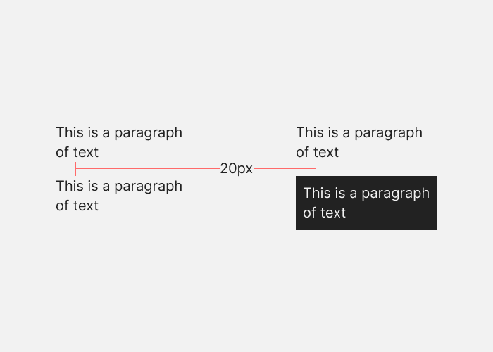

# Visual Design Rules

## Use near-black and near-white colors

Near-black: #222222
Near-white: #F2F2F2

## Saturate your neutrals

For example, if your red is 100% saturated in HSB, your neutrals should be less than 5% saturated.

Maybe you can reduce opacity to make them less saturated.

## Align everything

Alignment is the easiest way to make your designs look more professional. It makes thing relate to each other and creates a sense of order.

## Spacing should go between points of high contrast

When you’re measuring out space between elements in a design—for example if you want 100px of vertical space between blocks of content on a landing page—the spacing should be from one point of high contrast to the next. This is because our eyes find the edges of elements based on contrast, so we expect the spacing to run between points of contrast.

A white background with black paragraphs of text means that the points of contrast will be the end of one paragraph and the start of the next. But if you put a black background behind one white paragraph, the spacing should run from the end of one paragraph to the start of the black background, then again from the start of the black background to the start of the paragraph.

## Text

- Keep body text at 16px or larger
- Line height should be 1.5 times the font size
- Use a maximum of 2 fonts
- Use a line length of 45-75 characters

## Source

- [Source](https://anthonyhobday.com/sideprojects/saferules/)
