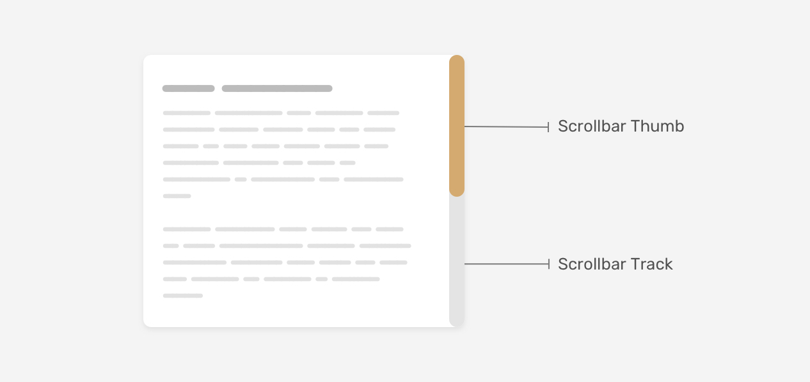

# Scrollbar

Scrollbar contains the track and thumb.

- The thumb is the part of the scrollbar that you can drag to scroll.
- The track is the area in which the thumb moves.



## Customize scrollbar

### Old syntax

These syntax only works for WebKit browsers (Chrome, Safari, etc.).

#### Scrollbar width

```css
/* Full page */
::-webkit-scrollbar {
  width: 12px;
}

/* For specific container */
.section::-webkit-scrollbar {
  width: 12px;
}
```

#### Scrollbar track

```css
/* Full page */
::-webkit-scrollbar-track {
  background-color: #f1f1f1;
}

/* For specific container */
.section::-webkit-scrollbar-track {
  background-color: #f1f1f1;
}
```

#### Scrollbar thumb

```css
/* Full page */
::-webkit-scrollbar-thumb {
  box-shadow: inset 0 0 5px rgba(0, 0, 0, 0.2);
}

/* For specific container */
.section::-webkit-scrollbar-thumb {
  box-shadow: inset 0 0 5px rgba(0, 0, 0, 0.2);
}
```

### New syntax

These syntax works for all browsers.

#### [N] Scrollbar width

```css
.section {
  scrollbar-width: thin;
}
```

We can not define a speicific number for the width of the scrollbar.

#### [N] Scrollbar color

```css
.section {
  scrollbar-color: #c1c1c1 #f1f1f1;
}
```

#### [N] Scrollbar gutter

Gutter is the space between the scrollbar and the content.

Use `stable` to reserve space for the scrollbar, which is useful when the scrollbar appears and disappears.

```css
.section {
  scrollbar-gutter: stable;
}
```

## Notes

1. If you want a generic style, it should be applied to the `<html>` element, not the `<body>` element.

   ```css
   html {
     scrollbar-width: thin;
     scrollbar-color: #c1c1c1 #f1f1f1;
   }
   ```

2. In Firefox, it's limited only to the thickness and solid colors.

## Example

### Same scrollbar for MacOS and Windows

```css
.section {
  scrollbar-color: #d4aa70 #e4e4e4;
}

.section::-webkit-scrollbar {
  width: 16px;
}

.section::-webkit-scrollbar-track {
  background-color: #e4e4e4;
  border-radius: 100px;
}

.section::-webkit-scrollbar-thumb {
  background-color: #d4aa70;
  border-radius: 100px;
}
```

### Gradient scrollbar

```css
.section::-webkit-scrollbar-thumb {
  background-image: linear-gradient(180deg, #d0368a 0%, #708ad4 99%);
  box-shadow: inset 2px 2px 5px 0 rgba(#fff, 0.5);
  border-radius: 100px;
}
```

## Source

- [ishadeed](https://ishadeed.com/article/custom-scrollbars-css/)
