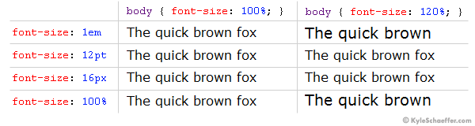
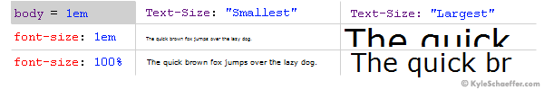
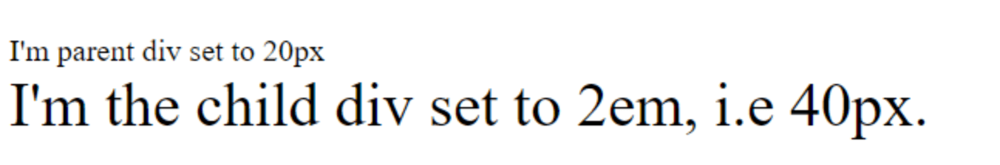
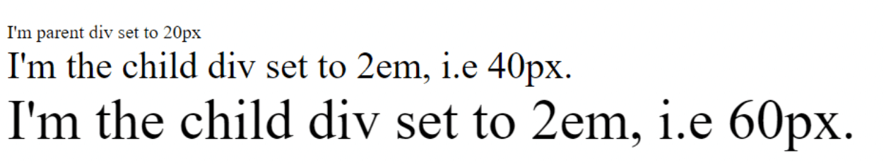

# Meet the Units

1. **“Ems” (em):** The “em” is a scalable unit that is used in web document media. An em is equal to the current font-size, for instance, if the font-size of the document is 12pt, 1em is equal to 12pt. Ems are scalable in nature, so 2em would equal 24pt, .5em would equal 6pt, etc. Ems are becoming increasingly popular in web documents due to scalability and their mobile-device-friendly nature.

2. **Pixels (px):** Pixels are fixed-size units that are used in screen media (i.e. to be read on the computer screen). One pixel is equal to one dot on the computer screen (the smallest division of your screen’s resolution). Many web designers use pixel units in web documents in order to produce a pixel-perfect representation of their site as it is rendered in the browser. One problem with the pixel unit is that it does not scale upward for visually-impaired readers or downward to fit mobile devices.

3. **Points (pt):** Points are traditionally used in print media (anything that is to be printed on paper, etc.). One point is equal to 1/72 of an inch. Points are much like pixels, in that they are fixed-size units and cannot scale in size.

4. **Percent (%):** The percent unit is much like the “em” unit, save for a few fundamental differences. First and foremost, the current font-size is equal to 100% (i.e. 12pt = 100%). While using the percent unit, your text remains fully scalable for mobile devices and for accessibility.

5. **Rem (rem)**: The unit `rem` (root em) stands for the font size of the root element. In an HTML document, the root element is the html element.

## So, What’s the Difference?

It’s easy to understand the difference between font-size units when you see them in action. Generally, **1em = 12pt = 16px = 100%**. When using these font-sizes, let’s see what happens when you increase the base font size (using the body CSS selector) from 100% to 120%.



As you can see, both the em and percent units get larger as the base font-size increases, but pixels and points do not. It can be easy to set an absolute size for your text, but it’s much easier on your visitors to use scalable text that can display on any device or any machine. For this reason, the em and percent units are preferred for web document text.

## Em vs. Percent

We’ve decided that point and pixel units are not necessarily best suited for web documents, which leaves us with the em and percent units. In theory, both the em and the percent units are identical, but in application, they actually have a few minor differences that are important to consider.

In the example above, we used the percent unit as our base font-size (on the body tag). **If you change your base font-size from percent to ems** (i.e. **body { font-size: 1em; }**), you _probably_ won’t notice a difference. Let’s see what happens when “1em” is our body font-size, and when the client alters the “Text Size” setting of their browser (this is available in some browsers, such as Internet Explorer).



When the client’s browser text size is set to “medium,” there is no difference between ems and percent. When the setting is altered, however, the difference is quite large. On the “Smallest” setting, ems are much smaller than percent, and when on the “Largest” setting, it’s quite the opposite, with ems displaying much larger than percent. While some could argue that the em units are scaling as they are truly intended, in practical application, the em text scales too abruptly, with the smallest text becoming hardly legible on some client machines.

## em and rem units in CSS

When looking for ways of specifying lengths in CSS, we’re quite spoiled for choices. All units for specifying lengths in CSS fall under two categories.

Absolute lengths: Absolute lengths, as the name suggests, are absolute; they’re fixed and don’t react relative to anything. This means no matter what happens, they’ll be the same size. Absolute lengths include cm, mm, in, px, pts, and pc. Relative lengths: Relative lengths are units that specify a length relative to another unit, i.e., they respond based on other specified units or elements. They include %, vmax, vmin, vh, vw, ch, ex, em and rem.

### What is `em`?

`em` units in CSS are a relative unit of measurement used to size elements on a web page, mostly font size. Because ==it’s relative to its parent element==, 1 em is equal to the font-size set in the parent element.

This means if you set the font-size in a parent div to 20px and set the font-size of the child div to 2 em, the font-size in the child div will equal 40px. Here’s an example.

First, let’s write the HTML

```html
<html lang="en">
  <head>
    <meta charset="UTF-8" />
    <meta http-equiv="X-UA-Compatible" content="IE=edge" />
    <meta name="viewport" content="width=device-width, initial-scale=1.0" />
    <title>Document</title>
    <link rel="stylesheet" href="style.css" />
  </head>
  <body>
    <div class="parent">
      I'm parent div set to 20px
      <div class="child">I'm the child div set to 2em, i.e 40px.</div>
    </div>
  </body>
</html>
```

Next, the CSS.

```css
.parent {
  font-size: 20px;
}

.child {
  font-size: 2em;
}

p {
  font-size: 1.5em;
}
```

That will give us this.



The em unit is useful because it allows you to adjust the size of elements on a page based on the font-size of a previously stated element, which helps create a consistent visual hierarchy. This can be useful for creating accessible websites that are easy to read for users with visual impairments.

It’s important to note that if you don’t specify the value of a parent element, the default value of the browser is taken as the parent element.

```css
p {
  font-size: 1.5em;
}
```

In this example, the font-size property is set to 1.5em, meaning that the text size in the `<p>` element will be 1.5 times the size of the browser's default font-size if there’s no direct parent element.

Since most browsers scale their default font-size according to the screen size, this allows you to create flexible and responsive layouts that can adapt to different screen and font sizes.

Using the appropriate CSS properties, em units can also be used to set the size of other elements, such as margins, padding, and borders.

### What is `rem`?

`rem` is another unit of measuring length in CSS, which stands for "root em". Since we know that an em is equal to the point size of the current font, we can deduce that the "root em" refers to the font size of the root element, which is usually the `<html>` element.

Like em, rem inherits its size from a parent element, but the parent element that rem looks at is not the div or section above it, but the very first element that surrounds it, which is the html element. Let’s make an example using the previous code. Same html code, with just an extra div.

```html
<html lang="en">
  <head>
    <meta charset="UTF-8" />
    <meta http-equiv="X-UA-Compatible" content="IE=edge" />
    <meta name="viewport" content="width=device-width, initial-scale=1.0" />
    <title>Document</title>
    <link rel="stylesheet" href="style.css" />
  </head>
  <body>
    <div class="parent">
      I'm parent div set to 20px
      <div class="child">I'm the child div set to 2em, i.e 40px.</div>
      <div class="child-2">I'm the child div set to 2em, i.e 60px.</div>
    </div>
  </body>
</html>
```

Next, we’ll add the following CSS code to our CSS file.

```css
html {
  font-size: 30px;
}

.child-2 {
  font-size: 2rem;
}
```

The result would be this.



As you can see, despite the child-2 div being inside another divs, it goes back all the way to the html element to inherit its font size.

Using the "rem" unit allows for a more scalable and flexible way to size elements on a page because if you change the font-size of the root element, all elements sized with the "rem" unit will be updated automatically to maintain their relative size.

### Advanced Usage of em and rem

#### Compound Scaling with em

We can use em units to create compound scaling effects within nested elements. For instance, if we set a parent element to have a font size of 2em, and a child element to have a font size of 1.5em, the child’s font size will be 1.5 times the parent’s size, creating a scalable hierarchy.

```css
.parent {
  font-size: 2em;
}

.child {
  font-size: 1.5em; /* This will be 1.5 * 2em = 3em */
}
```

#### Responsive Typography with rem

Using rem units for typography ensures that all text scales relative to the root font size. By adjusting the root font size with media queries, we can easily create responsive typography.

```css
html {
  font-size: 16px; /* Default root font size */
}

@media (max-width: 600px) {
  html {
    font-size: 14px; /* Smaller font size for small screens */
  }
}

body {
  font-size: 1rem; /* 1rem = 16px by default, 14px on small screens */
}
```

#### Padding and Margins with rem

We can use rem units for padding and margins to maintain consistent spacing across different screen sizes. This approach ensures that spacing scales appropriately when the root font size changes.

```css
.container {
  padding: 2rem; /* Padding will scale with the root font size */
  margin: 1rem auto;
}
```

### rem vs em

In CSS, the rem unit is only relative to the document's root element, while the em unit is only relative to the immediate parent of the targeted element. This means that em sizes are inherited from parent elements, while rem sizes are inherited only from the root element.

### When to use em and rem units in CSS

It is a good idea to use the rem unit for global values such as font-sizes, margins, and padding, especially if you want to specify a font-size for the entire document and have it scale uniformly rather than being influenced by the font sizes of parent elements.

em is more suited for values that are specific to a particular element and its children. This allows you to create a consistent and flexible layout that adjusts well to different screen sizes and font sizes. Potential problems with using em and rem units in CSS em and rem are by far the best units to use today when specifying length, but like all things in life, they’re not perfect. These are a couple of problems you may run into when using em and rem:

- **Complex calculations:** Using em and rem units can lead to complex calculations, especially when nested elements are involved. This can make it difficult to accurately predict and control the size of elements on a page.
- **Inheritance issues:** Because em units are relative to the font size of their parent element, it can be difficult to understand and control how sizes are inherited across the page. This can lead to unexpected results and require additional debugging to resolve.
- **Performance issues:** In some very rare cases, using em and rem units can have a negative impact on performance, especially when combined with complex calculations or used excessively on a page.

### Accessibility Considerations

#### Scalable Font Sizes

Because I used either `em` or `rem` for the font sizes, then text on the webpage gets scalable to respond to user needs. This is beneficial to people with visual impairments who may desire a larger text size for comfort in reading. Browsers can scale these units more easily than fixed units.

#### Consistent Spacing

By using rem for margins, padding, and other spacing properties, it's certain everything scales consistently. This could improve the predictability of the layout structure, which can help users with cognitive disabilities.

#### Responsive Design

As already explained, both 'em' and 'rem' units are relative units, so designing a responsible layout becomes a lot easier. The layout then dynamically adapts according to screen size because the sizes of screens change, which is paramount as users are from diverse devices and can use assistive technologies.

#### User Preferences

Some users set up their browser to have a different font size from the default to increase readability. By designing with `rem` units, user styles get respected, and our content stays accessible.

#### Reduced Motion and Distraction

Em and rem units make it more in control to resize and reposition the elements, reducing unnecessary movement and distractions visually—a very challenging experience for users with attention-related disabilities. In short, we use em and rem units in our CSS to make the design more accessible and user-friendly. It is such a small but powerful way of using inclusive and adaptive design to cater to a wider scope of user needs.

## Why `rem` not `px`?

`px` is a fixed unit of measure. We tend not to use them in responsive design at all.

## Unit Overview

Historically `px` units typically represented one device pixel. With devices having higher and higher pixel density this no longer holds for many devices, such as with Apple's Retina Display.

`rem` units represent the **r**oot **em** size. It's the `font-size` of whatever matches `:root`. In the case of HTML, it's the `<html>` element; for SVG, it's the `<svg>` element. The default `font-size` in every browser\* is `16px`.

## On Using `px`

The majority of CSS examples on the internet use `px` values because they were the de-facto standard. `pt`, `in` and a variety of other units _could_ have been used in theory, but they didn't handle small values well as you'd quickly need to resort to fractions, which were longer to type, and harder to reason about.

If you wanted a thin border, with `px` you could use `1px`, with `pt` you'd need to use `0.75pt` for consistent results, and that's just not very convenient.

## On Using `rem`

`rem`'s default value of `16px` isn't a very strong argument for its use. Writing `0.0625rem` is _worse_ than writing `0.75pt`, so why would anyone use `rem`?

There are two parts to `rem`'s advantage over other units.

- User preferences are respected
- You can change the apparent `px` value of `rem` to whatever you'd like

### Respecting User Preferences

Browser zoom has changed a lot over the years. Historically many browsers would only scale up `font-size`, but that changed pretty rapidly when websites realized that their beautiful pixel-perfect designs were breaking any time someone zoomed in or out. At this point, browsers scale the entire page, so font-based zooming is out of the picture.

Respecting a user's wishes is not out of the picture. Just because a browser is set to `16px` by default, doesn't mean any user can't change their preferences to `24px` or `32px` to correct for low vision or poor visibility (e.x. screen glare). If you base your units off of `rem`, any user at a higher font-size will see a proportionally larger site. Borders will be bigger, padding will be bigger, margins will be bigger, everything will scale up fluidly.

If you base your media queries on `rem`, you can also make sure that the site your users see fits their screen. A user with `font-size` set to `32px` on a `640px` wide browser, will effectively be seeing your site as shown to a user at `16px` on a `320px` wide browser. There's absolutely no loss for responsive web design (RWD) in using `rem`.

### Changing Apparent `px` Value

Because `rem` is based on the `font-size` of the `:root` node, if you want to change what `1rem` represents, all you have to do is change the `font-size`.

_**Whatever you do, don't set the `:root` element's `font-size` to a `px` value.**_

If you set the `font-size` on `html` to a `px` value, you've blown away the user's preferences without a way to get them back.

If you want to change the _apparent_ value of `rem`, use `%` units.

The math for this is reasonably straight-forward.

The apparent font-size of `:root` is `16px`, but lets say we want to change it to `20px`. All we need to do is multiply `16` by some value to get `20`.

Set up your equation:

```console
16 * X = 20
```

And solve for `X`:

```console
X = 20 / 16
X = 1.25
X = 125%
```

```css
:root {
  font-size: 125%; // 20px
}
```

Doing everything in multiples of `20` isn't all that great, but a common suggestion is to make the apparent size of `rem` equal to `10px`. The magic number for that is `10/16` which is `0.625`, or `62.5%`.

```css
:root {
  font-size: 62.5%; // 10px
}
```

The problem now is that your default `font-size` for the rest of the page is set way too small, but there's a simple fix for that: Set a `font-size` on `body` using `rem`:

```css
:root {
  font-size: 62.5%;
}

body {
  font-size: 1.6rem; // 16px
}
```

It's important to note, with this adjustment in place, the apparent value of `rem` is `10px` which means any value you might have written in `px` can be converted directly to `rem` by bumping a decimal place.

```xml
padding: 20px;
```

turns into

```xml
padding: 2rem;
```

The apparent font-size you choose is up to you, so if you want there's no reason you can't use:

```xml
:root {
  font-size: 6.25%;
}
body {
  font-size: 16rem;
}
```

and have `1rem` equal `1px`.

So there you have it, a simple solution to respect user wishes while also avoiding over-complicating your CSS.

## Wait, so what's the catch?

I was afraid you might ask that. As much as I'd like to pretend that `rem` is magic and solves-all-things, there are still some issues of note. Nothing deal-breaking **in my opinion**, but I'm going to call them out so you can't say I didn't warn you.

### Media Queries (use `em`)

One of the first issues you'll run into with `rem` involves media queries. Consider the following code:

```xml
:root {
  font-size: 1000px;
}
@media (min-width: 1rem) {
  :root {
    font-size: 1px;
  }
}
```

Here the value of `rem` changes depending on whether the media-query applies, and the media query depends on the value of `rem`, so what on earth is going on?

`rem` in media queries uses the initial value of `font-size` and _should not_ (see Safari section) take into account any changes that may have happened to the `font-size` of the `:root` element. In other words, it's apparent value is _always_ `16px`.

This is a bit annoying, because it means that you have to do _some_ fractional calculations, but I have found that most common media queries already use values that are multiples of 16.

```xml
|   px | rem |
+------+-----+
|  320 |  20 |
|  480 |  30 |
|  768 |  48 |
| 1024 |  64 |
| 1200 |  75 |
| 1600 | 100 |
```

Additionally if you're using a CSS preprocessor, you can use mixins or variables to manage your media queries, which will mask the issue entirely.

#### Safari

Unfortunately there's a known bug with Safari where changes to the `:root` font-size do actually change the calculated `rem` values for media query ranges. This can cause some very strange behavior if the font-size of the `:root` element is changed within a media query. Fortunately the fix is simple: [use `em` units for media queries](https://zellwk.com/blog/media-query-units/).

### Context Switching

If you switch between projects various different projects, it's quite possible that the apparent font-size of `rem` will have different values. In one project, you might be using an apparent size of `10px` where in another project the apparent size might be `1px`. This can be confusing and cause issues.

My only recommendation here is to stick with `62.5%` to convert `rem` to an apparent size of `10px`, because that has been more common in my experience.

## Source

- [joshwcomeau](https://www.joshwcomeau.com/css/surprising-truth-about-pixels-and-accessibility/)
