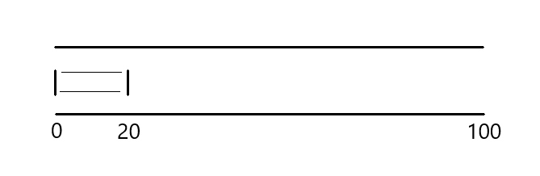
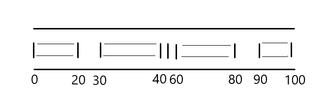

# Custom Audio Player

We should first go through the semantic HTML elements of the player before we start building features and styling things. We have plenty of elements to work with here based on the elements we just listed above.

## Play/pause button

I think the HTML element appropriate for this button is the `<button>` element. It will contain the play icon, but the pause icon should also be in this button. That way, we’re toggling between the two rather than taking up space by displaying both at the same time.

Something like this in the markup:

```html
<div id="audio-player-container">
  <p>Audio Player</p>
  <!-- swaps with pause icon -->
  <button id="play-icon"></button>
</div>
```

So, the question becomes: how do we swap between the two buttons, both visually and functionally? the pause icon will replace the play icon when the play action is triggered. The play button should display when the audio is paused and the pause button should display when the audio is playing.

```html
<div id="audio-player-container">
  <p>audio player ish</p>
  <button id="play-icon"></button>
</div>
```

```css
body {
  font-family: Arial, Helvetica, sans-serif;
}
button {
  padding: 0;
  border: 0;
  background: inherit;
  cursor: pointer;
  outline: none;
  width: 40px;
  height: 40px;
}
#audio-player-container {
  position: relative;
  margin: 100px 5% auto 5%;
  width: 90%;
  max-width: 500px;
  height: 80px;
  background: #fff;
}
#audio-player-container::before {
  position: absolute;
  content: "";
  width: calc(100% + 4px);
  height: calc(100% + 4px);
  left: -2px;
  top: -2px;
  background: linear-gradient(to left, #007db5, #ff8a00);
  z-index: -1;
}
p {
  position: absolute;
  top: -18px;
  right: 5%;
  padding: 0 5px;
  margin: 0;
  font-size: 28px;
  background: #fff;
}
#play-icon {
  margin: 20px 2.5% 20px 2.5%;
}
path {
  stroke: #007db5;
}
```

```js
import lottieWeb from "https://cdn.skypack.dev/lottie-web";

const playIconContainer = document.getElementById("play-icon");
let state = "play";

const animation = lottieWeb.loadAnimation({
  container: playIconContainer,
  path: "https://maxst.icons8.com/vue-static/landings/animated-icons/icons/pause/pause.json",
  renderer: "svg",
  loop: false,
  autoplay: false,
  name: "Demo Animation",
});

animation.goToAndStop(14, true);

playIconContainer.addEventListener("click", () => {
  if (state === "play") {
    animation.playSegments([14, 27], true);
    state = "pause";
  } else {
    animation.playSegments([0, 14], true);
    state = "play";
  }
});
```

The HTML section contains the following:

- a container for the player,
- text that briefly describes the container, and
- a `<button>` element for the play and pause actions.

The CSS section includes some light styling. The JavaScript is what we need to break down a bit because it’s doing several things:

```javascript
// imports the Lottie library via Skypack
import lottieWeb from "https://cdn.skypack.dev/lottie-web";

// variable for the button that will contain both icons
const playIconContainer = document.getElementById("play-icon");
// variable that will store the button’s current state (play or pause)
let state = "play";

// loads the animation that transitions the play icon into the pause icon into the referenced button, using Lottie’s loadAnimation() method
const animation = lottieWeb.loadAnimation({
  container: playIconContainer,
  path: "https://maxst.icons8.com/vue-static/landings/animated-icons/icons/pause/pause.json",
  renderer: "svg",
  loop: false,
  autoplay: false,
  name: "Demo Animation",
});

animation.goToAndStop(14, true);

// adds an event listener to the button so that when it is clicked, the the player toggles between play and pause
playIconContainer.addEventListener("click", () => {
  if (state === "play") {
    animation.playSegments([14, 27], true);
    state = "pause";
  } else {
    animation.playSegments([0, 14], true);
    state = "play";
  }
});
```

Here’s what the script is doing, minus the code:

- It imports the Lottie library via Skypack.
- It references the button that will contain both icons in a variable.
- It defines a variable that will store the button’s current state (play or pause).
- It loads the animation that transitions the play icon into the pause icon into the referenced button, using Lottie’s `loadAnimation()` method.
- It displays the play icon on load since the audio is initially paused.
- It adds an event listener to the button so that when it is clicked, the the player toggles between play and pause.

## Current time and duration

The current time is like a progress indicate that shows you how much time has elapsed from the start of the audio file. The duration? That’s just how long the sound file is.

A `<span>` element is okay to display these. The `<span>` element for the current time, which is to be updated every second, has a default text content of `0:00`. On the other side, the one for duration is the duration of the audio in `mm:ss` format.

```html
<div id="audio-player-container">
  <p>Audio Player</p>
  <button id="play-icon"></button>
  <span id="current-time" class="time">0:00</span>
  <span id="duration" class="time">0:00</span>
</div>
```

## Seek slider and volume control slider

We need a way to move to any point in time in the sound file. So, if I want to skip ahead to the halfway point of the file, I can simply click and drag a slider to that spot in the timeline.

We also need a way to control the sound volume. That, too, can be some sort of click-and-drag slider thingy.

I would say `<input type="range">` is the right HTML element for both of these features.

```html
<div id="audio-player-container">
  <p>Audio Player</p>
  <button id="play-icon"></button>
  <span id="current-time" class="time">0:00</span>
  <input type="range" id="seek-slider" max="100" value="0" />
  <span id="duration" class="time">0:00</span>
  <input type="range" id="volume-slider" max="100" value="100" />
</div>
```

Styling range inputs with CSS is totally possible, but I’ll tell you what: it is difficult for me to wrap my head around.

Look at all the code needed on `input[type="range"]` to get a consistent experience:

```css
input[type="range"] {
  position: relative;
  -webkit-appearance: none;
  width: 48%;
  margin: 0;
  padding: 0;
  height: 19px;
  margin: 30px 2.5% 20px 2.5%;
  float: left;
  outline: none;
}
input[type="range"]::-webkit-slider-runnable-track {
  width: 100%;
  height: 3px;
  cursor: pointer;
  background: linear-gradient(
    to right,
    rgba(0, 125, 181, 0.6) var(--buffered-width),
    rgba(0, 125, 181, 0.2) var(--buffered-width)
  );
}
input[type="range"]::before {
  position: absolute;
  content: "";
  top: 8px;
  left: 0;
  width: var(--seek-before-width);
  height: 3px;
  background-color: #007db5;
  cursor: pointer;
}
input[type="range"]::-webkit-slider-thumb {
  position: relative;
  -webkit-appearance: none;
  box-sizing: content-box;
  border: 1px solid #007db5;
  height: 15px;
  width: 15px;
  border-radius: 50%;
  background-color: #fff;
  cursor: pointer;
  margin: -7px 0 0 0;
}
input[type="range"]:active::-webkit-slider-thumb {
  transform: scale(1.2);
  background: #007db5;
}
input[type="range"]::-moz-range-track {
  width: 100%;
  height: 3px;
  cursor: pointer;
  background: linear-gradient(
    to right,
    rgba(0, 125, 181, 0.6) var(--buffered-width),
    rgba(0, 125, 181, 0.2) var(--buffered-width)
  );
}
input[type="range"]::-moz-range-progress {
  background-color: #007db5;
}
input[type="range"]::-moz-focus-outer {
  border: 0;
}
input[type="range"]::-moz-range-thumb {
  box-sizing: content-box;
  border: 1px solid #007db5;
  height: 15px;
  width: 15px;
  border-radius: 50%;
  background-color: #fff;
  cursor: pointer;
}
input[type="range"]:active::-moz-range-thumb {
  transform: scale(1.2);
  background: #007db5;
}
input[type="range"]::-ms-track {
  width: 100%;
  height: 3px;
  cursor: pointer;
  background: transparent;
  border: solid transparent;
  color: transparent;
}
input[type="range"]::-ms-fill-lower {
  background-color: #007db5;
}
input[type="range"]::-ms-fill-upper {
  background: linear-gradient(
    to right,
    rgba(0, 125, 181, 0.6) var(--buffered-width),
    rgba(0, 125, 181, 0.2) var(--buffered-width)
  );
}
input[type="range"]::-ms-thumb {
  box-sizing: content-box;
  border: 1px solid #007db5;
  height: 15px;
  width: 15px;
  border-radius: 50%;
  background-color: #fff;
  cursor: pointer;
}
input[type="range"]:active::-ms-thumb {
  transform: scale(1.2);
  background: #007db5;
}
```

Styling the progress section of range inputs is a tricky endeavor. Firefox provides the `::-moz-range-progress` pseudo-element while Internet Explorer provides `::-ms-fill-lower`. As WebKit browsers do not provide any similar pseudo-element, we have to use the `::before` pseudo-element to improvise the progress. That explains why, if you noticed, I added event listeners in the JavaScript section to set custom CSS properties (e.g. `--before-width`) that update when the input event is fired on each of the sliders.

## Volume percentage

This is to display the percentage volume. The text content of this element is updated as the user changes the volume through the slider. Since it is based on user input, I think this element should be the `<output>` element.

```html
<div id="audio-player-container">
  <p>Audio Player</p>
  <button id="play-icon"></button>
  <span id="current-time" class="time">0:00</span>
  <input type="range" id="seek-slider" max="100" value="0" />
  <span id="duration" class="time">0:00</span>
  <output id="volume-output">100</output>
  <input type="range" id="volume-slider" max="100" value="100" />
</div>
```

## Mute button

Like for the play and pause actions, this should be in a `<button>` element. Luckily for us, Icons8 also has an [animated mute icon](https://icons8.com/free-animated-icons/mute). So we would use the Lottie library here just as we did for the play/pause button.

```html
<div id="audio-player-container">
  <p>Audio Player</p>
  <button id="play-icon"></button>
  <span id="current-time" class="time">0:00</span>
  <input type="range" id="seek-slider" max="100" value="0" />
  <span id="duration" class="time">0:00</span>
  <output id="volume-output">100</output>
  <input type="range" id="volume-slider" max="100" value="100" />
  <button id="mute-icon"></button>
</div>
```

That’s all of the basic markup, styling and scripting we need at the moment!

```html
<div id="audio-player-container">
  <p>audio player ish</p>
  <button id="play-icon"></button>
  <span id="current-time" class="time">0:00</span>
  <input type="range" id="seek-slider" max="100" value="0" />
  <span id="duration" class="time">0:00</span>
  <output id="volume-output">100</output>
  <input type="range" id="volume-slider" max="100" value="100" />
  <button id="mute-icon"></button>
</div>
```

```css
body {
  margin: 0;
  padding: 0;
  font-family: Arial, Helvetica, sans-serif;
  letter-spacing: -0.5px;
}
button {
  padding: 0;
  border: 0;
  background: transparent;
  cursor: pointer;
  outline: none;
  width: 40px;
  height: 40px;
  float: left;
}
#audio-player-container {
  --seek-before-width: 0%;
  --volume-before-width: 100%;
  --buffered-width: 0%;
  position: relative;
  margin: 100px 2.5% auto 2.5%;
  width: 95%;
  max-width: 500px;
  height: 132px;
  background: #fff;
}
#audio-player-container::before {
  position: absolute;
  content: "";
  width: calc(100% + 4px);
  height: calc(100% + 4px);
  left: -2px;
  top: -2px;
  background: linear-gradient(to left, #007db5, #ff8a00);
  z-index: -1;
}
p {
  position: absolute;
  top: -18px;
  right: 5%;
  padding: 0 5px;
  margin: 0;
  font-size: 28px;
  background: #fff;
}
#play-icon {
  margin: 20px 2.5% 10px 2.5%;
}
path {
  stroke: #007db5;
}
.time {
  display: inline-block;
  width: 37px;
  text-align: center;
  font-size: 20px;
  margin: 28.5px 0 18.5px 0;
  float: left;
}
output {
  display: inline-block;
  width: 32px;
  text-align: center;
  font-size: 20px;
  margin: 10px 2.5% 0 5%;
  float: left;
  clear: left;
}
#volume-slider {
  margin: 10px 2.5%;
  width: 58%;
}
#volume-slider::-webkit-slider-runnable-track {
  background: rgba(0, 125, 181, 0.6);
}
#volume-slider::-moz-range-track {
  background: rgba(0, 125, 181, 0.6);
}
#volume-slider::-ms-fill-upper {
  background: rgba(0, 125, 181, 0.6);
}
#volume-slider::before {
  width: var(--volume-before-width);
}
#mute-icon {
  margin: 0 2.5%;
}
input[type="range"] {
  position: relative;
  -webkit-appearance: none;
  width: 48%;
  margin: 0;
  padding: 0;
  height: 19px;
  margin: 30px 2.5% 20px 2.5%;
  float: left;
  outline: none;
}
input[type="range"]::-webkit-slider-runnable-track {
  width: 100%;
  height: 3px;
  cursor: pointer;
  background: linear-gradient(
    to right,
    rgba(0, 125, 181, 0.6) var(--buffered-width),
    rgba(0, 125, 181, 0.2) var(--buffered-width)
  );
}
input[type="range"]::before {
  position: absolute;
  content: "";
  top: 8px;
  left: 0;
  width: var(--seek-before-width);
  height: 3px;
  background-color: #007db5;
  cursor: pointer;
}
input[type="range"]::-webkit-slider-thumb {
  position: relative;
  -webkit-appearance: none;
  box-sizing: content-box;
  border: 1px solid #007db5;
  height: 15px;
  width: 15px;
  border-radius: 50%;
  background-color: #fff;
  cursor: pointer;
  margin: -7px 0 0 0;
}
input[type="range"]:active::-webkit-slider-thumb {
  transform: scale(1.2);
  background: #007db5;
}
input[type="range"]::-moz-range-track {
  width: 100%;
  height: 3px;
  cursor: pointer;
  background: linear-gradient(
    to right,
    rgba(0, 125, 181, 0.6) var(--buffered-width),
    rgba(0, 125, 181, 0.2) var(--buffered-width)
  );
}
input[type="range"]::-moz-range-progress {
  background-color: #007db5;
}
input[type="range"]::-moz-focus-outer {
  border: 0;
}
input[type="range"]::-moz-range-thumb {
  box-sizing: content-box;
  border: 1px solid #007db5;
  height: 15px;
  width: 15px;
  border-radius: 50%;
  background-color: #fff;
  cursor: pointer;
}
input[type="range"]:active::-moz-range-thumb {
  transform: scale(1.2);
  background: #007db5;
}
input[type="range"]::-ms-track {
  width: 100%;
  height: 3px;
  cursor: pointer;
  background: transparent;
  border: solid transparent;
  color: transparent;
}
input[type="range"]::-ms-fill-lower {
  background-color: #007db5;
}
input[type="range"]::-ms-fill-upper {
  background: linear-gradient(
    to right,
    rgba(0, 125, 181, 0.6) var(--buffered-width),
    rgba(0, 125, 181, 0.2) var(--buffered-width)
  );
}
input[type="range"]::-ms-thumb {
  box-sizing: content-box;
  border: 1px solid #007db5;
  height: 15px;
  width: 15px;
  border-radius: 50%;
  background-color: #fff;
  cursor: pointer;
}
input[type="range"]:active::-ms-thumb {
  transform: scale(1.2);
  background: #007db5;
}
```

```js
import lottieWeb from "https://cdn.skypack.dev/lottie-web";

const playIconContainer = document.getElementById("play-icon");
const audioPlayerContainer = document.getElementById("audio-player-container");
const seekSlider = document.getElementById("seek-slider");
const volumeSlider = document.getElementById("volume-slider");
const muteIconContainer = document.getElementById("mute-icon");
let playState = "play";
let muteState = "unmute";

const playAnimation = lottieWeb.loadAnimation({
  container: playIconContainer,
  path: "https://maxst.icons8.com/vue-static/landings/animated-icons/icons/pause/pause.json",
  renderer: "svg",
  loop: false,
  autoplay: false,
  name: "Play Animation",
});

const muteAnimation = lottieWeb.loadAnimation({
  container: muteIconContainer,
  path: "https://maxst.icons8.com/vue-static/landings/animated-icons/icons/mute/mute.json",
  renderer: "svg",
  loop: false,
  autoplay: false,
  name: "Mute Animation",
});

playAnimation.goToAndStop(14, true);

playIconContainer.addEventListener("click", () => {
  if (playState === "play") {
    playAnimation.playSegments([14, 27], true);
    playState = "pause";
  } else {
    playAnimation.playSegments([0, 14], true);
    playState = "play";
  }
});

muteIconContainer.addEventListener("click", () => {
  if (muteState === "unmute") {
    muteAnimation.playSegments([0, 15], true);
    muteState = "mute";
  } else {
    muteAnimation.playSegments([15, 25], true);
    muteState = "unmute";
  }
});

const showRangeProgress = (rangeInput) => {
  if (rangeInput === seekSlider) {
    audioPlayerContainer.style.setProperty(
      "--seek-before-width",
      (rangeInput.value / rangeInput.max) * 100 + "%"
    );
  } else {
    audioPlayerContainer.style.setProperty(
      "--volume-before-width",
      (rangeInput.value / rangeInput.max) * 100 + "%"
    );
  }
};

seekSlider.addEventListener("input", (e) => {
  showRangeProgress(e.target);
});
volumeSlider.addEventListener("input", (e) => {
  showRangeProgress(e.target);
});
```

### Working on the functionality

The HTML `<audio>` element has a `preload` attribute. This attribute gives the browser instructions for how to load the audio file. It accepts one of three values:

- `none` – indicates that the browser should not load the audio at all (unless the user initiates the play action)
- `metadata` – indicates that only the metadata (like length) of the audio should be loaded
- `auto` – loads the complete audio file

An empty string is equivalent to the `auto` value. Note, however, that these values are merely _hints_ to the browser. The browser does not have to agree to these values. For example, if a user is on a cellular network on iOS, Safari does not load any part of an audio, regardless of the `preload` attribute, except the user triggers the play action. For this player, we would use the `metadata` value since it doesn’t require much overhead and we want to display the length of the audio.

What would help us accomplish the features our audio player should have is the JavaScript `HTMLMediaElement` interface, which the `HTMLAudioElement` interface inherits. For our audio player code to be as self-explanatory as possible, I’d divide the JavaScript into two sections: presentation and functionality.

First off, we should create an `<audio>` element in the audio player that has the basic features we want:

```html
<div id=”audio-player-container”>
  <audio src=”my-favourite-song.mp3” preload=”metadata” loop>
  <button id="play-icon"></button>
  <!-- ... -->
</div>
```

## Display the audio duration

The first thing we want to display on the browser is the duration of the audio, when it is available. The `HTMLAudioElement` interface has a `duration` property, which returns the duration of the audio, returned in seconds units. If it is unavailable, it returns `NaN`.

We’ve set `preload` to `metadata` in this example, so the browser should provide us that information up front on load… assuming it respects `preload`. Since we’d be certain that the duration will be available when the browser has downloaded the metadata of the audio, we display it in our handler for the `loadedmetadata` event, which the interface also provides:

```javascript
const audio = document.querySelector("audio");

audio.addEventListener("loadedmetadata", () => {
  displayAudioDuration(audio.duration);
});
```

That’s great but, again, we get the duration in second. We probably should convert that to a `mm:ss` format:

```javascript
const calculateTime = (secs) => {
  const minutes = Math.floor(secs / 60);
  const seconds = Math.floor(secs % 60);
  const returnedSeconds = seconds < 10 ? `0${seconds}` : `${seconds}`;
  return `${minutes}:${returnedSeconds}`;
};
```

The third variable, `returnedSeconds`, is necessary for situations where the duration is something like 4 minutes and 8 seconds. We would want to return 4:08, not 4:8.

More often than not, the browser loads the audio faster than usual. When this happens, the `loadedmetadata` event is fired before its listener can be added to the `<audio>` element. Therefore, the audio duration is not displayed on the browser. Nevertheless, there’s a hack. The `HTMLMediaElement` has a property called `readyState`. It returns a number that, [according to MDN Web Docs](https://developer.mozilla.org/en-US/docs/Web/API/HTMLMediaElement/readyState), indicates the readiness state of the media. The following describes the values:

- `0` – no data about the media is available.
- `1` – the metadata attributes of the media are available.
- `2` – data is available, but not enough to play more than a frame.
- `3` – data is available, but for a little amount of frames from the current playback position.
- `4` – data is available, such that the media can be played through to the end without interruption.

We want to focus on the metadata. So our approach is to display the duration _if_ the metadata of the audio is available. If it is not available, we add the event listener. That way, the duration is always displayed.

```javascript
const audio = document.querySelector("audio");
const durationContainer = document.getElementById("duration");

const calculateTime = (secs) => {
  const minutes = Math.floor(secs / 60);
  const seconds = Math.floor(secs % 60);
  const returnedSeconds = seconds < 10 ? `0${seconds}` : `${seconds}`;
  return `${minutes}:${returnedSeconds}`;
};

const displayDuration = () => {
  durationContainer.textContent = calculateTime(audio.duration);
};

if (audio.readyState > 0) {
  displayDuration();
} else {
  audio.addEventListener("loadedmetadata", () => {
    displayDuration();
  });
}
```

## Seek slider

The default value of the range slider’s `max` property is 100. The general idea is that when the audio is playing, the thumb is supposed to be “sliding.” Also, it is supposed to move every second, such that it gets to the end of the slider when the audio ends.

Notwithstanding, if the audio duration is 150 seconds and the value of the slider’s `max` property is 100, the thumb will get to the end of the slider before the audio ends. This is why it is necessary to set the value of the slider’s `max` property to the audio duration in seconds. This way, the thumb gets to the end of the slider when the audio ends. Recall that this should be when the audio duration is available, when the browser has downloaded the audio metadata, as in the following:

```javascript
const seekSlider = document.getElementById("seek-slider");

const setSliderMax = () => {
  seekSlider.max = Math.floor(audio.duration);
};

if (audio.readyState > 0) {
  displayDuration();
  setSliderMax();
} else {
  audio.addEventListener("loadedmetadata", () => {
    displayDuration();
    setSliderMax();
  });
}
```

## Buffered amount

As the browser downloads the audio, it would be nice for the user to know how much of it they can seek to without delay. The `HTMLMediaElement` interface provides the `buffered` and `seekable` properties. The `buffered` property returns a `TimeRanges` object, which indicates the chunks of media that the browser has downloaded. [According to MDN Web Docs](https://developer.mozilla.org/en-US/docs/Web/API/TimeRanges), a `TimeRanges` object is a series of non-overlapping ranges of time, with start and stop times. The chunks are usually contiguous, unless the user seeks to another part in the media. The `seekable` property returns a `TimeRanges` object, which indicates “seekable” parts of the media, irrespective of whether they’ve been downloaded or not.

Recall that the `preload="metadata"` attribute is present in our `<audio>` element. If, for example the audio duration is 100 seconds, the `buffered` property returns a `TimeRanges` object similar to the following:



When the audio has started playing, the `seekable` property would return a `TimeRanges` object similar to the following:



It returns multiple chunks of media because, more often than not, [byte-range requests](https://developer.mozilla.org/en-US/docs/Web/HTTP/Range_requests) are enabled on the server. What this means is that multiple parts of the media can be downloaded simultaneously. However, we want to display the buffered amount closest to the current playback position. That would be the first chunk (time range 0 to 20). That would be the first and last chunk from the first image. As the audio starts playing, the browser begins to download more chunks. We would want to display the one closest to the current playback position, which would be the current last chunk returned by the buffered property. The following snippet would store in the variable, `bufferedAmount`, i.e. the time for the end of the last range in the `TimeRanges` object returned by the `buffered` property.

```javascript
const audio = document.querySelector("audio");
const bufferedAmount = audio.buffered.end(audio.buffered.length - 1);
```

This would be 20 from the 0 to 20 range in the first image. The following snippet stores in the variable, `seekableAmount`, the time for the end of the last range in the `TimeRanges` object returned by the `seekable` property.

```javascript
const audio = document.querySelector("audio");
const seekableAmount = audio.seekable.end(audio.seekable.length - 1);
```

Nevertheless, this would be 100 from the 90 to 100 range in the second image, which is the entire audio duration. Note that there are some holes in the `TimeRanges` object as the browser only downloads some parts of the audio. What this means is that the entire duration would be displayed to the user as the buffered amount. Meanwhile, some parts in the audio are not available yet. Because this won’t provide the best user experience, the first snippet is what we should use.

As the browser downloads the audio, the user should expect that the buffered amount on the slider increases in width. The `HTMLMediaElement` provides an event, the progress event, which fires as the browser loads the media. Of course, I’m thinking what you’re thinking! The buffered amount should be incremented in the handler for the audio’s progress event.

Finally, we should actually display the buffered amount on the seek slider. We do that by setting the property we talked about earlier, `--buffered-width`, as a percentage of the value of the slider’s `max` property. Yes, in the handler for the progress event too. Also, because of the browser loading the audio faster than usual, we should update the property in the `loadedmetadata` event and its preceding conditional block that checks for the readiness state of the audio.

```html
<div id="audio-player-container">
  <audio
    src="https://assets.codepen.io/4358584/Anitek_-_Komorebi.mp3"
    preload="metadata"
    loop
  ></audio>
  <p>audio player ish</p>
  <button id="play-icon"></button>
  <span id="current-time" class="time">0:00</span>
  <input type="range" id="seek-slider" max="100" value="0" />
  <span id="duration" class="time">0:00</span>
  <output id="volume-output">100</output>
  <input type="range" id="volume-slider" max="100" value="100" />
  <button id="mute-icon"></button>
</div>
```

```css
body {
  margin: 0;
  padding: 0;
  font-family: Arial, Helvetica, sans-serif;
  letter-spacing: -0.5px;
}
button {
  padding: 0;
  border: 0;
  background: transparent;
  cursor: pointer;
  outline: none;
  width: 40px;
  height: 40px;
  float: left;
}
#audio-player-container {
  --seek-before-width: 0%;
  --volume-before-width: 100%;
  --buffered-width: 0%;
  position: relative;
  margin: 100px 2.5% auto 2.5%;
  width: 95%;
  max-width: 500px;
  height: 132px;
  background: #fff;
}
#audio-player-container::before {
  position: absolute;
  content: "";
  width: calc(100% + 4px);
  height: calc(100% + 4px);
  left: -2px;
  top: -2px;
  background: linear-gradient(to left, #007db5, #ff8a00);
  z-index: -1;
}
p {
  position: absolute;
  top: -18px;
  right: 5%;
  padding: 0 5px;
  margin: 0;
  font-size: 28px;
  background: #fff;
}
#play-icon {
  margin: 20px 2.5% 10px 2.5%;
}
path {
  stroke: #007db5;
}
.time {
  display: inline-block;
  width: 37px;
  text-align: center;
  font-size: 20px;
  margin: 28.5px 0 18.5px 0;
  float: left;
}
output {
  display: inline-block;
  width: 32px;
  text-align: center;
  font-size: 20px;
  margin: 10px 2.5% 0 5%;
  float: left;
  clear: left;
}
#volume-slider {
  margin: 10px 2.5%;
  width: 58%;
}
#volume-slider::-webkit-slider-runnable-track {
  background: rgba(0, 125, 181, 0.6);
}
#volume-slider::-moz-range-track {
  background: rgba(0, 125, 181, 0.6);
}
#volume-slider::-ms-fill-upper {
  background: rgba(0, 125, 181, 0.6);
}
#volume-slider::before {
  width: var(--volume-before-width);
}
#mute-icon {
  margin: 0 2.5%;
}
input[type="range"] {
  position: relative;
  -webkit-appearance: none;
  width: 48%;
  margin: 0;
  padding: 0;
  height: 19px;
  margin: 30px 2.5% 20px 2.5%;
  float: left;
  outline: none;
}
input[type="range"]::-webkit-slider-runnable-track {
  width: 100%;
  height: 3px;
  cursor: pointer;
  background: linear-gradient(
    to right,
    rgba(0, 125, 181, 0.6) var(--buffered-width),
    rgba(0, 125, 181, 0.2) var(--buffered-width)
  );
}
input[type="range"]::before {
  position: absolute;
  content: "";
  top: 8px;
  left: 0;
  width: var(--seek-before-width);
  height: 3px;
  background-color: #007db5;
  cursor: pointer;
}
input[type="range"]::-webkit-slider-thumb {
  position: relative;
  -webkit-appearance: none;
  box-sizing: content-box;
  border: 1px solid #007db5;
  height: 15px;
  width: 15px;
  border-radius: 50%;
  background-color: #fff;
  cursor: pointer;
  margin: -7px 0 0 0;
}
input[type="range"]:active::-webkit-slider-thumb {
  transform: scale(1.2);
  background: #007db5;
}
input[type="range"]::-moz-range-track {
  width: 100%;
  height: 3px;
  cursor: pointer;
  background: linear-gradient(
    to right,
    rgba(0, 125, 181, 0.6) var(--buffered-width),
    rgba(0, 125, 181, 0.2) var(--buffered-width)
  );
}
input[type="range"]::-moz-range-progress {
  background-color: #007db5;
}
input[type="range"]::-moz-focus-outer {
  border: 0;
}
input[type="range"]::-moz-range-thumb {
  box-sizing: content-box;
  border: 1px solid #007db5;
  height: 15px;
  width: 15px;
  border-radius: 50%;
  background-color: #fff;
  cursor: pointer;
}
input[type="range"]:active::-moz-range-thumb {
  transform: scale(1.2);
  background: #007db5;
}
input[type="range"]::-ms-track {
  width: 100%;
  height: 3px;
  cursor: pointer;
  background: transparent;
  border: solid transparent;
  color: transparent;
}
input[type="range"]::-ms-fill-lower {
  background-color: #007db5;
}
input[type="range"]::-ms-fill-upper {
  background: linear-gradient(
    to right,
    rgba(0, 125, 181, 0.6) var(--buffered-width),
    rgba(0, 125, 181, 0.2) var(--buffered-width)
  );
}
input[type="range"]::-ms-thumb {
  box-sizing: content-box;
  border: 1px solid #007db5;
  height: 15px;
  width: 15px;
  border-radius: 50%;
  background-color: #fff;
  cursor: pointer;
}
input[type="range"]:active::-ms-thumb {
  transform: scale(1.2);
  background: #007db5;
}
```

```js
/** Implementation of the presentation of the audio player */
import lottieWeb from "https://cdn.skypack.dev/lottie-web";

const playIconContainer = document.getElementById("play-icon");
const audioPlayerContainer = document.getElementById("audio-player-container");
const seekSlider = document.getElementById("seek-slider");
const volumeSlider = document.getElementById("volume-slider");
const muteIconContainer = document.getElementById("mute-icon");
let playState = "play";
let muteState = "unmute";

const playAnimation = lottieWeb.loadAnimation({
  container: playIconContainer,
  path: "https://maxst.icons8.com/vue-static/landings/animated-icons/icons/pause/pause.json",
  renderer: "svg",
  loop: false,
  autoplay: false,
  name: "Play Animation",
});

const muteAnimation = lottieWeb.loadAnimation({
  container: muteIconContainer,
  path: "https://maxst.icons8.com/vue-static/landings/animated-icons/icons/mute/mute.json",
  renderer: "svg",
  loop: false,
  autoplay: false,
  name: "Mute Animation",
});

playAnimation.goToAndStop(14, true);

playIconContainer.addEventListener("click", () => {
  if (playState === "play") {
    playAnimation.playSegments([14, 27], true);
    playState = "pause";
  } else {
    playAnimation.playSegments([0, 14], true);
    playState = "play";
  }
});

muteIconContainer.addEventListener("click", () => {
  if (muteState === "unmute") {
    muteAnimation.playSegments([0, 15], true);
    muteState = "mute";
  } else {
    muteAnimation.playSegments([15, 25], true);
    muteState = "unmute";
  }
});

const showRangeProgress = (rangeInput) => {
  if (rangeInput === seekSlider)
    audioPlayerContainer.style.setProperty(
      "--seek-before-width",
      (rangeInput.value / rangeInput.max) * 100 + "%"
    );
  else
    audioPlayerContainer.style.setProperty(
      "--volume-before-width",
      (rangeInput.value / rangeInput.max) * 100 + "%"
    );
};

seekSlider.addEventListener("input", (e) => {
  showRangeProgress(e.target);
});
volumeSlider.addEventListener("input", (e) => {
  showRangeProgress(e.target);
});

/** Implementation of the functionality of the audio player */

const audio = document.querySelector("audio");
const durationContainer = document.getElementById("duration");

const calculateTime = (secs) => {
  const minutes = Math.floor(secs / 60);
  const seconds = Math.floor(secs % 60);
  const returnedSeconds = seconds < 10 ? `0${seconds}` : `${seconds}`;
  return `${minutes}:${returnedSeconds}`;
};

const displayDuration = () => {
  durationContainer.textContent = calculateTime(audio.duration);
};

const setSliderMax = () => {
  seekSlider.max = Math.floor(audio.duration);
};

const displayBufferedAmount = () => {
  const bufferedAmount = Math.floor(
    audio.buffered.end(audio.buffered.length - 1)
  );
  audioPlayerContainer.style.setProperty(
    "--buffered-width",
    `${(bufferedAmount / seekSlider.max) * 100}%`
  );
};

if (audio.readyState > 0) {
  displayDuration();
  setSliderMax();
  displayBufferedAmount();
} else {
  audio.addEventListener("loadedmetadata", () => {
    displayDuration();
    setSliderMax();
    displayBufferedAmount();
  });
}

audio.addEventListener("progress", displayBufferedAmount);
```

## Current time

As the user slides the thumb along the range input, the range value should be reflected in the `<span>` element containing the current time of the audio. This tells the user the current playback position of the audio. We do this in the handler of the slider’s input event listener.

If you think the correct event to listen to should be the change event, I beg to differ. Say the user moved the thumb from value 0 to 20. The input event fires at values 1 through to 20. However, the change event will fire only at value 20. If we use the change event, it will not reflect the playback position from values 1 to 19. So, I think the input event is appropriate. Then, in the handler for the event, we pass the slider’s value to the `calculateTime()` function we defined earlier.

We created the function to take time in seconds and return it in a `mm:ss` format. If you’re thinking, Oh, but the slider’s value is not time in seconds, let me explain. Actually, it is. Recall that we set the value of the slider’s `max` property to the audio duration, when it is available. Let’s say the audio duration is 100 seconds. If the user slides the thumb to the middle of the slider, the slider’s value will be 50. We wouldn’t want 50 to appear in the current time box because it is not in accordance with the `mm:ss` format. When we pass 50 to the function, the function returns 0:50 and that would be a better representation of the playback position.

I added the snippet below to our JavaScript.

```javascript
const currentTimeContainer = document.getElementById("current-time");

seekSlider.addEventListener("input", () => {
  currentTimeContainer.textContent = calculateTime(seekSlider.value);
});
```

Full

```js
/** Implementation of the presentation of the audio player */
import lottieWeb from "https://cdn.skypack.dev/lottie-web";

const playIconContainer = document.getElementById("play-icon");
const audioPlayerContainer = document.getElementById("audio-player-container");
const seekSlider = document.getElementById("seek-slider");
const volumeSlider = document.getElementById("volume-slider");
const muteIconContainer = document.getElementById("mute-icon");
let playState = "play";
let muteState = "unmute";

const playAnimation = lottieWeb.loadAnimation({
  container: playIconContainer,
  path: "https://maxst.icons8.com/vue-static/landings/animated-icons/icons/pause/pause.json",
  renderer: "svg",
  loop: false,
  autoplay: false,
  name: "Play Animation",
});

const muteAnimation = lottieWeb.loadAnimation({
  container: muteIconContainer,
  path: "https://maxst.icons8.com/vue-static/landings/animated-icons/icons/mute/mute.json",
  renderer: "svg",
  loop: false,
  autoplay: false,
  name: "Mute Animation",
});

playAnimation.goToAndStop(14, true);

playIconContainer.addEventListener("click", () => {
  if (playState === "play") {
    playAnimation.playSegments([14, 27], true);
    playState = "pause";
  } else {
    playAnimation.playSegments([0, 14], true);
    playState = "play";
  }
});

muteIconContainer.addEventListener("click", () => {
  if (muteState === "unmute") {
    muteAnimation.playSegments([0, 15], true);
    muteState = "mute";
  } else {
    muteAnimation.playSegments([15, 25], true);
    muteState = "unmute";
  }
});

const showRangeProgress = (rangeInput) => {
  if (rangeInput === seekSlider)
    audioPlayerContainer.style.setProperty(
      "--seek-before-width",
      (rangeInput.value / rangeInput.max) * 100 + "%"
    );
  else
    audioPlayerContainer.style.setProperty(
      "--volume-before-width",
      (rangeInput.value / rangeInput.max) * 100 + "%"
    );
};

seekSlider.addEventListener("input", (e) => {
  showRangeProgress(e.target);
});
volumeSlider.addEventListener("input", (e) => {
  showRangeProgress(e.target);
});

/** Implementation of the functionality of the audio player */

const audio = document.querySelector("audio");
const durationContainer = document.getElementById("duration");
const currentTimeContainer = document.getElementById("current-time");

const calculateTime = (secs) => {
  const minutes = Math.floor(secs / 60);
  const seconds = Math.floor(secs % 60);
  const returnedSeconds = seconds < 10 ? `0${seconds}` : `${seconds}`;
  return `${minutes}:${returnedSeconds}`;
};

const displayDuration = () => {
  durationContainer.textContent = calculateTime(audio.duration);
};

const setSliderMax = () => {
  seekSlider.max = Math.floor(audio.duration);
};

const displayBufferedAmount = () => {
  const bufferedAmount = Math.floor(
    audio.buffered.end(audio.buffered.length - 1)
  );
  audioPlayerContainer.style.setProperty(
    "--buffered-width",
    `${(bufferedAmount / seekSlider.max) * 100}%`
  );
};

if (audio.readyState > 0) {
  displayDuration();
  setSliderMax();
  displayBufferedAmount();
} else {
  audio.addEventListener("loadedmetadata", () => {
    displayDuration();
    setSliderMax();
    displayBufferedAmount();
  });
}

audio.addEventListener("progress", displayBufferedAmount);

seekSlider.addEventListener("input", () => {
  currentTimeContainer.textContent = calculateTime(seekSlider.value);
});
```

## Play/pause

Now we’re going to set the audio to play or pause according to the respective action triggered by the user. If you recall, we created a variable, `playState`, to store the state of the button. That variable is what will help us know when to play or pause the audio. If its value is `play` and the button is clicked, our script is expected to perform the following actions:

- play the audio
- change the icon from play to pause
- change the `playState` value to `pause`

We already implemented the second and third actions in the handler for the button’s click event. What we need to do is to add the statements to play and pause the audio in the event handler:

```javascript
playIconContainer.addEventListener("click", () => {
  if (playState === "play") {
    audio.play();
    playAnimation.playSegments([14, 27], true);
    playState = "pause";
  } else {
    audio.pause();
    playAnimation.playSegments([0, 14], true);
    playState = "play";
  }
});
```

It is possible that the user will want to seek to a specific part in the audio. In that case, we set the value of the audio’s `currentTime` property to the seek slider’s value. The slider’s change event will come in handy here. If we use the input event, various parts of the audio will play in a very short amount of time.

Recall our scenario of 1 to 20 values. Now imagine the user slides the thumb from 1 to 20 in, say, two seconds. That’s 20 seconds audio playing in two seconds. It’s like listening to Busta Rhymes on 3× speed. I’d suggest we use the `change` event. The audio will only play after the user is done seeking. This is what I’m talking about:

```javascript
seekSlider.addEventListener("change", () => {
  audio.currentTime = seekSlider.value;
});
```

With that out of the way, something needs to be done while the audio is playing. That is to set the slider’s value to the current time of the audio. Or move the slider’s thumb by one tick every second. Since the audio duration and the slider’s `max` value are the same, the thumb gets to the end of the slider when the audio ends. Now the `timeupdate` event of the `HTMLMediaElement` interface should be the appropriate event for this. This event is fired as the value of the media’s `currentTime` property is updated, which is approximately four times in one second. So in the handler for this event, we could set the slider’s value to the audio’s current time. This should work just fine:

```javascript
audio.addEventListener("timeupdate", () => {
  seekSlider.value = Math.floor(audio.currentTime);
});
```

However, there are some things to take note of here:

1. As the audio is playing, and the seek slider’s value is being updated, a user is unable to interact with the slider. If the audio is paused, the slider won’t be able to receive input from the user because it is constantly being updated.
2. In the handler, we update the value of the slider but its input event does not fire. This is because the event only fires when a user updates the slider’s value on the browser, and not when it is updated programmatically.

Let’s consider the first issue.

To be able to interact with the slider while the audio is playing, we would have to pause the process of updating it’s value when it receives input. Then, when the slider loses focus, we resume the process. But, we don’t have access to this process. My hack would be to use the `requestAnimationFrame()` global method for the process. But this time, we won’t be using the `timeupdate` event for this because it still won’t work. The animation would play forever until the audio is paused, and that’s not what we want. Therefore, we use the play/pause button’s click event.

To use the `requestAnimationFrame()` method for this feature, we have to accomplish these steps:

1. Create a function to keep our “update slider value” statement.
2. Initialize a variable in the function that was previously created to store the request ID returned by the function (that will be used to pause the update process).
3. Add the statements in the play/pause button click event handler to start and pause the process in the respective blocks.

This is illustrated in the following snippet:

```javascript
let rAF = null;

const whilePlaying = () => {
  seekSlider.value = Math.floor(audio.currentTime);
  rAF = requestAnimationFrame(whilePlaying);
};

playIconContainer.addEventListener("click", () => {
  if (playState === "play") {
    audio.play();
    playAnimation.playSegments([14, 27], true);
    requestAnimationFrame(whilePlaying);
    playState = "pause";
  } else {
    audio.pause();
    playAnimation.playSegments([0, 14], true);
    cancelAnimationFrame(rAF);
    playState = "play";
  }
});
```

But this doesn’t exactly solve our problem. The process is only paused when the audio is paused. We also need to pause the process, if it is in execution (i.e. if the audio is playing), when the user wants to interact with the slider. Then, after the slider loses focus, if the process was ongoing before (i.e. if the audio was playing), we start the process again. For this, we would use the slider’s input event handler to pause the process. To start the process again, we would use the `change` event because it is fired after the user is done sliding the thumb. Here is the implementation:

```javascript
seekSlider.addEventListener("input", () => {
  currentTimeContainer.textContent = calculateTime(seekSlider.value);
  if (!audio.paused) {
    cancelAnimationFrame(raf);
  }
});

seekSlider.addEventListener("change", () => {
  audio.currentTime = seekSlider.value;
  if (!audio.paused) {
    requestAnimationFrame(whilePlaying);
  }
});
```

I was able to come up with something for the second issue. I added the statements in the seek slider’s input event handlers to the `whilePlaying()` function. Recall that there are two event listeners for the slider’s input event: one for the presentation, and the other for the functionality. After adding the two statements from the handlers, this is how our `whilePlaying()` function looks:

```javascript
const whilePlaying = () => {
  seekSlider.value = Math.floor(audio.currentTime);
  currentTimeContainer.textContent = calculateTime(seekSlider.value);
  audioPlayerContainer.style.setProperty(
    "--seek-before-width",
    `${(seekSlider.value / seekSlider.max) * 100}%`
  );
  raf = requestAnimationFrame(whilePlaying);
};
```

Note that the statement on the fourth line is the seek slider’s appropriate statement from the `showRangeProgress()` function we created earlier in the presentation section.

Now we’re left with the volume-control functionality.

```js
/** Implementation of the presentation of the audio player */
import lottieWeb from "https://cdn.skypack.dev/lottie-web";

const playIconContainer = document.getElementById("play-icon");
const audioPlayerContainer = document.getElementById("audio-player-container");
const seekSlider = document.getElementById("seek-slider");
const volumeSlider = document.getElementById("volume-slider");
const muteIconContainer = document.getElementById("mute-icon");
let playState = "play";
let muteState = "unmute";

const playAnimation = lottieWeb.loadAnimation({
  container: playIconContainer,
  path: "https://maxst.icons8.com/vue-static/landings/animated-icons/icons/pause/pause.json",
  renderer: "svg",
  loop: false,
  autoplay: false,
  name: "Play Animation",
});

const muteAnimation = lottieWeb.loadAnimation({
  container: muteIconContainer,
  path: "https://maxst.icons8.com/vue-static/landings/animated-icons/icons/mute/mute.json",
  renderer: "svg",
  loop: false,
  autoplay: false,
  name: "Mute Animation",
});

playAnimation.goToAndStop(14, true);

playIconContainer.addEventListener("click", () => {
  if (playState === "play") {
    audio.play();
    playAnimation.playSegments([14, 27], true);
    requestAnimationFrame(whilePlaying);
    playState = "pause";
  } else {
    audio.pause();
    playAnimation.playSegments([0, 14], true);
    cancelAnimationFrame(raf);
    playState = "play";
  }
});

muteIconContainer.addEventListener("click", () => {
  if (muteState === "unmute") {
    muteAnimation.playSegments([0, 15], true);
    muteState = "mute";
  } else {
    muteAnimation.playSegments([15, 25], true);
    muteState = "unmute";
  }
});

const showRangeProgress = (rangeInput) => {
  if (rangeInput === seekSlider)
    audioPlayerContainer.style.setProperty(
      "--seek-before-width",
      (rangeInput.value / rangeInput.max) * 100 + "%"
    );
  else
    audioPlayerContainer.style.setProperty(
      "--volume-before-width",
      (rangeInput.value / rangeInput.max) * 100 + "%"
    );
};

seekSlider.addEventListener("input", (e) => {
  showRangeProgress(e.target);
});
volumeSlider.addEventListener("input", (e) => {
  showRangeProgress(e.target);
});

/** Implementation of the functionality of the audio player */

const audio = document.querySelector("audio");
const durationContainer = document.getElementById("duration");
const currentTimeContainer = document.getElementById("current-time");
let raf = null;

const calculateTime = (secs) => {
  const minutes = Math.floor(secs / 60);
  const seconds = Math.floor(secs % 60);
  const returnedSeconds = seconds < 10 ? `0${seconds}` : `${seconds}`;
  return `${minutes}:${returnedSeconds}`;
};

const displayDuration = () => {
  durationContainer.textContent = calculateTime(audio.duration);
};

const setSliderMax = () => {
  seekSlider.max = Math.floor(audio.duration);
};

const displayBufferedAmount = () => {
  const bufferedAmount = Math.floor(
    audio.buffered.end(audio.buffered.length - 1)
  );
  audioPlayerContainer.style.setProperty(
    "--buffered-width",
    `${(bufferedAmount / seekSlider.max) * 100}%`
  );
};

const whilePlaying = () => {
  seekSlider.value = Math.floor(audio.currentTime);
  currentTimeContainer.textContent = calculateTime(seekSlider.value);
  audioPlayerContainer.style.setProperty(
    "--seek-before-width",
    `${(seekSlider.value / seekSlider.max) * 100}%`
  );
  raf = requestAnimationFrame(whilePlaying);
};

if (audio.readyState > 0) {
  displayDuration();
  setSliderMax();
  displayBufferedAmount();
} else {
  audio.addEventListener("loadedmetadata", () => {
    displayDuration();
    setSliderMax();
    displayBufferedAmount();
  });
}

audio.addEventListener("progress", displayBufferedAmount);

seekSlider.addEventListener("input", () => {
  currentTimeContainer.textContent = calculateTime(seekSlider.value);
  if (!audio.paused) {
    cancelAnimationFrame(raf);
  }
});

seekSlider.addEventListener("change", () => {
  audio.currentTime = seekSlider.value;
  if (!audio.paused) {
    requestAnimationFrame(whilePlaying);
  }
});
```

## Volume-control

For volume-control, we’re utilizing the second slider, `#volume-slider`. When the user interacts with the slider, the slider’s value is reflected in the volume of the audio and the `<output>` element we created earlier.

The slider’s `max` property has a default value of 100. This makes it easy to display its value in the `<output>` element when it is updated. We could implement this in the input event handler of the slider. However, to implement this in the volume of the audio, we’re going to have to do some math.

The `HTMLMediaElement` interface provides a `volume` property, which returns a value between 0 and 1, where 1 being is the loudest value. What this means is if the user sets the slider’s value to 50, we would have to set the volume property to 0.5. Since 0.5 is a hundredth of 50, we could set the volume to a hundredth of the slider’s value.

```javascript
const volumeSlider = document.getElementById("volume-slider");
const outputContainer = document.getElementById("volume-output");

volumeSlider.addEventListener("input", (e) => {
  const value = e.target.value;

  outputContainer.textContent = value;
  audio.volume = value / 100;
});
```

Not bad, right?

## Muting audio

Next up is the speaker icon, which is clicked to mute and unmute the audio. To mute the audio, we would use its `muted` property, which is also available via `HTMLMediaElement` as a boolean type. Its default value is `false`, which is unmuted. To mute the audio, we set the property to `true`. If you recall, we added a click event listener to the speaker icon for the presentation (the Lottie animation). To mute and unmute the audio, we should add the statements to the respective conditional blocks in that handler, as in the following:

```javascript
const muteIconContainer = document.getElementById("mute-icon");

muteIconContainer.addEventListener("click", () => {
  if (muteState === "unmute") {
    muteAnimation.playSegments([0, 15], true);
    audio.muted = true;
    muteState = "mute";
  } else {
    muteAnimation.playSegments([15, 25], true);
    audio.muted = false;
    muteState = "unmute";
  }
});
```

### Full demo

Here’s the full demo of our custom audio player in all its glory!

```html
<div id="audio-player-container">
  <audio
    src="https://assets.codepen.io/4358584/Anitek_-_Komorebi.mp3"
    preload="metadata"
    loop
  ></audio>
  <p>audio player ish</p>
  <button id="play-icon"></button>
  <span id="current-time" class="time">0:00</span>
  <input type="range" id="seek-slider" max="100" value="0" />
  <span id="duration" class="time">0:00</span>
  <output id="volume-output">100</output>
  <input type="range" id="volume-slider" max="100" value="100" />
  <button id="mute-icon"></button>
</div>
```

```css
body {
  margin: 0;
  padding: 0;
  font-family: Arial, Helvetica, sans-serif;
  letter-spacing: -0.5px;
}
button {
  padding: 0;
  border: 0;
  background: transparent;
  cursor: pointer;
  outline: none;
  width: 40px;
  height: 40px;
  float: left;
}
#audio-player-container {
  --seek-before-width: 0%;
  --volume-before-width: 100%;
  --buffered-width: 0%;
  position: relative;
  margin: 100px 2.5% auto 2.5%;
  width: 95%;
  max-width: 500px;
  height: 132px;
  background: #fff;
}
#audio-player-container::before {
  position: absolute;
  content: "";
  width: calc(100% + 4px);
  height: calc(100% + 4px);
  left: -2px;
  top: -2px;
  background: linear-gradient(to left, #007db5, #ff8a00);
  z-index: -1;
}
p {
  position: absolute;
  top: -18px;
  right: 5%;
  padding: 0 5px;
  margin: 0;
  font-size: 28px;
  background: #fff;
}
#play-icon {
  margin: 20px 2.5% 10px 2.5%;
}
path {
  stroke: #007db5;
}
.time {
  display: inline-block;
  width: 37px;
  text-align: center;
  font-size: 20px;
  margin: 28.5px 0 18.5px 0;
  float: left;
}
output {
  display: inline-block;
  width: 32px;
  text-align: center;
  font-size: 20px;
  margin: 10px 2.5% 0 5%;
  float: left;
  clear: left;
}
#volume-slider {
  margin: 10px 2.5%;
  width: 58%;
}
#volume-slider::-webkit-slider-runnable-track {
  background: rgba(0, 125, 181, 0.6);
}
#volume-slider::-moz-range-track {
  background: rgba(0, 125, 181, 0.6);
}
#volume-slider::-ms-fill-upper {
  background: rgba(0, 125, 181, 0.6);
}
#volume-slider::before {
  width: var(--volume-before-width);
}
#mute-icon {
  margin: 0 2.5%;
}
input[type="range"] {
  position: relative;
  -webkit-appearance: none;
  width: 48%;
  margin: 0;
  padding: 0;
  height: 19px;
  margin: 30px 2.5% 20px 2.5%;
  float: left;
  outline: none;
}
input[type="range"]::-webkit-slider-runnable-track {
  width: 100%;
  height: 3px;
  cursor: pointer;
  background: linear-gradient(
    to right,
    rgba(0, 125, 181, 0.6) var(--buffered-width),
    rgba(0, 125, 181, 0.2) var(--buffered-width)
  );
}
input[type="range"]::before {
  position: absolute;
  content: "";
  top: 8px;
  left: 0;
  width: var(--seek-before-width);
  height: 3px;
  background-color: #007db5;
  cursor: pointer;
}
input[type="range"]::-webkit-slider-thumb {
  position: relative;
  -webkit-appearance: none;
  box-sizing: content-box;
  border: 1px solid #007db5;
  height: 15px;
  width: 15px;
  border-radius: 50%;
  background-color: #fff;
  cursor: pointer;
  margin: -7px 0 0 0;
}
input[type="range"]:active::-webkit-slider-thumb {
  transform: scale(1.2);
  background: #007db5;
}
input[type="range"]::-moz-range-track {
  width: 100%;
  height: 3px;
  cursor: pointer;
  background: linear-gradient(
    to right,
    rgba(0, 125, 181, 0.6) var(--buffered-width),
    rgba(0, 125, 181, 0.2) var(--buffered-width)
  );
}
input[type="range"]::-moz-range-progress {
  background-color: #007db5;
}
input[type="range"]::-moz-focus-outer {
  border: 0;
}
input[type="range"]::-moz-range-thumb {
  box-sizing: content-box;
  border: 1px solid #007db5;
  height: 15px;
  width: 15px;
  border-radius: 50%;
  background-color: #fff;
  cursor: pointer;
}
input[type="range"]:active::-moz-range-thumb {
  transform: scale(1.2);
  background: #007db5;
}
input[type="range"]::-ms-track {
  width: 100%;
  height: 3px;
  cursor: pointer;
  background: transparent;
  border: solid transparent;
  color: transparent;
}
input[type="range"]::-ms-fill-lower {
  background-color: #007db5;
}
input[type="range"]::-ms-fill-upper {
  background: linear-gradient(
    to right,
    rgba(0, 125, 181, 0.6) var(--buffered-width),
    rgba(0, 125, 181, 0.2) var(--buffered-width)
  );
}
input[type="range"]::-ms-thumb {
  box-sizing: content-box;
  border: 1px solid #007db5;
  height: 15px;
  width: 15px;
  border-radius: 50%;
  background-color: #fff;
  cursor: pointer;
}
input[type="range"]:active::-ms-thumb {
  transform: scale(1.2);
  background: #007db5;
}
```

```js
/** Implementation of the presentation of the audio player */
import lottieWeb from "https://cdn.skypack.dev/lottie-web";

const playIconContainer = document.getElementById("play-icon");
const audioPlayerContainer = document.getElementById("audio-player-container");
const seekSlider = document.getElementById("seek-slider");
const volumeSlider = document.getElementById("volume-slider");
const muteIconContainer = document.getElementById("mute-icon");
let playState = "play";
let muteState = "unmute";

const playAnimation = lottieWeb.loadAnimation({
  container: playIconContainer,
  path: "https://maxst.icons8.com/vue-static/landings/animated-icons/icons/pause/pause.json",
  renderer: "svg",
  loop: false,
  autoplay: false,
  name: "Play Animation",
});

const muteAnimation = lottieWeb.loadAnimation({
  container: muteIconContainer,
  path: "https://maxst.icons8.com/vue-static/landings/animated-icons/icons/mute/mute.json",
  renderer: "svg",
  loop: false,
  autoplay: false,
  name: "Mute Animation",
});

playAnimation.goToAndStop(14, true);

playIconContainer.addEventListener("click", () => {
  if (playState === "play") {
    audio.play();
    playAnimation.playSegments([14, 27], true);
    requestAnimationFrame(whilePlaying);
    playState = "pause";
  } else {
    audio.pause();
    playAnimation.playSegments([0, 14], true);
    cancelAnimationFrame(raf);
    playState = "play";
  }
});

muteIconContainer.addEventListener("click", () => {
  if (muteState === "unmute") {
    muteAnimation.playSegments([0, 15], true);
    audio.muted = true;
    muteState = "mute";
  } else {
    muteAnimation.playSegments([15, 25], true);
    audio.muted = false;
    muteState = "unmute";
  }
});

const showRangeProgress = (rangeInput) => {
  if (rangeInput === seekSlider)
    audioPlayerContainer.style.setProperty(
      "--seek-before-width",
      (rangeInput.value / rangeInput.max) * 100 + "%"
    );
  else
    audioPlayerContainer.style.setProperty(
      "--volume-before-width",
      (rangeInput.value / rangeInput.max) * 100 + "%"
    );
};

seekSlider.addEventListener("input", (e) => {
  showRangeProgress(e.target);
});
volumeSlider.addEventListener("input", (e) => {
  showRangeProgress(e.target);
});

/** Implementation of the functionality of the audio player */

const audio = document.querySelector("audio");
const durationContainer = document.getElementById("duration");
const currentTimeContainer = document.getElementById("current-time");
const outputContainer = document.getElementById("volume-output");
let raf = null;

const calculateTime = (secs) => {
  const minutes = Math.floor(secs / 60);
  const seconds = Math.floor(secs % 60);
  const returnedSeconds = seconds < 10 ? `0${seconds}` : `${seconds}`;
  return `${minutes}:${returnedSeconds}`;
};

const displayDuration = () => {
  durationContainer.textContent = calculateTime(audio.duration);
};

const setSliderMax = () => {
  seekSlider.max = Math.floor(audio.duration);
};

const displayBufferedAmount = () => {
  const bufferedAmount = Math.floor(
    audio.buffered.end(audio.buffered.length - 1)
  );
  audioPlayerContainer.style.setProperty(
    "--buffered-width",
    `${(bufferedAmount / seekSlider.max) * 100}%`
  );
};

const whilePlaying = () => {
  seekSlider.value = Math.floor(audio.currentTime);
  currentTimeContainer.textContent = calculateTime(seekSlider.value);
  audioPlayerContainer.style.setProperty(
    "--seek-before-width",
    `${(seekSlider.value / seekSlider.max) * 100}%`
  );
  raf = requestAnimationFrame(whilePlaying);
};

if (audio.readyState > 0) {
  displayDuration();
  setSliderMax();
  displayBufferedAmount();
} else {
  audio.addEventListener("loadedmetadata", () => {
    displayDuration();
    setSliderMax();
    displayBufferedAmount();
  });
}

audio.addEventListener("progress", displayBufferedAmount);

seekSlider.addEventListener("input", () => {
  currentTimeContainer.textContent = calculateTime(seekSlider.value);
  if (!audio.paused) {
    cancelAnimationFrame(raf);
  }
});

seekSlider.addEventListener("change", () => {
  audio.currentTime = seekSlider.value;
  if (!audio.paused) {
    requestAnimationFrame(whilePlaying);
  }
});

volumeSlider.addEventListener("input", (e) => {
  const value = e.target.value;

  outputContainer.textContent = value;
  audio.volume = value / 100;
});
```

### One more thing…

If you need an audio player on a webpage, there’s a high chance that the page contains other stuff. That’s why I think it’s smart to group the audio player and all the code needed for it into a web component. This way, the webpage possesses a form of separation of concerns. I transferred everything we’ve done into a web component and came up with the following:

```html
<template>
  <style>
    button {
      padding: 0;
      border: 0;
      background: transparent;
      cursor: pointer;
      outline: none;
      width: 40px;
      height: 40px;
      float: left;
    }
    #audio-player-container {
      position: relative;
      margin: 100px 2.5% auto 2.5%;
      width: 95%;
      max-width: 500px;
      height: 132px;
      background: #fff;
      font-family: Arial, Helvetica, sans-serif;
      --seek-before-width: 0%;
      --volume-before-width: 100%;
      --buffered-width: 0%;
      letter-spacing: -0.5px;
    }
    #audio-player-container::before {
      position: absolute;
      content: "";
      width: calc(100% + 4px);
      height: calc(100% + 4px);
      left: -2px;
      top: -2px;
      background: linear-gradient(to left, #007db5, #ff8a00);
      z-index: -1;
    }
    p {
      position: absolute;
      top: -18px;
      right: 5%;
      padding: 0 5px;
      margin: 0;
      font-size: 28px;
      background: #fff;
    }
    #play-icon {
      margin: 20px 2.5% 10px 2.5%;
    }
    path {
      stroke: #007db5;
    }
    .time {
      display: inline-block;
      width: 37px;
      text-align: center;
      font-size: 20px;
      margin: 28.5px 0 18.5px 0;
      float: left;
    }
    output {
      display: inline-block;
      width: 32px;
      text-align: center;
      font-size: 20px;
      margin: 10px 2.5% 0 5%;
      float: left;
      clear: left;
    }
    #volume-slider {
      margin: 10px 2.5%;
      width: 58%;
    }
    #volume-slider::-webkit-slider-runnable-track {
      background: rgba(0, 125, 181, 0.6);
    }
    #volume-slider::-moz-range-track {
      background: rgba(0, 125, 181, 0.6);
    }
    #volume-slider::-ms-fill-upper {
      background: rgba(0, 125, 181, 0.6);
    }
    #volume-slider::before {
      width: var(--volume-before-width);
    }
    #mute-icon {
      margin: 0 2.5%;
    }
    input[type="range"] {
      position: relative;
      -webkit-appearance: none;
      width: 48%;
      margin: 0;
      padding: 0;
      height: 19px;
      margin: 30px 2.5% 20px 2.5%;
      float: left;
      outline: none;
    }
    input[type="range"]::-webkit-slider-runnable-track {
      width: 100%;
      height: 3px;
      cursor: pointer;
      background: linear-gradient(
        to right,
        rgba(0, 125, 181, 0.6) var(--buffered-width),
        rgba(0, 125, 181, 0.2) var(--buffered-width)
      );
    }
    input[type="range"]::before {
      position: absolute;
      content: "";
      top: 8px;
      left: 0;
      width: var(--seek-before-width);
      height: 3px;
      background-color: #007db5;
      cursor: pointer;
    }
    input[type="range"]::-webkit-slider-thumb {
      position: relative;
      -webkit-appearance: none;
      box-sizing: content-box;
      border: 1px solid #007db5;
      height: 15px;
      width: 15px;
      border-radius: 50%;
      background-color: #fff;
      cursor: pointer;
      margin: -7px 0 0 0;
    }
    input[type="range"]:active::-webkit-slider-thumb {
      transform: scale(1.2);
      background: #007db5;
    }
    input[type="range"]::-moz-range-track {
      width: 100%;
      height: 3px;
      cursor: pointer;
      background: linear-gradient(
        to right,
        rgba(0, 125, 181, 0.6) var(--buffered-width),
        rgba(0, 125, 181, 0.2) var(--buffered-width)
      );
    }
    input[type="range"]::-moz-range-progress {
      background-color: #007db5;
    }
    input[type="range"]::-moz-focus-outer {
      border: 0;
    }
    input[type="range"]::-moz-range-thumb {
      box-sizing: content-box;
      border: 1px solid #007db5;
      height: 15px;
      width: 15px;
      border-radius: 50%;
      background-color: #fff;
      cursor: pointer;
    }
    input[type="range"]:active::-moz-range-thumb {
      transform: scale(1.2);
      background: #007db5;
    }
    input[type="range"]::-ms-track {
      width: 100%;
      height: 3px;
      cursor: pointer;
      background: transparent;
      border: solid transparent;
      color: transparent;
    }
    input[type="range"]::-ms-fill-lower {
      background-color: #007db5;
    }
    input[type="range"]::-ms-fill-upper {
      background: linear-gradient(
        to right,
        rgba(0, 125, 181, 0.6) var(--buffered-width),
        rgba(0, 125, 181, 0.2) var(--buffered-width)
      );
    }
    input[type="range"]::-ms-thumb {
      box-sizing: content-box;
      border: 1px solid #007db5;
      height: 15px;
      width: 15px;
      border-radius: 50%;
      background-color: #fff;
      cursor: pointer;
    }
    input[type="range"]:active::-ms-thumb {
      transform: scale(1.2);
      background: #007db5;
    }
  </style>
  <div id="audio-player-container">
    <audio src="" preload="metadata" loop></audio>
    <p>audio player ish</p>
    <button id="play-icon"></button>
    <span id="current-time" class="time">0:00</span>
    <input type="range" id="seek-slider" max="100" value="0" />
    <span id="duration" class="time">0:00</span>
    <output id="volume-output">100</output>
    <input type="range" id="volume-slider" max="100" value="100" />
    <button id="mute-icon"></button>
  </div>
</template>

<audio-player
  data-src="https://assets.codepen.io/4358584/Anitek_-_Komorebi.mp3"
></audio-player>
```

```js
import lottieWeb from "https://cdn.skypack.dev/lottie-web";

class AudioPlayer extends HTMLElement {
  constructor() {
    super();
    const template = document.querySelector("template");
    const templateContent = template.content;
    const shadow = this.attachShadow({ mode: "open" });
    shadow.appendChild(templateContent.cloneNode(true));
  }

  connectedCallback() {
    everything(this);
  }
}

const everything = function (element) {
  const shadow = element.shadowRoot;

  const audioPlayerContainer = shadow.getElementById("audio-player-container");
  const playIconContainer = shadow.getElementById("play-icon");
  const seekSlider = shadow.getElementById("seek-slider");
  const volumeSlider = shadow.getElementById("volume-slider");
  const muteIconContainer = shadow.getElementById("mute-icon");
  const audio = shadow.querySelector("audio");
  const durationContainer = shadow.getElementById("duration");
  const currentTimeContainer = shadow.getElementById("current-time");
  const outputContainer = shadow.getElementById("volume-output");
  let playState = "play";
  let muteState = "unmute";
  let raf = null;

  audio.src = element.getAttribute("data-src");

  const playAnimation = lottieWeb.loadAnimation({
    container: playIconContainer,
    path: "https://maxst.icons8.com/vue-static/landings/animated-icons/icons/pause/pause.json",
    renderer: "svg",
    loop: false,
    autoplay: false,
    name: "Play Animation",
  });

  const muteAnimation = lottieWeb.loadAnimation({
    container: muteIconContainer,
    path: "https://maxst.icons8.com/vue-static/landings/animated-icons/icons/mute/mute.json",
    renderer: "svg",
    loop: false,
    autoplay: false,
    name: "Mute Animation",
  });

  playAnimation.goToAndStop(14, true);

  const whilePlaying = () => {
    seekSlider.value = Math.floor(audio.currentTime);
    currentTimeContainer.textContent = calculateTime(seekSlider.value);
    audioPlayerContainer.style.setProperty(
      "--seek-before-width",
      `${(seekSlider.value / seekSlider.max) * 100}%`
    );
    raf = requestAnimationFrame(whilePlaying);
  };

  const showRangeProgress = (rangeInput) => {
    if (rangeInput === seekSlider)
      audioPlayerContainer.style.setProperty(
        "--seek-before-width",
        (rangeInput.value / rangeInput.max) * 100 + "%"
      );
    else
      audioPlayerContainer.style.setProperty(
        "--volume-before-width",
        (rangeInput.value / rangeInput.max) * 100 + "%"
      );
  };

  const calculateTime = (secs) => {
    const minutes = Math.floor(secs / 60);
    const seconds = Math.floor(secs % 60);
    const returnedSeconds = seconds < 10 ? `0${seconds}` : `${seconds}`;
    return `${minutes}:${returnedSeconds}`;
  };

  const displayDuration = () => {
    durationContainer.textContent = calculateTime(audio.duration);
  };

  const setSliderMax = () => {
    seekSlider.max = Math.floor(audio.duration);
  };

  const displayBufferedAmount = () => {
    const bufferedAmount = Math.floor(
      audio.buffered.end(audio.buffered.length - 1)
    );
    audioPlayerContainer.style.setProperty(
      "--buffered-width",
      `${(bufferedAmount / seekSlider.max) * 100}%`
    );
  };

  if (audio.readyState > 0) {
    displayDuration();
    setSliderMax();
    displayBufferedAmount();
  } else {
    audio.addEventListener("loadedmetadata", () => {
      displayDuration();
      setSliderMax();
      displayBufferedAmount();
    });
  }

  playIconContainer.addEventListener("click", () => {
    if (playState === "play") {
      audio.play();
      playAnimation.playSegments([14, 27], true);
      requestAnimationFrame(whilePlaying);
      playState = "pause";
    } else {
      audio.pause();
      playAnimation.playSegments([0, 14], true);
      cancelAnimationFrame(raf);
      playState = "play";
    }
  });

  muteIconContainer.addEventListener("click", () => {
    if (muteState === "unmute") {
      muteAnimation.playSegments([0, 15], true);
      audio.muted = true;
      muteState = "mute";
    } else {
      muteAnimation.playSegments([15, 25], true);
      audio.muted = false;
      muteState = "unmute";
    }
  });

  audio.addEventListener("progress", displayBufferedAmount);

  seekSlider.addEventListener("input", (e) => {
    showRangeProgress(e.target);
    currentTimeContainer.textContent = calculateTime(seekSlider.value);
    if (!audio.paused) {
      cancelAnimationFrame(raf);
    }
  });

  seekSlider.addEventListener("change", () => {
    audio.currentTime = seekSlider.value;
    if (!audio.paused) {
      requestAnimationFrame(whilePlaying);
    }
  });

  volumeSlider.addEventListener("input", (e) => {
    const value = e.target.value;
    showRangeProgress(e.target);
    outputContainer.textContent = value;
    audio.volume = value / 100;
  });

  if ("mediaSession" in navigator) {
    navigator.mediaSession.metadata = new MediaMetadata({
      title: "Komorebi",
      artist: "Anitek",
      album: "MainStay",
      artwork: [
        {
          src: "https://assets.codepen.io/4358584/1.300.jpg",
          sizes: "96x96",
          type: "image/png",
        },
        {
          src: "https://assets.codepen.io/4358584/1.300.jpg",
          sizes: "128x128",
          type: "image/png",
        },
        {
          src: "https://assets.codepen.io/4358584/1.300.jpg",
          sizes: "192x192",
          type: "image/png",
        },
        {
          src: "https://assets.codepen.io/4358584/1.300.jpg",
          sizes: "256x256",
          type: "image/png",
        },
        {
          src: "https://assets.codepen.io/4358584/1.300.jpg",
          sizes: "384x384",
          type: "image/png",
        },
        {
          src: "https://assets.codepen.io/4358584/1.300.jpg",
          sizes: "512x512",
          type: "image/png",
        },
      ],
    });
    navigator.mediaSession.setActionHandler("play", () => {
      if (playState === "play") {
        audio.play();
        playAnimation.playSegments([14, 27], true);
        requestAnimationFrame(whilePlaying);
        playState = "pause";
      } else {
        audio.pause();
        playAnimation.playSegments([0, 14], true);
        cancelAnimationFrame(raf);
        playState = "play";
      }
    });
    navigator.mediaSession.setActionHandler("pause", () => {
      if (playState === "play") {
        audio.play();
        playAnimation.playSegments([14, 27], true);
        requestAnimationFrame(whilePlaying);
        playState = "pause";
      } else {
        audio.pause();
        playAnimation.playSegments([0, 14], true);
        cancelAnimationFrame(raf);
        playState = "play";
      }
    });
    navigator.mediaSession.setActionHandler("seekbackward", (details) => {
      audio.currentTime = audio.currentTime - (details.seekOffset || 10);
    });
    navigator.mediaSession.setActionHandler("seekforward", (details) => {
      audio.currentTime = audio.currentTime + (details.seekOffset || 10);
    });
    navigator.mediaSession.setActionHandler("seekto", (details) => {
      if (details.fastSeek && "fastSeek" in audio) {
        audio.fastSeek(details.seekTime);
        return;
      }
      audio.currentTime = details.seekTime;
    });
    navigator.mediaSession.setActionHandler("stop", () => {
      audio.currentTime = 0;
      seekSlider.value = 0;
      audioPlayerContainer.style.setProperty("--seek-before-width", "0%");
      currentTimeContainer.textContent = "0:00";
      if (playState === "pause") {
        playAnimation.playSegments([0, 14], true);
        cancelAnimationFrame(raf);
        playState = "play";
      }
    });
  }
};

customElements.define("audio-player", AudioPlayer);
```
