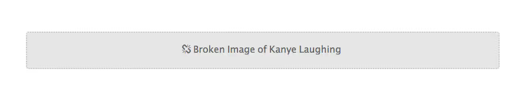

# Styling Broken Images

## Two Facts About The `` Element

To understand how we can style broken images, there are two facts about the way the `` element behaves that we need to understand first.

1. **We can apply regular typography-related styling to the `` element**. These styles will be applied to the alternative text, if it is displayed, and will not affect the working image.
2. **The `` element is a [replaced element](https://www.w3.org/TR/CSS21/generate.html#before-after-content)**. This is an element “whose appearance and dimensions are defined by an external resource” ([Sitepoint](https://reference.sitepoint.com/css/replacedelements)). Because the element is controlled by an external source, the `:before` and `:after` pseudo-elements typically shouldn’t work with it. However, **when the image is broken and not loaded, these pseudo-elements can appear**.
   Because of these two facts, we are able to apply styles to the `` element that will only appear when the image is broken, and will leave a working image unaffected.

## Putting It Into Practice

Using this information, here are some examples of how we can style broken images, using the following broken link -

```html

```

### Adding Helpful Information

One way we can handle broken images is to provide a message to the user saying that the image is broken. Using the `attr()` expression, we can even display the link to the broken image.


```css
img {
  font-family: "Helvetica";
  font-weight: 300;
  line-height: 2;
  text-align: center;
  width: 100%;
  height: auto;
  display: block;
  position: relative;
}

img:before {
  content: "We're sorry, the image below is broken :(";
  display: block;
  margin-bottom: 10px;
}

img:after {
  content: "(url: " attr(src) ")";
  display: block;
  font-size: 12px;
}
```

### Replacing The Default Alternative Text

Alternatively, we can use the pseudo-elements to replace the default alt text that shows, by positioning the pseudo-element on top of the default text, hiding it from view.


```css
img {
  /* Same as first example */
}

img:after {
  content: "\f1c5"" " attr(alt);
  font-size: 16px;
  font-family: FontAwesome;
  color: rgb(100, 100, 100);
  display: block;
  position: absolute;
  z-index: 2;
  top: 0;
  left: 0;
  width: 100%;
  height: 100%;
  background-color: #fff;
}
```

### Extra Styling

In addition to (or instead of) displaying a custom message, we can use the pseudo-elements to apply more styling to the broken image.


```css
img {
    /* Same as first example */
    min-height: 50px;
}

img:before {
    content: " ";
    display: block;
    position: absolute;
    top: -10px;
    left: 0;
    height: calc(100% + 10px);
    width: 100%;
    background-color: rgb(230, 230, 230);
    border: 2px dotted rgb(200, 200, 200);
    border-radius: 5px;
}

img:after {
    content: "\f127"" Broken Image of " attr(alt);
    display: block;
    font-size: 16px;
    font-style: normal; f
    ont-family: FontAwesome;
    color: rgb(100, 100, 100);
    position: absolute;
    top: 5px;
    left: 0;
    width: 100%;
    text-align: center;
}
```

If the image is not broken, with all the same styles applied to the element, the image is displayed normally. The pseudo-elements are not generated at all.
