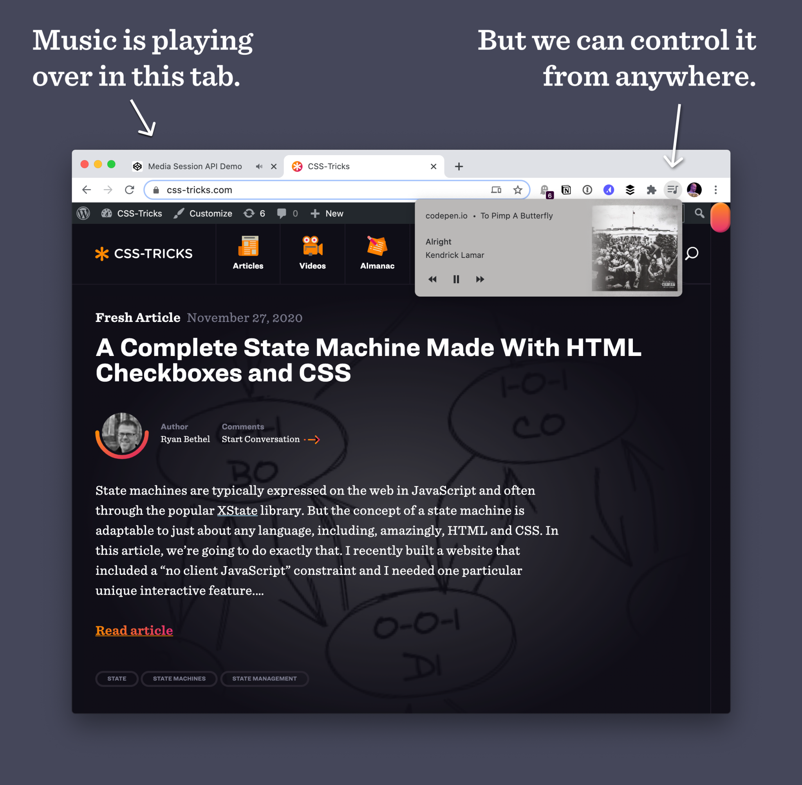

# Media Session API

You start a banging song track in one of your many open browser tabs. You’re loving it, but someone walks into your space and you need to pause it. Which tab is it? Browsers try to help with that a little bit. You can probably mute the entire system audio. But wouldn’t it be nice to actually have control over the audio playback without necessarily needing to find your way back to that tab?

The Media Session API makes this possible. It gives media playback access to the user _outside_ of the browser tab where it is playing. If implemented, it will be available in various places on the device, including:

- the notifications area on many mobile devices,
- on other wearables, and
- the media hub area of many desktop devices.

In addition, the Media Session API allows us to control media playback with media keys and voice assistants like Siri, Google Assistant, Bixby, or Alexa.


## The Media Session API

The Media Session API mainly consists of the two following interfaces:

- `MediaMetadata`
- `MediaSession`

The `MediaMetadata` interface is what provides data about the playing media. It is responsible for letting us know the media’s title, album, artwork and artist (which is Kendrick Lamar in this example). The `MediaSession` interface is what is responsible for the media playback functionality.

Before we take a deep dive into the topic, we would have to take note of feature detection. It is good practice to check if a browser supports a feature before implementing it. To check if a browser supports the Media Session API, we would have to include the following in our JavaScript file:

```javascript
if ("mediaSession" in navigator) {
  // Our media session api that lets us seek to the beginning of Kendrick Lamar's &quot;Alright&quot;
}
```

### The MediaMetadata interface

The constructor, `MediaMetadata.MediaMetadata()` creates a new `MediaMetadata` object. After creating it, we can add the following properties:

- `MediaMetadata.title` sets or gets the title of the media playing.
- `MediaMetadata.artist` sets or gets the name of the artist or group of the media playing.
- `MediaMetadata.album` sets or gets the name of the album containing the media playing.
- `MediaMetadata.artwork` sets or gets the array of images related with the media playing.

The value of the `artwork` property of the `MediaMetadata` object is an array of `MediaImage` objects. A `MediaImage` object contains details describing an image associated with the media. The objects have the three following properties:

- `src`: the URL of the image
- `sizes`: indicates the size of the image so one image does not have to be scaled
- `type`: the MIME type of the image

Let’s create a `MediaMetadata` object for Kendrick Lamar’s “Alright” off his _To Pimp a Butterfly_ album.

```javascript
if ("mediaSession" in navigator) {
  navigator.mediaSession.metadata = new MediaMetadata({
    title: "Alright",
    artist: "Kendrick Lamar",
    album: "To Pimp A Butterfly",
    artwork: [
      {
        src: "https://mytechnicalarticle/kendrick-lamar/to-pimp-a-butterfly/alright/96x96",
        sizes: "96x96",
        type: "image/png",
      },
      {
        src: "https://mytechnicalarticle/kendrick-lamar/to-pimp-a-butterfly/alright/128x128",
        sizes: "128x128",
        type: "image/png",
      },
      // More sizes, like 192x192, 256x256, 384x384, and 512x512
    ],
  });
}
```

#### The MediaSession interface

As stated earlier, this is what lets the user control the playback of the media. We can perform the following actions on the playing media through this interface:

- `play`: play the media
- `pause`: pause the media
- `previoustrack`: switch to the previous track
- `nexttrack`: switch to the next track
- `seekbackward`: seek backward from the current position, by a few seconds
- `seekforward`: seek forward from the current position, by a few seconds
- `seekto`: seek to a specified time from the current position
- `stop`: stop media playback
- `skipad`: skip past the advertisement playing, if any

The `MediaSessionAction` enumerated type makes these actions available as string types. To support any of these actions, we have to use the `MediaSession`’s `setActionHandler()` method to define a handler for that action. The method takes the action, and a callback that is called when the user invokes the action. Let us take a not-too-deep dive to understand it better.

To set handlers for the `play` and `pause` actions, we include the following in our JavaScript file:

```javascript
let alright = new HTMLAudioElement();

if ("mediaSession" in navigator) {
  navigator.mediaSession.setActionHandler("play", () => {
    alright.play();
  });
  navigator.mediaSession.setActionHandler("pause", () => {
    alright.pause();
  });
}
```

Here we set the track to **play** when the user plays it and **pause** when the user pauses it through the media interface.

For the `previoustrack` and `nexttrack` actions, we include the following:

```javascript
let u = new HTMLAudioElement();
let forSaleInterlude = new HTMLAudioElement();

if ("mediaSession" in navigator) {
  navigator.mediaSession.setActionHandler("previoustrack", () => {
    u.play();
  });
  navigator.mediaSession.setActionHandler("nexttrack", () => {
    forSaleInterlude.play();
  });
}
```

This might not completely be self-explanatory if you are not much of a Kendrick Lamar fan but hopefully, you get the gist. When the user wants to play the previous track, we set the previous track to play. When it is the next track, it is the next track.

To implement the `seekbackward` and `seekforward` actions, we include the following:

```javascript
if ("mediaSession" in navigator) {
  navigator.mediaSession.setActionHandler("seekbackward", (details) => {
    alright.currentTime = alright.currentTime - (details.seekOffset || 10);
  });
  navigator.mediaSession.setActionHandler("seekforward", (details) => {
    alright.currentTime = alright.currentTime + (details.seekOffset || 10);
  });
}
```

Given that I don’t consider any of this self-explanatory, I would like to give a concise explanation about the `seekbackward` and `seekforward` actions. The handlers for both actions, `seekbackward` and `seekforward`, are fired, as their names imply, when the user wants to seek backward or forward by a few number of seconds. The `MediaSessionActionDetails` dictionary provides us the “few number of seconds” in a property, `seekOffset`. However, the `seekOffset` property is not always present because not all user agents act the same way. When it is not present, we should set the track to seek backward or forward by a “few number of seconds” that makes sense to us. Hence, we use 10 seconds because it is quite a few. In a nutshell, we set the track to seek by `seekOffset` seconds if it is provided. If it is not provided, we seek by 10 seconds.

To add the `seekto` functionality to our Media Session API, we include the following snippet:

```javascript
if ("mediaSession" in navigator) {
  navigator.mediaSession.setActionHandler("seekto", (details) => {
    if (details.fastSeek && "fastSeek" in alright) {
      alright.fastSeek(details.seekTime);
      return;
    }
    alright.currentTime = details.seekTime;
  });
}
```

Here, the `MediaSessionActionDetails` dictionary provides the `fastSeek` and `seekTime` properties. `fastSeek` is basically seek performed rapidly (like fast-forwarding or rewinding) while `seekTime` is the time the track should seek to. While `fastSeek` is an optional property, the `MediaSessionActionDetails` dictionary always provides the `seekTime` property for the `seekto` action handler. So fundamentally, we set the track to `fastSeek` to the `seekTime` when the property is available and the user fast seeks, while we just set it to the `seekTime` when the user just seeks to a specified time.

Although I wouldn’t know why one would want to stop a Kendrick song, it won’t hurt to describe the `stop` action handler of the `MediaSession` interface:

```javascript
if ("mediaSession" in navigator) {
  navigator.mediaSession.setActionHandler("stop", () => {
    alright.pause();
    alright.currentTime = 0;
  });
}
```

The user invokes the `skipad` (as in, “skip ad” rather than “ski pad”) action handler when an advertisement is playing and they want to skip it so they can continue listening to track.

### Wrapping up

We should take note of something. Whenever the user plays the track, seeks, or changes the playback rate, we are supposed to update the position state on the interface provided by the Media Session API. What we use to implement this is the `setPositionState()` method of the `mediaSession` object, as in the following:

```javascript
if ("mediaSession" in navigator) {
  navigator.mediaSession.setPositionState({
    duration: alright.duration,
    playbackRate: alright.playbackRate,
    position: alright.currentTime,
  });
}
```

In addition, I would like to remind you that not all browsers of the users would support all the actions. Therefore, it is recommended to set the action handlers in a `try...catch` block, as in the following:

```javascript
const actionsAndHandlers = [
  [
    "play",
    () => {
      /*...*/
    },
  ],
  [
    "pause",
    () => {
      /*...*/
    },
  ],
  [
    "previoustrack",
    () => {
      /*...*/
    },
  ],
  [
    "nexttrack",
    () => {
      /*...*/
    },
  ],
  [
    "seekbackward",
    (details) => {
      /*...*/
    },
  ],
  [
    "seekforward",
    (details) => {
      /*...*/
    },
  ],
  [
    "seekto",
    (details) => {
      /*...*/
    },
  ],
  [
    "stop",
    () => {
      /*...*/
    },
  ],
];

for (const [action, handler] of actionsAndHandlers) {
  try {
    navigator.mediaSession.setActionHandler(action, handler);
  } catch (error) {
    console.log(`The media session action, ${action}, is not supported`);
  }
}
```

Putting everything we have done, we would have the following:

```javascript
let alright = new HTMLAudioElement();
let u = new HTMLAudioElement();
let forSaleInterlude = new HTMLAudioElement();

const updatePositionState = () => {
  navigator.mediaSession.setPositionState({
    duration: alright.duration,
    playbackRate: alright.playbackRate,
    position: alright.currentTime,
  });
};

const actionsAndHandlers = [
  [
    "play",
    () => {
      alright.play();
      updatePositionState();
    },
  ],
  [
    "pause",
    () => {
      alright.pause();
    },
  ],
  [
    "previoustrack",
    () => {
      u.play();
    },
  ],
  [
    "nexttrack",
    () => {
      forSaleInterlude.play();
    },
  ],
  [
    "seekbackward",
    (details) => {
      alright.currentTime = alright.currentTime - (details.seekOffset || 10);
      updatePositionState();
    },
  ],
  [
    "seekforward",
    (details) => {
      alright.currentTime = alright.currentTime + (details.seekOffset || 10);
      updatePositionState();
    },
  ],
  [
    "seekto",
    (details) => {
      if (details.fastSeek && "fastSeek" in alright) {
        alright.fastSeek(details.seekTime);
        updatePositionState();
        return;
      }
      alright.currentTime = details.seekTime;
      updatePositionState();
    },
  ],
  [
    "stop",
    () => {
      alright.pause();
      alright.currentTime = 0;
    },
  ],
];

if ("mediaSession" in navigator) {
  navigator.mediaSession.metadata = new MediaMetadata({
    title: "Alright",
    artist: "Kendrick Lamar",
    album: "To Pimp A Butterfly",
    artwork: [
      {
        src: "https://mytechnicalarticle/kendrick-lamar/to-pimp-a-butterfly/alright/96x96",
        sizes: "96x96",
        type: "image/png",
      },
      {
        src: "https://mytechnicalarticle/kendrick-lamar/to-pimp-a-butterfly/alright/128x128",
        sizes: "128x128",
        type: "image/png",
      },
      // More sizes, like 192x192, 256x256, 384x384, and 512x512
    ],
  });

  for (const [action, handler] of actionsAndHandlers) {
    try {
      navigator.mediaSession.setActionHandler(action, handler);
    } catch (error) {
      console.log(`The media session action, ${action}, is not supported`);
    }
  }
}
```
