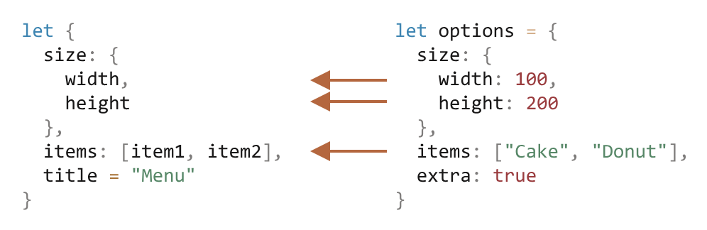

# Destructure Assignment

The two most used data structures in JavaScript are `Object` and `Array`.

- Objects allow us to create a single entity that stores data items by key.
- Arrays allow us to gather data items into an ordered list.

However, when we pass these to a function, we may not need all of it. The function might only require certain elements or properties.

_Destructuring assignment_ is a special syntax that allows us to “unpack” arrays or objects into a bunch of variables, as sometimes that’s more convenient.

Destructuring also works well with complex functions that have a lot of parameters, default values, and so on. Soon we’ll see that.

## Array destructuring

Here’s an example of how an array is destructured into variables:

```javascript
// we have an array with a name and surname
let arr = ["John", "Smith"];

// destructuring assignment
// sets firstName = arr[0]
// and surname = arr[1]
let [firstName, surname] = arr;

alert(firstName); // John
alert(surname); // Smith
```

Now we can work with variables instead of array members.

It looks great when combined with `split` or other array-returning methods:

```javascript
let [firstName, surname] = "John Smith".split(" ");
alert(firstName); // John
alert(surname); // Smith
```

As you can see, the syntax is simple. There are several peculiar details though.

### Ignore elements using commas

Unwanted elements of the array can also be thrown away via an extra comma:

```javascript
// second element is not needed
let [firstName, , title] = [
  "Julius",
  "Caesar",
  "Consul",
  "of the Roman Republic",
];

alert(title); // Consul
```

In the code above, the second element of the array is skipped, the third one is assigned to `title`, and the rest of the array items are also skipped (as there are no variables for them).

### Works with any iterable on the right-side

…Actually, we can use it with any iterable, not only arrays:

```javascript
let [a, b, c] = "abc"; // ["a", "b", "c"]
let [one, two, three] = new Set([1, 2, 3]);
```

That works, because internally a destructuring assignment works by iterating over the right value. It’s a kind of syntax sugar for calling `for..of` over the value to the right of `=` and assigning the values.

### Assign to anything at the left-side

We can use any “assignables” on the left side.

For instance, an object property:

```javascript
let user = {};
[user.name, user.surname] = "John Smith".split(" ");

alert(user.name); // John
alert(user.surname); // Smith
```

### Looping with .entries()

In the previous chapter, we saw the [Object.entries(obj)](https://developer.mozilla.org/en-US/docs/Web/JavaScript/Reference/Global_Objects/Object/entries) method.

We can use it with destructuring to loop over the keys-and-values of an object:

```javascript
let user = {
  name: "John",
  age: 30,
};

// loop over the keys-and-values
for (let [key, value] of Object.entries(user)) {
  alert(`${key}:${value}`); // name:John, then age:30
}
```

The similar code for a `Map` is simpler, as it’s iterable:

```javascript
let user = new Map();
user.set("name", "John");
user.set("age", "30");

// Map iterates as [key, value] pairs, very convenient for destructuring
for (let [key, value] of user) {
  alert(`${key}:${value}`); // name:John, then age:30
}
```

## The rest ‘…’

Usually, if the array is longer than the list at the left, the “extra” items are omitted.

For example, here only two items are taken, and the rest is just ignored:

```javascript
let [name1, name2] = ["Julius", "Caesar", "Consul", "of the Roman Republic"];

alert(name1); // Julius
alert(name2); // Caesar
// Further items aren't assigned anywhere
```

If we’d like also to gather all that follows – we can add one more parameter that gets “the rest” using three dots `"..."`:

```javascript
let [name1, name2, ...rest] = [
  "Julius",
  "Caesar",
  "Consul",
  "of the Roman Republic",
];

// rest is an array of items, starting from the 3rd one
alert(rest[0]); // Consul
alert(rest[1]); // of the Roman Republic
alert(rest.length); // 2
```

The value of `rest` is the array of the remaining array elements.

We can use any other variable name in place of `rest`, just make sure it has three dots before it and goes last in the destructuring assignment.

```javascript
let [name1, name2, ...titles] = [
  "Julius",
  "Caesar",
  "Consul",
  "of the Roman Republic",
];
// now titles = ["Consul", "of the Roman Republic"]
```

## Default values

If the array is shorter than the list of variables on the left, there will be no errors. Absent values are considered undefined:

```javascript
let [firstName, surname] = [];

alert(firstName); // undefined
alert(surname); // undefined
```

If we want a “default” value to replace the missing one, we can provide it using `=`:

```javascript
// default values
let [name = "Guest", surname = "Anonymous"] = ["Julius"];

alert(name); // Julius (from array)
alert(surname); // Anonymous (default used)
```

Default values can be more complex expressions or even function calls. They are evaluated only if the value is not provided.

For instance, here we use the `prompt` function for two defaults:

```javascript
// runs only prompt for surname
let [name = prompt("name?"), surname = prompt("surname?")] = ["Julius"];

alert(name); // Julius (from array)
alert(surname); // whatever prompt gets
```

Please note: the `prompt` will run only for the missing value (`surname`).

## Object destructuring

The destructuring assignment also works with objects.

The basic syntax is:

```javascript
let {var1, var2} = {var1:…, var2:…}
```

We should have an existing object on the right side, that we want to split into variables. The left side contains an object-like “pattern” for corresponding properties. In the simplest case, that’s a list of variable names in `{...}`.

For instance:

```javascript
let options = {
  title: "Menu",
  width: 100,
  height: 200,
};

let { title, width, height } = options;

alert(title); // Menu
alert(width); // 100
alert(height); // 200
```

Properties `options.title`, `options.width` and `options.height` are assigned to the corresponding variables.

The order does not matter. This works too:

```javascript
// changed the order in let {...}
let { height, width, title } = { title: "Menu", height: 200, width: 100 };
```

The pattern on the left side may be more complex and specify the mapping between properties and variables.

If we want to assign a property to a variable with another name, for instance, make `options.width` go into the variable named `w`, then we can set the variable name using a colon:

```javascript
let options = {
  title: "Menu",
  width: 100,
  height: 200,
};

// { sourceProperty: targetVariable }
let { width: w, height: h, title } = options;

// width -> w
// height -> h
// title -> title

alert(title); // Menu
alert(w); // 100
alert(h); // 200
```

The colon shows “what : goes where”. In the example above the property `width` goes to `w`, property `height` goes to `h`, and `title` is assigned to the same name.

For potentially missing properties we can set default values using `"="`, like this:

```javascript
let options = {
  title: "Menu",
};

let { width = 100, height = 200, title } = options;

alert(title); // Menu
alert(width); // 100
alert(height); // 200
```

Just like with arrays or function parameters, default values can be any expressions or even function calls. They will be evaluated if the value is not provided.

In the code below `prompt` asks for `width`, but not for `title`:

```javascript
let options = {
  title: "Menu",
};

let { width = prompt("width?"), title = prompt("title?") } = options;

alert(title); // Menu
alert(width); // (whatever the result of prompt is)
```

We also can combine both the colon and equality:

```javascript
let options = {
  title: "Menu",
};

let { width: w = 100, height: h = 200, title } = options;

alert(title); // Menu
alert(w); // 100
alert(h); // 200
```

If we have a complex object with many properties, we can extract only what we need:

```javascript
let options = {
  title: "Menu",
  width: 100,
  height: 200,
};

// only extract title as a variable
let { title } = options;

alert(title); // Menu
```

## The rest pattern “…”

What if the object has more properties than we have variables? Can we take some and then assign the “rest” somewhere?

We can use the rest pattern, just like we did with arrays. It’s not supported by some older browsers (IE, use Babel to polyfill it), but works in modern ones.

It looks like this:

```javascript
let options = {
  title: "Menu",
  height: 200,
  width: 100,
};

// title = property named title
// rest = object with the rest of properties
let { title, ...rest } = options;

// now title="Menu", rest={height: 200, width: 100}
alert(rest.height); // 200
alert(rest.width); // 100
```

### Gotcha if there’s no `let`

In the examples above variables were declared right in the assignment: `let {…} = {…}`. Of course, we could use existing variables too, without `let`. But there’s a catch.

This won’t work:

```javascript
let title, width, height;

// error in this line
{title, width, height} = {title: "Menu", width: 200, height: 100};
```

The problem is that JavaScript treats `{...}` in the main code flow (not inside another expression) as a code block. Such code blocks can be used to group statements, like this:

```javascript
{
  // a code block
  let message = "Hello";
  // ...
  alert(message);
}
```

So here JavaScript assumes that we have a code block, that’s why there’s an error. We want destructuring instead.

To show JavaScript that it’s not a code block, we can wrap the expression in parentheses `(...)`:

```javascript
let title, width, height;

// okay now
({ title, width, height } = { title: "Menu", width: 200, height: 100 });

alert(title); // Menu
```

## Nested destructuring

If an object or an array contains other nested objects and arrays, we can use more complex left-side patterns to extract deeper portions.

In the code below `options` has another object in the property `size` and an array in the property `items`. The pattern on the left side of the assignment has the same structure to extract values from them:

```javascript
let options = {
  size: {
    width: 100,
    height: 200,
  },
  items: ["Cake", "Donut"],
  extra: true,
};

// destructuring assignment split in multiple lines for clarity
let {
  size: {
    // put size here
    width,
    height,
  },
  items: [item1, item2], // assign items here
  title = "Menu", // not present in the object (default value is used)
} = options;

alert(title); // Menu
alert(width); // 100
alert(height); // 200
alert(item1); // Cake
alert(item2); // Donut
```

All properties of `options` object except `extra` which is absent in the left part, are assigned to corresponding variables:



Finally, we have `width`, `height`, `item1`, `item2` and `title` from the default value.

Note that there are no variables for `size` and `items`, as we take their content instead.

## Smart function parameters

There are times when a function has many parameters, most of which are optional. That’s especially true for user interfaces. Imagine a function that creates a menu. It may have a width, a height, a title, an item list and so on.

Here’s a bad way to write such a function:

```javascript
function showMenu(title = "Untitled", width = 200, height = 100, items = []) {
  // ...
}
```

In real-life, the problem is how to remember the order of arguments. Usually, IDEs try to help us, especially if the code is well-documented, but still… Another problem is how to call a function when most parameters are ok by default.

Like this?

```javascript
// undefined where default values are fine
showMenu("My Menu", undefined, undefined, ["Item1", "Item2"]);
```

That’s ugly. And becomes unreadable when we deal with more parameters.

Destructuring comes to the rescue!

We can pass parameters as an object, and the function immediately destructurizes them into variables:

```javascript
// we pass object to function
let options = {
  title: "My menu",
  items: ["Item1", "Item2"],
};

// ...and it immediately expands it to variables
function showMenu({
  title = "Untitled",
  width = 200,
  height = 100,
  items = [],
}) {
  // title, items – taken from options,
  // width, height – defaults used
  alert(`${title} ${width} ${height}`); // My Menu 200 100
  alert(items); // Item1, Item2
}

showMenu(options);
```

We can also use more complex destructuring with nested objects and colon mappings:

```javascript
let options = {
  title: "My menu",
  items: ["Item1", "Item2"],
};

function showMenu({
  title = "Untitled",
  width: w = 100, // width goes to w
  height: h = 200, // height goes to h
  items: [item1, item2], // items first element goes to item1, second to item2
}) {
  alert(`${title} ${w} ${h}`); // My Menu 100 200
  alert(item1); // Item1
  alert(item2); // Item2
}

showMenu(options);
```

The full syntax is the same as for a destructuring assignment:

```javascript
function({
  incomingProperty: varName = defaultValue
  ...
})
```

Then, for an object of parameters, there will be a variable `varName` for the property `incomingProperty`, with `defaultValue` by default.

Please note that such destructuring assumes that `showMenu()` does have an argument. If we want all values by default, then we should specify an empty object:

```javascript
showMenu({}); // ok, all values are default

showMenu(); // this would give an error
```

We can fix this by making `{}` the default value for the whole object of parameters:

```javascript
function showMenu({ title = "Menu", width = 100, height = 200 } = {}) {
  alert(`${title} ${width} ${height}`);
}

showMenu(); // Menu 100 200
```

In the code above, the whole arguments object is `{}` by default, so there’s always something to destructurize.

## Object patterns coerce values to objects

The object pattern coerces destructuring sources to objects before accessing properties. That means that it works with primitive values:

```js
const { length: len } = "abc"; // len = 3
const { toString: s } = 123; // s = Number.prototype.toString
```

## Default value

_Default values_ are an optional feature of patterns. They provide a fallback if nothing is found in the source. If a part (an object property or an Array element) has no match in the source, it is matched against:

- its _default value_ (if specified; it’s optional)
- `undefined` (otherwise)

Let’s look at an example. In the following destructuring, the element at index 0 has no match on the right-hand side. Therefore, destructuring continues by matching `x` against 3, which leads to `x` being set to 3.

```js
const [x = 3, y] = []; // x = 3; y = undefined
```

You can also use default values in object patterns:

```js
const { foo: x = 3, bar: y } = {}; // x = 3; y = undefined
```

### `undefined` triggers default values

Default values are also used if a part does have a match and that match is `undefined`:

```js
const [x = 1] = [undefined]; // x = 1
const { prop: y = 2 } = { prop: undefined }; // y = 2
```

### Default values are computed on demand

The default values themselves are only computed when they are needed. In other words, this destructuring:

```js
const { prop: y = someFunc() } = someValue;
```

is equivalent to:

```js
let y;
if (someValue.prop === undefined) {
  y = someFunc();
} else {
  y = someValue.prop;
}
```

You can observe that if you use `console.log()`:

```js
> function log(x) { console.log(x); return 'YES' }

> const [a=log('hello')] = [];
> a
'YES'

> const [b=log('hello')] = [123];
> b
123
```

### Default values can refer to other variables in the pattern

A default value can refer to any variable, including other variables in the same pattern:

```js
const [x = 3, y = x] = []; // x=3; y=3
const [x = 3, y = x] = [7]; // x=7; y=7
const [x = 3, y = x] = [7, 2]; // x=7; y=2
```

However, order matters: the variables x and y are declared from left to right and produce a ReferenceError if they are accessed before their declarations:

```js
const [x = y, y = 3] = []; // ReferenceError
```

### Default values for patterns

So far we have only seen default values for variables, but you can also associate them with patterns:

```js
const [{ prop: x } = {}] = [];
```

What does this mean? Recall the rule for default values: If a part has no match in the source, destructuring continues with the default value.

The element at index 0 has no match, which is why destructuring continues with:

```js
const { prop: x } = {}; // x = undefined
```

You can more easily see why things work this way if you replace the pattern { prop: x } with the variable pattern:

```js
const [pattern = {}] = [];
```

### More complex default values

Let’s further explore default values for patterns. In the following example, we assign a value to `x` via the default value `{ prop: 123 }`:

```js
const [{ prop: x } = { prop: 123 }] = [];
```

Because the Array element at index 0 has no match on the right-hand side, destructuring continues as follows and x is set to 123.

```js
const { prop: x } = { prop: 123 }; // x = 123
```

However, x is not assigned a value in this manner if the right-hand side has an element at index 0, because then the default value isn’t triggered.

```js
const [{ prop: x } = { prop: 123 }] = [{}];
```

In this case, destructuring continues with:

```js
const { prop: x } = {}; // x = undefined
```

Thus, if you want x to be 123 if either the object or the property is missing, you need to specify a default value for x itself:

```js
const [{ prop: x = 123 } = {}] = [{}];
```

Here, destructuring continues as follows, independently of whether the right-hand side is `[{}]` or `[]`.

```js
const { prop: x = 123 } = {}; // x = 123
```

## Examples of destructuring in parameter handling

### forEach() and destructuring

You will probably mostly use the `for-of` loop in ECMAScript 6, but the Array method `forEach()` also profits from destructuring. Or rather, its callback does.

First example: destructuring the Arrays in an Array.

```js
const items = [
  ["foo", 3],
  ["bar", 9],
];
items.forEach(([word, count]) => {
  console.log(word + " " + count);
});
```

Second example: destructuring the objects in an Array.

```js
const items = [
  { word: "foo", count: 3 },
  { word: "bar", count: 9 },
];
items.forEach(({ word, count }) => {
  console.log(word + " " + count);
});
```

### Transforming Maps

An ECMAScript 6 Map doesn’t have a method `map()` (like Arrays). Therefore, one has to:

- Step 1: Convert it to an Array of `[key,value]` pairs.
- Step 2: `map()` the Array.
- Step 3: Convert the result back to a Map.

This looks as follows.

```js
const map0 = new Map([
  [1, "a"],
  [2, "b"],
  [3, "c"],
]);

const map1 = new Map( // step 3
  [...map0] // step 1
    .map(([k, v]) => [k * 2, "_" + v]) // step 2
);
// Resulting Map: {2 -> '_a', 4 -> '_b', 6 -> '_c'}
```

### Handling an Array returned via a Promise

The tool method `Promise.all()` works as follows:

- Input: an iterable of Promises.
- Output: a Promise that is fulfilled with an Array as soon as the last input Promise is fulfilled. That Array contains the fulfillments of the input Promises.

Destructuring helps with handling the Array that the result of `Promise.all()` is fulfilled with:

```js
const urls = [
    'http://example.com/foo.html',
    'http://example.com/bar.html',
    'http://example.com/baz.html',
];

Promise.all(urls.map(downloadUrl))
.then(([fooStr, barStr, bazStr]) => {
    ···
});

// This function returns a Promise that is fulfilled
// with a string (the text)
function downloadUrl(url) {
    return fetch(url).then(request => request.text());
}
```
