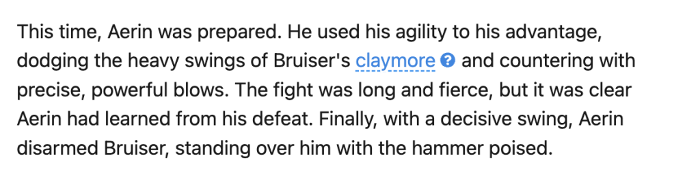
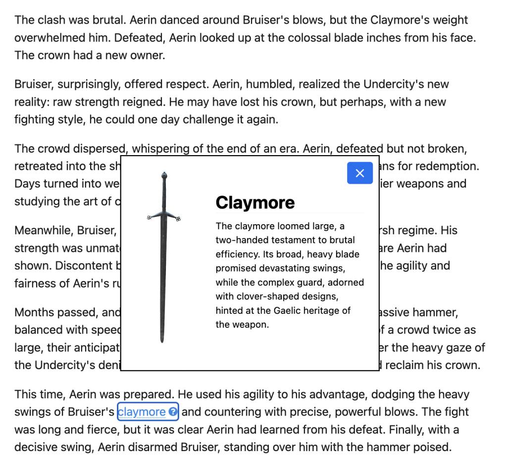

# Dialog vs Popover

They are different HTML, to begin with. A dialog is like this:

```html
<dialog id="my-dialog">Content</dialog>
```

While a popover is an attribute on some other element:

```html
<aside popover id="my-popover">Content</aside>
```

The reason it’s worth comparing them is that they are quite similar in a lot of ways, both in look and functionality, which can be confusing. It’s worth thinking about which one you really need.

## They are both hidden-by-default

If you put either bit of the HTML above onto the page, they will be visually hidden as well as ignored in the accessibility tree by default (but available in the DOM). It isn’t until you specifically show them (via JavaScript or on-page HTML control when available) that they are visible.

You _can_ make a `<dialog>` visible by default in HTML alone:

```html
<dialog id="my-dialog" open>Content</dialog>
```

Where you _cannot_ make a popover visible in HTML alone.

## Popovers Have HTML-Only Controls

You _can_ make a popover work (open & close) with HTML controls alone:

```html
<!-- This button will open and close the matching popover. No JavaScript required. -->
<button popovertarget="my-popover">Toggle Popover</button>

<aside popover id="my-popover">Content of popover</aside>
```

But you _cannot_ build HTML-only controls for a `<dialog>`. Opening and closing a dialog requires JavaScript event handlers.

## JavaScript APIs

### Dialog JavaScript APIs

The dialog APIs in JavaScript are interesting in that there are two different distinct APIs for opening it. This is where the term “modal” comes in. Modal is sometimes used as a term for the UI element itself, but here it essentially means if the modal should trap focus inside of it while open, or not.

- `.show()` — Open the dialog in a **non-modal** state, meaning no backdrop is shown and no focus trapping happens. Note that using the `open` attribute in the HTML/DOM to open the dialog is the same (non-modal).
- `.showModal()` — Open the dialog in a **modal** meaning a backdrop is shown and focus is trapped within the modal.
- `.close()` — Closes the dialog (if it’s open).

The `showModal()` method can throw if the dialog is already open in a non-modal state.

Uncaught InvalidStateError: Failed to execute 'showModal' on 'HTMLDialogElement': The dialog is already open as a non-modal dialog, and therefore cannot be opened as a modal dialog.

### Popover JS APIs

Popovers also have JavaScript APIs, but both the opening and closing APIs are different than with modals and do not overlap. These are pretty self explanatory.

- `.showPopover()` — Opens the popover.
- `.hidePopover()` — Closes the popover.

Calling `showPopover` on an already open popover or `hidePopover` on an already hidden popover does not throw.

## Focus Trapping

The ability of the dialog element to be opened in a modal state and thus trap focus inside of it is a superpower of this element. It is unique to the dialog element, popovers cannot do this (on their own).

Focus trapping, while it sounds kinda bad, is actually an accessibility _feature._ After all, that’s what a modal is: it _forces you to deal with some interaction_ before anything else can be done. It’s actually _also_ a [WCAG requirement to _not_ trap focus](https://www.w3.org/WAI/WCAG21/Understanding/no-keyboard-trap.html) when you shouldn’t, but in the case of a modal, you _should_ be trapping focus — as well as providing a standard way to close the dialog and escape the trap.

Focus can change to other focusable elements inside, and when you’re about to move focus forward to the next element when you’re at the last, it circles back to the first focusable element within the dialog. **You get all this “for free” with a `<dialog>` opened with `showModal()`**, which is otherwise a huge pain in the ass and you probably won’t even do it right (sorry).

If you need this focus trapping, don’t use a popover as it’s not for this job.

## Moving Focus

When a dialog is opened (either modal or non-modal), **focus is moved to the first focusable element within it**. When it is closed, focus is moved back to the element that opened it.

With a popover, focus remains on the element that opened it even after the popup is opened. However, after the popup is open, the next tab will put focus into the popup’s content if there is any in there, regardless of where it is in the DOM, tab through the focusable elements of the popup, then onto other focusable elements outside the popup after the original element that opened it.

This is all tricky work that you get for free by using the `<dialog>` element or popups and frankly a huge reason to use them.

## Escape Key

Both _modal_ dialogs and popups, when open, **can be closed by pressing the ESC key.** Very handy behavior that helps adhere to accessibility adherence, again given for free, which is tricky and error-prone to write yourself.

Non-modal dialogs do not close with the ESC key, so you’ll need to provide your own close functionality, like:

```html
<button onclick="myDialog.close()">Close</button>
```

## They Have the Same Default Styling

Dialogs and popovers look the same by default and have really basic default styling that you’ll almost certainly want to override.

They are essentially `position: fixed;` and `margin: auto;` which centers them in the viewport. This is a probably a smart default for dialogs. In my opinion, popovers are usually begging for [anchor positioning](https://developer.mozilla.org/en-US/docs/Web/CSS/CSS_anchor_positioning) to open the popover near where the element that opened it is, but they [work nicely as slide-out drawers](https://frontendmasters.com/blog/popovers-work-pretty-nicely-as-slide-out-drawers/) as well, particularly on mobile.

You’ll likely want to bring your own padding, border, background, typography, internal structure, etc.

## The Top Layer

Another amazing feature of both dialogs and popovers is that, when open, they are placed on what is called the “top layer”. It is literally impossible for any other element to be on top of them. It doesn’t matter where they are in the DOM (could be quite nested) or what containing blocks or `z-index` is involved, the top layer is the top no matter what. (Although – it is true that if you open _subsequent dialogs/popovers_, e.g. a button in a dialog opens another dialog, the second one will beat the first and be on top, as you’d expect.) This top-layer ability is yet another thing you get for free and a fantastic reason to use these native features.

## Backdrops

Both (modal) dialogs and popovers use (and share) a backdrop. This is the layer above all content on the page that covers the page (by default), but is still underneath the actual dialog or popover. This backdrop is a very light transparent black by default, but can be styled like this:

```css
::backdrop {
  background: color-mix(in srgb, purple, transparent 20%);
}
```

That will apply _both_ to modal dialogs and default popovers. If you wanted to have different backdrops for them, you could scope them like this, as the backdrop is applied to the element that is open:

```css
[popover]::backdrop {
}

dialog::backdrop {
}

.some-very-specific-element::backdrop {
}
```

You don’t _have_ to show a backdrop if you don’t want to, but it’s a good indicator for users particularly when modal behavior is in play (and perhaps an anti-pattern when it’s not, as you may be visually hiding elements in focus).

Non-modal dialogs do not have a backdrop.

## Soft Dismiss

This feature is unique to popovers. You can “click outside” the popover to close it, by default (yet another tricky behavior to code yourself). I’ve used the term “default popover” in this article and what I mean is when you don’t provide a value to the `popover` attribute. That implies `auto` as a value which is what makes soft dismissal work.

```html
<!-- Soft Dismissible -->
<div popover id="myPopover"></div>

<!-- Soft Dismissible -->
<div popover="auto" id="myPopover"></div>

<!-- NOT Soft Dismissible -->
<div popover="manual" id="myPopover"></div>
```

## Multiple Open

Both dialogs and popovers can have multiple open at once. The most recent one to be opened will be the one that is most “on top” and will close the first via soft dismiss or the ESC key. (Also see the CloseWatcher API).

For a modal dialog, note that because the rest of the page is essentially `inert` when it is open, the near-only way to open another is via interactivity within the first opened dialog.

For popups, because the default behavior has soft dismissal, the popovers will need to be `popover="manual"` or be opened with JavaScript without interaction for multiple of them to be open.

## Purpose and Semantics

Popovers likely have more use cases than dialogs. Any time you need a tooltipor to provide more contextual information that has good reason not to be visible by default, a popover is a good choice.

Non modal dialogs are pretty similar to a popup, but are perhaps better suited to situations where there is no other element on the page that is relevant to the messaging. Perhaps something like a “No internet connection detected” message, which could be very important to tell a user, but doesn’t need to 100% stop other activity on the page.

Modal dialogs are show-stoppers, forcing a user to deal with them before anything else can happen. They should be used sparingly. Perhaps a message like “Are you sure you want to delete this entire document? This cannot be undone.” would be a modal dialog, as any other interaction on the page is moot should the user be deleting.

### Using the Popover API for HTML Tooltips

This only works in HTML alone when a `<button>` is the “invoker” of opening the popup. So in the case of a _tooltip_, that button might come right in the middle of a sentence like.

```js
<p>
  This blog post was written by
  <button popovertarget="popover-chris-coyier">Chris Coyier</button>
  the genius.
</p>
```

Then elsewhere in the DOM (the location of which doesn’t effect the core functionality):

```js
<div id="popover-chris-coyier" popover role="tooltip">
  
  <h4>Chris Coyier</h4>
  <p>Handsome fella.</p>
</div>
```

Note I’m calling this an _HTML_ Tooltip, because what pops up isn’t text alone, which you might argue can be done with the `title` attribute. These popovers are far more flexible, allowing you to style them and can contain anything HTML can.

The weird part here is the button smack in the middle of the paragraph. That’ll be a bit awkward styling-wise, but that’s surmountable. Mostly I don’t know if that’s “cool” screen-reader wise. So if someone know’s, feel free to chime in. If it’s _not_ cool, we might have to think about using a different element that is cool and relying on JavaScript to invoke the popup.

### The Basic CSS

For one thing, let’s make the the middle-of-text look of the button look like something you can click. That’s something Melanie pointed out as a requirement. Rather than just being blue and underlined like a normal link, I’ll add an icon so it indicates slightly different behavior. We also need to \_un_do basic button styling so the button looks more like just some text. I usually have a class for that I call “text-like”. So:

```css
button[popovertarget].text-like {
  border: 0;
  background: none;
  font: inherit;
  display: inline-block;

  color: #1e88e5;
  text-decoration-style: dashed;
  text-decoration-line: underline;
  text-decoration-color: #42a5f5;
  text-underline-offset: 2px;
  overflow: visible;

  padding: 0 1.1rem 0 0; /* space for icon */
  background-image: url("data:image/svg+xml,%3Csvg xmlns='http://www.w3.org/2000/svg' viewBox='0 0 512 512' width='100' title='question-circle'%3E%3Cpath fill='%231e88e5' d='M504 256c0 136.997-111.043 248-248 248S8 392.997 8 256C8 119.083 119.043 8 256 8s248 111.083 248 248zM262.655 90c-54.497 0-89.255 22.957-116.549 63.758-3.536 5.286-2.353 12.415 2.715 16.258l34.699 26.31c5.205 3.947 12.621 3.008 16.665-2.122 17.864-22.658 30.113-35.797 57.303-35.797 20.429 0 45.698 13.148 45.698 32.958 0 14.976-12.363 22.667-32.534 33.976C247.128 238.528 216 254.941 216 296v4c0 6.627 5.373 12 12 12h56c6.627 0 12-5.373 12-12v-1.333c0-28.462 83.186-29.647 83.186-106.667 0-58.002-60.165-102-116.531-102zM256 338c-25.365 0-46 20.635-46 46 0 25.364 20.635 46 46 46s46-20.636 46-46c0-25.365-20.635-46-46-46z' /%3E%3C/svg%3E");
  background-size: 0.8em;
  background-repeat: no-repeat;
  background-position: center right 1px;

  &:focus,
  &:hover {
    text-decoration-color: lightblue;
    text-decoration-style: solid;
  }
}
```

That leads to a within-paragraph look like this:



Then if we apply some super basic styling to the `[popover]` element itself, we can get a popover opening exactly in the middle of the page like this:



A couple of notes here:

- I did _not_ use any `::backdrop` styling to style the rest of the page behind the popover. I feel like that may be a bit of an anti-pattern if using for tooltips. I don’t see any need to mess with the rest of the page when a tooltip is open.
- I wanted to use flexbox on the popup, but that caused an issue, because `display: flex;` overrides the default `display: none;` of the popup, making it visible all the time. Instead, you can use `[popover]:popover-open { }` to apply it only when the popover is open. Or use an internal wrapper or whatever.

### The Functional JavaScript

We need JavaScript here for two jobs:

1. Normal tooltip behavior suggests you should be able to hover over an element and the tooltip will appear. That cannot be done in HTML alone. Maybe it could be done in CSS somehow with an animation delay or something, but it’s likely a bit more straightforward in JavaScript.
2. Again, CSS doesn’t have anchor positioning yet, so we’ll do positioning with JavaScript.

These are both progressive enhancements, which is nice. So if either thing fails, the tooltip should still work.

#### The Hover Delay

For the delay, we’ll start a timer when the mouse cursor enters a button that opens a popup, if the timer finishes, we’ll open it. If the mouse cursor leaves before the timeout, we’ll clear that timeout:

```js
const popoverButtons = document.querySelectorAll("button[popovertarget]");

popoverButtons.forEach((button) => {
  let timeout = 0;
  button.addEventListener("mouseenter", () => {
    const target = button.getAttribute("popovertarget");
    const popover = document.querySelector("#" + target);
    // delay opening
    timeout = setTimeout(() => {
      popover.showPopover();
    }, 1500);
  });

  button.addEventListener("mouseleave", () => {
    clearTimeout(timeout);
  });
});
```

#### The Positioning

The `.showPopover()` API is what opens the popup, so the trick is positioning it as it is being opened.

```js
popoverButtons.forEach((button) => {
  let timeout = 0;
  button.addEventListener("mouseenter", () => {
    const target = button.getAttribute("popovertarget");
    const popover = document.querySelector("#" + target);
    // delay opening
    timeout = setTimeout(() => {
      popover.showPopover();
      computePosition(button, popover, {
        placement: "top",
        middleware: [flip(), shift({ padding: 5 }), offset(6)],
      }).then(({ x, y }) => {
        Object.assign(popover.style, {
          left: `${x}px`,
          top: `${y}px`,
        });
      });
    }, 1500);
  });

  button.addEventListener("mouseleave", () => {
    clearTimeout(timeout);
    button.removeAttribute("style");
  });
});
```

## The Dialog Element with Entry _and_ Exit Animations

This bit of code says a lot:

```css
dialog[open] {
  transition: translate 0.7s ease-out, display 0.7s ease-out allow-discrete;

  /* Post-Entry (Normal) State */
  translate: 0 0;

  /* Pre-Entry State */
  @starting-style {
    translate: 0 100vh;
  }
}
```

There are two big things at work there:

1. The `display` property is listed in the transitions, with the keyword `allow-discrete`. The code for it is hidden in User-Agent stylesheets, but when a `<dialog>` moves from close (default) to open, the `display` goes from `none` to `block`. Using this keyword means that the `display` property is changed _after_ the animation timing, so animations can actually happen.
2. The `@starting-style` gives us an opportunity to apply styling to the element _just as it’s entering it’s current state_, meaning the transition will happen between the styles declared inside and outside that block.

### Both Entry and Exit

The trick isn’t terribly different than the code above, it’s just to have very specific styles for both the open and closed (i.e. `:not([open])` states. Like this:

```css
dialog {
  --duration: 0.34s;

  transition: translate var(--duration) ease-in-out, scale var(--duration) ease-in-out,
    filter var(--duration) ease-in-out, display var(--duration) ease-in-out allow-discrete;

  &[open] {
    /* Post-Entry (Normal) State */
    translate: 0 0;
    scale: 1;
    filter: blur(0);

    /* Pre-Entry State */
    @starting-style {
      translate: 0 8vh;
      scale: 1.15;
      filter: blur(8px);
    }
  }

  /* Exiting State */
  &:not([open]) {
    translate: 0 -8vh;
    scale: 1.15;
    filter: blur(8px);
  }
}
```

Note that not only does it _have_ entry and exit animations, but those states are _different_ — which is very cool! Emphasizing that, here’s one where I move the dialog along an `offset-path` so the exit is really a continuation of the path:

```html
<dialog>
  <p>This dialog has entry and exit animations.</p>
  <form method="dialog">
    <button>OK</button>
  </form>
</dialog>

<button onclick="document.querySelector('dialog').showModal()">
  Open Dialog
</button>
```

```css
dialog {
  transition: opacity 1s ease-in-out, offset-distance 2s ease-in-out,
    display 2s ease-in-out allow-discrete;

  offset-path: path("M66.5,0c0,0-145.1,265.4,184.9,265.4S454.1,0,454.1,0");
  offset-rotate: 0deg;
  translate: -200px -200px;

  &[open] {
    opacity: 1;
    offset-distance: 50%;

    @starting-style {
      opacity: 0;
      offset-distance: 0%;
    }
  }

  &:not([open]) {
    opacity: 0;
    offset-distance: 120%;
  }
}

::backdrop {
  background: none;
}

body,
button {
  font-family: system-ui;
  font-size: 1rem;
}

button {
  padding: 1rem 2rem;
  background: #f06d06;
  color: white;
  font-weight: 600;
  border-radius: 3rem;
  border: none;
}

html {
  background: #333;
}
```

## Usage with Popovers

This isn’t exclusively for dialogs, you can make it work with whatever. But naturally open-closable things make the most sense. Like native popovers! Nils Riedemann has a nice demo here:

```html
<body class="bg-dots">
  <button popovertarget="the-popover" class="btn">open popover</button>

  <dialog id="the-popover" popover class="text-lg card">🎉</dialog>

  <p class="text-sm">currently requires chrome for full effect</p>
</body>
```

```css
:root {
  --color-prim: lch(50% 50% 192deg);
  --color-bg: lch(from var(--color-prim) calc(l + 40) calc(c * 0.25) h);
  --color-sheet: lch(from var(--color-prim) 100% calc(c * 0.05) h);
  --color-fg: lch(from var(--color-prim) 5% c h);
  font-family: Seravek, "Gill Sans Nova", Ubuntu, Calibri, "DejaVu Sans",
    source-sans-pro, sans-serif;
}

html,
body {
  background: var(--color-bg);

  &:has(:popover-open) {
    --color-prim: lch(50% 50% 0deg);
  }
}

[popover],
::backdrop {
  transition: display 400ms ease-in-out allow-discrete, transform 288ms
      ease-in-out, opacity 160ms ease-in-out;
}

[popover] {
  position: fixed;
  width: fit-content;
  height: fit-content;
  inset: 0px;
  padding: 0.25em;
  opacity: 0;
  transform: perspective(800px) translateY(200px) scale(0.8) rotate3d(
      1,
      1,
      0,
      180deg
    );

  &::backdrop {
    background-color: var(--color-fg);
    opacity: 0;
  }

  &:popover-open {
    opacity: 1;
    transform: translateY(0) scale(1);

    &::backdrop {
      opacity: 0.5;
    }
  }

  @starting-style {
    &:popover-open {
      opacity: 0;
      transform: perspective(800px) translateY(-80px) scale(2) rotate3d(
          2,
          0,
          8,
          45deg
        );
    }

    &:popover-open::backdrop {
      opacity: 0;
    }
  }
}

/** just styling **/

html,
body {
  display: grid;
  place-content: center;
  gap: 2rem;
  height: 100%;
}

.text-lg {
  font-size: 4rem;
}

.card {
  border-radius: 1rem;
  padding: 3rem;
  box-shadow: 4px 4px 8px lch(from var(--color-bg) calc(l - 90) c h / 20%);
}

.btn {
  border: 0.25rem solid var(--color-fg);
  border-radius: 1rem;
  font-size: 2rem;
  padding: 0.33rem 0.75rem;
  box-shadow: 2px 4px 0 var(--color-fg), 2px 6px 8px lch(from var(--color-bg) calc(
            l - 90
          )
          c h / 50%);
  background-color: var(--color-sheet);
  transition: 200ms ease-in-out;
  cursor: pointer;
  color: var(--color-fg);

  &:focus,
  &:hover {
    background-color: white;
    box-shadow: 0px 0px 0 black;
    transform: translate(4px, 4px);
  }
}

.text-sm {
  font-size: 0.8rem;
  text-align: center;
  color: oklch(from var(--color-bg) 50% c h);
}
```
