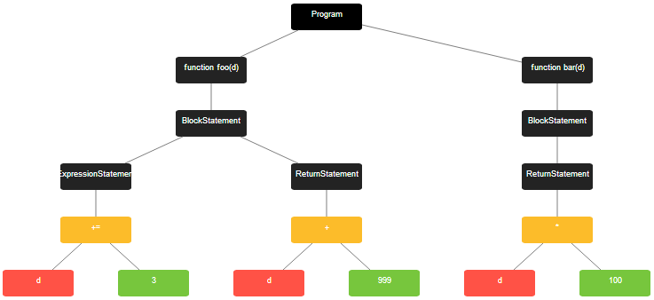
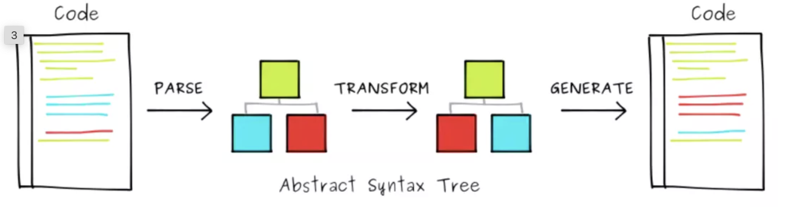
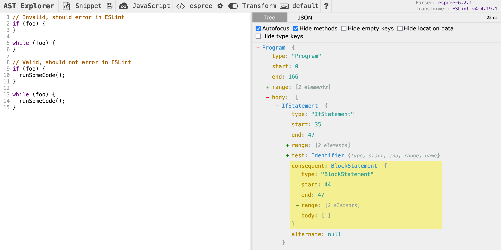
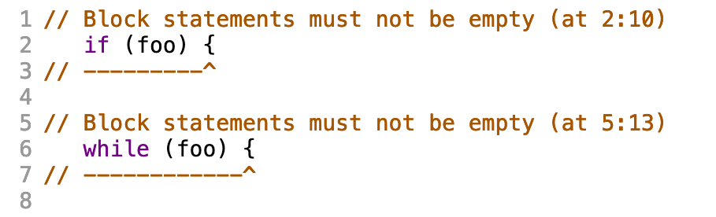

# AST

Abstract Syntax Tree (AST), is a tree representation of program source code.

There is a couple JavaScript `AST` standards:

- [estree](https://github.com/estree/estree) - standard for EcmaScript AST;
- [shift](https://shift-ast.org/) - was designed with transformation in mind, [not compatible with estree](https://blog.shapesecurity.com/2015/01/06/a-technical-comparison-of-the-shift-and-spidermonkey-ast-formats/);
- [babel](https://github.com/babel/babel/blob/main/packages/babel-parser/ast/spec.md) - supports language features which is have not yet become a standard, but have a [proposal](https://github.com/tc39/proposals).

Here is a list of JavaScript parsers:

- [esprima](https://esprima.org) one of the first
- [acorn](https://github.com/acornjs/acorn) very popular, fast and stable
- [espree](https://github.com/eslint/espree) based on `acorn`, used in [eslint](https://eslint.org);
- [@babel/parser](https://babeljs.io/docs/en/babel-parser) based on `acorn`, supports all new language features
- [shfit-ast parser](https://shift-ast.org/parser.html) produces `Shift AST`
- [typescript](https://github.com/Microsoft/TypeScript/wiki/Using-the-Compiler-API) can parse JavaScript and TypeScript, producing it's own AST format for this

You can find more parsers on [astexplorer.net](https://astexplorer.net/), most of them `estree` compatible.

While most parsers that supports `estree` can be easily replaced by each other, `babel` has very rich infrastructure needed to comfortable work with `AST`. It has:

- [handbook](https://github.com/jamiebuilds/babel-handbook/blob/master/translations/en/plugin-handbook.md) describing all the tools, and ways to use it.
- [@babel/traverse](https://babeljs.io/docs/en/babel-traverse.html) - maintains the overall tree state, and is responsible for replacing, removing, and adding nodes;
- [@babel/template](https://babeljs.io/docs/en/babel-template) - simplest way to create a `AST`-node from string.
- [@babel/types](https://babeljs.io/docs/en/babel-types) - contains builders and checkers of `AST`-nodes.

One of the simplest way to play with `AST`, is using [putout](https://github.com/coderaiser/putout), which is based on `babel` and supports simplified way of transforming `JavaScript` code

==Parsing the source code as plain text to a data structure called abstract syntax tree (AST)==. Not only do ASTs present the source code in a structured way but they also play a critical role in the semantic analysis where the compiler validates the correctness and proper usage of the program and the language elements. Later on, the ASTs are used to generate the actual bytecode or machine code.

For example:



An AST is the result of parsing code. For JavaScript, an AST is a JavaScript object containing a tree representation of your source. Before we use it, we have to create it. Depending on the code we are parsing, we choose the appropriate parser.

Here since the code is ES5-compatible, we can choose the `acorn` parser.

Here are some of the most well known Open Source ECMAScript parsers:

| Parser     | Supported Languages            | GitHub                                                                                               |
| ---------- | ------------------------------ | ---------------------------------------------------------------------------------------------------- |
| acorn      | esnext & JSX (using acorn-jsx) | [https://github.com/acornjs/acorn](https://github.com/acornjs/acorn)                                 |
| esprima    | esnext & older                 | [https://github.com/jquery/esprima](https://github.com/jquery/esprima)                               |
| cherow     | esnext & older                 | [https://github.com/cherow/cherow](https://github.com/cherow/cherow)                                 |
| espree     | esnext & older                 | [https://github.com/eslint/espree](https://github.com/eslint/espree)                                 |
| shift      | esnext & older                 | [https://github.com/shapesecurity/shift-parser-js](https://github.com/shapesecurity/shift-parser-js) |
| babel      | esnext, JSX & typescript       | [https://github.com/babel/babel](https://github.com/babel/babel)                                     |
| TypeScript | esnext & typescript            | [https://github.com/Microsoft/TypeScript](https://github.com/Microsoft/TypeScript)                   |

All parsers work the same. Give it some code, get an `AST`.

```js
const { Parser } = require("acorn");

const ast = Parser.parse(readFileSync(fileName).toString());
```

A JavaScript Abstract Syntax Tree (AST) is a hierarchical tree representation of the structure of JavaScript code. Each node in the tree represents a syntactic construct in the source code, such as expressions, statements, and declarations. ASTs are used extensively in compilers, interpreters, code analyzers, and transformation tools to understand and manipulate code.

**Key Concepts of AST**

1. Nodes: Each node represents a construct in the code (e.g., a function, a variable declaration).
2. Tree Structure: Nodes are connected in a parent-child relationship, representing the nested structure of the code.

**Example Workflow**

1. Parse JavaScript Code to AST
2. Traverse and Manipulate the AST
3. Generate Code from AST

Using ASTs, you can parse, analyze, and manipulate JavaScript code programmatically. Tools like Acorn and Estraverse allow you to traverse and modify the AST, while tools like Escodegen can generate code from the modified AST. This approach is fundamental in building tools for code analysis, transformation, and optimization.

**Original JavaScript Code**

The AST corresponds to the following JavaScript code:

```javascript
const greet = (name) => {
  return `Hello, ${name}!`;
};
console.log(greet("Suresh"));
```

**JavaScript Code into an AST**

```javascript
{
  "type": "Program",
  "start": 0,
  "end": 86,
  "body": [
    {
      "type": "VariableDeclaration",
      "start": 0,
      "end": 56,
      "declarations": [
        {
          "type": "VariableDeclarator",
          "start": 6,
          "end": 55,
          "id": {
            "type": "Identifier",
            "start": 6,
            "end": 11,
            "name": "greet"
          },
          "init": {
            "type": "ArrowFunctionExpression",
            "start": 14,
            "end": 55,
            "id": null,
            "expression": false,
            "generator": false,
            "async": false,
            "params": [
              {
                "type": "Identifier",
                "start": 15,
                "end": 19,
                "name": "name"
              }
            ],
            "body": {
              "type": "BlockStatement",
              "start": 24,
              "end": 55,
              "body": [
                {
                  "type": "ReturnStatement",
                  "start": 28,
                  "end": 53,
                  "argument": {
                    "type": "TemplateLiteral",
                    "start": 35,
                    "end": 52,
                    "expressions": [
                      {
                        "type": "Identifier",
                        "start": 45,
                        "end": 49,
                        "name": "name"
                      }
                    ],
                    "quasis": [
                      {
                        "type": "TemplateElement",
                        "start": 36,
                        "end": 43,
                        "value": {
                          "raw": "Hello, ",
                          "cooked": "Hello, "
                        },
                        "tail": false
                      },
                      {
                        "type": "TemplateElement",
                        "start": 50,
                        "end": 51,
                        "value": {
                          "raw": "!",
                          "cooked": "!"
                        },
                        "tail": true
                      }
                    ]
                  }
                }
              ]
            }
          }
        }
      ],
      "kind": "const"
    },
    {
      "type": "ExpressionStatement",
      "start": 57,
      "end": 86,
      "expression": {
        "type": "CallExpression",
        "start": 57,
        "end": 85,
        "callee": {
          "type": "MemberExpression",
          "start": 57,
          "end": 68,
          "object": {
            "type": "Identifier",
            "start": 57,
            "end": 64,
            "name": "console"
          },
          "property": {
            "type": "Identifier",
            "start": 65,
            "end": 68,
            "name": "log"
          },
          "computed": false,
          "optional": false
        },
        "arguments": [
          {
            "type": "CallExpression",
            "start": 69,
            "end": 84,
            "callee": {
              "type": "Identifier",
              "start": 69,
              "end": 74,
              "name": "greet"
            },
            "arguments": [
              {
                "type": "Literal",
                "start": 75,
                "end": 83,
                "value": "Suresh",
                "raw": "'Suresh'"
              }
            ],
            "optional": false
          }
        ],
        "optional": false
      }
    }
  ],
  "sourceType": "module"
}
```

## Code Transpililation

A transpiler, short for _"source-to-source compiler"_, is a software tool that translates source code written in one programming language into equivalent source code in the same language. Transpilers are commonly used for various purposes, such as language compatibility, syntax conversion, and code optimization.

A frequent scenario involves syntax conversion, especially when dealing with compatibility issues. Imagine we have an application, and some of our users are on older web browsers. If we've adopted new syntax features like the Nullish coalescing operator (??), this could render our app unusable for those users. To address this, we must transform our code into an older, compatible syntax before deploying it to production. This ensures that our app remains accessible and functional for users with older browsers.

As depicted in the image above, the Transpiler begins by **parsing** the code into an Abstract Syntax Tree (AST). Following this, it proceeds to **transform** the AST as needed before finally **generating** code based on the modified AST.

[Babel](https://babel.io) is a very common JavaScript Transpiler in the ecosystem and you may have used it directly or indirectly. We'll talk about how it uses AST in detail as we proceed.

## Code Linting

Another software tool that is quite heavy on AST is Linters. A linter automatically analyzes and checks source code for potential errors, style violations, and programming best practices, helping developers identify and correct issues in their code during development.

Before a linter can perform static analysis on your source code, it begins by parsing the code into an Abstract Syntax Tree (AST). Once this parsing is complete, the linter then proceeds to traverse the AST to identify and address potential issues within the code.

[ESLint](https://eslint.org) is a widely adopted Linter within the JavaScript community. It boasts a robust plugin system, a comprehensive library of plugins, editor extensions, and presets (which are groups of plugins) that you can easily integrate into your project. We'll be talking about Eslint in detail later in this post.

## AST in Transpliers (Babel)

[Babel](https://babel.io) provides us with the toolchains to transpile our code, it has a CLI, a parser, and a plugin system, which means that you can write a **plugin** that applies some transformation to your code.

Babel takes each of your files, generates an Abstract Syntax Tree (AST) based on your code, and passes this AST along with additional information to a Plugin. The Plugin can then apply the required transformations to the AST. After the transformations are complete, the resulting AST is converted back into code. **It is important to note that without a plugin, Babel does absolutely nothing. You simply get the same code as output**.

## AST Workflow



- **Parse:** Parses the code into AST
- **Transform:** Performs operations, such as addition, deletion, replacement, and appending on each node in AST, which includes 95% of the code in business development.
- **Generator:** Converts AST to code

## Start from a Simple Requirement

**Pseudo-Requirement for Code Compression:** Simplify square function parameters and references. Convert the variable from num to n:

```js
// from
function square(num) {
  return num * num;
}

// into
function square(n) {
  return n * n;
}
```

### Solution 1: Using Replace Statement for Brute-Force Conversion

```js
const sourceText = `function square(num) {
  return num * num;
}`;
```

```js
sourceText.replace(/num/g, "n");
```

This operation is brutal and can cause bugs easily, so the code may not be useful. If the "num" string exists, it will also be converted:

```js
// Before conversion
function square(num) {
  return num * num;
}
console.log("param 2 result num is " + square(2));

// After conversion
function square(n) {
  return n * n;
}
console.log("param 2 result n is " + square(2));
```

### Solution 2: Using Babel for Conversion

```js
module.exports = () => {
  return {
    visitor: {
      // Define the visitor and traverse the Identifier
      Identifier(path) {
        if (path.node.name === "num") {
          path.node.name = "n"; // Convert the variable name
        }
      },
    },
  };
};
```

Define the Identifier visitor to traverse the Identifier. If the Identifier is "num," the variable is converted. The preceding code resolves the problem that num is converted when it is a string. However, there is also a potential issue. For example, errors occur when the code looks like this:

```js
// Before conversion
function square(num) {
  return num * num;
}
console.log("global num is " + window.num);

// After conversion
function square(n) {
  return n * n;
}
console.log("global num is " + window.n); // Error
```

window.num will also be converted after being matched by the visitor iterator. After conversion, the output code is window.n, which causes an error. The requirement contains three keywords, *square function, parameters, and references.* Based on the keywords, the code needs to be optimized further.

### Solution 2 Upgrade: Finding the Reference Relationship

```js
module.exports = () => {
  return {
    visitor: {
      Identifier(path) {
        // Three criteria
        if (path.node.name !== "num") {
          // Variable needs to be num
          return;
        }
        if (path.parent.type !== "FunctionDeclaration") {
          // The parent type needs to be function
          return;
        }
        if (path.parent.id.name !== "square") {
          // The function name must be square
          return;
        }
        const referencePaths = path.scope.bindings["num"].referencePaths; // Find the corresponding reference
        referencePaths.forEach((path) => (path.node.name = "n")); // Modify reference value
        path.node.name = "n"; // Modify variable value
      },
    },
  };
};
```

## Babel in AST

### API Overview

```js
// Three steps of the API workflow
const parser = require("@babel/parser").parse;
const traverse = require("@babel/traverse").default;
const generate = require("@babel/generator").default;

// Supporting package
const types = require("@babel/types");

// Template package
const template = require("@babel/template").default;
```

### @babel/parser

Use babel/parser to convert the source code to AST

```js
const ast = parser(rawSource, {
  sourceType: "module",
  plugins: ["jsx"],
});
```

### @babel/traverse

The core of AST development is that more than 95% of the code write visitors come from @babel/traverse.

```js
const ast = parse(`function square(num) {
  return num * num;
}`);

traverse(ast, {
  // Perform AST conversion
  Identifier(path) {
    // Traverse the visitor of the variable
    // ...
  },
  // Traverse other visitors
});
```

### @babel/generator

Use @babel/generator to generate the corresponding source code based on the operated AST:

```js
const output = generate(ast, {
  /* options */
});
```

### @babel/types

@babel/types is used to create and identify AST nodes. It is often used in actual development:

```js
// @babel/types that start with "is" are used to identify the nodes
types.isObjectProperty(node);
types.isObjectMethod(node);

// Create a null node
const nullNode = types.nullLiteral();
// Create a square node
const squareNode = types.identifier("square");
```

### @babel/template

@babel/types can create AST nodes, which is too tedious. Use @babel/template to create the entire AST node quickly. The following code compares the two methods of creating the AST node called *import React from 'react*:

```js
// @babel/types
// Search for the corresponding API to create a node and match methods for passing parameters
const types = require("@babel/types");
const ast = types.importDeclaration(
  [types.importDefaultSpecifier(types.identifier("React"))],
  types.stringLiteral("react")
);

// path.replaceWith(ast) // Node replacement
```

```js
// Use @babel/template
// Create the node and input source code, which is clear and easy to understand
const template = require("@babel/template").default;
const ast = template.ast(`import React from 'react'`);

// path.replaceWith(ast) // Node replacement
```

### Define a Babel Plugin for Common Use

Define a babel plugin for common use to facilitate Webpack integration. There is an example below:

```js
// Define a plugin
const { declare } = require("@babel/helper-plugin-utils");

module.exports = declare((api, options) => {
  return {
    name: "your-plugin", // Define the plugin name
    visitor: {
      // Write the business visitor
      Identifier(path) {
        // ...
      },
    },
  };
});
```

```js
// Configure babel.config.js
module.exports = {
  presets: [
    require("@babel/preset-env"), // It can be used together with the common presets.
  ],
  plugins: [
    require("your-plugin"),
    // require('./your-plugin') can be a relative directory.
  ],
};
```

The babel plugin development is equal to writing AST transform callbacks. There is no need to use the @babel/parser, @babel/traverse, @babel/generator, or other modules directly, which are called inside Babel.

When the @babel/types capability is required, @babelcore is recommended for direct use

```js
const core = require("@babel/core");
const types = core.types; // const types = require('@babel/types');
```

## ESLint in AST

After mastering the core principles of AST, it is easier to customize ESLint rules:

```js
// eslint-plugin-my-eslint-plugin
module.exports.rules = {
  "var-length": (context) => ({
    // Define the var-length rule to check the variable length
    VariableDeclarator: (node) => {
      if (node.id.name.length <= 1) {
        context.report(node, "Variable name length must be greater than 1");
      }
    },
  }),
};
```

```js
// .eslintrc.js
module.exports = {
  root: true,
  parserOptions: { ecmaVersion: 6 },
  plugins: ["my-eslint-plugin"],
  rules: {
    "my-eslint-plugin/var-length": "warn",
  },
};
```

## ESLint rules

[ESLint](https://eslint.org/) is a tool that analyzes your code to find issues before they hit production. ESLint is built into most code editors, so you can see any errors that come up as you write your code.

As you might have guessed, ESLint uses an AST to analyze your code piece by piece. The AST is run through a series of [rules](https://eslint.org/docs/user-guide/configuring/rules) that check to ensure syntax is correct and best practices are followed.

### Building our own rule

We'll be rebuilding one of the built-in ESLint rules, [no-empty](https://eslint.org/docs/rules/no-empty). The rule ensures that developers do not leave empty block statements in their code.

In the AST Explorer, lets replace the example code we were using with the code below that we want to lint with our rule. We'll come back to this after learning a bit more about the structure of ESLint rules.

```js
// Invalid, should error in ESLint
if (foo) {
}

while (foo) {}

// Valid, should not error in ESLint
if (foo) {
  runSomeCode();
}

while (foo) {
  runSomeOtherCode();
}
```

### Anatomy of an ESLint rule

#### Files

There is a standard format for ESLint rules. Each rule haves three files:

- `lib/rules/rule-name.js` - The source file for the rule
- `tests/lib/rules/rule-name.test.js` - A test file
- `docs/rules/rule-name.md` - A documentation file

We will be focusing on the source file.

#### Source file

The source file for a lint rule exports an object that must contain two main properties:

- `meta` - An object containing information about the rule
- `create` - a function that contains the logic for linting your code.

The skeleton of our `no-empty` rule would like this:

```jsx
module.exports = {
  meta: {
    type: "suggestion",
    docs: {
      description: "disallow empty block statements",
      category: "Possible Errors",
      recommended: true,
      url: "linl-to-docks",
    },
    fixable: "code",
    // Rule settings can be added here
    schema: [],
  },
  create: function (context) {
    return {
      // callback functions go here
    };
  },
};
```

#### Create function

The `create` function is where most of the the logic lives. It returns an object where each value is a callback function that ESLint runs on the different `node` types in the AST.

To fill in the `no-empty` rule, we need to find the node type of block statements in our code so that we can run a function to check if they are empty.

This is where AST Explorer really comes in handy. Let's open it up again, and click on one of the opening curly brackets (`{`) in the code we pasted in a couple minutes ago. The Explorer will highlight the block statement on the left, and we can see it is of type `BlockStatement`.



Now let's add a `BlockStatement` key to the object returned by the `create` function, and set the key's value to a function. ESLint will run this function once for each block statement in our code, and pass it the corresponding `node`, which is highlighted in the screenshot above.

```js
create: function(context) {
    return {
        // the `node` is a BlockStatement object
        BlockStatement: (node) => {
            // The linter will run this function once for each
            // block statement in your code
        },
    };
}
```

AST Explorer has another great feature that lets you build and test rules right inside your browser. At the top of AST Explorer you will notice another toggle for `Transform`.

You'll notice two new sections come up from the bottom of the window. On the bottom left we can paste in our lint rule code, and on the bottom right you will see the output of our code.

Lets paste in what we have so far, I've added a `console.log` that logs the `node` in the `FunctionDeclaration` callback so we can see if our rule is working:

```jsx
module.exports = {
  meta: {
    type: "suggestion",
    docs: {
      description: "disallow empty block statements",
      category: "Possible Errors",
      recommended: true,
      url: "linl-to-docks",
    },
    fixable: "code",
    // Rule settings can be added here
    schema: [],
  },
  create: function (context) {
    return {
      BlockStatement: (node) => {
        console.log(node);
      },
    };
  },
};
```

Open up your browser console and you should see the four `BlockStatement` objects that represent the four block statements in the code we are linting. Inside those objects you will find lots of information about node, including a `body`. We can use this `body` value to check if our block statements are empty.

Now we can fill in our `BlockStatement` function with a basic implementation of this rule:

```jsx
create: function (context) {
  return {
    BlockStatement: (node) => {
      // If the node body is empty, return
      if (node.body.length !== 0) {
        return;
      }

      context.report({
        node: node,
        message: "Block statements must not be empty"
      });
    },
  };
},
```

A couple important things to note here:

- Early returns
  It is common to use early returns when we know the node we are analyzing is valid. This implementation has only one check, but most rules will have multiple. If we make it through all the early return checks, we want to report an error.

- Context object
  We are using the `context` object passed into the `create` function to report errors. The context object provides a number of helpful properties and methods that can be used to make more complex rules.

#### See errors in AST Explorer

After updating our lint rule in AST Explorer, we can now see errors reported on the two empty block statements, but not on the statements with content. It works!



## Traversing an AST

As the name AST suggests, AST uses a tree data structure. To hone the skills of manipulating AST, we need to recall our long distant memory of *"Algorithm 101"*, the **depth-first search (DFS)** tree traversal algorithm.

Now you have a clearer idea of how depth-first search works, a depth-first search on an AST would look something like this:

```js
function visit(ast) {
  // TODO: do something with this node

  const keys = Object.keys(ast);
  for (let i = 0; i < keys.length; i++) {
    const child = ast[key];
    // could be an array of nodes or just a node
    if (Array.isArray(child)) {
      for (let j = 0; j < child.length; j++) {
        visit(child[j]);
      }
    } else if (isNode(child)) {
      visit(child);
    }
  }
}

function isNode(node) {
  // probably need more check,
  // for example,
  // if the node contains certain properties
  return typeof node === "object";
}
```

We can then fill up the `TODO` with our manipulation code.

If we find ourselves needing to do multiple traversals, with different AST manipulation, we would soon realize that mixing AST manipulation code with the traversal code is *not clean enough*. Naturally, you would realize *it is cleaner* to pass in a callback function that gets called every time we visit a node:

```js
// highlight-next-line
function visit(ast, callback) {
  // highlight-next-line
  callback(ast);

  const keys = Object.keys(ast);
  for (let i = 0; i < keys.length; i++) {
    const child = ast[key];
    if (Array.isArray(child)) {
      for (let j = 0; j < child.length; j++) {
        // highlight-next-line
        visit(child[j], callback);
      }
    } else if (isNode(child)) {
      // highlight-next-line
      visit(child, callback);
    }
  }
}

function isNode(node) {
  // probably need more check,
  // for example,
  // if the node contains certain properties
  return typeof node === "object";
}
```

The `visit` function is now generic enough that you can use it for any AST:

```js
visit(htmlAst, (htmlAstNode) => {
  /*...*/
});
visit(cssAst, (cssAstNode) => {
  /*...*/
});
```

Naturally, you would think that having the information of the parent node, and the key / index of the current node would be useful to have in the callback function:

```js
function visit(ast, callback) {
  // highlight-next-line
  function _visit(node, parent, key, index) {
    // highlight-next-line
    callback(node, parent, key, index);

    const keys = Object.keys(node);
    for (let i = 0; i < keys.length; i++) {
      const child = node[key];
      if (Array.isArray(child)) {
        for (let j = 0; j < child.length; j++) {
          // highlight-next-line
          _visit(child[j], node, key, j);
        }
      } else if (isNode(child)) {
        // highlight-next-line
        _visit(child, node, key);
      }
    }
  }
  // highlight-next-line
  _visit(ast, null);
}
```

Now, we might think to ourselves, I dont want to get callback for every node visited, I just need callback for a certain node. You might be tempted to add a condition in the `visit` function:

```js
function visit(ast, callback) {
  function _visit(node, parent, key, index) {
    // highlight-next-line
    if (someCondition(node)) {
      callback(node, parent, key, index);
    }
    ...
```

But you think twice: *what if someone else wants to use `visit` but with a different condition for callback?*

For most of the time, you want to callback only to a certain types of node. In that case, instead of passing in a callback function, you can pass in a map of node type to their respective callback functions:

```js
function visit(ast, callbackMap) {
  function _visit(node, parent, key, index) {
    // highlight-start
    const nodeType = getNodeType(node);
    if (nodeType in callbackMap) {
      callbackMap[nodeType](node, parent, key, index);
    }
    // highlight-end
    ...
  }
}

visit(ast, {
  Identifier(node, parent, key, index) {
    // do something
  }
})
```

At this point, you maybe realize, *hey, this looks so much like one of those AST traversing libraries!* And yes, this is how they get implemented.

Now we can traverse the AST, and find the node that we are interested in, so the next step is to manipulate them.

## Manipulating AST

Manipulating the AST can be categorized into 3 different operations:

- Adding a node
- Replacing a node
- Removing a node

### Adding a node

To add a node, you can assign it to a keyed property of your node:

```js
function visitCallback(node, parent, key, index) {
  node.foo = createNewNode();
}
```

or push the new node, if the keyed property is an array:

```js
function visitCallback(node, parent, key, index) {
  node.foo.push(createNewNode());
}
```

To add a node as a sibling, you may need to access the node's parent:

```js
function visitCallback(node, parent, key, index) {
  // add as first sibling
  parent[key].unshift(createNewNode());
  // add as last sibling
  parent[key].push(createNewNode());
  // add as next sibling
  parent[key].splice(index + 1, 0, createNewNode());
  // add as prev sibling
  parent[key].splice(index, 0, createNewNode());
}
```

### Replacing a node

To replace the current node to another node, update the key property of the current node's parent:

```js
function visitCallback(node, parent, key, index) {
  parent[key] = updatedNode();
}
```

If the key property of the parent is an array:

```
function visitCallback(node, parent, key, index) {
  parent[key][index] = updatedNode();
}
```

### Removing a node

To remove the current node, delete the key property of the current node's parent:

```js
function visitCallback(node, parent, key, index) {
  delete parent[key];
}
```

If the key property of the parent is an array:

```js
function visitCallback(node, parent, key, index) {
  parent[key].splice(index, 1);
}
```

> The operations of **adding**, **replacing**, and **removing** nodes are so common that, they are usually implemented as a util function.

However, there's **one important step** that I did not cover: after you mutate the node, you need to make sure that the traversal still works fine.

For a node that is a property of a key of its parent, adding, replacing and removing them are usually fine. Except for the replace operation, you might need to revisit the *"current node"*, which is the *new replacing node*.

However, for node that are in an array, you need to take special care to update the array index of the loop:

```js
function visit(ast, callbackMap) {
  function _visit(node, parent, key, index) {
    // ...
    if (Array.isArray(child)) {
      for (let j = 0; j < child.length; j++) {
        _visit(child[j], node, key, j);
        // highlight-start
        if (hasRemoved()) {
          // offset the index
          j--;
        }
        // highlight-end
      }
    }
    // ...
  }
}
```

But how do you know that the current node was removed?

Well, knowing when a node got removed is sometimes a secret that lies within the `remove` util function from the tree traversal library.

It could be as simple as setting a flag when you call `remove`:

```js
// highlight-start
let _hasRemoved = false;
function remove(node, parent) {
  _hasRemoved = true;
  // proceed to remove current node
}
function hasRemoved() {
  let result = _hasRemoved;
  // reset back
  _hasRemoved = false;
  return result;
}
// highlight-end

// function _visit(...) { ...
for (let j = 0; j < child.length; j++) {
  _visit(child[j], node, key, j);
  // highlight-next-line
  if (hasRemoved()) {
    // ...
  }
}

// ...somewhere in your visitCallback
function visitCallback(node, parent, key, index) {
  // highlight-next-line
  remove(node, parent);
}
```

But sometimes, instead of having to import the `remove` util from the tree traversal library, the `remove` function is available in `this` of the `visitCallback`:

```js
function visit(ast, callbackMap) {
  function _visit(node, parent, key, index) {
    // highlight-start
    let _hasRemoved = false;
    const _this = {
      // don't need to take in `node` and `parent`,
      // because it know exactly what they are
      remove() {
        _hasRemoved = true;
        // proceed to remove current node
      },
    };
    // highlight-end

    // ...
    if (nodeType in callbackMap) {
      // highlight-next-line
      callbackMap[nodeType].call(_this, node, parent, key, index);
    }
  }
}

// ...somewhere in your visitCallback
function visitCallback(node, parent, key, index) {
  // highlight-next-line
  this.remove();
}
```

Now you learned the 3 basic operations of manipulating the AST, you maybe wonder how exactly is to use these basic operations to write a codemod or an AST transform plugin?

You need to:

- **Know how the part of the code you want to change look like in the AST**, so you can target the specific type of the node, and
- **Know how does the final output you wish to see look like in the AST**, so you know what nodes to create, update or remove.

So we are going to elaborate more on these 2 steps specifically.

## Targeting a node

Node targeting, most of the times, is just a lot of `===`.

For example, if you want to target a `<figure>` with a class `foo` that contains an `` and a `<figcaption>` in [htmlparser2](https://github.com/fb55/htmlparser2):

```js
<figure>
  
  <figcaption>lorem ipsum</figcaption>
</figure>
```

You need to check:

```js
function visit(node) {
  if (
    /* 1. is node <figure> */
    node.type === "tag" &&
    node.name === "figure" &&
    /* 2. is node contain class `foo` */
    node.attribs.class === "foo" &&
    /* 3. is node children contain  */
    node.children.find(
      (child) => child.type === "tag" && child.name === "img"
    ) !== undefined &&
    /* 4. is node children contain <figcaption> */
    node.children.find(
      (child) => child.type === "tag" && child.name === "figcaption"
    ) !== undefined
  ) {
    // do something
  }
}
```

To make it less verbose, we can refactor each check into reusable functions:

```js
function isTag(node, name) {
  return node.type === "tag" && node.name === name;
}
function hasAttr(node, key, value) {
  return node.attribs[key] === value;
}
function hasChild(node, fn) {
  return node.children.find(fn) !== undefined;
}
function visit(node) {
  if (
    /* 1. is node <figure> */
    // highlight-next-line
    isTag(node, "figure") &&
    /* 2. is node contain class `foo` */
    // highlight-next-line
    hasAttr(node, "class", "foo") &&
    /* 3. is node children contain  */
    // highlight-next-line
    hasChild((child) => isTag(child, "img")) &&
    /* 4. is node children contain <figcaption> */
    // highlight-next-line
    hasChild((child) => isTag(child, "figcaption"))
  ) {
    // do something
  }
}
```

## Creating a node

There are a few ways you can create an AST node.

The simplest and crudest way is to **manually create the node object**. Most of the time, the node object is a JavaScript object. So you can just create them manually:

```js
const newNode = {
  type: "Identifier",
  name: "foo",
};
```

It may become unwieldy when creating large, complex AST nodes, so sometimes library decides to provide builder functions, like [@babel/types](https://babeljs.io/docs/en/babel-types) to simplify node creation and provide default values:

```js
const newNode = t.identifier("foo");

const newNode2 = t.functionDeclaration(
  "bar",
  [t.identifier("foo")],
  [
    t.expressionStatement(
      t.callExpression(
        t.memberExpression(t.identifier("console"), t.identifier("log"), false),
        [t.identifier("foo")]
      )
    ),
    t.returnStatement(t.identifier("foo")),
  ]
);
```

It looked more concise and tidier, but it is hard to comprehend and grasp what node it is creating.

So, a better way of creating complex AST node, is to use the `parse` function + `string`:

```js
const newNode2 = babelParser.parse(`
  function bar(foo) {
    console.log(foo);
    return foo;
  }
`).program.body[0];

const newNode3 = cssTree.parse(
  `
  .foo {
    color: red;
  }
`,
  { context: "rule" }
);
```

For Babel, there's an amazing util called [@babel/template](https://babeljs.io/docs/en/babel-template), where you can use [template literals](https://developer.mozilla.org/en-US/docs/Web/JavaScript/Reference/Template_literals) to create AST node:

```js
const newNode4 = template.statement`
  console.log(foo);
`;

// placeholder can be an AST node or string
const newNode5 = template.statement`
  function bar(foo) {
    ${newNode4}
    alert("${"hello world"}")
    return foo;
  }
`;
```

## Read more

https://github.com/jamiebuilds/babel-handbook/blob/master/translations/en/plugin-handbook.md
