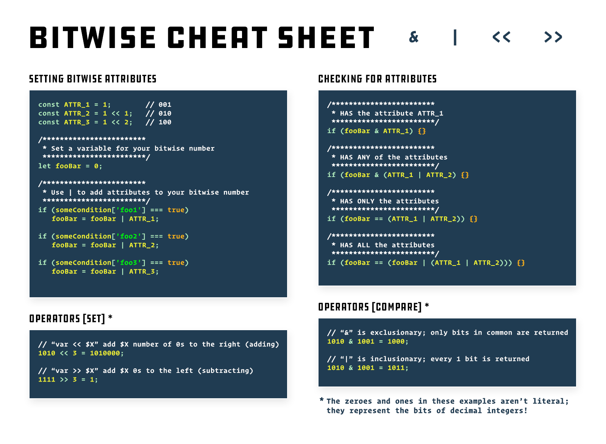

# Bitwise

Bitwise operators perform an operation on the bitwise (0,1) representation of their arguments, rather than as decimal, hexadecimal, or octal numbers. For example, the decimal number eight has a binary representation of 1000. Bitwise operators do their operations on such binary representation (for example 1000) but they return standard JavaScript numerical values.

Here is a list of JavaScript's bitwise operators.

| **Operator**                 | **Usage** | **Description**                                                                                                          |
| ---------------------------- | --------- | ------------------------------------------------------------------------------------------------------------------------ |
| Bitwise AND                  | a & b     | Returns a one in each bit position if bits of both left and right operands are ones.                                     |
| Bitwise OR                   | a \| b    | Returns a one in each bit if bits of either left or right operand is one.                                                |
| Bitwise XOR                  | a ^ b     | Returns a one in a bit position if bits of one but not both left and right operand are one.                              |
| Bitwise NOT                  | ~ a       | Flips the bits of its operand.                                                                                           |
| Left shift                   | a << b    | Shifts a in binary representation b bits to the left, shifting in zeros from the right.                                  |
| Sign-propagating right shift | a >> b    | Shifts a in binary representation b bits to the right, discarding bits shifted off.                                      |
| Zero-fill right shift        | a >>> b   | Shifts a in binary representation b bits to the right, discarding bits shifted off, and shifting in zeros from the left. |

## AND operations

Let's start with AND. In logical expressions we use the double ampersand (`&&`) and for bitwise AND we use a single ampersand (`&`).

For example, for logical AND expressions:

```js
print(true && true); // true

print(true && false); // false

print(false && true); // false

print(false && false); // false
```

In other words, all terms have to be true in order for the final result to be true. The same holds for a bitwise AND operation:

Where both bits are `1` the result will remain `1` otherwise the result bit will be `0`. Remember, bitwise operations operate on a bit-by-bit basis.

So, an example:

```js
print(7 & 1); // 1
// because 111 & 001
// Leftmost bit is 1 on the left and 0 on the right.
// So, same as true (1) && false (0) becomes false (0)
// Next bit is the same 1 & 0 (true && false), so false
// Rightmost bit is 1 & 1 (true && true) and
// so becomes 1 (true)
```

Shown on top of each other:

```js
111 
001 
--- 
001 = 1
```

Or vertically next to each other:

```js
1 & 0 = 0 
1 & 0 = 0 
1 & 1 = 1
```

Like I stated, it works on each bit individually. There are no carries or anything like that.

Some other quick examples:

```js
5 & 4 = 4 
```

In binary:

```js
101 & 100 = 100 
```

On top of each other:

```js
101 
100 
--- 
100 = 4
```

Useful things you can do with it:

Check if a value is odd or even:

```js
for (let n = 0; n < 1000; n++) {
  console.log(`${n} is ${n & 1 ? "odd" : "even"}`);
}
```

Most people do something like this to check for odd or even:

```js
const isOdd = (value) => value % 2 === 1;
```

But that’s wrong, because:

```js
print(isOdd(11)); // true
print(isOdd(-11)); // false Oops!
```

Whereas

```js
const isOdd = (value) => !!(value & 1);
```

always works.

## OR operations

The OR is different from the AND operation in that, for the result to be `true` (or `1`), the AND operation required both sides to be `true` (or `1`), the OR operation only requires one of the conditions to be `true` (or `1`). For logical expressions we use double pipes (`||`) and bit bitwise operations we use a single pipe (`|`).

Some logical OR expressions:

```js
print(true || true); // true

print(true || false); // true

print(false || true); // true

print(false || false); // false
```

Some OR examples:

```js
print(6 | 1); // 7
// Note for an AND operation with the same numbers,
// the result would be 6 & 1 = 0
```

On top of each other:

```js
110 
001 
--- 
111 = 7
```

## XOR operations

The final bitwise operation (that takes left and right hand side operands) available in most languages is the Exclusive OR which is a caret (`^`). You don't see that used much in JavaScript. I use it from time to time but I think I'm the only guy in the world who uses this in JavaScript as I've never seen it used outside of my code.

We shall refer to it as XOR.

Here's how it works:

```js
print(true ^ true); // false
print(true ^ false); // true
print(false ^ true); // true
print(false ^ false); // false
```

Some XOR examples:

```js
print(7 ^ 1); // 6
```

On top of each other:

```js
111 
001 
--- 
110 = 6
```

Basically, if the two sides are the same (i.e. `1` and `1` or `0` and `0`) then the result is `0` and if they are different, then the result is a `1`.

Here's an example (somewhat modified) of where I used an XOR in JavaScript a few weeks ago.

```js
function shallow_similar(a, b) {
  if (Array.isArray(a) ^ Array.isArray(b)) return false;
  return Array.isArray(a) ? a.every((val, i) => b[i] === val) : a === b;
}
```

Note the `if` statement uses an XOR. The two variables `a` and `b` cannot be similar if one of them is an array and the other isn't. Remember that XOR is `0` (or `false`) if the left and right side are different? Perfect for this use case. I use `Array.isArray()` to make the array check into a `true` or `false`. The `true` will coerce to a `1` and the `false` will coerce to a `0`. The XOR will become `1` if they are different and `0` if they are the same. Then the if statement will coerce the result to a boolean, true or false. Neat, clean, easy, and compact.

Here's a fun effect of XOR that has been exploited for a great many things over the years.

```js
let value1 = 15, // Could be any integer, 15 is just an example

value2 = 5, // Again, any integer value would do

newValue = value1 ^ value2; // XOR value1 with value2

print( value1 + ' ^ ' + value2 + ' = ' + newValue ); // 15 ^ 5 = 10

print( newValue + ' ^ ' + value2 + ' = ' value1 ); // 10 ^ 5 = 15
```

In other words, if you XOR some value (lets' call it A) with some other value (let's call it B) then you get a new value (let's call this C). Applying XOR with value B with get the original value (A) back again.

```js
A ^ B ^ (B === A);
```

## NOT operations

The next bitwise operation is the unary bitwise negation, also known as a bitwise NOT. It basically flips every bit to its opposite, also known as a one's complement. It is occasionally used for a quick method for turning a number into an internal representation of a small integer (called a SMI in V8). It is functionally equivalent to a `Math.floor()` except much faster. For this, it would be useful to understand the difference between one's complement and two's complement, but not essential.

```js
let a = 1.8;

print(~~a); // 1

// Side note, other fast bitwise ways of forcing an integer:

print(a | 0); // 1

print(a >>> 0); // 1
```

The reason why these work is because bitwise operations only make sense with integers (with a few magical exceptions) so JavaScript converts the value to an integer by rounding it down. It also marks it internally as an SMI which makes the variable very fast. You see the `| 0` a lot in asm.js, for example, for this exact reason.

Here is another (only slightly evil) one's complement trick.

```js
/ First, the wrong way

let a = {};

// ...

a.counter++; // Oops! Error. Result is NaN because a.counter was undefined.

Here's the (ever so slightly) evil way.

let a {};

// ...

a.counter = -~a.counter;
```

Before it can execute the `-`, it first has to execute the `~`. Before it can do that, it first has to get the value and make sure it's an integer. So, in other words, the `-~` first executes the `~` which coerces the `a.counter` to an integer. Of course, it's `undefined` so we end up with `0`. Then we apply the `~` so it becomes all ones (111...111) which is the same as the integer value `-1`. Then it applies the `-` which flips the sign so it becomes `1`.

But wait! It's get more magical as we go along, now with 10% more evil.

Next time it does the following as we now have the value `1` in `a.counter`. So, same sequence again:

`~1` (000...001 becomes 111...110) which is the same as `-2` (one's complement, remember?)

`-(-2)` becomes `2`

and so on. It basically is the same as `variable++` except without the error for `undefined` object properties. I do not recommend using this unless you intend to puzzle (and probably annoy) your coworkers.

Here are something actually useful examples of bitwise operations. These types of operations are extremely common in C, for example, but rarely seen in JavaScript.

```js
const READY = 1, // 0001
  WAIT = 2, // 0010
  ERROR = 4, // 0100
  UNITIALIZED = 8; // 1000

let status = READY | UNINITIALIZED; // status is now 1001 because

// UNITIALIZED is 8 and READY

// is 1 (1000 | 0001 = 1001 = 9)

function isReady() {
  return !!(status & READY); // Force it to boolean using !!

  // (probably not necessary but

  // more correct than truthy)

  // Basically, xxxx & 0001,

  // leaving us 000x (where x is either 0 or 1)

  // which !! coerces to true (1) or false (0)
}

function isInitialized() {
  return !!(status & UNINITIALIZED); // Force it to boolean
}

function make_initialized() {
  status &= ~UNINITIALIZED; // Flip the bits to make a mask,

  // so UNINITIALIZED = 8 (1000)

  // becomes 1111...10111 and then use

  // an AND which will preserve all the

  // bits where we have a 1 bit and

  // clear any bit where we have a 0.

  // This neatly clears

  // out bit number 3 (the fourth bit

  // from the right or decimal 8)
}

function set_error() {
  status |= ERROR; // Use an OR to set the ERROR bit

  // (decimal 4, bit number 2,

  // third bit from the right)
}

function clear_error() {
  status &= ~ERROR; // Flip the bits and mask out

  // the ERROR bit. Same as

  // make_uninitialized above
}
```

## SHIFT operations

Some more bitwise operations: the shift instructions.

The shift instructions are `<<`, `>>`, and `>>>`.

They do the following, in order: shift all bits left, shift all bits right, and shift all bits right adding zero bits on the left.

Examples:

`1010 >> 1 = 0101 (10 >> 1 = 5)` because `1010 >> 1` loses our rightmost bit (it falls off the edge), sort of like this: `0101 [0]`

`1010 >> 2 = 0010 (10 >> 2 = 2)` because `1010 >> 2` loses the two rightmost bits, so `0010 [10]`

The bits that fall off are just lost in JavaScript. (Geek note: In assembler, they are not lost but shift through the carry flag (and sign flag before carry when going left). Assembler rules!)

It is the same as doing an integer division by powers of two. So `>> 1` is (almost) the same as `/ 2`, and `>> 2` is the same as `/ 4`, and `>> 3` is the same as `/ 8`. Just be aware that this is a pure integer division so `10 >> 2 !== 10 / 4` because `10 >> 2 = 2` but `10 / 4 = 2.5`.

Because the leftmost bit of an integer is used as a sign bit (when the number is considered a signed, as opposed to unsigned, integer) we also have the `>>>` which shifts in zeros as opposed to the `>>` which duplicates the leftmost bit.

So

```js
0000...0111 >> 1 = 0000...0011 (7 >> 1 = 3)

1111...1011 >> 1 = 1111...1101 (-5 >> 1 = -3)
```

but

```js
0000...0111 >>> 1 = 0000...0011 (7 >> 1 = 3)

1111...1011 >>> 1 = 0111...1101 (-5 >> 1 = 2147483645)
```

In the same way, you can use `<<` to multiply by powers of two, so

```js
111 << 1 = 1110 (7 << 1 = 14 or 7 * 2 = 14)
```

Back in the day before CPUs had multiply and divide instructions and such operations were prohibitively expensive, you could do quick multiply if you knew the right hand side. For example, to multiply a value by `10` in case you don't have a multiply instruction:

```js
(value << (3 + value)) << 1 === value * 10;
```

So `value << 3` is the same as doing `value * 8` and `value << 1` is the same as `value * 2`, and when you add them together you get `value * 10` because `value * 10 === ( value * 8 + value * 2 )`.

## Examples

All integers in JavaScript (up to 9,007,199,254,740,991 in 64-bit environments) can be represented in binary. You can see what they are by calling `toString(2)` on them:

```js
(1).toString(2);
// 1
(2).toString(2);
// 10
(3).toString(2);
// 11
(4).toString(2);
// 100
// ...
(3877494).toString(2);
// 1110110010101001110110_
```

You get the idea. Now comes the important part. The real trick behind the whole thing is this: _Bitwise operators let you compare and manipulate those binary strings directly_. So the bitwise operator `<<`, which puts zeroes on the right of the binary string, will increase your integer decimal-value according to binary rules. Here’s what I mean:

```js
// Let's set `fooBar` to the number 2
let fooBar = 2;
fooBar.toString(2);
// 10 (<- this is its binary representation)
// We're inserting (1) zero at the end of fooBar's binary
// representation
foobar = fooBar << 1;
fooBar.toString(2);
// 100
// ...so this means fooBar, in decimal form, now equals 4. Rad!
console.log(fooBar);
// 4
```

In my specific example above, we can store all four of our possible attributes in a single 4-bit number, between 0000–1111, with each bit representing either true (1) or false (0). So you can imagine that using this schema, the binary number `1111` would mean all attributes are true, the rest are false; `1000` would mean only the fourth attribute is true, etc. (keep in mind binary counts will go right-to-left; the “first” attribute would be 1, or 0001; the “fourth” would be 1000).

The two most important bitwise comparison operators are “&” and “|”. Their resemblance to “&&” and “||” is intentional, but perhaps misleading. “&” will return a binary representation of the intersection of the two numbers you’re comparing, “|” returns the union. So `1010 & 1001` will return `1000`, because the leftmost `1` is the _only_ bit in common between the two; `1010 | 1001` will return `1011`, because those are _all_ the bits in common.

For example:

```js
// Let's define an object that needs to be checked. In the
// real world, this might come from an API response, or user
// interactions, or a form, etc. You might not know it beforehand.
const myObject = {
  foo1: false,
  foo2: true,
  foo3: false,
  foo4: true
}// Let's also set up some constants to make code easier to
// read later on. These could obviously take many forms, or be set
// up in different ways, but I find this the most intuitive to read:
const HAS_FOO1 = 1;         // 0001
const HAS_FOO2 = 1 << 1;  // 0010
const HAS_FOO3 = 1 << 2;  // 0100
const HAS_FOO4 = 1 << 3;  // 1000// Construct your bitwise number. How you do this will depend
// on your use-case, but here's one way to do it: Checking object
// keys manually and using if statements to add attributes one at
// a time.
let myBitNumber = 0;if (myObject['foo1'] === true)
  myBitNumber = myBitNumber | HAS_FOO1;
  // This uses the bitwise | to form a unionif (myObject['foo2'] === true)
  myBitNumber = myBitNumber | HAS_FOO2;if (myObject['foo3'] === true)
  myBitNumber = myBitNumber | HAS_FOO3;if (myObject['foo4'] === true)
  myBitNumber = myBitNumber | HAS_FOO4;console.log(myBitNumber.toString(2));
// 1010/*
 * Our bitwise number is now "1010". That's because our second and
 * fourth attributes are true.
 * Think of it this way:
 *
 * | fourth | third | second | first | <= Attribute
 * |    1   |   0   |   1    |   0   | <= True/false
 *
 */
```

Now, on to the tests. If you’re checking your bitwise number for attributes, there are four possible states you can check for: whether your number **has ONE** of a certain attribute, whether it **has ANY** of an array of given attributes, whether it **has ONLY** the attributes specified, or it **has ALL** of an array of attributes.



Test your bitwise:

```js
// Test whether your bit number has a single attribute. '&' ensures
// an intersection between them.
if (myBitNumber & HAS_FOO1) {
  // False, in this example
}
if (myBitNumber & HAS_FOO2) {
  // True!
} // Test whether your bit number has ANY of the specified attributes
if (myBitNumber & (HAS_FOO1 | HAS_FOO2)) {
  // True!
}
if (myBitNumber & (HAS_FOO1 | HAS_FOO3)) {
  // False
} // Test whether your bit number contains ONLY the specified attributes
if (myBitNumber == (HAS_FOO2 | HAS_FOO4)) {
  // True
}
if (myBitNumber == (HAS_FOO2 | HAS_FOO3 | HAS_FOO4)) {
  // False
} // Test whether your bit number contains ALL of the given
// attributes. This is slightly tricky: the union of ATTRIBUTES
// can't supersede `myBitNumber` alone, otherwise it contains a bit
// that `myBitNumber` doesn't.
if (myBitNumber == (myBitNumber | (HAS_FOO2 | HAS_FOO4))) {
  // True
}
if (myBitNumber == (myBitNumber | (HAS_FOO2 | HAS_FOO3 | HAS_FOO4))) {
  // False
}
```

And that’s the quick summary. A functional example of using bitwise operators to store and compare multiple true/false attributes efficiently. It’s fairly easy to read and understand, simple to update and maintain, and if you need to edit one clause or even add another attribute, it’s not exponentially difficult.
