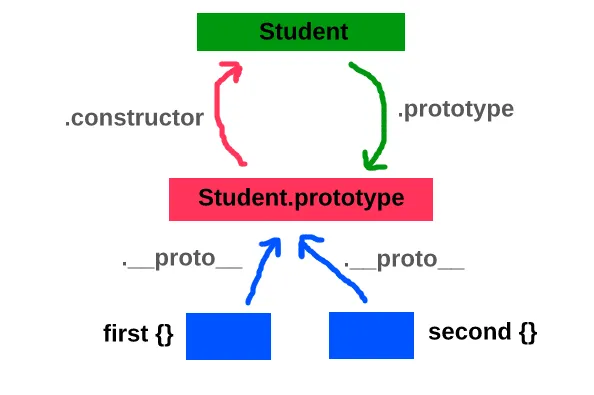

# Classes

_In JavaScript classes are functions. And since all functions are objects in JavaScript, classes are also objects._

The prototype property of a class is not the prototype of the class. It is the prototype of every object created from that class

It all starts with a class definition and a basic `constructor` method:

```javascript
class Widget {
  constructor(type) {
    this.type = type;
  }
}

let foo = new Widget("foo");
```

In the code above we create a (nearly) empty `class` named "Widget" with a simple constructor method (named "constructor", which is the only thing it can be called). You've probably seen this basic example before, so I won't dwell on it. Now we want to abstract some functionality up to a parent class so that we can reuse it in two subclasses. First, we need to create the parent class:

```javascript
class Resource {
  constructor() {}
}
```

In JavaScript, there are precisely two use cases for the `super` keyword.

1. **Within subclass constructor calls**. If initializing your derived class requires you to use the parent class’s constructor, you can call `super(parentConstructorParams[ )` within the subclass constructor, passing along any necessary parameters.
2. **To refer to methods in the superclass**. Within normal method definitions, derived classes can refer to methods on the parent class with dot notation: `super.methodName`.
3. There's really only one interesting bit here, if you have a `constructor` in the subclass, _you must have a `constructor` method_ in the parent class, even if it is a no-op function (and you have to call it). Why? The JS engine only attaches an object instance to the context variable (`this`) once you get to the highest prototype in the chain - which is `Object`. If you create a constructor, and then you _don't_ call the parent constructor, you're essentially short circuiting the chain!

In the code below, we have a constructor in the subclass which uses the ES6 `super` variable to call the parent constructor:

```javascript
class Widget extends Resource {
  constructor() {
    super();
  }
}
```

We could have passed any number of arguments into the parent constructor function. More to the point, if you try to access `this` in the subclass _before_ calling `super()` you'll get an error!

```javascript
class Widget extends Resource {
  constructor() {
    console.log(this); // ReferenceError
    super();
  }
}
```

## Prototypal inheritance

Javascript has what is called prototypal inheritance, which sounds scary, but is actually simpler than traditional class based inheritance once you get the hang of it. Each object may have an implicit pointer to another object, referred to as its prototype. When you try to access a property on an object where no property exists with that key, it instead looks up the key on the prototype object, and returns the prototype’s property for that key if it exists. If it doesn’t exist on the prototype, it recursively checks the prototype’s prototype and so on, all the way up the chain until a property is found or an object without a prototype is reached.

### Chain Gang

So you might ask, why do I only have to create a parent `constructor` if I create a child `constructor`? Wouldn't I need to do it _all the time_? Well, yes, it does need to exist _all the time_, but if you don't explicitly create the lowest level `constructor` (in subclass), then JavaScript will create it for you. In other words, if you have no "constructor" defined, JS creates a no-op one for you: `constructor() { }` And if you are in a subclass, the default `constructor` created for you is actually:

```javascript
constructor(...args) {
    super(...args);
}
```

As always, rules are made to be broken, I said above that you **must** create the `constructor` in the parent class, but really that's not true. The only reason you have to do it is because the default return value from a constructor method call is the value of `this`. So if you _don't_ create that parent `constructor`, then you will have no `this` value, and thus you'd be returning `undefined`, which is not ok in JavaScript constructors.

So, to break the rule here you just need to **return a different value**, then you don't need to create a parent constructor:

```javascript
class Resource {}

class Widget extends Resource {
  constructor() {
    return { foo: "bar" };
  }
}
```

That said, this gets you into a really weird state. I would not recommend this unless you know what you're doing!

I think you may have guessed it already, but the key to understanding what `super` is lies in the way we've been using it. We call `super()` inside of a subclass' `constructor` method in order to call the parent `constructor`... and that's pretty much what `super` is in JavaScript: a reference to the parent `prototype`:

```javascript
class Resource {
  constructor() {}
}

class Widget extends Resource {
  constructor() {
    super();
    if (super.constructor === Resource.prototype.constructor) {
      console.log("It's true!");
    }
  }
}
```

Take a close look at that `if` conditional above... `super.constructor === Resource.prototype.constructor` - the `super` variable points to the parent `prototype`. What does that mean? It means you still need to know about prototypes for one. But it also means that inside of subclass methods, you have immediate access to the parent prototype (and the full chain) without having to necessarily know the _name_ of the parent class.

Not having to know the name of the parent class is cool I guess, but there is more magic going on behind the scenes here... The JS engine is actually doing you another favor: it's attaching the current context for you in class methods:

```javascript
class Resource {
  constructor() {}
  whoami() {
    console.log(this); // will print out the current SUBCLASS object
  }
}

class Widget extends Resource {
  constructor() {
    super();
  }
  whoami() {
    console.log(this); // will print out the current Widget object
    super.whoami();
  }
}

let w = new Widget();
w.whoami();
```

What you see above is really important, we no longer need to call the parent methods using `apply` or `call` and switch the context. If you're confused, don't worry, a lot of people are (and have been for a long time). Essentially, this is what we used to have to do:

```javascript
Widget.prototype.whoami = function () {
  console.log(this);
  Resource.prototype.whomai.apply(this); // execute the PARENT method, switching the context
};
```

In the olden days (ES5), if we tried to just call `Resource.prototype.whoami()` (or `this.__proto__.whoami()`) then the value of `this` inside the parent method would just be the `Resource` prototype... _not_ the `Widget` object we're operating on.

You'll notice above that we use `super()` in the subclass constructor, but `super.whoami()` in the subclass method of the same name. So is `super` a function or an object? The answer is both, and neither. More specifically, functions are objects in JavaScript, so the answer would always be "both". But even more specifically, in JavaScript "super" is now a keyword, which means JavaScript is doing special things with it internally. In fact, inside of our `whoami` method you can't do `console.log( typeof(super) )`, you just get a SyntaxError, kind of like if you just tried to do: `let x = new;` ("new" is a keyword, and must be used appropriately).

## Old style classes

In early versions of Javascript, it was common to simulate classes using code like the following.

```js
function Foo(x) {
  this.x = x;
  this.y = 432;
}
Foo.prototype.point = function () {
  return "Foo(" + this.x + ", " + this.y + ")";
};

var myfoo = new Foo(99);
console.log(myfoo.point()); // prints "Foo(99, 432)"
```

Where did `this` come from? Where did `prototype` come from? What does `new` do? As it turns out, even the earliest versions of Javascript didn’t want to be too unconventional, so they included some syntax that let you code things that were kinda-sorta like classes.

In technical terms, functions in Javascript are defined by the two internal methods `[[Call]]` and `[[Construct]]` . Any object with a `[[Call]]` method is called a function, and any function that additionally has a `[[Construct]]` method is called a constructor¹. The `[[Call]]` method determines what happens when you invoke an object as a function, e.g. `foo(args)` , while `[[Construct]]` determines what happens when you invoke it as a new expression, i.e. `new foo` or `new foo(args)`.

For ordinary function definitions, calling `[[Construct]]` will implicitly create a new object whose `[[Prototype]]` is the `prototype` property of the constructor function if that property exists and is object valued, or `Object.prototype` otherwise. The newly created object is bound to the `this` value inside the function’s local environment. If the function returns an object, the `new` expression will evaluate to that object, otherwise, the `new` expression evaluates to the implicitly created `this` value.

As for the `prototype` property, that is implicitly created whenever you define an ordinary function. Each newly defined function has a property named “prototype” defined upon it with a newly created object as its value. That object in turn has a `constructor` property which points back to the original function. Note that this prototype property is **not** the same as the `[[Prototype]]` slot. In the previous code example, `Foo` is still just a function, so its `[[Prototype]]` is the predefined object `Function.prototype` .

## New style classes

With that background out of the way, it’s time to examine ES6 class syntax. The previous code sample translates directly to the new syntax as follows:

```js
class Foo {
  constructor(x) {
    this.x = x;
    this.y = 432;
  }

  point() {
    return "Foo(" + this.x + ", " + this.y + ")";
  }
}

let myfoo = new Foo(99);

console.log(myfoo.point()); // prints "Foo(99, 432)"
```

As before, each class consists of a constructor function and a prototype object which refer to each other via the `prototype` and `constructor` properties. However, the order of definition of the two is reversed. With an old style class, you define the constructor function, and the prototype object is created for you. With a new style class, the body of the class definition becomes the contents of the prototype object (except for static methods), and among them, you define a `constructor`. The end result is the same either way.

So if the ES6 class syntax is just sugar for old style “classes”, what’s the point? Apart from looking a lot nicer and adding safety checks, the new class syntax also has functionality that was impossible pre-ES6, specifically, class based inheritance. When you define a class with the new syntax, you can optionally provide a super class for the class to inherit from as demonstrated below:

```js
class Base {
  foo() {
    return "foo in Base";
  }

  bar() {
    return "bar in Base";
  }
}

class Child extends Base {
  foo() {
    return "foo in Child";
  }

  whiz() {
    return "whiz in Child";
  }
}

const b = new Base();

const c = new Child();

console.log(b.foo()); // foo in Base

console.log(b.bar()); // bar in Base

console.log(c.foo()); // foo in Child

console.log(c.bar()); // bar in Base

console.log(c.whiz()); // whiz in Child
```

This example by itself can still be emulated without class syntax, although the code required is a lot uglier.

With class based inheritance, the rule is simple — each part of the pair has as its prototype the corresponding part of the superclass. So the constructor of the superclass is the `[[Prototype]]` of the subclass constructor and the prototype object of the superclass is the `[[Prototype]]` of the subclass prototype object.

There is no direct and convenient way to set up these `[[Prototype]]` relationships without using class syntax, but you can set them manually using `Object.setPrototypeOf()`, introduced in ES5.

```js
function Base() {}

Base.prototype.foo = function () {
  return "foo in Base";
};

Base.prototype.bar = function () {
  return "bar in Base";
};

function Child() {}

Object.setPrototypeOf(Child, Base);

Object.setPrototypeOf(Child.prototype, Base.prototype);

Child.prototype.foo = function () {
  return "foo in Child";
};

Child.prototype.whiz = function () {
  return "whiz in Child";
};

var b = new Base();

var c = new Child();

console.log(b.foo()); // foo in Base

console.log(b.bar()); // bar in Base

console.log(c.foo()); // foo in Child

console.log(c.bar()); // bar in Base

console.log(c.whiz()); // whiz in Child
```

However, the example above notably avoids doing anything in the constructors. In particular, it avoids `super`, a new piece of syntax that allows subclasses to access the properties and constructor of the superclass. This is much more complicated, and is in fact impossible to fully emulate in ES5, although it can be emulated in ES6 without using class syntax or super through use of `Reflect`.

## Superclass property access

There are two uses for `super` — calling a superclass constructor, or accessing properties of the superclass. The second case is simpler, so we’ll cover it first.

The way that `super` works is that each function has an internal slot called `[[HomeObject]]` , which holds the object that the function was originally defined within if it was originally defined as a method. For a class definition, this object will be the prototype object of the class, i.e. `Foo.prototype` . When you access a property via `super.foo` or `super["foo"]`, it is equivalent to `[[HomeObject]].[[Prototype]].foo` .

With this understanding of how `super` works behind the scenes, you can predict how it will behave even under complicated and unusual circumstances. For example, a function’s `[[HomeObject]]` is fixed at definition time and will not change even if you later assign the function to other objects as shown below.

```js
class A {
  foo() {
    return "foo in A";
  }
}

class B extends A {
  foo() {
    return "foo in B";
  }
}

class C {
  foo() {
    return "foo in C";
  }
}

class D extends C {
  foo() {
    return super.foo();
  }
}

b = new B();

console.log(b.foo()); // foo in B

B.prototype.foo = D.prototype.foo;

console.log(b.foo()); // foo in C

console.log(b instanceof C); // false
```

In the above example, we took a function originally defined in `D.prototype` and copied it over to `B.prototype`. Since the `[[HomeObject]]` still points to `D.prototype`, the `super` access looks in the `[[Prototype]]` of `D.prototype`, which is `C.prototype`. The result is that `C`'s copy of foo is called even though `C` is nowhere in `b`'s prototype chain.

Likewise, the fact that `[[HomeObject]].[[Prototype]]` is looked up on every evaluation of the `super` expression means that it will see changes to the `[[Prototype]]` and return new results, as shown below.

```js
class A {
  foo() {
    return "foo in A";
  }
}
class B {
  foo() {
    return "foo in B";
  }
}

class C extends A {
  foo() {
    console.log(super.foo()); // foo in A
    Object.setPrototypeOf(C.prototype, B.prototype);
    console.log(super.foo()); // foo in B
  }
}

c = new C();
c.foo();
```

As a side note, `super` is not limited to class definitions. It can also be used from any function defined within an object literal using the new method shorthand syntax, in which case `[[HomeObject]]` will be the enclosing object literal. Of course, the `[[Prototype]]` of an object literal will always be `Object.prototype` so this isn’t terribly useful unless you manually reassign the prototype as is done below.

```js
const obj = {
  msg: "Hello, ",

  print() {
    return this.msg + super.msg;
  },
};
Object.setPrototypeOf(obj, {
  msg: "world!",
});

console.log(obj.print()); // Hello, world!
```

## Emulating super properties

There is no way to manually set `[[HomeObject]]` on our methods, but we can emulate it by just saving the value and doing the resolution manually as shown below. It’s not as convenient as just writing `super`, but at least it works.

```js
function Base() {}
Base.prototype.foo = function () {
  return "foo in Base";
};

function Child() {}
Object.setPrototypeOf(Child, Base);
Object.setPrototypeOf(Child.prototype, Base.prototype);

const homeObject = Child.prototype;
Child.prototype.foo = function () {
  return "foo in Child";
};
Child.prototype.bar = function () {
  // super.foo();
  return Object.getPrototypeOf(homeObject).foo.call(this);
};

const c = new Child();
console.log(c.foo()); // foo in Child
console.log(c.bar()); // foo in Base
```

Note that we need to use `.call(this)` to ensure that the super method gets called with the right `this` value. If the method has a property which shadows `Function.prototype.call` for some reason, we could instead use `Function.prototype.call.call(foo, this)` or `Reflect.apply(foo, this)` , which are more reliable but verbose.

## Super in static methods

You can also use `super` from static methods. Static methods are the same as regular methods, except that they are defined as properties on the constructor function instead of on the prototype object.

```js
class Base {
  foo() {
    return "foo in Base";
  }
  static bar() {
    return "bar in Base";
  }
}
class Child extends Base {
  foo() {
    return super.foo();
  }
  static bar() {
    return super.bar();
  }
}

const obj = new Child();
console.log(obj.foo()); // foo in Base
console.log(Child.bar()); // bar in Base
```

`super` can be emulated within static methods in the same way as with normal methods. The only difference is that `[[HomeObject]]` is now the constructor function rather than the prototype object.

```js
function Base() {}
Base.prototype.foo = function () {
  return "foo in Base";
};
Base.bar = function () {
  return "bar in Base";
};

function Child() {}
Object.setPrototypeOf(Child, Base);
Object.setPrototypeOf(Child.prototype, Base.prototype);

const homeCtor = Child;
const homeProto = Child.prototype;
Child.prototype.foo = function () {
  // super.foo();
  return Object.getPrototypeOf(homeProto).foo.call(this);
};
Child.bar = function () {
  // super.bar();
  return Object.getPrototypeOf(homeCtor).bar.call(this);
};

const obj = new Child();
console.log(obj.foo()); // foo in Base
console.log(Child.bar()); // bar in Base
```

## Super constructors

When the `[[Construct]]` method of an ordinary constructor function is invoked, a new object is implicitly created and bound to the `this` value inside the function. However, subclass constructors follow different rules. There is no automatically created `this` value and attempting to access `this` results in an error. Instead, you must call the constructor of the superclass via `super(args)` . The result of the superclass constructor is then bound to the local `this` value, after which you can access it in the subclass constructor as normal.

This of course presents problems if you want to create an old style class that can properly interoperate with new style classes. There is no problem when subclassing an old style class with a new style class, since the base class constructor is just an ordinary constructor function either way. However, subclassing a new style class with an old style class will not work properly, since old style constructors are always base constructors and don’t have the special subclass constructor behavior.

To make the challenge concrete, suppose we have a new style class `Base` whose definition is unknown and cannot be changed, and we wish to subclass it without using class syntax, while remaining compatible with whatever code in `Base` is expecting a true subclass.

First off, we will assume that `Base` is not using proxies, or nondeterministic computed properties, or anything else weird like that, since our solution will likely access the properties of `Base` a different number of times or in a different order than a real subclass would, and there’s nothing we can do about that.

After that, the question becomes how to set up the constructor call chain. As with regular `super` properties, we can easily get the superclass constructor using `Object.getPrototypeOf(homeObject).constructor`. But how to invoke it? Luckily, we can use `Reflect.construct()` to manually invoke the internal `[[Construct]]` method of any constructor function.

There’s no way to emulate the special behavior of the `this` binding, but we can just ignore `this` and use a local variable to store the “real” `this` value, named `$this` in the example below.

```js
function Child(...args) {
  const { constructor } = Object.getPrototypeOf(homeObject);

  const $this = Reflect.construct(constructor, args);

  // initialize subclass properties

  $this.x = 43;

  return $this;
}

Object.setPrototypeOf(Child, Base);

Object.setPrototypeOf(Child.prototype, Base.prototype);

const homeObject = Child.prototype;

const obj = new Child("some", "args", "for the superclass ctor");

console.log(obj.x); // 43
```

Note the `return $this;` line above. Recall that if a constructor function returns an object, that object will be used as the value of the `new` expression instead of the implicitly created `this` value.

So, mission accomplished? Not quite. The `obj` value in the above example is not actually an instance of `Child`, i.e. it does not have `Child.prototype` in its prototype chain. This is because `Base`‘s constructor didn’t know anything about `Child` and hence returned an object that was just a plain instance of `Base` (its `[[Prototype]]` is `Base.prototype`).

So how is this problem solved for real classes? `[[Construct]]`, and by extension, `Reflect.construct`, actually take three parameters. The third parameter, `newTarget`, is a reference to the constructor that was originally invoked in the `new` expression, and hence the constructor of the bottom-most (most derived) class in the inheritance hierarchy. Once control flow reaches the constructor of the base class, the implicitly created `this` object will have `newTarget` as its `[[Prototype]]`.

Therefore, we can make `Base` construct an instance of `Child` by invoking the constructor via `Reflect.construct(constructor, args, Child)`. However, this still isn’t quite right, because it will break whenever someone else subclasses `Child`. Instead of hardcoding the child class, we need to pass through `newTarget` unchanged. Luckily, it can be accessed within constructors using the special `new.target` syntax. This leads to the final solution below:

```js
function Child(...args) {
  const { constructor } = Object.getPrototypeOf(homeObject);
  const $this = Reflect.construct(constructor, args, new.target);

  // initialize subclass properties
  $this.x = 43;
  return $this;
}
Object.setPrototypeOf(Child, Base);
Object.setPrototypeOf(Child.prototype, Base.prototype);
const homeObject = Child.prototype;
```

## Creating and using constructors

Constructors are like regular functions, but we use them with the `new` keyword. There are two types of constructors: built-in constructors such as `Array` and `Object`, which are available automatically in the execution environment at runtime; and custom constructors, which define properties and methods for your own type of object.

A constructor is useful when you want to create multiple similar objects with the same properties and methods. It’s a convention to capitalize the name of constructors to distinguish them from regular functions. Consider the following code:

```javascript
function Book() {
  // unfinished code
}

var myBook = new Book();
```

The last line of the code creates an instance of `Book` and assigns it to a variable. Although the `Book` constructor doesn’t do anything, `myBook` is still an instance of it. As you can see, there is no difference between this function and regular functions except that it’s called with the `new` keyword and the function name is capitalized.

## Determining the type of an instance

To find out whether an object is an instance of another one, we use the `instanceof` operator:

```javascript
myBook instanceof Book; // true
myBook instanceof String; // false
```

Note that if the right side of the `instanceof` operator isn’t a function, it will throw an error:

```javascript
myBook instanceof {};
// TypeError: invalid 'instanceof' operand ({})
```

Another way to find the type of an instance is to use the `constructor` property. Consider the following code fragment:

```javascript
myBook.constructor === Book; // true
```

The constructor property of `myBook` points to `Book`, so the strict equality operator returns `true`. Every object in JavaScript inherits a `constructor` property from its prototype, which points to the constructor function that has created the object:

```javascript
var s = new String("text");
s.constructor === String; // true

"text".constructor === String; // true

var o = new Object();
o.constructor === Object; // true

var o = {};
o.constructor === Object; // true

var a = new Array();
a.constructor === Array; // true

[].constructor === Array; // true
```

Note, however, that using the `constructor` property to check the type of an instance is generally considered bad practice because it can be overwritten.

## `new` operator

### The Four Rules

1. It creates a new, empty object.
2. It binds `this` to our newly created object.
3. It adds a property onto our newly created object called “**proto**” which points to the constructor function’s prototype object.
4. It adds a `return this` to the end of the function, so that the object that is created is returned from the function.

```js
function Student(name, age) {
  this.name = name;
  this.age = age;
}
```

Perfect. Now lets invoke our constructor function with the `new` operator. We’re going to pass in two arguments: `'John'`, and `26`.

```js
var first = **new** Student('John', 26);
```

So, what happens when we run the above code?

1. A new object is created — the `first` object.
2. `this` is bound to our `first` object. So any references to `this` will point to `first`.
3. Our **proto** is added. `first.__proto__` will now point to `Student.prototype`.
4. After everything is done, our brand new `first` object is returned to our new `first` variable.

Now lets try creating a new student:

```js
var second = new Student("Jeff", 50);
```

We’ve used our `Student` constructor function to create our second student named Jeff. And, since we used the `new` operator, the `__proto__` property should have also been added to our `second` object. It should point to the parent constructor. Lets try seeing if they’re equal:

```js
second.__proto__ === Student.prototype;
// true
```

Finally, our `Student.prototype.constructor` should point to our `Student` constructor function:

```js
Student.prototype.constructor; //  function Student(name, age) {
//    this.name = name;
//    this.age = age;
//  }
```



As you can see above, our `Student` constructor function (as well as all other constructor functions) have a property called `.prototype`. This prototype has an object on it called `.constructor` which points back to the constructor function. It’s a nice little loop. Then, when we use the `new` operator to create a new object, each object has `.__proto__` property which links the new object back to the `Student.prototype`.

> **It’s important because of inheritance. The prototype object is shared among all objects created with that constructor function. This means we can add functions and properties to the prototype that all of our objects can use**.

In our above examples, we only created two `Student` objects, but what if instead of two students, we have 20,000? All of a sudden, we’re saving a ton of processing power by putting shared functions on the prototype instead of in each of the student objects.

Lets look at an example to drive this idea home. In your console add the following line:

```js
Student.prototype.sayInfo = function () {
  console.log(this.name + " is " + this.age + " years old");
};
```

Again, what we’re doing here is adding a function to the Student prototype — Any student we create or have created now has access to this brand new `.sayInfo` function!

Add a new student and try it again:

```js
var third = new Student("Tracy", 15); // Now if we log third out, we see the object only has two
// properties, age and name. Yet, we still have access to the
// sayInfo function:third;
// Student {name: "Tracy", age: 15}third.sayInfo();
// Tracy is 15 years old
```

It works! And it works because of _inheritance_. With JavaScript objects, an object will first look to see if it has the property we are calling. If it doesn’t, it then moves upwards, to it’s prototype and says ‘_Hey, do you have this property?_’. This same pattern continues all the way up until we either find that property, or we reach the end of the prototype chain at the global object.

Inheritance is the same reason you’ve been able to use functions like `.toString()` in the past! Think about it, you’ve never written a `toString()` method, yet you’ve been able to use it just fine. That’s because the method, as well as other built in JS methods are on the `Object prototype`. Every object we create ultimately delegates to the `Object prototype`. And sure, we could over write these methods with something like this:

```js
var name = {
  toString: function () {
    console.log("Not a good idea");
  },
};
name.toString();
// Not a good idea
```

Our object first checks to see if it has the method before moving to the prototype. Since we do have the method, it is run and there is no inheritance needed. But that’s not a good idea. Leave global methods as they are and name your functions something else.

**Note: Difference between **proto** and prototype**

If you are already getting confused about **proto** and prototype, don’t worry! You are far from the only one to be confused about this.

Prototype is a property of the constructor function that determines what will become the **proto** property on the constructed object.

So, **proto** is the reference created, and that reference is known as the prototype chain bond.

## The Object.defineProperty() method

The `Object.defineProperty()` method can be used inside a constructor to help perform all necessary property setup. Consider the following constructor:

```javascript
function Book(name) {
  Object.defineProperty(this, "name", {
    get: function () {
      return "Book: " + name;
    },
    set: function (newName) {
      name = newName;
    },
    configurable: false,
  });
}

var myBook = new Book("Single Page Web Applications");
console.log(myBook.name); // Book: Single Page Web Applications

// we cannot delete the name property because "configurable" is set to false
delete myBook.name;
console.log(myBook.name); // Book: Single Page Web Applications

// but we can change the value of the name property
myBook.name = "Testable JavaScript";
console.log(myBook.name); // Book: Testable JavaScript
```

This code uses `Object.defineProperty()` to define accessor properties. Accessor properties don’t include any properties or methods, but they define a getter to call when the property is read, and a setter to call when the property is written to.

A getter is expected to return a value, while a setter receives the value being assigned to the property as an argument. The constructor above returns an instance whose `name` property can be set or changed, but cannot be deleted. When we get the value of `name`, the getter prepends the string `Book:` to the name and returns it.

### Using the new keyword is essential

It’s important to remember to use the `new` keyword before all constructors. If you accidentally forget `new`, you will be modifying the global object instead of the newly created object. Consider the following example:

```javascript
function Book(name, year) {
  console.log(this);
  this.name = name;
  this.year = year;
}

var myBook = Book("js book", 2014);
console.log(myBook instanceof Book);
console.log(window.name, window.year);

var myBook = new Book("js book", 2014);
console.log(myBook instanceof Book);
console.log(myBook.name, myBook.year);
```

When we call the `Book` constructor without `new`, we are in fact calling a function without a return statement. As a result, `this` inside the constructor points to `Window` (instead of `myBook`), and two global variables are created. However, when we call the function with `new`, the context is switched from global (Window) to the instance. So, `this` correctly points to `myBook`.

Note that in strict mode this code would throw an error because strict mode is designed to protect the programmer from accidentally calling a constructor without the `new` keyword.

## Not just a syntactic sugar

Sometimes people say that `class` is a “syntactic sugar” (syntax that is designed to make things easier to read, but doesn’t introduce anything new), because we could actually declare the same thing without using the `class` keyword at all:

```javascript
// rewriting class User in pure functions

// 1. Create constructor function
function User(name) {
  this.name = name;
}
// a function prototype has "constructor" property by default,
// so we don't need to create it

// 2. Add the method to prototype
User.prototype.sayHi = function () {
  alert(this.name);
};

// Usage:
let user = new User("John");
user.sayHi();
```

The result of this definition is about the same. So, there are indeed reasons why `class` can be considered a syntactic sugar to define a constructor together with its prototype methods.

Still, there are important differences.

1. First, a function created by `class` is labelled by a special internal property `[[IsClassConstructor]]: true`. So it’s not entirely the same as creating it manually.

   The language checks for that property in a variety of places. For example, unlike a regular function, it must be called with `new`:

```javascript
class User {
  constructor() {}
}

alert(typeof User); // function
User(); // Error: Class constructor User cannot be invoked without 'new'
```

Also, a string representation of a class constructor in most JavaScript engines starts with the “class…”

```javascript
class User {
  constructor() {}
}

alert(User); // class User { ... }
```

There are other differences, we’ll see them soon.

- Class methods are non-enumerable. A class definition sets `enumerable` flag to `false` for all methods in the `"prototype"`.
  That’s good, because if we `for..in` over an object, we usually don’t want its class methods.
- Classes always `use strict`. All code inside the class construct is automatically in strict mode.

## Class Expression

Just like functions, classes can be defined inside another expression, passed around, returned, assigned, etc.

Here’s an example of a class expression:

```javascript
let User = class {
  sayHi() {
    alert("Hello");
  }
};
```

Similar to Named Function Expressions, class expressions may have a name.

If a class expression has a name, it’s visible inside the class only:

```javascript
// "Named Class Expression"
// (no such term in the spec, but that's similar to Named Function Expression)
let User = class MyClass {
  sayHi() {
    alert(MyClass); // MyClass name is visible only inside the class
  }
};

new User().sayHi(); // works, shows MyClass definition

alert(MyClass); // error, MyClass name isn't visible outside of the class
```

We can even make classes dynamically “on-demand”, like this:

```javascript
function makeClass(phrase) {
  // declare a class and return it
  return class {
    sayHi() {
      alert(phrase);
    }
  };
}

// Create a new class
let User = makeClass("Hello");

new User().sayHi(); // Hello
```

## Getters/setters

Just like literal objects, classes may include getters/setters, computed properties etc.

Here’s an example for `user.name` implemented using `get/set`:

```javascript
class User {
  constructor(name) {
    // invokes the setter
    this.name = name;
  }

  get name() {
    return this._name;
  }

  set name(value) {
    if (value.length < 4) {
      alert("Name is too short.");
      return;
    }
    this._name = value;
  }
}

let user = new User("John");
alert(user.name); // John

user = new User(""); // Name is too short.
```

Technically, such class declaration works by creating getters and setters in `User.prototype`.

## Computed names […]

Here’s an example with a computed method name using brackets `[...]`:

```javascript
class User {
  ["say" + "Hi"]() {
    alert("Hello");
  }
}

new User().sayHi();
```

Such features are easy to remember, as they resemble that of literal objects.

## Class field

Previously, our classes only had methods.

“Class fields” is a syntax that allows to add any properties.

For instance, let’s add `name` property to `class User`:

```javascript
class User {
  name = "John";

  sayHi() {
    alert(`Hello, ${this.name}!`);
  }
}

new User().sayHi(); // Hello, John!
```

So, we just write “ = ” in the declaration, and that’s it.

The important difference of class fields is that they are set on individual objects, not `User.prototype`:

```javascript
class User {
  name = "John";
}

let user = new User();
alert(user.name); // John
alert(User.prototype.name); // undefined
```

We can also assign values using more complex expressions and function calls:

```javascript
class User {
  name = prompt("Name, please?", "John");
}

let user = new User();
alert(user.name); // John
```

### Making bound methods with class fields

So if an object method is passed around and called in another context, `this` won’t be a reference to its object any more.

For instance, this code will show `undefined`:

```javascript
class Button {
  constructor(value) {
    this.value = value;
  }

  click() {
    alert(this.value);
  }
}

let button = new Button("hello");

setTimeout(button.click, 1000); // undefined
```

The problem is called “losing `this`”.

There are two approaches to fixing it:

1. Pass a wrapper-function, such as `setTimeout(() => button.click(), 1000)`.
2. Bind the method to object, e.g. in the constructor.

Class fields provide another, quite elegant syntax:

```javascript
class Button {
  constructor(value) {
    this.value = value;
  }
  click = () => {
    alert(this.value);
  };
}

let button = new Button("hello");

setTimeout(button.click, 1000); // hello
```

The class field `click = () => {...}` is created on a per-object basis, there’s a separate function for each `Button` object, with `this` inside it referencing that object. We can pass `button.click` around anywhere, and the value of `this` will always be correct.

That’s especially useful in browser environment, for event listeners.
