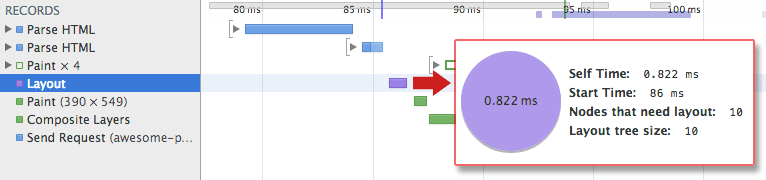

# DOM and Layout Trees

## How is a web page built?

How a browser goes from a source HTML document to displaying a styled and interactive page in the viewport is called the “Critical Rendering Path”. Although this process can be broken down into several steps, these steps can be roughly grouped into two stages. The first stage involves the browser parsing the document to determine what will ultimately be rendered on the page, and the second stage involves the browser performing the render.

The result of the first stage is what is called a “render tree”. The render tree is a representation of the HTML elements that will be rendered on the page and their related styles. In order to build this tree, the browser needs two things:

1. The CSSOM, a representation of the styles associated with elements
2. The DOM, a representation of the elements

## How is the DOM created?

The DOM is an object-based representation of the source HTML document. It has some differences, as we will see below, but it is essentially an attempt to convert the structure and content of the HTML document into an object model that can be used by various programs.

The object structure of the DOM is represented by what is called a “node tree”. It is so called because it can be thought of as a tree with a single parent stem that branches out into several child branches, each which may have leaves. In this case, the parent “stem” is the root `<html>` element, the child “branches” are the nested elements, and the “leaves” are the content within the elements.

In addition to parsing the style and structure of the HTML and CSS, the browser creates a representation of the document known as the Document Object Model. This **model** allows JavaScript to access the text content and elements of the website **document** as **objects**.

Let’s take this HTML document as an example:

```html
<!DOCTYPE html>

<html lang="en">
  <head>
    <title>My first web page</title>
  </head>

  <body>
    <h1>Hello, world!</h1>
    <p>How are you?</p>
  </body>
</html>
```

This document can be represented as the following node tree:

- html
  - head
    - title
      - My first web page
  - body
    - h1
      - Hello, world!
    - p
      - How are you?

## What the DOM is _not_

In the example I gave above, it seems like the DOM is a 1-to-1 mapping of the source HTML document or what you see your DevTools. However, as I mentioned, there are differences. In order to fully understand what the DOM _is_, we need to look at what it is _not_.

### The DOM is _not_ your source HTML

Although the DOM is created from the source HTML document, it is not always exactly the same. There are two instances in which the DOM can be different from the source HTML.

#### 1. When the HTML is not valid

The DOM is an interface for **valid** HTML documents. During the process of creating the DOM, the browser may correct some invalidities in the HTML code.

Let’s take this HTML document for example:

```html
<!DOCTYPE html>
<html>
  Hello, world!
</html>
```

The document is missing a `<head>` and `<body>` element, which is a requirement for valid HTML. If we look at the resulting DOM tree, we will see that this has been corrected:

- html
  - head
  - body
    - Hello, world!

#### 2. When the DOM is modified by Javascript

Besides being an interface to viewing the content of an HTML document, the DOM can also be modified, making it a living resource.

We can, for example, create additional nodes to the DOM using Javascript.

```js
var newParagraph = document.createElement("p");
var paragraphContent = document.createTextNode("I'm new!");
newParagraph.appendChild(paragraphContent);
document.body.appendChild(newParagraph);
```

This will update the DOM, but of course not our HTML document.

`getElementById`, `innerHTML`

1. getElementById: To access elements and attributes whose id is set.
2. innerHTML: To access the content of an element.
   `getElementsByTagName`: To access elements and attributes using tag name. This method will return an array of all the items with the same tag name.

`event` handler Example

1. createElement: To create new element
2. removeChild: Remove an element
3. You can add an **event handler** to a particular element like this:

##### Traversing the DOM

You can traverse the DOM and use some properties that we’re gonna see now. With these properties, you can return elements, comments, text, and so on.

`.childNodes`

This property returns a _nodeList_ of child _nodes_ of the given element. It returns text, comments, and so on. So, when you want to use it, you should be careful.

```
var container = document.querySelector('.container');
```

```
var getContainerChilds = container.childNodes;
```

`.firstChild`

This property returns the first child of the given element.

```
var container = document.querySelector('.container');
```

```
var getFirstChild = container.firstChild;
```

`.nodeName`

This property returns the name of the given element. In this case, we passed a _div_, so it will return “_div_”.

```
var container = document.querySelector('.container');
```

```
var getName = container.nodeName;
```

`.nodeValue`

This property is specific for **texts and comments**, as it returns or sets the value of the current _node_. In this case, since we passed a div, it will return _null_.

```
var container = document.querySelector('.container')
```

```
var getValue = container.nodeValue;
```

`.nodeType`

This property returns the **type** of the given element. In this case, it returns “_1_”.

```
var container = document.querySelector('.container')
```

```
var getValue = container.nodeType;
```

But, what does “_1_” mean anyway? It is basically the **nodeType** of the given element. In this case, it is an **ELEMENT_NODE** and returns null. If this were an attribute, it would be returned as “_2_” to us and the attribute value.

##### Elements

These properties, instead of those above, return to us only **elements**. They are more often used and recommended because they can cause less confusion and are easier to understand.

`.parentNode`

This property returns the parent of the node given.

```
var container = document.querySelector('.container')
```

```
var getParent = container.parentNode;
```

`.firstElementChild`

Returns the first child element of the given element.

```
var container = document.querySelector('.container')
```

```
var getValue = container.firstElementChild;
```

`.lastElementChild`

Returns the last child element of the given element.

```
var container = document.querySelector('.container')
```

```
var getValue = container.lastElementChild;
```

These are some of the many properties that the DOM has. It’s very important for you to know the basics about the DOM, how it works, and its methods and properties, because some day you may need it.

Here’s a quick bullet point to summarize the methods you learned:

1. Traversing downwards
   1. `element.querySelector`
   2. `element.querySelectorAll`
   3. `element.children`
2. Traversing upwards
   1. `element.parentElement`
   2. `element.closest`
3. Traversing sideways
   1. `element.nextElementSibling`
   2. `element.previousElementSibling`
   3. Combine `parentElement`, `children`, and `index`

### The DOM is _not_ what you see in the browser (i.e., the render tree)

What you see in the browser viewport is the render tree which, as I mentioned, is a combination of the DOM and the CSSOM. What really separates the DOM from the render tree, is that the latter only consists of what will eventually be painted on the screen.

Because the render tree is only concerned with what is rendered, it excludes elements that are visually hidden. For example, elements that have `display: none` styles associated to them.

```html
<!DOCTYPE html>

<html lang="en">
  <head></head>

  <body>
    <h1>Hello, world!</h1>

    <p style="display: none;">How are you?</p>
  </body>
</html>
```

The DOM will include the `<p>` element:

- html
  - head
  - body
    - h1
      - Hello, world!
    - p
      - How are you?

However, the render tree, and therefore what is seen in the viewport, will not include that element.

- html

  - body
    - h1
      - Hello, world!

- The DOM and CSSOM trees combine to form the render tree.
- Render tree contains only the nodes required to render the page.
- Layout computes the exact position and size of each object.
- The last step is paint, which takes in the final render tree and renders the pixels to the screen.

First, the browser combines the DOM and CSSOM into a "render tree," which captures all the visible DOM content on the page and all the CSSOM style information for each node.


To construct the render tree, the browser roughly does the following:

1. Starting at the root of the DOM tree, traverse each visible node.
   - Some nodes are not visible (for example, script tags, meta tags, and so on), and are omitted since they are not reflected in the rendered output.
   - Some nodes are hidden via CSS and are also omitted from the render tree; for example, the span node---in the example above---is missing from the render tree because we have an explicit rule that sets the "display: none" property on it.
2. For each visible node, find the appropriate matching CSSOM rules and apply them.
3. Emit visible nodes with content and their computed styles.

The final output is a render tree that contains both the content and style information of all the visible content on the screen. **With the render tree in place, we can proceed to the "layout" stage.**

Up to this point we've calculated which nodes should be visible and their computed styles, but we have not calculated their exact position and size within the viewport of the device---that's the "layout" stage, also known as "reflow."

To figure out the exact size and position of each object on the page, the browser begins at the root of the render tree and traverses it. Let's consider a simple, hands-on example:

```html
<!DOCTYPE html>

<html>
  <head>
    <meta name="viewport" content="width=device-width,initial-scale=1" />

    <title>Critial Path: Hello world!</title>
  </head>

  <body>
    <div style="width: 50%">
      <div style="width: 50%">Hello world!</div>
    </div>
  </body>
</html>
```

The body of the above page contains two nested div's: the first (parent) div sets the display size of the node to 50% of the viewport width, and the second div---contained by the parent---sets its width to be 50% of its parent; that is, 25% of the viewport width.


The output of the layout process is a "box model," which precisely captures the exact position and size of each element within the viewport: all of the relative measurements are converted to absolute pixels on the screen.

Finally, now that we know which nodes are visible, and their computed styles and geometry, we can pass this information to the final stage, which converts each node in the render tree to actual pixels on the screen. This step is often referred to as "painting" or "rasterizing."

This can take some time because the browser has to do quite a bit of work. However, Chrome DevTools can provide some insight into all three of the stages described above. Let's examine the layout stage for our original "hello world" example:



- The "Layout" event captures the render tree construction, position, and size calculation in the Timeline.
- When layout is complete, the browser issues "Paint Setup" and "Paint" events, which convert the render tree to pixels on the screen.

The time required to perform render tree construction, layout and paint varies based on the size of the document, the applied styles, and the device it is running on: the larger the document, the more work the browser has; the more complicated the styles, the more time taken for painting also (for example, a solid color is "cheap" to paint, while a drop shadow is "expensive" to compute and render).

The page is finally visible in the viewport

Here's a quick recap of the browser's steps:

1. Process HTML markup and build the DOM tree.
2. Process CSS markup and build the CSSOM tree.
3. Combine the DOM and CSSOM into a render tree.
4. Run layout on the render tree to compute geometry of each node.
5. Paint the individual nodes to the screen.

Our demo page may look simple, but it requires quite a bit of work. If either the DOM or CSSOM were modified, you would have to repeat the process in order to figure out which pixels would need to be re-rendered on the screen.

**_Optimizing the critical rendering path_ is the process of minimizing the total amount of time spent performing steps 1 through 5 in the above sequence.** Doing so renders content to the screen as quickly as possible and also reduces the amount of time between screen updates after the initial render; that is, achieve higher refresh rates for interactive content.

### The DOM is _not_ what is in DevTools

This difference is a bit more minuscule because the DevTools element inspector provides the closest approximation to the DOM that we have in the browser. However, the DevTools inspector includes additional information that isn’t in the DOM.

The best example of this is CSS pseudo-elements. Pseudo-elements created using the `::before` and `::after` selectors form part of the CSSOM and render tree, but are not technically part of the DOM. This is because the DOM is built from the source HTML document alone, not including the styles applied to the element.

Despite the fact that pseudo-elements are not part of the DOM, they are in our devtools element inspector.

This is why pseudo-elements cannot be targetted by Javascript, because they are not part of the DOM.
