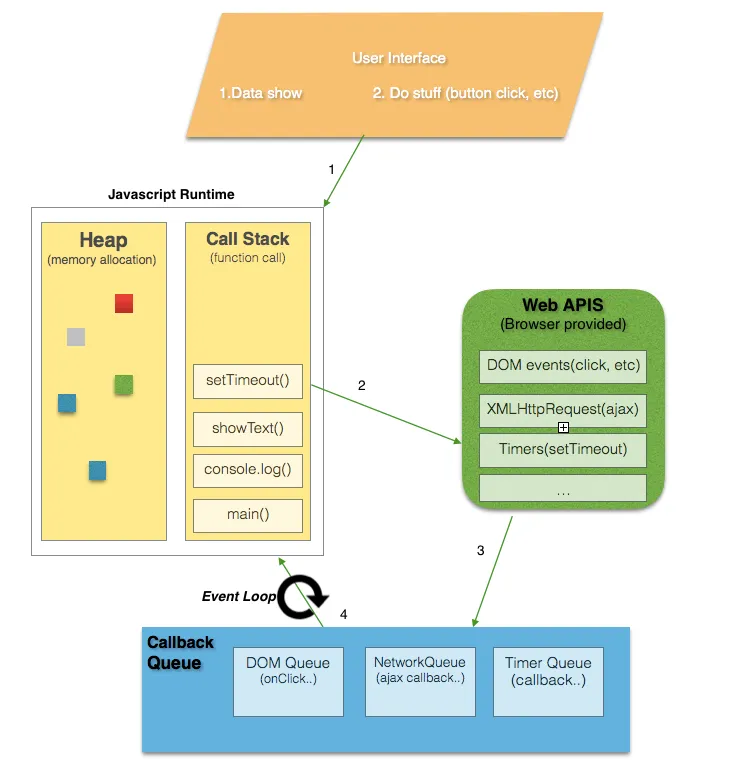

# Extra

## What is an Execution Context?

Simply put, an execution context is an abstract concept of an environment where the Javascript code is evaluated and executed. Whenever any code is run in JavaScript, it’s run inside an execution context.

### Types of Execution Context

There are three types of execution context in JavaScript.

- **Global Execution Context —** This is the default or base execution context. The code that is not inside any function is in the global execution context. It performs two things: it creates a global object which is a window object (in the case of browsers) and sets the value of `this` to equal to the global object. There can only be one global execution context in a program.
- **Functional Execution Context —** Every time a function is invoked, a brand new execution context is created for that function. Each function has its own execution context, but it’s created when the function is invoked or called. There can be any number of function execution contexts. Whenever a new execution context is created, it goes through a series of steps in a defined order which I will discuss later in this article.
- **Eval Function Execution Context —** Code executed inside an `eval` function also gets its own execution context, but as `eval` isn’t usually used by JavaScript developers.

## Event Loop

Event loop basic job is to look both at the stack and the task queue, pushing the first thing on the queue to the stack when it see stack as empty. Each message or callback is processed completely before any other message is processed.

**Tasks** are scheduled so the browser can get from its internals into JavaScript/DOM land and ensures these actions happen sequentially. Between tasks, the browser _may_ render updates. Getting from a mouse click to an event callback requires scheduling a task, as does parsing HTML, and in the above example, `setTimeout`.

**Microtasks** are usually scheduled for things that should happen straight after the currently executing script, such as reacting to a batch of actions, or to make something async without taking the penalty of a whole new task. The microtask queue is processed after callbacks as long as no other JavaScript is mid-execution, and at the end of each task. Any additional microtasks queued during microtasks are added to the end of the queue and also processed. Microtasks include mutation observer callbacks, and as in the above example, promise callbacks.



**Browser or Web APIs** are built into your web browser, and are able to expose data from the browser and surrounding computer environment and do useful complex things with it. They are not part of the JavaScript language itself, rather they are built on top of the core JavaScript language, providing you with extra superpowers to use in your JavaScript code.

When we invoke a function, it gets added to something called the call stack. The call stack is part of the JS engine, this isn’t browser specific. It’s a stack, meaning that it’s first in, last out. When a function returns a value, it gets popped off the stack

## Execution Stack

Execution stack, also known as “calling stack” in other programming languages, is a stack with a LIFO (Last in, First out) structure, which is used to store all the execution context created during the code execution.

When the JavaScript engine first encounters your script, it creates a global execution context and pushes it to the current execution stack. Whenever the engine finds a function invocation, it creates a new execution context for that function and pushes it to the top of the stack.

The engine executes the function whose execution context is at the top of the stack. When this function completes, its execution stack is popped off from the stack, and the control reaches to the context below it in the current stack.

Example:

```js
let a = "Hello World!";

function first() {
  console.log("Inside first function");
  second();
  console.log("Again inside first function");
}

function second() {
  console.log("Inside second function");
}

first();
console.log("Inside Global Execution Context");
```


When the above code loads in the browser, the Javascript engine creates a global execution context and pushes it to the current execution stack. When a call to `first()` is encountered, the Javascript engines creates a new execution context for that function and pushes it to the top of the current execution stack.

When the `second()` function is called from within the `first()` function, the Javascript engine creates a new execution context for that function and pushes it to the top of the current execution stack. When the `second()` function finishes, its execution context is popped off from the current stack, and the control reaches to the execution context below it, that is the `first()` function execution context.

When the `first()` finishes, its execution stack is removed from the stack and control reaches to the global execution context. Once all the code is executed, the JavaScript engine removes the global execution context from the current stack.

## Lifecycle of Execution Context

The execution context is created in two phases: **1) Creation Phase** and **2) Execution Phase.**

### The Creation Phase

The execution context is created during the creation phase. Following things happen during the creation phase:

1. **LexicalEnvironment** component is created.
2. **VariableEnvironment** component is created.

3. *lexical environment* is a structure that holds **identifier-variable mapping**. (here **identifier** refers to the name of variables/functions, and the **variable** is the reference to actual object [including function object and array object] or primitive value).

```js
var a = 20;
var b = 40;

function foo() {
  console.log("bar");
}
```

So the lexical environment for the above snippet looks like this:

```js
lexicalEnvironment = {
    a: 20,
    b: 40,
    foo: <ref. to foo function>
}
```

Each Lexical Environment has three components:

1. Environment Record
2. Reference to the outer environment,
3. This binding.

#### Environment Record

The environment record is the place where the variable and function declarations are stored inside the lexical environment.

There are also two types of *environment record* :

- **Declarative environment record —** As its name suggests stores variable and function declarations. The lexical environment for function code contains a declarative environment record.
- **Object environment record —** The lexical environment for global code contains a objective environment record. Apart from variable and function declarations, the object environment record also stores a global binding object (window object in browsers). So for each of binding object’s property (in case of browsers, it contains properties and methods provided by browser to the window object), a new entry is created in the record.

**Note —** For the **function code**, the *environment record* also contains an `arguments` object that contains the mapping between indexes and arguments passed to the function and the *length(number)* of the arguments passed into the function. For example, an argument object for the below function looks like this:

#### Reference to the Outer Environment

The **reference to the outer environment** means it has access to its outer lexical environment. That means that the JavaScript engine can look for variables inside the outer environment if they are not found in the current lexical environment.

#### This Binding

In this component, the value of `this` is determined or set.

In the global execution context, the value of `this` refers to the global object. (in browsers, `this` refers to the Window Object).

In the function execution context, the value of `this` depends on how the function is called. If it is called by an object reference, then the value of `this` is set to that object, otherwise, the value of `this` is set to the global object or `undefined`(in strict mode). For example:

```js
const person = {
  name: "peter",
  birthYear: 1994,
  calcAge: function () {
    console.log(2018 - this.birthYear);
  },
};

person.calcAge();
// 'this' refers to 'person', because 'calcAge' was called with //'person' object referenceconst calculateAge = person.calcAge;

calculateAge();
// 'this' refers to the global window object, because no object reference was given
```

Abstractly, the lexical environment looks like this in pseudocode:

```output
GlobalExectionContext = {
  LexicalEnvironment: {
    EnvironmentRecord: {
      Type: "Object",
      _// Identifier bindings go here_    }
    outer: <null>,
    this: <global object>
  }
}

FunctionExectionContext = {
  LexicalEnvironment: {
    EnvironmentRecord: {
      Type: "Declarative",
      _// Identifier bindings go here_    }
    outer: <Global or outer function environment reference>,
    this: <depends on how function is called>
  }
}
```

2. Variable Environment:

It’s also a Lexical Environment whose EnvironmentRecord holds bindings created by *VariableStatements* within this execution context.

As written above, the variable environment is also a lexical environment, So it has all the properties and components of a lexical environment as defined above.

In ES6, one difference between **LexicalEnvironment** component and the **VariableEnvironment** component is that the former is used to store function declaration and variable (`let` and `const`) bindings, while the latter is used to store the variable `(var)` bindings only.

### Execution Phase

In this phase assignments to all those variables are done and the code is finally executed.\

Example

Let’s look at some example to understand the above concepts:

```js
let a = 20;
const b = 30;
var c;

function multiply(e, f) {
  var g = 20;
  return e * f * g;
}

c = multiply(20, 30);
```

When the above code is executed, the JavaScript engine creates a global execution context to execute the global code. So the global execution context will look something like this during the creation phase:

```output
GlobalExectionContext = {
    LexicalEnvironment: {
        EnvironmentRecord: {
          Type: "Object",
          // Identifier bindings go here
          a: < uninitialized >,
          b: < uninitialized >,
          multiply: < func >
        }
        outer: <null>,
        ThisBinding: <Global Object>
    },
    VariableEnvironment: {
        EnvironmentRecord: {
          Type: "Object",
          // Identifier bindings go here
          c: undefined,
        }
    outer: <null>,
    ThisBinding: <Global Object>
  }
}
```

During the execution phase, the variable assignments are done. So the global execution context will look something like this during the execution phase.

```output
GlobalExectionContext = {
LexicalEnvironment: {
    EnvironmentRecord: {
      Type: "Object",
      // Identifier bindings go here
      a: 20,
      b: 30,
      multiply: < func >
    }
    outer: <null>,
    ThisBinding: <Global Object>
  },
VariableEnvironment: {
    EnvironmentRecord: {
      Type: "Object",
      // Identifier bindings go here
      c: undefined,
    }
    outer: <null>,
    ThisBinding: <Global Object>
  }
}
```

When a call to function `multiply(20, 30)` is encountered, a new function execution context is created to execute the function code. So the function execution context will look something like this during the creation phase:

```output
FunctionExectionContext = {
LexicalEnvironment: {
    EnvironmentRecord: {
      Type: "Declarative",
      // Identifier bindings go here
      Arguments: {0: 20, 1: 30, length: 2},
    },
    outer: <GlobalLexicalEnvironment>,
    ThisBinding: <Global Object or undefined>,
  },
VariableEnvironment: {
    EnvironmentRecord: {
      Type: "Declarative",
      // Identifier bindings go here
      g: undefined
    },
    outer: <GlobalLexicalEnvironment>,
    ThisBinding: <Global Object or undefined>
  }
}
```

After this, the execution context goes through the execution phase that means assignments to the variables inside the function are done. So the function execution context will look something like this during the execution phase:

```
FunctionExectionContext = {
LexicalEnvironment: {
    EnvironmentRecord: {
      Type: "Declarative",
      // Identifier bindings go here
      Arguments: {0: 20, 1: 30, length: 2},
    },
    outer: <GlobalLexicalEnvironment>,
    ThisBinding: <Global Object or undefined>,
  },
VariableEnvironment: {
    EnvironmentRecord: {
      Type: "Declarative",
      // Identifier bindings go here
      g: 20
    },
    outer: <GlobalLexicalEnvironment>,
    ThisBinding: <Global Object or undefined>
  }
}
```

After the function completes, the returned value is stored inside `c`. So the global lexical environment is updated. After that, the global code completes and the program finishes.

**Note —** As you might have noticed that the `let` and `const` defined variables do not have any value associated with them during the creation phase, but `var` defined variables are set to `undefined` .

This is because, during the creation phase, the code is scanned for variable and function declarations, while the function declaration is stored in its entirety in the environment, the variables are initially set to `undefined` (in case of `var`) or remain uninitialized (in case of `let` and `const`).

This is the reason why you can access `var` defined variables before they are declared (though `undefined`) but get a reference error when accessing `let` and `const` variables before they are declared.

This is, what we call hoisting.

## What causes a stack overflow?

A stack overflow occurs when there is a recursive function (a function that calls itself) without an exit point. The browser (hosting environment) has a maximum stack call that it can accomodate before throwing a stack error.

## Heap

Objects are allocated in a heap i.e mostly unstructured region of memory. All the memory allocation to variables and objects happens here.

## Queue

A JavaScript runtime contains a message queue, which is a list of messages to be processed and the associated callback functions to execute. When the stack has enough capacity, a message is taken out of the queue and processed which consists of calling the associated function (and thus creating an initial stack frame). The message processing ends when the stack becomes empty again. In basic words , these messages are queued in response to external async events(such as a mouse being clicked or receiving the response to an HTTP request), given a callback function has been provided. If, for example a user were to click a button and no callback function was provided — no message would have been enqueued.

## What is microtask

Microtask is used for the javascript code which needs to be executed immediately after the currently executing task/microtask is completed. They are kind of blocking in nature. i.e, The main thread will be blocked until the microtask queue is empty. The main sources of microtasks are Promise.resolve, Promise.reject, MutationObservers, IntersectionObservers etc

Microtask Queue is the new queue where all the tasks initiated by promise objects get processed before the callback queue. The microtasks queue are processed before the next rendering and painting jobs. But if these microtasks are running for a long time then it leads to visual degradation.

The `queueMicrotask` function is used to schedule a microtask, which is a function that will be executed asynchronously in the microtask queue. The purpose of `queueMicrotask` is to ensure that a function is executed after the current task has finished, but before the browser performs any rendering or handles user events.

Example:

```js
console.log("Start"); //1

queueMicrotask(() => {
  console.log("Inside microtask"); // 3
});

console.log("End"); //2
```

By using queueMicrotask, you can ensure that certain tasks or callbacks are executed at the earliest opportunity during the JavaScript event loop, making it useful for performing work that needs to be done asynchronously but with higher priority than regular `setTimeout` or `setInterval` callbacks.

## What is an event table

Event Table is a data structure that stores and keeps track of all the events which will be executed asynchronously like after some time interval or after the resolution of some API requests. i.e Whenever you call a setTimeout function or invoke async operation, it is added to the Event Table. It doesn't not execute functions on it’s own. The main purpose of the event table is to keep track of events and send them to the Event Queue as shown in the below diagram.

### What is debouncing?

Debouncing is a programming pattern that allows delaying execution of some piece of code until a specified time to avoid unnecessary *CPU cycles, API calls and improve performance*. The debounce function make sure that your code is only triggered once per user input. The common usecases are Search box suggestions, text-field auto-saves, and eliminating double-button clicks.

Let's say you want to show suggestions for a search query, but only after a visitor has finished typing it. So here you write a debounce function where the user keeps writing the characters with in 500ms then previous timer cleared out using `clearTimeout` and reschedule API call/DB query for a new time—300 ms in the future.

```js
function debounce(func, timeout = 500) {
  let timer;
  return (...args) => {
    clearTimeout(timer);
    timer = setTimeout(() => {
      func.apply(this, args);
    }, timeout);
  };
}
function fetchResults() {
  console.log("Fetching input suggestions");
}
const processChange = debounce(() => fetchResults());
```

The *debounce()* function can be used on input, button and window events

**Input:**

```html
<input type="text" onkeyup="processChange()" />
```

**Button:**

```html
<button onclick="processChange()">Click me</button>
```

**Windows event:**

```html
window.addEventListener("scroll", processChange);
```

### What is throttling?

Throttling is a technique used to limit the execution of an event handler function, even when this event triggers continuously due to user actions. The common use cases are browser resizing, window scrolling etc.

The below example creates a throttle function to reduce the number of events for each pixel change and trigger scroll event for each 100ms except for the first event.

```js
const throttle = (func, limit) => {
  let inThrottle;
  return (...args) => {
    if (!inThrottle) {
      func.apply(this, args);
      inThrottle = true;
      setTimeout(() => (inThrottle = false), limit);
    }
  };
};
window.addEventListener("scroll", () => {
  throttle(handleScrollAnimation, 100);
});
```

## Changing Context with .call(), .apply() and .bind()

Call and Apply functions are used to change the context while calling a function. This gives you incredible programming capabilities (and some ultimate powers to **Rule The World**). To use the call or apply function, you just need to call it on the function instead of invoking the function using a pair of parenthesis and pass the context as the first argument. The function’s own arguments can be passed after the context.

```js
function hello() {
  // do something...
}

hello(); // the way you usually call it
hello.call(context); // here you can pass the context(value of this) as the first argument
hello.apply(context); // here you can pass the context(value of this) as the first argument
```

The difference between `.call()` and `.apply()` is that in Call, you pass the rest of the arguments as a list separated by a comma while apply allows you to pass the arguments in an array.

```js
function introduce(name, interest) {
  console.log("Hi! I'm " + name + " and I like " + interest + ".");
  console.log("The value of this is " + this + ".");
}

introduce("Hammad", "Coding"); // the way you usually call it
introduce.call(window, "Batman", "to save Gotham"); // pass the arguments one by one after the contextt
introduce.apply("Hi", ["Bruce Wayne", "businesses"]); // pass the arguments in an array after the context

// Output:
// Hi! I'm Hammad and I like Coding.
// The value of this is [object Window].
// Hi! I'm Batman and I like to save Gotham.
// The value of this is [object Window].
// Hi! I'm Bruce Wayne and I like businesses.
// The value of this is Hi.
```

ECMAScript 5 (ES5) introduced the `Function.prototype.bind` method that is used for manipulating context. It returns a new function which is permanently bound to the first argument of `bind` regardless of how the function is being used. It works by using a closure that is responsible for redirecting the call in the appropriate context. See the following polyfill for unsupported browsers:

```js
if (!("bind" in Function.prototype)) {
  Function.prototype.bind = function () {
    var fn = this;
    var context = arguments[0];
    var args = Array.prototype.slice.call(arguments, 1);
    return function () {
      return fn.apply(context, args.concat([].slice.call(arguments)));
    };
  };
}
```

It is commonly used where context is commonly lost; object-orientation and event handling. This is necessary because the `addEventListener` method of a node will always execute the callback in the context of the node the event handler is bound to, which is the way it should be. However if your employing advanced object-oriented techniques and require your callback to be a method of an instance, you will be required to manually adjust the context, this is where `bind` comes in handy:

```js
function Widget() {
  this.element = document.createElement("div");
  this.element.addEventListener("click", this.onClick.bind(this), false);
}

Widget.prototype.onClick = function (e) {
  // do something
};
```

While reviewing the source of the polyfill for `Function.prototype.bind` function, you may have noticed 2 invocations involving the `slice` method of an `Array`:

```js
Array.prototype.slice.call(arguments, 1);
[].slice.call(arguments);
```

What is interesting to note here is that the `arguments` object is not actually an array at all, however it is often described as an array-like object much like a nodelist (anything returned by `element.childNodes`). They contain a length property and indexed values but they are still not arrays, and subsequently don’t support any of the native methods of arrays such as `slice` and `push`. However, because of their similar behavior, the methods of `Array` can be adopted or hijacked, if you will, and executed in the context of an array-like object as is the case above.

This technique of adopting another object’s methods also applies to object-orientation when emulating classical based inheritance in JavaScript:

```js
SubClass.prototype.init = function () {
  // call the superclass init method in the context of the "SubClass" instance
  SuperClass.prototype.init.apply(this, arguments);
};
```

By invoking the method of the superclass (`SuperClass`) in the context of an instance of a subclass (`SubClass`), we can mimic the ability of calling a method’s super to fully exploit this powerful design pattern.
