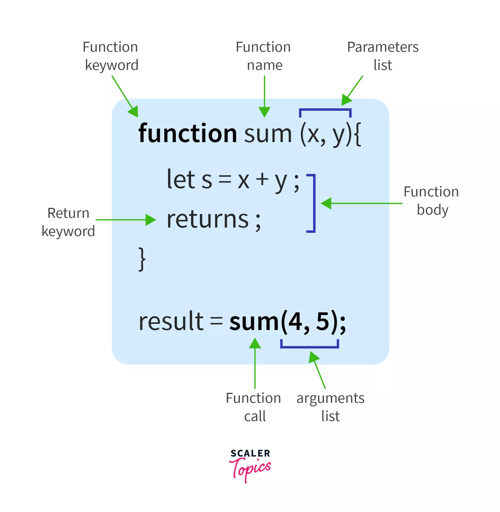

# Function Scope, Block Scope, and Lexical Scope

## Context vs Scope

Every function invocation has both a scope and a context associated with it.

Fundamentally, scope is function-based while context is object-based. In other words, scope pertains to the variable access of a function when it is invoked and is unique to each invocation. Context is always the value of the `this` keyword which is a reference to the object that “owns” the currently executing code.

## What is a Function (aka function declaration)?

- A function is a **_subprogram_** designed to perform a particular task.
- Functions are executed when they are called. This is known as **_invoking_** a function.
- Values can be **_passed_** into functions and used within the function.
- Functions **_always_** `return` a value. In JavaScript, if no `return` value is specified, the function will return `undefined`
- Functions are **_objects_**.
- It is helpful when you want to abstract some logic into a function body and the actual implementation will be done at some later point of time.
  For example:

```js
var num1 = 10;
var num2 = 20;var result = add(num1, num2); // ==> 30 [Executing before declaring]function add(param1, param2) {
    return param1 + param2 ;
}
```



### Function expressions

A function expression is very similar to a function declaration. Their syntax, too, is almost similar. The main difference between a function expression and a function declaration is the **function name**, which **can be omitted**(not mandatory though) in function expressions to create an **anonymous function.** For example, the above add function can now be defined as

```js
const add = function (a, b) {
  //function expression
  return a + b;
};
console.log(add(3, 4));
// expected output: 7
```

### Anonymous functions

**Anonymous functions** are the functions that do not have any name. Here, we use only the function keyword **without** the function name. We can basically call an anonymous function by assigning it to a variable and calling that variable.

**Example:**

```js
let x = function () {
  //anonymous function
  console.log("I'm anonymous function!");
};
x(); //to call the anonymous function.
```

### Arrow Functions

As of ES2015, we _can_ also use **arrow functions** in place of function expressions. Arrow function expressions are somewhat a compact alternative to the normal function expressions; however, they are restricted and cannot be used for all situations.

In its most basic form, a _function expression_ produces a value, while a _function statement_ performs an action.

With the arrow function, it is important to remember that statements need to have curly braces. Once the curly braces are present, you always need to write `return` as well.

**The general syntax**
`(_param1_, _param2_, …, _paramN_) =>  { _statements_ }`

**If there is only one expression you can leave off the {}**
`(_param1_, _param2_, …, _paramN_) =>  _expression_`

**If there is no parameters you use only the () and they become compulsory**
`() => { _statements_ }`

**If there is only one parameter then the parenthesis are optional**
`singleParam **=>** { statements }`

```javascript
const add = (a, b) => {
  return a + b;
};
console.log(add(10, 5)); // expected output: 15
```

#### Return key word

By default arrow functions return the result of the expression hence `return` keyword is optional — this applies only to single line arrow function.

```js
var multiply = (a, b) => a * b; // returns the result
var multiply = (a, b) => {
  a * b;
}; // returns undefined
var multiply = (a, b) => {
  return a * b;
}; //returns the result
```

whenever we introduce the {} in the arrow function its considered as a multi line and we have to explicitly return

#### Object Literal

What will happen when I call the `myFunction` below?

```
var myFunction = () => { age: 23 }
```

if we intended to return the object `{age: 23}` this wont work as the arrow function assumes `{}` marks the beginning and end of the function. So how do we return object literals? Simple, wrap the object around parenthesis

```
var myFunction = () => ({ age: 23 })
```

If you are returning an object literal, it needs to be wrapped in parentheses. This forces the interpreter to evaluate what is inside the parentheses, and the object literal is returned.

#### The `this` keyword

Arrow functions ==have no binding of== ==`this`==. Instead, ==`this`== ==is bound lexically. Simply put, this means that== ==`this`== ==will keep its meaning from its original context.==

```js
function Person() {
  // The Person() constructor defines `this` as an instance of itself.
  this.age = 0; // age in this case is for that person instance  setInterval(function growUp() {
    // In non-strict mode, the growUp() function defines `this`
    // as the global object, which is different from the `this`
    // defined by the Person() constructor.
    this.age++;
  }, 1000);
}
```

Inside the function Person() we have another function called growUp(), the problem is that inside the growUp() function the `this` keyword refers to a different object and not the Person() object meaning the age is not same as age defined above in person.

The arrow function does not create its own `this` hence we can use it to refer to the `this` of person()

```js
function Person() {
  this.age = 0;

  setInterval(() => {
    this.age++; // |this| properly refers to the person object
  }, 1000);
}
```

#### You Can’t Name Arrow Functions

Functions that don’t have a name identifier between the `function` keyword and the parameter list are called _anonymous functions_. Here’s what a regular anonymous function expression looks like:

```javascript
const anonymous = function () {
  return "You can't identify me!";
};
```

**Arrow functions are all anonymous functions**:

```javascript
const anonymousArrowFunc = () => "You can't identify me!";
```

As of ES6, variables and methods can infer the name of an anonymous function from its syntactic position, using its `name` property. This makes it possible to identify the function when inspecting its value or reporting an error.

```javascript
console.log(anonymousArrowFunc.name);
// output: "anonymousArrowFunc"
```

Be aware that this inferred `name` property only exists when the anonymous function is assigned to a variable, as in the examples above. If you use an anonymous function as a callback, you lose this useful feature. This is exemplified in the below example where the anonymous function inside the `.setInterval()` method can’t avail itself of the `name` property:

```javascript
let counter = 5;
let countDown = setInterval(() => {
  console.log(counter);
  counter--;
  if (counter === 0) {
    console.log("I have no name!!");
    clearInterval(countDown);
  }
}, 1000);
```

And that’s not all. This inferred `name` property still doesn’t work as a proper identifier that you can use to refer to the function from inside itself — such as for recursion, unbinding events, etc.

#### No `arguments` Object

Sometimes, you might need to create a function with an indefinite number of parameters. For example, let’s say you want to create a function that lists your favorite Netflix series ordered by preference. However, you don’t know how many series you’re going to include just yet. JavaScript makes the _[arguments](https://developer.mozilla.org/en-US/docs/Web/JavaScript/Reference/Functions/arguments)_ object available. This is an array-like object (not a full-blown array) that stores the values passed to the function when called.

Try to implement this functionality using an arrow function:

```javascript
const listYourFavNetflixSeries = () => {
  // we need to turn the arguments into a real array
  // so we can use .map()
  const favSeries = Array.from(arguments);
  return favSeries.map((series, i) => {
    return `${series} is my #${i + 1} favorite Netflix series`;
  });
  console.log(arguments);
};

console.log(listYourFavNetflixSeries("Bridgerton", "Ozark", "After Life"));
```

When you call the function, you’ll get the following error message: `Uncaught ReferenceError: arguments is not defined`. What this means is that the `arguments` object isn’t available inside arrow functions. In fact, replacing the arrow function with a regular function does the trick:

```javascript
const listYourFavNetflixSeries = function () {
  const favSeries = Array.from(arguments);
  return favSeries.map((series, i) => {
    return `${series} is my #${i + 1} favorite Netflix series`;
  });
  console.log(arguments);
};
console.log(listYourFavNetflixSeries("Bridgerton", "Ozark", "After Life"))[
  // output:
  ("Bridgerton is my #1 favorite Netflix series",
  "Ozark is my #2 favorite Netflix series",
  "After Life is my #3 favorite Netflix series")
];
```

So, if you need the `arguments` object, you can’t use arrow functions.

But what if you _really_ want to use an arrow function to replicate the same functionality? One thing you can do is use [ES6 rest parameters](https://developer.mozilla.org/en-US/docs/Web/JavaScript/Reference/Functions/rest_parameters) (`...`). Here’s how you could rewrite your function:

```javascript
const listYourFavNetflixSeries = (...seriesList) => {
  return seriesList.map((series, i) => {
    return `${series} is my #${i + 1} favorite Netflix series`;
  });
};
```

#### Dont use arrow functions for….

1. Constructors

Arrow functions will throw an error if you call `new` on them

```js
var Foo = () => {};
var foo = new Foo(); // TypeError: Foo is not a constructor
```

2. Prototypes

Arrow functions do not have prototype properties

```js
var Foo = () => {};
console.log(Foo.prototype); // undefined
```

3. Object methods

When you call `cat.jumps`, the number of lives does not decrease. It is because `this` is not bound to anything, and will inherit the value of `this` from its parent scope.

```js
var cat = {
  lives: 9,
  jumps: () => {
    this.lives--;
  },
};
```

4. Callback functions with dynamic context

If you need your context to be dynamic, arrow functions are not the right choice. Take a look at this event handler below:

```js
var button = document.getElementById("press");
button.addEventListener("click", () => {
  this.classList.toggle("on");
});
```

If we click the button, we would get a TypeError. It is because `this` is not bound to the button, but instead bound to its parent scope.

## Function Hoisting

In JavaScript, hoisting is the process in which the declarations of functions, variables, and classes are moved to the top of the scope before execution of the code. Hoisting allows functions to be safely used in code before they are declared.

**Example:**

```javascript
greet("World");

function greet(name) {
  console.log("Hello " + name);
}
```

This is due to hoisting that we can **use the function before declaring it** in our code. Otherwise we would have to write the same code like:

```javascript
function greet(name) {
  console.log("Hello " + name);
}
greet("World");
```

The same does not follows for the arrow functions. Like traditional function expressions, arrow functions are not hoisted, so you cannot call them before you declare them. If we try to access them before declaration, we will get 'undefined'.

Similar to the `var` statement, function declarations are hoisted to the top of other code. Function expressions aren’t hoisted, which allows them to retain a copy of the local variables from the scope where they were defined.

This is because, the arrow functions are treated like variables in JavaScript. They do not have any names(anonymous). So, undefined is allocated to them in the memory allocation phase. Variable and class declarations are also hoisted. Although, they are not in the scope of this tutorial.

## Function Scope

**What is scope?** Scope refers to the visibility of variables, functions, and objects within some part of your code during runtime. In simple words, scope determines the visibility of variables and other resources in particular areas of your code.

A **function's scope** can be either its body, which declares local variables, or the scope that contains the function's name (either a class or namespace). Let us see some important points about a function's scope:

1. **Local Scope:** When a variable is defined inside a function, it is said to be in local scope. A javascript function can only access a variable that is present inside its scope or the global scope. It cannot access a variable that is defined in some other function.
2. **Global Scope** : Variables defined **outside of a function, are said to be in a global scope**. In a script, the outermost scope is the global scope.
3. **Lexical Scope:** This means that in a nested group of functions, **the inner functions will have access to the variables** and the other resources of their parent scope.

```javascript
function demo() {
  let a = 10;
  //It cannot access 'b'
  function anotherDemo() {
    //It can access 'a'
    let b = 20;
    console.log("Hey, I am from anotherDemo! a = ", a);
    console.log("Hey, I am from anotherDemo! b = ", b);
  }
  anotherDemo();
}
demo();
```

## Scope and the Function Stack

### Scope in JavaScript

In the JavaScript language there are two types of scopes:

- Global Scope
- Local Scope

Variables defined **inside a function** are in local scope while variables defined outside of a function are in the global scope. Each function when invoked creates a new scope.

As of ES3, a _catch_ clause in _try / catch_ statements has a _block scope_, which means that it has its own scope. It's important to note that the _try_ clause does not have a _block scope_, only the _catch_ clause does.

### Block Statements

Block statements like `if` and `switch` conditions or `for` and `while` loops, unlike functions, don’t create a new scope. Variables defined inside of a block statement will remain in the scope they were already in.

```js
if (true) {
  // this 'if' conditional block doesn't create a new scope
  var name = "Hammad"; // name is still in the global scope
}

console.log(name); // logs 'Hammad'
```

### Recursion

Recursion simply means when a function can 'refer' or 'call' itself to solve a problem. And a function that calls itself is a recursive function.

There are 3 ways in which a **function can refer to itself**:

1. **The function's name**
2. **arguments.callee** - The arguments.callee property contains the currently executing function.
3. An **in-scope variable** that refers to the function

**Note:** callee is a property of the argument's object. It can be used to refer to the currently executing function inside the function body of that function. It is useful when the name of the function is unknown, for example, an "anonymous function".

```javascript
let fact = function factorial(f) {
  if (f <= 1) return 1;
  else return f * factorial(f - 1);
};
console.log("The factorial of 5 = ", fact(5));
```

Recursion uses a stack: **the function stack**. It is also known as the **call stack**. Whenever a function call takes place, it is pushed into the stack and the execution happens. Likewise, different function calls result in the pushing of the functions in the stack. Once the execution is completed, that particular function is popped off from the stack. However, if the stack limit exceeds what it is assigned to, it results in a **"stack overflow"** error.

### Nested functions and closures

A function within another function is known as the nested function. In the nested functions, the inner functions have access to the variables or other resources of its parent(or the outer function). Let's take an example to understand this --

```javascript
function outermost(a) {
  //It cannot access 'b' or 'c'
  function outer(b) {
    //It can only access 'a'
    function inner(c) {
      //It can access both 'a' and 'b'
      console.log("outermost function: a = ", a);
      console.log("outer function: b = ", b);
      console.log("inner function: c = ", c);
    }
    inner(3);
  }
  outer(2);
}
outermost(1);
```

So, here, we see that the inner function has access to it's outer and outermost function's variables (and all other resources). But vice versa is not applicable where outer() will be able to fetch the local variables of inner(). Simply put, the parent function won't be able to access the variables defined in their subsequent child functions.

### Closures

Closure means that an inner function always has access to the variables and parameters of its outer function. The inner function preserves the value of the outer function, even after the outer function has returned.

Also, accessing variables outside of the immediate lexical scope creates a closure. In other words, a closure is formed when a nested function is defined inside of another function, allowing access to the outer functions variables. Returning the nested function allows you to maintain access to the local variables, arguments, and inner function declarations of its outer function. This encapsulation allows us to hide and preserve the execution context from outside scopes while exposing a public interface and thus is subject to further manipulation. A simple example of this looks like the following:

```js
function foo() {
  var localVariable = "private variable";
  return function () {
    return localVariable;
  };
}

var getLocalVariable = foo();
getLocalVariable(); // "private variable"
```

In other words, a closure is a function having access to it's parent scope, even after the parent function's execution is completed.

It's concept is deeply related to the lexical scope, we just studied.

One of the most popular types of closures is what is widely known as the _module pattern_; it allows you to emulate public, private, and privileged members:

```js
var Module = (function () {
  var privateProperty = "foo";

  function privateMethod(args) {
    // do something
  }

  return {
    publicProperty: "",

    publicMethod: function (args) {
      // do something
    },

    privilegedMethod: function (args) {
      return privateMethod(args);
    },
  };
})();
```

The module acts as if it were a singleton, executed as soon as the compiler interprets it, hence the opening and closing parenthesis at the end of the function. The only available members outside of the execution context of the closure are your public methods and properties located in the return object (`Module.publicMethod` for example). However, all private properties and methods will live throughout the life of the application as the execution context is preserved, meaning variables are subject to further interaction via the public methods.

### The Scope Chain

For each execution context there is a scope chain coupled with it. The scope chain contains the variable object for every execution context in the execution stack. It is used for determining variable access and identifier resolution. For example:

```js
function first() {
  second();
  function second() {
    third();
    function third() {
      fourth();
      function fourth() {
        // do something
      }
    }
  }
}
first();
```

Running the preceding code will result in the nested functions being executed all the way down to the `fourth` function. At this point the scope chain would be, from top to bottom: fourth, third, second, first, global. The `fourth` function would have access to global variables and any variables defined within the `first`, `second`, and `third` functions as well as the functions themselves.

Name conflicts amongst variables between different execution contexts are resolved by climbing up the scope chain, moving locally to globally. This means that local variables with the same name as variables higher up the scope chain take precedence.

To put it simply, each time you attempt to access a variable within a function’s execution context, the look-up process will always begin with its own variable object. If the identifier is not found in the variable object, the search continues into the scope chain. It will climb up the scope chain examining the variable object of every execution context looking for a match to the variable name.

**Scope Chain:** In JavaScript, when a variable is used, the JavaScript engine will seek the variable's value in its current scope. If it is unable to find the variable, it will seek the outer scope and continue this until it finds the variable or reaches global scope. If it cannot find it till the end then either it will declare the variable implicitly or will throw an error.

```javascript
function outer() {
  function inner() {}
  return inner;
}
let demo = outer();
demo();
```

You can use a closure to put one function inside the other, and still execute the inner function at a later point of time, preserving the variables of its parent function.

```javascript
function intro() {
  introduce = "Hello";
  return function () {
    console.log(introduce + " World!");
  };
}

intro()(); // logs "Hello World!"
```

Since closures exist within outer functions, they allow you to execute the outer function at one point in time, and then execute the closure later, with the values from the outer function saved.

Closures have access not only to the variables defined in their outer function but also to the arguments of the outer function.

### Preservation of variables

A **closure** preserves the arguments and variables in all scopes it references(or points to). Closures allow you to save a snapshot of the scope when the function was originally declared. Since they exist within outer functions, they allow you to execute the outer function at any point of time, and then execute the closure later, with the values from the outer function saved.

Let us see a simple example which shows how closures preserve any variable from their parent's scope.

**Example:**

```javascript
function parent(x) {
  function child(y) {
    return x + y;
  }
  return child;
}
fn_child = parent(10); // Think of it like: give me a function that adds 10 to whatever you give it
result = fn_child(5); // returns 15
console.log(result);

//Another way to write the same
result1 = parent(10)(5);
console.log(result1);
```

Notice how x is preserved when 'child' is returned. Since each call provides different arguments, a new closure is created for each call to 'parent'. The memory can be freed only when the returned 'child' is no longer accessible.

## Function Objects.

Functions are function objects. In JavaScript, anything that is not a primitive type ( `undefined`, `null`,`boolean`, `number`, or `string`) is an object. Objects in JavaScript are _extremely_ versatile. Because of this, we can even pass a function as a parameter into another function.

## Scope of var

**Scope** essentially means where these variables are available for use. `var` declarations are globally scoped or function/locally scoped.

The scope is global when a `var` variable is declared outside a function. This means that any variable that is declared with `var` outside a function block is available for use in the whole window.

`var` is function scoped when it is declared within a function. This means that it is available and can be accessed only within that function.

To understand further, look at the example below.

```javascript
var greeter = "hey hi";

function newFunction() {
  var hello = "hello";
}
```

Here, `greeter` is globally scoped because it exists outside a function while `hello` is function scoped. So we cannot access the variable `hello` outside of a function. So if we do this:

```javascript
var tester = "hey hi";

function newFunction() {
  var hello = "hello";
}
console.log(hello); // error: hello is not defined
```

We'll get an error which is as a result of `hello` not being available outside the function.

### Hoisting of var

Hoisting is a JavaScript mechanism where variables and function declarations are moved to the top of their scope before code execution. This means that if we do this:

```javascript
console.log(greeter);
var greeter = "say hello";
```

it is interpreted as this:

```javascript
var greeter;
console.log(greeter); // greeter is undefined
greeter = "say hello";
```

So `var` variables are hoisted to the top of their scope and initialized with a value of `undefined`.

## let is block scoped

A block is a chunk of code bounded by {}. A block lives in curly braces. Anything within curly braces is a block.

So a variable declared in a block with `let`  is only available for use within that block. Let me explain this with an example:

```javascript
let greeting = "say Hi";
let times = 4;

if (times > 3) {
  let hello = "say Hello instead";
  console.log(hello); // "say Hello instead"
}
console.log(hello); // hello is not defined
```

We see that using `hello` outside its block (the curly braces where it was defined) returns an error. This is because `let` variables are block scoped .

### `let` can be updated but not re-declared.

Just like `var`,  a variable declared with `let` can be updated within its scope. Unlike `var`, a `let` variable cannot be re-declared within its scope. So while this will work:

```javascript
let greeting = "say Hi";
greeting = "say Hello instead";
```

this will return an error:

```javascript
let greeting = "say Hi";
let greeting = "say Hello instead"; // error: Identifier 'greeting' has already been declared
```

However, if the same variable is defined in different scopes, there will be no error:

```javascript
let greeting = "say Hi";
if (true) {
  let greeting = "say Hello instead";
  console.log(greeting); // "say Hello instead"
}
console.log(greeting); // "say Hi"
```

Why is there no error? This is because both instances are treated as different variables since they have different scopes.

This fact makes `let` a better choice than `var`. When using `let`, you don't have to bother if you have used a name for a variable before as a variable exists only within its scope.

Also, since a variable cannot be declared more than once within a scope, then the problem discussed earlier that occurs with `var` does not happen.

### Hoisting of let

Just like  `var`, `let` declarations are hoisted to the top. Unlike `var` which is initialized as `undefined`, the `let` keyword is not initialized. So if you try to use a `let` variable before declaration, you'll get a `Reference Error`.

## Const

Variables declared with the `const` maintain constant values. `const` declarations share some similarities with `let` declarations.

### const declarations are block scoped

Like `let` declarations, `const` declarations can only be accessed within the block they were declared.

### const cannot be updated or re-declared

This means that the value of a variable declared with `const` remains the same within its scope. It cannot be updated or re-declared. So if we declare a variable with `const`, we can neither do this:

```javascript
const greeting = "say Hi";
greeting = "say Hello instead"; // error: Assignment to constant variable.
```

nor this:

```javascript
const greeting = "say Hi";
const greeting = "say Hello instead"; // error: Identifier 'greeting' has already been declared
```

Every `const` declaration, therefore, must be initialized at the time of declaration.

This behavior is somehow different when it comes to objects declared with `const`. While a `const` object cannot be updated, the properties of this objects can be updated. Therefore, if we declare a `const` object as this:

```javascript
const greeting = {
  message: "say Hi",
  times: 4,
};
```

while we cannot do this:

```javascript
greeting = {
  words: "Hello",
  number: "five",
}; // error:  Assignment to constant variable.
```

we can do this:

```javascript
greeting.message = "say Hello instead";
```

This will update the value of `greeting.message` without returning errors.

Contrary to the `var` keyword, the `let` and `const` keywords support the declaration of local scope inside block statements.

```js
if (true) {
  // this 'if' conditional block doesn't create a scope

  // name is in the global scope because of the 'var' keyword
  var name = "Hammad";
  // likes is in the local scope because of the 'let' keyword
  let likes = "Coding";
  // skills is in the local scope because of the 'const' keyword
  const skills = "JavaScript and PHP";
}

console.log(name); // logs 'Hammad'
console.log(likes); // Uncaught ReferenceError: likes is not defined
console.log(skills); // Uncaught ReferenceError: skills is not defined
```

### Hoisting of const

Just like `let`, `const` declarations are hoisted to the top but are not initialized.
