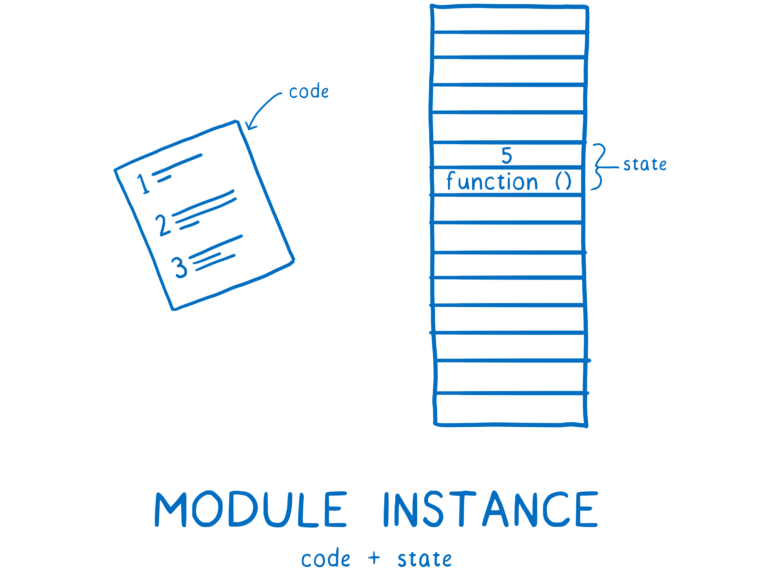

# IIFE modules and namespaces

## IIFE

An IIFE (Immediately Invoked Function Expression) is a JavaScript function that runs as soon as it is defined.

```js
(function () {
  // …
})();

(() => {
  // …
})();

(async () => {
  // …
})();
```

Another way to invoke IIFE

```js
!(function myName() {
  console.log("Parwinder"); // Parwinder
})();
```

Instead of creating a IIFE using `(function => {})()` we have done it using `!function => {}()`. No need to wrap our function block in `()`.

### Avoid polluting the global namespace

Because our application could include many functions and global variables from different source files, it's important to limit the number of global variables. If we have some initiation code that we don't need to use again, we could use the IIFE pattern. As we will not reuse the code again, using IIFE in this case is better than using a function declaration or a function expression.

```js
(() => {
  // some initiation code
  let firstVariable;
  let secondVariable;
})();

// firstVariable and secondVariable will be discarded after the function is executed.
```

### Execute an async function

An `async` IIFE allows you to use `await` and `for-await` even in older browsers and JavaScript runtimes that have no top-level `await`:

```js
const getFileStream = async (url) => {
  // implementation
};

(async () => {
  const stream = await getFileStream("https://domain.name/path/file.ext");
  for await (const chunk of stream) {
    console.log({ chunk });
  }
})();
```

### The module pattern

We would also use IIFE to create private and public variables and methods.

```js
const makeWithdraw = (balance) =>
  ((copyBalance) => {
    let balance = copyBalance; // This variable is private
    const doBadThings = () => {
      console.log("I will do bad things with your money");
    };
    doBadThings();
    return {
      withdraw(amount) {
        if (balance >= amount) {
          balance -= amount;
          return balance;
        }
        return "Insufficient money";
      },
    };
  })(balance);

const firstAccount = makeWithdraw(100); // "I will do bad things with your money"
console.log(firstAccount.balance); // undefined
console.log(firstAccount.withdraw(20)); // 80
console.log(firstAccount.withdraw(30)); // 50
console.log(firstAccount.doBadThings); // undefined; this method is private
const secondAccount = makeWithdraw(20); // "I will do bad things with your money"
console.log(secondAccount.withdraw(30)); // "Insufficient money"
console.log(secondAccount.withdraw(20)); // 0
```

#### IIFE with return value

```js
var result = (function () {
  return "From IIFE";
})();

alert(result); // alerts "From IIFE"
```

#### IIFE with parameter

```js
(function IIFE(msg, times) {
  for (var i = 1; i <= times; i++) {
    console.log(msg);
  }
})("Hello!", 5);
```

### For loop with var before ES6

We could see the following use of IIFE in some old code, before the introduction of the statements **let** and **const** in **ES6** and the block scope. With the statement **var**, we have only function scopes and the global scope. Suppose we want to create 2 buttons with the texts Button 0 and Button 1 and when we click them, we would like them to alert 0 and 1. The following code doesn't work:

```js
for (var i = 0; i < 2; i++) {
  const button = document.createElement("button");
  button.innerText = `Button ${i}`;
  button.onclick = function () {
    console.log(i);
  };
  document.body.appendChild(button);
}
console.log(i); // 2
```

When clicked, both Button 0 and Button 1 alert 2 because `i` is global, with the last value 2. To fix this problem before ES6, we could use the IIFE pattern:

```js
for (var i = 0; i < 2; i++) {
  const button = document.createElement("button");
  button.innerText = `Button ${i}`;
  button.onclick = (function (copyOfI) {
    return function () {
      console.log(copyOfI);
    };
  })(i);
  document.body.appendChild(button);
}
console.log(i); // 2
```

When clicked, Buttons 0 and 1 alert 0 and 1. The variable `i` is globally defined. Using the statement **let**, we could simply do:

```js
for (let i = 0; i < 2; i++) {
  const button = document.createElement("button");
  button.innerText = `Button ${i}`;
  button.onclick = function () {
    console.log(i);
  };
  document.body.appendChild(button);
}
console.log(i); // Uncaught ReferenceError: i is not defined.
```

When clicked, these buttons alert 0 and 1.

## Namespace

Namespace is a context for identifiers, a logical grouping of names used in a program. Within the same context and same scope, an identifier must uniquely identify an entity.

In an operating system, a directory is a namespace. Each file or subdirectory within a directory has a unique name; the same name can be used multiple times across subdirectories.

In HTML, CSS, and XML-based languages, a namespace is the explicitly declared or implied dialect to which an element (or attribute) belongs.

## Modularity

The term Modularity refers to the degree to which a system's components may be separated and recombined, it is also division of a software package into logical units. The advantage of a modular system is that one can reason the parts independently

JavaScript’s never had a standard way to import and export functionality from a source file to another. Well, it has: global variables. For example:

```html
<script src="https://code.jquery.com/jquery-1.12.0.min.js"></script>

<script>
  // `$` variable available here
</script>
```

One solution to problems of multiple `<script>` tags is to concatenate all JavaScript files into a single, large file. This solves some performance and dependency management issues, but it could incur a manual build and testing step.

This is far from ideal for a few reasons:

- You may have **conflicts** with other libraries using the same variable names. That’s why many libraries have a [noConflict()](https://api.jquery.com/jquery.noconflict/) method.
- You cannot correctly make **cyclic references**. If an A module depends on a B module and vice versa, in which order do we put the `<script>` tags?
- Even if there are not cyclic references the order in which you put the `<script>` tags is important and **hard to maintain**.

IIFEs were used as a building block in the revealing module pattern. Its advantage is that it clearly separates between what is public and what is private:

```js
var myModule = (function () {
  // private variable, accessible only inside the IIFE
  var counter = 0;

  function increment() {
    counter++;
  }

  // publicly exposed logic
  return {
    increment: increment,
  };
})();
```

Instead of using this pattern, with ES6 we can use modules. Modules declare their own scope and variables created inside the module will not polute the global object:

```js
// myModule.js

let counter = 0;

export function increment() {
  counter++;
}

// logic.js

import { increment } from "myModule.js";

increment();
```

### Module formats

A module format is the syntax we can use to define a module.

Before EcmaScript 6 or ES2015, JavaScript did not have an official syntax to define modules. Therefore, smart developers came up with various formats to define modules in JavaScript.

Some of the most widely adapted and well known formats are:

- Asynchronous Module Definition (AMD)
- CommonJS
- Universal Module Definition (UMD)
- System.register
- ES6 module format

#### Asynchronous Module Definition (AMD)

The [AMD](https://github.com/amdjs/amdjs-api/wiki/AMD?ref=jvandemo.com) format is used in browsers and uses a `define` function to define modules:

```javascript
//Calling define with a dependency array and a factory function
define(["dep1", "dep2"], function (dep1, dep2) {
  //Define the module value by returning a value.
  return function () {};
});
```

#### CommonJS format

The [CommonJS](http://www.commonjs.org/?ref=jvandemo.com) format is used in Node.js and uses `require` and `module.exports` to define dependencies and modules:

```javascript
var dep1 = require("./dep1");
var dep2 = require("./dep2");

module.exports = function () {
  // ...
};
```

#### Universal Module Definition (UMD)

The [UMD](https://github.com/umdjs/umd?ref=jvandemo.com) format can be used both in the browser and in Node.js.

```javascript
(function (root, factory) {
  if (typeof define === "function" && define.amd) {
    // AMD. Register as an anonymous module.
    define(["b"], factory);
  } else if (typeof module === "object" && module.exports) {
    // Node. Does not work with strict CommonJS, but
    // only CommonJS-like environments that support module.exports,
    // like Node.
    module.exports = factory(require("b"));
  } else {
    // Browser globals (root is window)
    root.returnExports = factory(root.b);
  }
})(this, function (b) {
  //use b in some fashion.

  // Just return a value to define the module export.
  // This example returns an object, but the module
  // can return a function as the exported value.
  return {};
});
```

### System.register

The [System.register format](https://github.com/ModuleLoader/es-module-loader/blob/master/docs/system-register.md?ref=jvandemo.com) was designed to support the ES6 module syntax in ES5:

```javascript
import { p as q } from "./dep";

var s = "local";

export function func() {
  return q;
}

export class C {}
```

#### ES6 module format

As of ES6, JavaScript also supports a native module format.

It uses an `export` token to export a module's public API:

```javascript
// lib.js

// Export the function
export function sayHello() {
  console.log("Hello");
}

// Do not export the function
function somePrivateFunction() {
  // ...
}
```

and an `import` token to import parts that a module exports:

```javascript
import { sayHello } from "./lib";

sayHello();
// => Hello
```

==When importing from modules, path must start with `./`, `../`, `/` and you should always use full URL (including `.js` extension)==

We can even give imports an alias using `as`:

```javascript
import { sayHello as say } from "./lib";

say();
// => Hello
```

or load an entire module at once:

```javascript
import * as lib from "./lib";

lib.sayHello();
// => Hello
```

The format also supports default exports:

```javascript
// lib.js

// Export default function
export default function sayHello() {
  console.log("Hello");
}

// Export non-default function
export function sayGoodbye() {
  console.log("Goodbye");
}
```

which you can import like this:

```javascript
import sayHello, { sayGoodbye } from "./lib";

sayHello();
// => Hello

sayGoodbye();
// => Goodbye
```

You can export not only functions, but anything you like:

```javascript
// lib.js

// Export default function
export default function sayHello() {
  console.log("Hello");
}

// Export non-default function
export function sayGoodbye() {
  console.log("Goodbye");
}

// Export simple value
export const apiUrl = "...";

// Export object
export const settings = {
  debug: true,
};
```

Unfortunately, the native module format is not yet supported by all browsers.

We can already use the ES6 module format today, but we need a transpiler like Babel to transpile our code to an ES5 module format such as AMD or CommonJS before we can actually run our code in the browser.

### Using ES6 Modules

```html
<!DOCTYPE html>
<html>
  <head>
    <title>ES6 module example</title>
    <script src="app/utils.js" type="module"></script>
    <script src="app/fallback.js" nomodule></script>
  </head>

  <body></body>
</html>
```

You can add `module` to the type attribute of a script element `<script type="module">`. The browser will then treat either inline or external `script` elements as an ES6 module.

Browsers that support ES6 modules will ignore scripts with a `nomodule` attribute. This is useful for providing a fallback script to legacy browsers.

It's worth noting that ES6 modules now have strict mode enabled by default.

#### Single Export

In **utils.js** file.

```js
function hello() {
  return "Hello";
}
function world() {
  return "World";
}
// Basic export
export { hello, world };
```

In **main.js** file.

```js
import { hello, world } from "/app/utils.js";
hello();
world();
```

Include a name space

```js
import * as util from "/app/utils.js";
util.hello();
util.world();
```

###### Named Export

```js
export function hello() {
  return "Hello";
}
export function world() {
  return "World";
}
```

#### Default Export

In **utils.js** file.

```js
var utils = {
  hello: function () {
    return "Hello";
  },
  world: function () {
    return "World";
  },
};
export default utils;
```

In **main.js** file.

```js
import utils from "/app/utils.js";
utils.hello();
utils.world();
```

### Using ES6 Modules in Browsers

Scripts which use modules must be loaded by setting a `type="module"` attribute in the `<script>` tag. For example:

```html
<script type="module" src="./main.js"></script>
```

or inline:

```html
<script type="module">
  import { something } from "./somewhere.js";
  // ...
</script>
```

Modules are parsed once, regardless of how many times they’re referenced in the page or other modules.

- Modules must be served with the MIME type `application/javascript`. Most servers will do this automatically, but be wary of dynamically generated scripts or `.mjs` files
- Regular `<script>` tags can fetch scripts on other domains but modules are fetched using cross-origin resource sharing (CORS). Modules on different domains must therefore set an appropriate HTTP header, such as `Access-Control-Allow-Origin: *`. Finally, modules won’t send cookies or other header credentials unless a `crossorigin="use-credentials"` attribute is added to the `<script>` tag and the response contains the header `Access-Control-Allow-Credentials: true`.

#### Module Execution is Deferred

The `<script defer>` attribute delays script execution until the document has loaded and parsed. Modules — _including inline scripts_ — defer by default. Example:

```html
<!-- runs SECOND -->
<script type="module">
  // do something...
</script>

<!-- runs THIRD -->
<script defer src="c.js"></script>

<!-- runs FIRST -->
<script src="a.js"></script>

<!-- runs FOURTH -->
<script type="module" src="b.js"></script>
```

#### Module Fallbacks

Browsers without module support won’t run `type="module"` scripts. A fallback script can be provided with a `nomodule` attribute which module-compatible browsers ignore. For example:

```js
<script type="module" src="runs-if-module-supported.js"></script>
<script nomodule src="runs-if-module-not-supported.js"></script>
```

### Notes

Be aware that there are a few differences between regular JS and JavaScript running in an ES6 module.

- **CORS** — Module scripts are requested with CORS and should make use of valid CORS headers e.g. `Access-Control-Allow-Origin: *.`
- **Use root relative paths to import modules** — `import {foo} from '/utils/bar.js';` works. `import {foo} from 'utils/bar.js';` doesn't work.
- **Strict mode by default** — ES6 modules run in strict mode (no `'use strict'` is required).
- **The top level value of `this` is `undefined`** — not the window object.
- **variables are local to the module** — unless specifically exported.
- **Deferred by default** — modules are non blocking and execute as `defer` scripts.

## Module loaders

A module loader interprets and loads a module written in a certain module format.

A module loader runs at runtime:

- you load the module loader in the browser
- you tell the module loader which main app file to load
- the module loader downloads and interprets the main app file
- the module loader downloads files as needed

If you open the network tab in your browser's developer console, you will see that many files are loaded on demand by the module loader.

A few examples of popular module loaders are:

- _[RequireJS](http://requirejs.org/?ref=jvandemo.com)_: loader for modules in AMD format
- _[SystemJS](https://github.com/systemjs/systemjs?ref=jvandemo.com)_: loader for modules in AMD, CommonJS, UMD or System.register format

### Module bundlers

A module bundler replaces a module loader.

But, in contrast to a module loader, a module bundler runs at build time:

- you run the module bundler to generate a bundle file at build time (e.g. bundle.js)
- you load the bundle in the browser

If you open the network tab in your browser's developer console, you will see that only 1 file is loaded. No module loader is needed in the browser. All code is included in the bundle.

Examples of popular module bundlers are:

- _[Browserify](http://browserify.org/?ref=jvandemo.com)_: bundler for CommonJS modules
- _[Webpack](https://webpack.github.io/?ref=jvandemo.com)_: bundler for AMD, CommonJS, ES6 modules

## How ES6 modules work and why Node.js hasn’t implemented it yet

JavaScript is evolving a lot, specially with ES6, and this problem had to be solved. That’s why ES modules were born. They look a lot like CJS syntactically.

Let’s compare them. This is how we import something in both systems:

```js
const { helloWorld } = require("./b.js"); // CommonJS
import { helloWorld } from "./b.js"; // ES modules
```

This is how we export functionality:

```js
// CommonJS
exports.helloWorld = () => {
  console.log("hello world");
};

// ES modules
export function helloWorld() {
  console.log("hello world");
}
```

Very similar, right?

It’s been a long time since Node.js has implemented 99% of ECMAScript 2015 (aka ES6), but **we will need to wait until the end of 2017 for support for ES6 modules**. And it will be only available behind a runtime flag! Why is it taking so long to implement ES6 modules in Node.js if they are so similar to CJS?

Well, the devil is in the details. The syntax is pretty similar between both systems, but **the semantics are pretty different**. There are also subtle edge cases that require a special effort to be 100% compatible with the specification.

Even though ES modules are not implemented in Node.js, they are implemented already in some browsers. For example we can test them in Safari 10.1. Let’s see some examples and we will see why the semantics are so important. I’ve created these three files:

```js
// index.html
<script type="module" src="./a.js"></script>;

// a.js
console.log("executing a.js");
import { helloWorld } from "./b.js";
helloWorld(); // b.js
console.log("executing b.js");
export function helloWorld() {
  console.log("hello world");
}
```

What do we see in the console when this is run? This is the result:

```
executing b.js
executing a.js
hello world
```

However, the same code using CJS and running it in Node.js:

```js
// a.js
console.log("executing a.js");
import { helloWorld } from "./b.js";
helloWorld(); // b.js
console.log("executing b.js");
export function helloWorld() {
  console.log("hello world");
}
```

Will give us:

```
executing a.js
executing b.js
hello world
```

So… it has executed the code in different order! This is because ES6 modules are first parsed (without being executed), then the runtime looks for imports, loads them and finally it executes the code. **This is called async loading**.

On the other hand, Node.js loads the dependencies (requires) on demand **while executing the code**. Which is very different. In many case this may not make any difference, but in other cases it is a completely different behavior.

Node.js and web browsers need to implement this new way of loading code keeping the previous one. How do they know when to use a system and when the other one? Browsers know this because you specify it at the `<script>` level, as we’ve seen in the example with the `type` property:

```html
<script type="module" src="./a.js"></script>
```

**However, how does Node.js know?** There’s been a lot of discussion about this and there’s been a lot of proposals _(checking first the syntax and then deciding whether or not it should be treated as a module, defining it in the package.json file,…)_. Finally the approved proposal has been: the Michael Jackson Solution. Basically if you want a file to be loaded as an ES6 module you will use a different extension: .mjs instead of .js.

## How do modules help?

Modules give you a better way to organize these variables and functions. With modules, you group the variables and functions that make sense to go together.

This puts these functions and variables into a module scope. The module scope can be used to share variables between the functions in the module.

But unlike function scopes, module scopes have a way of making their variables available to other modules as well. They can say explicitly which of the variables, classes, or functions in the module should be available.

When something is made available to other modules, it’s called an export. Once you have an export, other modules can explicitly say that they depend on that variable, class or function.

Because this is an explicit relationship, you can tell which modules will break if you remove another one.

Once you have the ability to export and import variables between modules, it makes it a lot easier to break up your code into small chunks that can work independently of each other. Then you can combine and recombine these chunks, kind of like Lego blocks, to create all different kinds of applications from the same set of modules.

Since modules are so useful, there have been multiple attempts to add module functionality to JavaScript. Today there are two module systems that are actively being used. CommonJS (CJS) is what Node.js has used historically. ESM (EcmaScript modules) is a newer system which has been added to the JavaScript specification. Browsers already support ES modules, and Node is adding support.

### How ES modules work

When you’re developing with modules, you build up a graph of dependencies. The connections between different dependencies come from any import statements that you use.

These import statements are how the browser or Node knows exactly what code it needs to load. You give it a file to use as an entry point to the graph. From there it just follows any of the import statements to find the rest of the code.

But files themselves aren’t something that the browser can use. It needs to parse all of these files to turn them into data structures called Module Records. That way, it actually knows what’s going on in the file.


After that, the module record needs to be turned into a module instance. An instance combines two things: the code and state.

The code is basically a set of instructions. It’s like a recipe for how to make something. But by itself, you can’t use the code to do anything. You need raw materials to use with those instructions.

What is state? State gives you those raw materials. State is the actual values of the variables at any point in time. Of course, these variables are just nicknames for the boxes in memory that hold the values.

So the module instance combines the code (the list of instructions) with the state (all the variables’ values).



What we need is a module instance for each module. The process of module loading is going from this entry point file to having a full graph of module instances.

For ES modules, this happens in three steps.

1. Construction — find, download, and parse all of the files into module records.
2. Instantiation —find boxes in memory to place all of the exported values in (but don’t fill them in with values yet). Then make both exports and imports point to those boxes in memory. This is called linking.
3. Evaluation —run the code to fill in the boxes with the variables’ actual values.

People talk about ES modules being asynchronous. You can think about it as asynchronous because the work is split into these three different phases — loading, instantiating, and evaluating — and those phases can be done separately.

This means the spec does introduce a kind of asynchrony that wasn’t there in CommonJS. I’ll explain more later, but in CJS a module and the dependencies below it are loaded, instantiated, and evaluated all at once, without any breaks in between.

However, the steps themselves are not necessarily asynchronous. They can be done in a synchronous way. It depends on what’s doing the loading. That’s because not everything is controlled by the ES module spec. There are actually two halves of the work, which are covered by different specs.

The [ES module spec](https://tc39.github.io/ecma262/#sec-modules) says how you should parse files into module records, and how you should instantiate and evaluate that module. However, it doesn’t say how to get the files in the first place.

It’s the loader that fetches the files. And the loader is specified in a different specification. For browsers, that spec is the [HTML spec](https://html.spec.whatwg.org/#fetch-a-module-script-tree). But you can have different loaders based on what platform you are using.

The loader also controls exactly how the modules are loaded. It calls the ES module methods — `ParseModule`, `Module.Instantiate`, and `Module.Evaluate`. It’s kind of like a puppeteer controlling the JS engine’s strings.

Now let’s walk through each step in more detail.

#### Construction

Three things happen for each module during the Construction phase.

1. Figure out where to download the file containing the module from (aka module resolution)
2. Fetch the file (by downloading it from a URL or loading it from the file system)
3. Parse the file into a module record

#### Finding the file and fetching it

The loader will take care of finding the file and downloading it. First it needs to find the entry point file. In HTML, you tell the loader where to find it by using a script tag.


But how does it find the next bunch of modules — the modules that `main.js` directly depends on?

This is where import statements come in. One part of the import statement is called the module specifier. It tells the loader where it can find each next module.

One thing to note about module specifiers: they sometimes need to be handled differently between browsers and Node. Each host has its own way of interpreting the module specifier strings. To do this, it uses something called a module resolution algorithm, which differs between platforms.

Browsers only accept URLs as module specifiers. They will load the module file from that URL. But that doesn’t happen for the whole graph at the same time. You don’t know what dependencies the module needs you to fetch until you’ve parsed the file… and you can’t parse the file until you fetched it.

This means that we have to go through the tree layer-by-layer, parsing one file, then figuring out its dependencies, and then finding and loading those dependencies.


If the main thread were to wait for each of these files to download, a lot of other tasks would pile up in its queue.

That’s because when you’re working in a browser, the downloading part takes a long time.


Blocking the main thread like this would make an app that uses modules too slow to use. This is one of the reasons that the ES module spec splits the algorithm into multiple phases. Splitting out construction into its own phase allows browsers to fetch files and build up their understanding of the module graph before getting down to the synchronous work of instantiating.

This approach—having the algorithm split up into phases—is one of the key differences between ES modules and CommonJS modules.

CommonJS can do things differently because loading files from the filesystem takes much less time than downloading across the Internet. This means Node can block the main thread while it loads the file. And since the file is already loaded, it makes sense to just instantiate and evaluate (which aren’t separate phases in CommonJS). This also means that you’re walking down the whole tree, loading, instantiating, and evaluating any dependencies before you return the module instance.


The CommonJS approach has a few implications, and I will explain more about those later. But one thing that it means is that in Node with CommonJS modules, you can use variables in your module specifier. You are executing all of the code in this module (up to the `require` statement) before you look for the next module. That means the variable will have a value when you go to do module resolution.

But with ES modules, you’re building up this whole module graph beforehand… before you do any evaluation. This means you can’t have variables in your module specifiers, because those variables don’t have values yet.


But sometimes it is really useful to use variables for module paths. For example, you might want to switch which module you load depending on what the code is doing or what environment it is running in.

To make this possible for ES modules, there’s a proposal called [dynamic import](https://github.com/tc39/proposal-dynamic-import). With it, you can use an import statement like `` import(`${path}/foo.js`) ``.

The way this works is that any file loaded using `import()` is handled as the entry point to a separate graph. The dynamically imported module starts a new graph, which is processed separately.

One thing to note, though — any module that is in both of these graphs is going to share a module instance. This is because the loader caches module instances. For each module in a particular global scope, there will only be one module instance.

This means less work for the engine. For example, it means that the module file will only be fetched once even if multiple modules depend on it. (That’s one reason to cache modules. We’ll see another in the evaluation section.)

The loader manages this cache using something called a [module map](https://html.spec.whatwg.org/multipage/webappapis.html#module-map). Each global keeps track of its modules in a separate module map.

When the loader goes to fetch a URL, it puts that URL in the module map and makes a note that it’s currently fetching the file. Then it will send out the request and move on to start fetching the next file.

What happens if another module depends on the same file? The loader will look up each URL in the module map. If it sees `fetching` in there, it will just move on to the next URL.

But the module map doesn’t just keep track of what files are being fetched. The module map also serves as a cache for the modules, as we’ll see next.

#### Parsing

Now that we have fetched this file, we need to parse it into a module record. This helps the browser understand what the different parts of the module are.

Once the module record is created, it is placed in the module map. This means that whenever it’s requested from here on out, the loader can pull it from that map.


There is one detail in parsing that may seem trivial, but that actually has pretty big implications. All modules are parsed as if they had `"use strict"` at the top. There are also other slight differences. For example, the keyword `await` is reserved in a module’s top-level code, and the value of `this` is `undefined`.

This different way of parsing is called a “parse goal”. If you parse the same file but use different goals, you’ll end up with different results. So you want to know before you start parsing what kind of file you’re parsing — whether it’s a module or not.

In browsers this is pretty easy. You just put `type="module"` on the script tag. This tells the browser that this file should be parsed as a module. And since only modules can be imported, the browser knows that any imports are modules, too.

But in Node, you don’t use HTML tags, so you don’t have the option of using a `type` attribute. One way the community has tried to solve this is by using an `.mjs` extension. Using that extension tells Node, “this file is a module”. You’ll see people talking about this as the signal for the parse goal. The discussion is currently ongoing, so it’s unclear what signal the Node community will decide to use in the end.

Either way, the loader will determine whether to parse the file as a module or not. If it is a module and there are imports, it will then start the process over again until all of the files are fetched and parsed.

And we’re done! At the end of the loading process, you’ve gone from having just an entry point file to having a bunch of module records.

#### Instantiation

Like I mentioned before, an instance combines code with state. That state lives in memory, so the instantiation step is all about wiring things up to memory.

First, the JS engine creates a module environment record. This manages the variables for the module record. Then it finds boxes in memory for all of the exports. The module environment record will keep track of which box in memory is associated with each export.

These boxes in memory won’t get their values yet. It’s only after evaluation that their actual values will be filled in. There is one caveat to this rule: any exported function declarations are initialized during this phase. This makes things easier for evaluation.

To instantiate the module graph, the engine will do what’s called a depth first post-order traversal. This means it will go down to the bottom of the graph — to the dependencies at the bottom that don’t depend on anything else — and set up their exports.


The engine finishes wiring up all of the exports below a module — all of the exports that the module depends on. Then it comes back up a level to wire up the imports from that module.

Note that both the export and the import point to the same location in memory. Wiring up the exports first guarantees that all of the imports can be connected to matching exports.


This is different from CommonJS modules. In CommonJS, the entire export object is copied on export. This means that any values (like numbers) that are exported are copies.

This means that if the exporting module changes that value later, the importing module doesn’t see that change.


In contrast, ES modules use something called live bindings. Both modules point to the same location in memory. This means that when the exporting module changes a value, that change will show up in the importing module.

Modules that export values can change those values at any time, but importing modules cannot change the values of their imports. That being said, if a module imports an object, it can change property values that are on that object.


The reason to have live bindings like this is then you can wire up all of the modules without running any code. This helps with evaluation when you have cyclic dependencies, as I’ll explain below.

So at the end of this step, we have all of the instances and the memory locations for the exported/imported variables wired up.

Now we can start evaluating the code and filling in those memory locations with their values.

#### Evaluation

The final step is filling in these boxes in memory. The JS engine does this by executing the top-level code — the code that is outside of functions.

Besides just filling in these boxes in memory, evaluating the code can also trigger side effects. For example, a module might make a call to a server.

Because of the potential for side effects, you only want to evaluate the module once. As opposed to the linking that happens in instantiation, which can be done multiple times with exactly the same result, evaluation can have different results depending on how many times you do it.

This is one reason to have the module map. The module map caches the module by canonical URL so that there is only one module record for each module. That ensures each module is only executed once. Just as with instantiation, this is done as a depth first post-order traversal.

What about those cycles that we talked about before?

In a cyclic dependency, you end up having a loop in the graph. Usually, this is a long loop. But to explain the problem, I’m going to use a contrived example with a short loop.


Let’s look at how this would work with CommonJS modules. First, the main module would execute up to the require statement. Then it would go to load the counter module.


The counter module would then try to access `message` from the export object. But since this hasn’t been evaluated in the main module yet, this will return undefined. The JS engine will allocate space in memory for the local variable and set the value to undefined.


Evaluation continues down to the end of the counter module’s top level code. We want to see whether we’ll get the correct value for message eventually (after main.js is evaluated), so we set up a timeout. Then evaluation resumes on `main.js`.


The message variable will be initialized and added to memory. But since there’s no connection between the two, it will stay undefined in the required module.


If the export were handled using live bindings, the counter module would see the correct value eventually. By the time the timeout runs, `main.js`’s evaluation would have completed and filled in the value.

Supporting these cycles is a big rationale behind the design of ES modules. It’s this three-phase design that makes them possible.

## The import() expression

The `import(module)` expression loads the module and returns a promise that resolves into a module object that contains all its exports. It can be called from any place in the code.

We can use it dynamically in any place of the code, for instance:

```javascript
let modulePath = prompt("Which module to load?");

import(modulePath)
  .then(obj => <module object>)
  .catch(err => <loading error, e.g. if no such module>)
```

Or, we could use `let module = await import(modulePath)` if inside an async function.

For instance, if we have the following module `say.js`:

```javascript
// 📁 say.js
export function hi() {
  alert(`Hello`);
}

export function bye() {
  alert(`Bye`);
}
```

…Then dynamic import can be like this:

```javascript
let { hi, bye } = await import("./say.js");

hi();
bye();
```

Or, if `say.js` has the default export:

```javascript
// 📁 say.js
export default function () {
  alert("Module loaded (export default)!");
}
```

…Then, in order to access it, we can use `default` property of the module object:

```javascript
let obj = await import("./say.js");
let say = obj.default;
// or, in one line: let {default: say} = await import('./say.js');

say();
```

Here’s the full example:

```javascript
export function hi() {
  alert(`Hello`);
}

export function bye() {
  alert(`Bye`);
}

export default function () {
  alert("Module loaded (export default)!");
}
```

```html
<!DOCTYPE html>
<script>
  async function load() {
    let say = await import("./say.js");
    say.hi(); // Hello!
    say.bye(); // Bye!
    say.default(); // Module loaded (export default)!
  }
</script>
<button onclick="load()">Click me</button>
```
