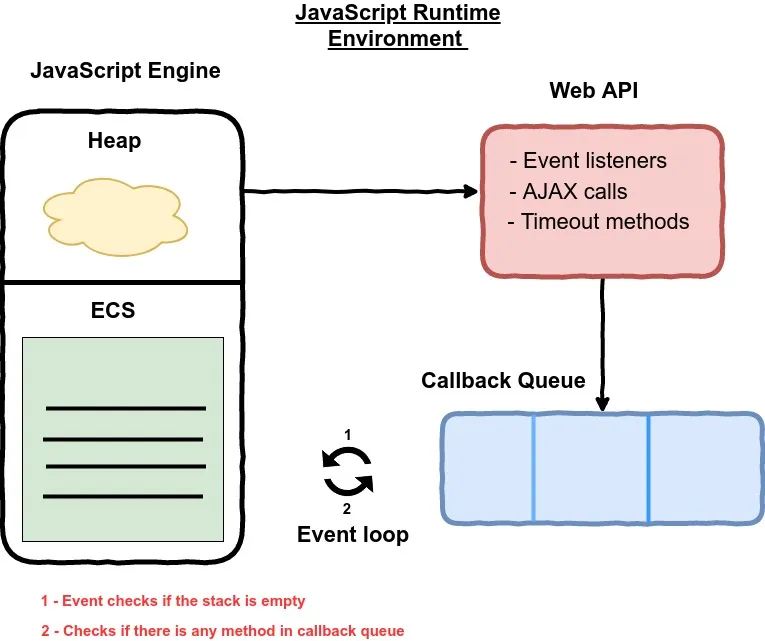
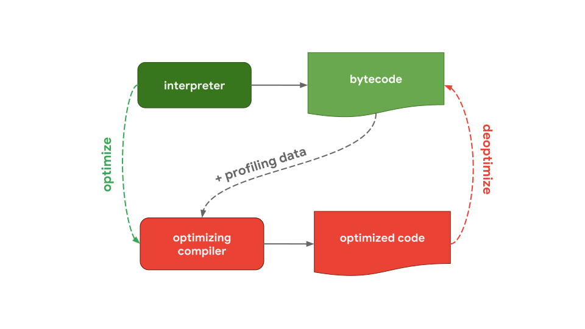
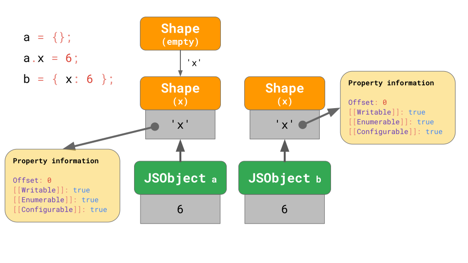
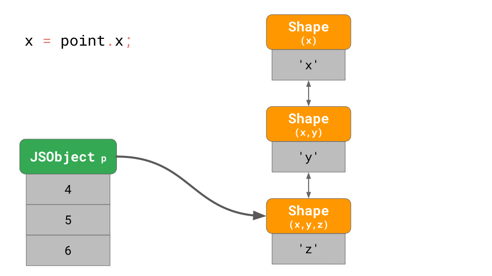
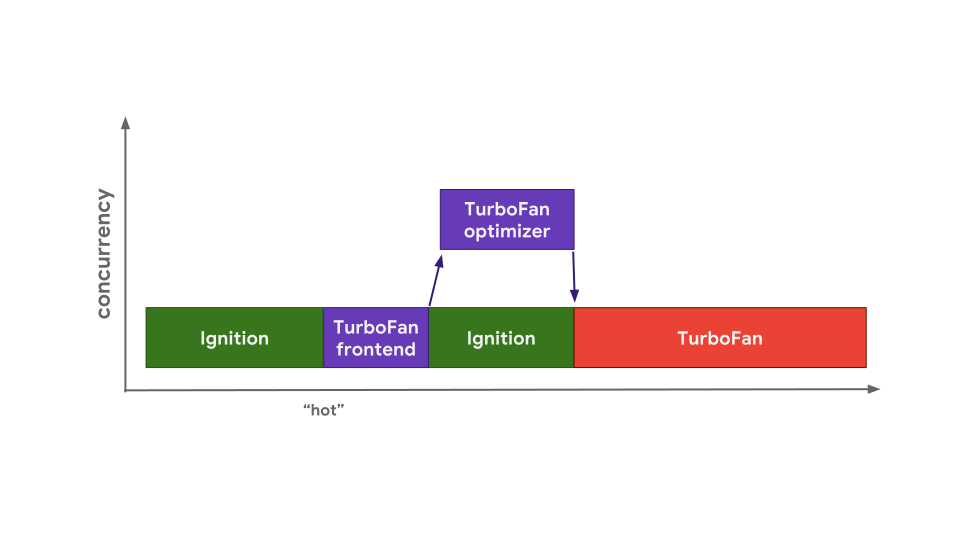
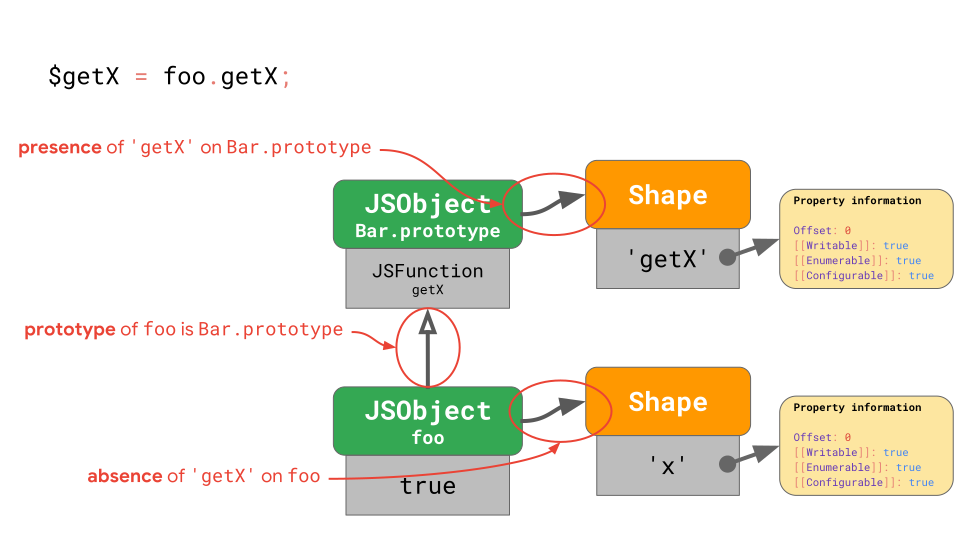
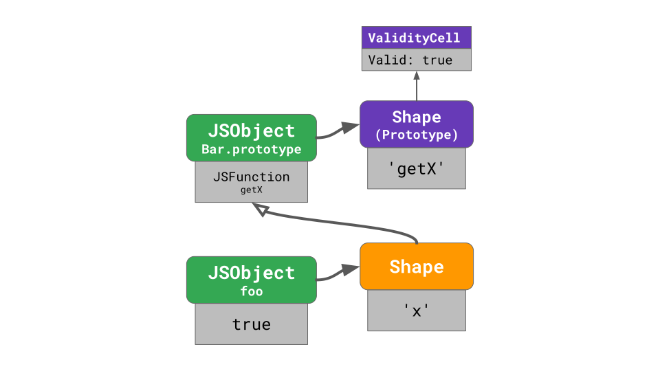
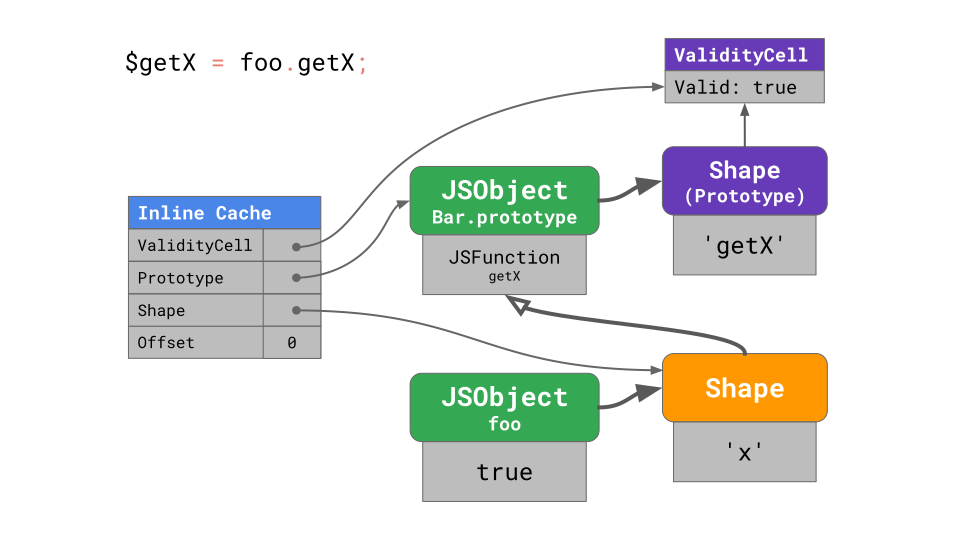

# JS Engines

## How does JavaScript actually get translated?

A **JIT compiler** is different from traditional compilers, such as those used for C++. Traditional compilers have plenty of time to optimize the code during compilation, but the **JIT compiler** must compile code just before it's executed. As soon as the JavaScript code is about to run, it gets compiled into executable bytecode.

Despite the differences in how JavaScript is compiled compared to other compiled languages, the process still follows some of the same rules as traditional compilers. The JavaScript code is parsed before execution, which makes it look like a parsed language. However, the code is converted to binary form before execution.

To better understand this process, let's take a closer look at how code execution works behind the scenes:

- First, the code is transpiled using tools like Babel or Webpack.
- The transpiled code is given to the engine, which parses it to an Abstract Syntax Tree (AST).
- The AST is then converted to bytecode that is understood by the machine. This is an Intermediate Representation (IR), which is further optimized by the **JIT compiler**.
- After optimization, the JS Virtual Machine (VM) executes the code.

Thus, we can conclude that JavaScript is executed in three phases:

- Parsing
- Compiling
- Executing

JavaScript code is initially interpreted before any execution begins. For example, consider the following code:

```js
console.log("Hello");
for (var i = 0; i < 4; i++) {
  console.log(Hello);
}
```

The output shows the interpreter behavior in the above code example, where first `Hello` is printed to the console, and then an error is reported. This output strongly supports the fact that JavaScript is an interpreted language.

While it may seem like JavaScript code is being executed line by line, this is only true during the parsing phase. In reality, the entire code is compiled at once to convert it into machine-readable code before execution. Therefore, JavaScript is a just-in-time compiled language that uses an interpreter in its first phase.

## Explaining JIT in JavaScript

JIT (just-in-time) compilation is a technique used by modern JavaScript engines to improve the performance of JavaScript code. Unlike traditional compilers that optimize code during compilation, JIT compiler take a middle-ground approach. They initially interpret the code and then selectively compile parts of it that are used repeatedly. This approach balances fast start-up time with improved performance.

When a JavaScript engine encounters a function, it can either interpret the code on-the-fly or compile the code before execution. Interpreting the code can be faster to start execution but slower in terms of overall performance, as the code is translated line-by-line each time the function is executed. Compiling the code before execution can be slower to start, but it can result in faster execution due to machine code optimizations.

In this approach, the code is compiled into machine code, which is then executed by the processor.

**JIT compiler** take a middle-ground approach, where they initially interpret the code and then selectively compile parts of it that are used repeatedly. As a result, the JIT compiler offers a balance of fast start-up time and improved performance.

To understand how JIT compilers work, let's consider an example:

```js
function add(a, b) {
  return a + b;
}

for (let i = 0; i < 100000000; i++) {
  add(i, i + 1);
}
```

In this code, we have a simple `add` function that adds two numbers and a loop that calls this function `100` million times with different inputs.

When the JavaScript engine first encounters this code, it will interpret it on-the-fly and execute it. However, as the loop runs repeatedly, the engine detects that the `add` function is being called repeatedly and decides to compile it to machine code to improve performance.

The **JIT compiler** analyzes the code and optimizes it for the specific inputs being used in the loop.

For example, it may decide to inline the `add` function, which means replacing the function call with the actual addition code, eliminating the overhead of calling a function. Additionally, it may also perform other optimizations such as constant folding or dead-code elimination, which remove unnecessary computations.

Overall, the **JIT compiler** help improve the performance of JavaScript code by selectively compiling parts of it that are used repeatedly, while still allowing for fast start-up times.

Now that we have a better understanding of how the **JIT compiler** works, let's delve into the issues we previously discussed and their underlying causes.

## Why the Pre-execution syntax error alerts

Let's explore the reason behind syntax error alerts in JavaScript using the same example we discussed earlier.

```js
console.log("Hello World from javascript!");
console.log("Hello World from javascript!");
console.log("Hello World from javascript!");
console.log("Hello World from javascript!");
console.log("Hello World from javascript!");
console.log("Hello World from javascript!");
console.log("Hello World from javascript!");
console.log("Hello World!);
```

In the case of the code example provided, the JavaScript engine compiles the code before execution, and the syntax error is detected during the compilation phase. This is because the engine uses the `JIT` compiler that optimizes code on the fly as it's executed. When the engine encounters an error during the compilation phase, it immediately throws an error without executing any code.

Therefore, the fact that JavaScript detects syntax errors during the compilation phase suggests that it's more like a compiled language than an interpreted one.

## What is the story of hoisting?

Let's now understand the hoisting in the context of `JIT` engine using the code we used before:

```js
max(1, 2);
// 2
function max(num1, num2) {
  return num1 > num2 ? num1 : num2;
}
```

So, how does the JavaScript engine know about the `max` function before it reaches the declaration?

The answer lies in the Just-In-Time (`JIT`) compilation process that occurs behind the scenes when JavaScript code is executed in modern browsers.

During the optimization step, the **JIT compiler** can analyze the code to determine which functions are likely to be called frequently and which variables are likely to be accessed repeatedly. By identifying these patterns, the compiler can optimize the code for faster execution, which can result in significant performance gains.

In the case of hoisting, the compiler can recognize the pattern of a function being declared at the top of its scope and optimize the code accordingly.

## JS Engine

JavaScript engine consists of two components:

1. Execution context stack - this is where your stack frames are as your code executes
2. Memory Heap - this is where the memory allocation happens

**Execution context stack (ECS)**
Execution context stack is a stack data structure which follows the **Last In First Out** (LIFO) principle (the last item to enter the stack will be the first item to be removed from the stack). ECS stores the execution context for each function. Execution context is defined as an object which stores local variables, functions and objects. Primitive values like `int`, `bool` etc are stored inside the execution context object while function definitions and objects are not stored inside the execution context object, they are stored inside the heap. Execution context object just has the reference or memory address of where these function definitions and objects are stored.

By default, at the bottom of the ECS, we have a global execution context which deals with all the code in the global scope. Each function has its own execution context called functional execution context which gets inserted on the top of ECS as and when the function is called in the code. If the same function is called twice like in recursion, it will have two different functional execution context in the ECS.

When the execution of the function is completed, JS engine itself removes it from the ECS and starts executing the function on the top of the stack.

==As JavaScript engine has only one ECS, it can execute only one thing at a time which is at the top of the ECS. This is what makes JavaScript single threaded.==

**Heap**
Heap is a large unstructured data structure which stores all the dynamic data like function definitions, objects, arrays etc. Execution context stack just contains their reference or in other words stores their memory addresses where these function definitions, objects and arrays are stored. ==The memory occupied in the heap continues to exist even after the JavaScript code execution has completed. They are removed by the JavaScript Garbage Collector.==

```js
console.log("Inside global execution context");

// 'a' will be stored on ECS as it's a primitive value
var a = 10;

// Only reference of functionOne will be stored inside stack.
// funtionOne definition itseld will be stored on heap
function functionOne() {
  console.log("Inside functionOne exectuon context");

  // 'b' will be stored on ECS as it's a primitive value
  var b = 5;

  // Only object reference will be stored on the stack.
  // Object itself will stored on heap
  var obj = {
    name: "Virat",
    age: 30,
  };

  function functionTwo() {
    console.log("Inside functionTwo exectuon context");
    console.log("Exiting functionTwo exectuon context");
  }

  functionTwo();
  console.log("Exiting functionOne exectuon context");
}

functionOne();
console.log("Exiting global execution context");

// Program Ends - Execution stack becomes empty.
// Heap memory may or may not be released, it depends on garbage
// collector
```

When the browser loads the JS file, the JS engine will push the global execution context in the ECS and will start executing it. When JS engine reaches the function definition of `functionOne`, it stores the function definition in the heap memory and its reference in the global execution context. When `functionOne` is called by JS engine, it pushes `functionOne` execution context inside the ECS and starts executing `functionOne`, pausing the execution of the global execution context.

When JS engine calls `functioninTwo` inside `functionOne`, JS engine pushes `functionTwo` inside ECS and starts executing `functionTwo`, pausing the execution of `functionOne`. Once all the code inside `functionTwo` is executed, JS engine pop out `functionTwo` execution context and restarts executing remaining code of `functionOne`.

Similarly, it removes the `functionOne` execution context once all the code of `functionOne` is executed. It should be noted that even though `functionOne` has been removed from the ECS, objects and function definitions inside `functionOne` continue to occupy memory in the heap without being referred by any variable. They will be removed by the garbage collector automatically, we don't have to remove it ourselves. Once all the code from the global execution context is executed, ECS becomes empty and the execution of the script ends.

## JavaScript Runtime Environment (JRE)

JRE is just like a container which consists of the following components:

1. JS Engine
2. Web API
3. Callback Queue or message queue
4. Event Table
5. Event loop



### Web API

Web APIs are not part of the JS engine but they are part of the JavaScript Runtime Environment which is provided by the browser. JavaScript just provides us with a mechanism to access these API’s. As Web APIs are browser specific, they may vary from browser to browser. There may be cases where some Web APIs may be present in one browser but not in other.

Examples:

1. DOM API for manipulating the DOM. `document.getElementById`,`addEventListerner`, `document.querySelectorAll`, etc. are part of the DOM API provided by the browser which we can access using JavaScript.
2. AJAX calls or XMLHttpRequest. As Web APIs are browser specific and XMLHttpRequest is a Web API, we had to implement XMLHttpRequest in a different way for IE before JQuery saved us (remember?).
3. Timer functions like `setTimeout` and `setInterval` are also provided by the browser.

When JavaScript engine finds any Web API method, it sends that method to an event table, where it waits till an event occurs. In the case of AJAX calls, the JS engine will send the AJAX calls to the event table and will continue the execution of code after the Ajax call. AJAX call will wait in the event table until the response from the AJAX call is returned. In case of timer function like `setTimeout`, it waits until the timer count becomes zero.

**Event Table**

It is a table data structure to store the asynchronous methods which need to be executed when some event occurs.

**Callback Queue or Message Queue or Event Queue**

Callback Queue or Message Queue is a queue data structure which follows **First In First Out** principle (item to be inserted first in the queue will be removed from the queue first). It stores all the messages which are moved from the event table to the event queue. Each message has an associated function. Callback queue maintains the order in which the message or methods were added in the queue.

Web API callbacks are moved from the event table to the event queue when an event occurs. For example, when AJAX calls are completed and the response is returned, it is moved from the event table to the event queue. Similarly, when the `setTimout` method waiting time becomes zero it is moved from the event queue to the event table.

**Event Loop**

Methods are executed neither in the event table nor in the event queue. They are executed by the JavaScript engine, only if it is present in the ECS. So, for the execution of any method, we need to move that method from the callback queue to the execution context stack. This is what the event loop does! Event loop continuously checks if the execution context stack is empty and if there are any messages in the event queue. It will move the method from the callback queue to ECS only when the execution context stack is empty.

## The JavaScript engine pipeline

It all starts with the JavaScript code you write. The JavaScript engine parses the source code and turns it into an Abstract Syntax Tree (AST). Based on that AST, the interpreter can start to do its thing and produce bytecode. Great! At that point the engine is actually running the JavaScript code.


To make it run faster, the bytecode can be sent to the optimizing compiler along with profiling data. The optimizing compiler makes certain assumptions based on the profiling data it has, and then produces highly-optimized machine code.

If at some point one of the assumptions turns out to be incorrect, the optimizing compiler deoptimizes and goes back to the interpreter.

### Interpreter/compiler pipelines in JavaScript engines

Now, let’s zoom in on the parts of this pipeline that actually run your JavaScript code, i.e. where code gets interpreted and optimized, and go over some of the differences between major JavaScript engines.

Generally speaking, there’s a pipeline containing an interpreter and an optimizing compiler. The interpreter generates unoptimized bytecode quickly, and the optimizing compiler takes a little longer but eventually produces highly-optimized machine code.



This generic pipeline is pretty much exactly how V8, the JavaScript engine used in Chrome and Node.js, works:


The interpreter in V8 is called Ignition, and is responsible for generating and executing bytecode. While it runs the bytecode, it collects profiling data, which can be used to speed up the execution later. When a function becomes _hot_, for example when it’s run often, the generated bytecode **and** the profiling data are passed on to TurboFan, our optimizing compiler, to generate highly-optimized machine code based on the profiling data.


SpiderMonkey, Mozilla’s JavaScript engine as used in Firefox and in [SpiderNode](https://github.com/mozilla/spidernode), does it a little differently. They have not one but two optimizing compilers. The interpreter optimizes into the Baseline compiler, which produces somewhat optimized code. Combined with profiling data gathered while running the code, the IonMonkey compiler can produce heavily-optimized code. If the speculative optimization fails, IonMonkey falls back to the Baseline code.


Chakra, Microsoft’s JavaScript engine as used in Edge and [Node-ChakraCore](https://github.com/nodejs/node-chakracore), has a very similar setup with two optimizing compilers. The interpreter optimizes into SimpleJIT — where JIT stands for Just-In-Time compiler — which produces somewhat optimized code. Combined with profiling data, the FullJIT can produce more-heavily-optimized code.


JavaScriptCore (abbreviated as JSC), Apple’s JavaScript engine as used in Safari and React Native, takes it to the extreme with three different optimizing compilers. LLInt, the Low-Level Interpreter, optimizes into the Baseline compiler, which can then optimize into the DFG (Data Flow Graph) compiler, which can in turn optimize into the FTL (Faster Than Light) compiler.

Why do some engines have more optimizing compilers than others? It’s all about trade-offs. An interpreter can produce bytecode quickly, but bytecode is generally not very efficient. An optimizing compiler on the other hand takes a little longer, but eventually produces much more efficient machine code. There is a trade-off between quickly getting code to run (interpreter) or taking some more time, but eventually running the code with optimal performance (optimizing compiler). Some engines choose to add multiple optimizing compilers with different time/efficiency characteristics, allowing for more fine-grained control over these trade-offs at the cost of additional complexity.

We’ve just highlighted the main differences in the interpreter and optimizing compiler pipelines for each JavaScript engine. But besides these differences, at a high level, **all JavaScript engines have the same architecture**: there’s a parser and some kind of interpreter/compiler pipeline.

## JavaScript’s object model

Let’s look at what else JavaScript engines have in common by zooming in on how some aspects are implemented.

For example, how do JavaScript engines implement the JavaScript object model, and which tricks do they use to speed up accessing properties on JavaScript objects? As it turns out, all major engines implement this very similarly.

The ECMAScript specification essentially defines all objects as dictionaries, with string keys mapping to property attributes.


Other than the `[[Value]]` itself, the spec defines these properties:

- `[[Writable]]` which determines whether the property can be reassigned to,
- `[[Enumerable]]` which determines whether the property shows up in `for`-`in` loops,
- and `[[Configurable]]` which determines whether the property can be deleted.

The `[[double square brackets]]` notation looks funky, but that’s just how the spec represents properties that aren’t directly exposed to JavaScript. You can still get to these property attributes for any given object and property in JavaScript by using the `Object.getOwnPropertyDescriptor` API:

```js
const object = { foo: 42 };

Object.getOwnPropertyDescriptor(object, "foo");

// → { value: 42, writable: true, enumerable: true, configurable: true }
```

Ok, so that’s how JavaScript defines objects. What about arrays?

You can think of arrays as a special case of objects. One difference is that arrays have special handling of array indices. Here _array index_ is a special term in the ECMAScript specification. Arrays are limited to 2³²−1 items in JavaScript. An array index is any valid index within that limit, i.e. any integer number from 0 to 2³²−2.

Another difference is that arrays also have a magical `length` property.

```js
const array = ["a", "b"];

array.length; // → 2

array[2] = "c";

array.length; // → 3
```

In this example, the array has a `length` of `2` when it’s created. Then we assign another element to index `2`, and the `length` automatically updates.

JavaScript defines arrays similarly to objects. For example, all the keys including array indices are represented as strings explicitly. The first element in the array is stored under the key `'0'`.


The `'length'` property is just another property that happens to be non-enumerable and non-configurable.

Once an element is added to the array, JavaScript automatically updates the `[[Value]]` property attribute of the `'length'` property.


Generally speaking, arrays behave pretty similarly to objects.

## Optimizing property access

Now that we know how objects are defined in JavaScript, let’s dive into how JavaScript engines enable working with objects efficiently.

Looking at JavaScript programs in the wild, accessing properties is by far the most common operation. It’s crucial for JavaScript engines to make property access fast.

```js
const object = {
  foo: "bar",

  baz: "qux",
};

// Here, we’re accessing the property `foo` on `object`:

doSomething(object.foo);
//          ^^^^^^^^^^
```

### Shapes

In JavaScript programs, it’s common to have multiple objects with the same property keys. Such objects have the same _shape_.

```js
const object1 = { x: 1, y: 2 };

const object2 = { x: 3, y: 4 };

// `object1` and `object2` have the same shape.
```

It’s also very common to access the same property on objects with the same shape:

```js
function logX(object) {
  console.log(object.x);
  //          ^^^^^^^^
}

const object1 = { x: 1, y: 2 };

const object2 = { x: 3, y: 4 };

logX(object1);

logX(object2);
```

With that in mind, JavaScript engines can optimize object property access based on the object’s shape. Here’s how that works.

Let’s assume we have an object with the properties `x` and `y`, and it uses the dictionary data structure we discussed earlier: it contains the keys as strings, and those point to their respective property attributes.


If you access a property, e.g. `object.y`, the JavaScript engine looks in the `JSObject` for the key `'y'`, then loads the corresponding property attributes, and finally returns the `[[Value]]`.

But where are these property attributes stored in memory? Should we store them as part of the `JSObject`? If we assume that we’ll be seeing more objects with this shape later, then it’s wasteful to store the full dictionary containing the property names and attributes on the `JSObject` itself, as the property names are repeated for all objects with the same shape. That’s a lot of duplication and unnecessarily memory usage. As an optimization, engines store the `Shape` of the object separately.


This `Shape` contains all the property names and the attributes, except for their `[[Value]]`s. Instead the `Shape` contains the offset of the values inside of the `JSObject`, so that the JavaScript engine knows where to find the values. Every `JSObject` with this same shape points to exactly this `Shape` instance. Now every `JSObject` only has to store the values that are unique to this object.


The benefit becomes clear when we have multiple objects. No matter how many objects there are, as long as they have the same shape, we only have to store the shape and property information once!

All JavaScript engines use shapes as an optimization, but they don’t all call them shapes:

- Academic papers call them _Hidden Classes_ (confusing w.r.t. JavaScript classes)
- V8 calls them _Maps_ (confusing w.r.t. JavaScript `Map`s)
- Chakra calls them _Types_ (confusing w.r.t. JavaScript’s dynamic types and `typeof`)
- JavaScriptCore calls them _Structures_
- SpiderMonkey calls them _Shapes_

Throughout this article, we’ll continue to use the term _shapes_.

### Transition chains and trees

What happens if you have an object with a certain shape, but then you add a property to it? How does the JavaScript engine find the new shape?

```js
const object = {};

object.x = 5;

object.y = 6;
```

The shapes form so-called _transition chains_ in the JavaScript engine. Here’s an example:


The object starts out without any properties, so it points to the empty shape. The next statement adds a property `'x'` with a value `5` to this object, so the JavaScript engine transitions to a shape that contains the property `'x'` and a value `5` is added to the `JSObject` at the first offset `0`. The next line adds a property `'y'`, so the engine transitions to yet another shape that contains both `'x'` and `'y'`, and appends the value `6` to the `JSObject` (at offset `1`).

==**Note:** The order in which properties are added impacts the shape. For example, `{ x: 4, y: 5 }` results in a different shape than `{ y: 5, x: 4 }`.==

We don’t even need to store the full table of properties for each `Shape`. Instead, every `Shape` only needs to know about the new property it introduces. For example, in this case we don’t have to store the information about `'x'` in that last shape, because it can be found earlier in the chain. To make this work, every `Shape` links back to its previous shape:


If you write `o.x` in your JavaScript code, the JavaScript engine looks up the property `'x'` by walking up the transition chain until it finds the `Shape` that introduced property `'x'`.

But what happens if there’s no way to create a transition chain? For example, what if you have two empty objects, and you add a different property to each of them?

```js
const object1 = {};

object1.x = 5;

const object2 = {};

object2.y = 6;
```

In that case we have to branch, and instead of a chain, we end up with a _transition tree_:


Here, we create an empty object `a`, and then add a property `'x'` to it. We end up with a `JSObject` containing a single value, and two `Shapes`: the empty shape, and the shape with only a property `x`.

The second example starts with an empty object `b` too, but then adds a different property `'y'`. We end up with two shape chains, and a total of three shapes.

Does that mean we always start at the empty shape? Not necessarily. Engines apply some optimizations for object literals that already contain properties. Let’s say we either add `x` starting from the empty object literal, or have an object literal that already contains `x`:

```js
const object1 = {};

object1.x = 5;

const object2 = { x: 6 };
```

In the first example, we start at the empty shape and transition to the shape that also contains `x`, just as we saw before.

In the case of `object2`, it makes sense to directly produce objects that already have `x` from the beginning instead of starting from an empty object and transitioning.



The object literal that contains the property `'x'` starts at a shape that contains `'x'` from the beginning, effectively skipping the empty shape. This is what (at least) V8 and SpiderMonkey do. This optimization shortens the transition chains and makes it more efficient to construct objects from literals.

Here’s an example of a 3D point object with properties `'x'`, `'y'`, and `'z'`.

```javascript
const point = {};
point.x = 4;
point.y = 5;
point.z = 6;
```

As we learned before, this creates an object with 3 shapes in memory (not counting the empty shape). To access the property `'x'` on that object, e.g. if you write `point.x` in your program, the JavaScript engine needs to follow the linked list: it starts at the `Shape` at the bottom, and then works its way up to the `Shape` that introduced `'x'` at the top.



That’s going to be really slow if we do this more often, especially when the objects have lots of properties. The time to find the property is `O(n)`, i.e. linear in the number of properties on the object. To speed up searching for properties, JavaScript engines add a `ShapeTable` data structure. This `ShapeTable` is a dictionary, mapping property keys to the respective `Shape`s that introduce the given property.


Wait a minute, now we’re back to dictionary lookups… That’s where we were before we started adding `Shape`s in the first place! So why do we bother with shapes at all?

The reason is that shapes enable another optimization called _Inline Caches_.

### Inline Caches (ICs)

    Short: Inline Caching, or IC, is a major optimisation technique within JavaScript engines. The interpreter must perform a search before it can access an object’s property. That property can be part of an object’s prototype, have a getter method or even be accessible via a proxy. Searching for the property is quite expensive in terms of execution speed.

    The engine assigns each object to a “type” that it generates during the runtime. V8 calls these “types”, which are not part of the ECMAScript standard, hidden classes or object shapes. For two objects to share the same object shape, both objects must have exactly the same properties in the same order. So an object`{firstname: "Han", lastname: "Solo"}` would be assigned to a different class than `{lastname: "Solo", firstname: "Han"}`.

    With the help of the object shapes, the engine knows the memory location of each property. The engine hard-codes those locations into the function that accesses the property.

The main motivation behind shapes is the concept of Inline Caches or ICs. ICs are the key ingredient to making JavaScript run fast! JavaScript engines use ICs to memorize information on where to find properties on objects, to reduce the number of expensive lookups.

Here’s a function `getX` that takes an object and loads the property `x` from it:

```javascript
function getX(o) {
  return o.x;
}
```

If we run this function in JSC, it generates the following bytecode:


The first `get_by_id` instruction loads the property `'x'` from the first argument (`arg1`) and stores the result into `loc0`. The second instruction returns what we stored to `loc0`.

JSC also embeds an Inline Cache into the `get_by_id` instruction, which consists of two uninitialized slots.


Now let’s assume we call `getX` with an object `{ x: 'a' }`. As we learned, this object has a shape with property `'x'` and the `Shape` stores the offset and attributes for that property `x`. When you execute the function for the first time, the `get_by_id` instruction looks up the property `'x'` and finds that the value is stored at offset `0`.


The IC embedded into the `get_by_id` instruction memorizes the shape and the offset at which the property was found:


For subsequent runs, the IC only needs to compare the shape, and if it’s the same as before, just load the value from the memorized offset. Specifically, if the JavaScript engine sees objects with a shape that the IC recorded before, it no longer needs to reach out to the property information at all — instead, the expensive property information lookup can be skipped entirely. That’s significantly faster than looking up the property each time.

## Storing arrays efficiently

For arrays, it’s common to store properties that are _array indices_. The values for such properties are called array elements. It would be wasteful memory-wise to store property attributes for each and every array element in every single array. Instead, JavaScript engines use the fact that array-indexed properties are writable, enumerable, and configurable by default, and store array elements separately from other named properties.

Consider this array:

```javascript
const array = ["#jsconfeu"];
```

The engine stores the array length (`1`), and points to the `Shape` that contains the offset and the attributes for the `'length'` property.


This is similar to what we’ve seen before… but where are the array values stored?


Every array has a separate _elements backing store_ that contains all the array-indexed property values. The JavaScript engine doesn’t have to store any property attributes for array elements, because usually they are all writable, enumerable, and configurable.

What happens in the unusual case, though? What if you change the property attributes of array elements?

```js
// Please don’t ever do this!

const array = Object.defineProperty(
  [],

  "0",

  {
    value: "Oh noes!!1",

    writable: false,

    enumerable: false,

    configurable: false,
  }
);
```

The above snippet defines a property named `'0'` (which happens to be an array index), but sets it attributes to non-default values.

In such edge cases, the JavaScript engine represents the _entire_ elements backing store as a dictionary that maps array indices to property attributes.


Even when just a single array element has non-default attributes, the entire array’s backing store goes into this slow and inefficient mode. **Avoid `Object.defineProperty` on array indices!** (I’m not sure why you would even want to do this. It seems like a weird, non-useful thing to do.)

## Optimization tiers and execution trade-offs

Modern JavaScript engines all have the same overall pipeline:


We also pointed out that although the high-level pipeline is similar between engines, there are often differences in the optimization pipeline. Why is that? **Why do some engines have more optimization tiers than others?** It turns out there is a trade-off between quickly getting code to run, or taking some more time but eventually running the code with optimal performance.


An interpreter can produce bytecode quickly, but bytecode is generally not very efficient. An optimizing compiler on the other hand takes a little longer, but eventually produces much more efficient machine code.

This is exactly the model that V8 uses. V8’s interpreter is called Ignition, and it’s the fastest interpreter of all the engines (in terms of raw bytecode execution speed). V8’s optimizing compiler is named TurboFan, and it eventually generates highly-optimized machine code.


This trade-off between startup latency and execution speed is the reason why some JavaScript engines choose to add optimization tiers in between. For example, SpiderMonkey adds a Baseline tier in between the interpreter and their full IonMonkey optimizing compiler:


The interpreter generates bytecode quickly, but the bytecode executes relatively slowly. Baseline takes a little longer to generate code, but it offers better run-time performance. And finally, the IonMonkey optimizing compiler takes the longest to produce machine code, but that code can run very efficiently.

Let’s take a look at a concrete example and see how the pipelines in the different engines deal with it. Here’s some code that gets repeated often, in a hot loop.

```javascript
let result = 0;

for (let i = 0; i < 4242424242; ++i) {
  result += i;
}

console.log(result);
```

V8 starts running the bytecode in the Ignition interpreter. At some point the engine determines that the code is _hot_ and starts up the TurboFan frontend, which is the part of TurboFan that deals with integrating profiling data and constructing a basic machine representation of the code. This is then sent to the TurboFan optimizer on a different thread for further improvements.



While the optimizer is running, V8 continues executing the bytecode in Ignition. At some point the optimizer is done and we have executable machine code, and the execution can continue with that.

The SpiderMonkey engine also starts running the bytecode in the interpreter. But it has the additional Baseline tier, which means hot code is first sent to Baseline. The Baseline compiler generates Baseline code on the main thread and continues execution once ready.


If Baseline code is run for a while, SpiderMonkey eventually fires up the IonMonkey frontend, and kicks off the optimizer — very similarly to V8. It keeps running in Baseline while IonMonkey is optimizing. Finally, when the optimizer is done, the optimized code is executed instead of the Baseline code.

Chakra’s architecture is very similar to SpiderMonkey’s, but Chakra tries to run more things concurrently to avoid blocking the main thread. Instead of running any part of the compiler on the main thread, Chakra copies out the bytecode and the profiling data that the compiler likely needs and sends it to a dedicated compiler process.


When the generated code is ready, the engine starts to run this SimpleJIT code instead of the bytecode. The same goes for the FullJIT. The benefit of this approach is that the pause times where the copy happens are usually much shorter compared to running the full compiler (frontend). But the downside of this approach is that the **copy heuristic** might miss some information that would be required for a certain optimization, so it’s trading code quality for latency to some extent.

In JavaScriptCore, all optimizing compilers run **fully concurrent** with the main JavaScript execution; there’s no copy phase! Instead, the main thread merely triggers compilation jobs on another thread. The compilers then use a complicated locking scheme to access profiling data from the main thread.


The advantage of this approach is that it reduces the jank caused by JavaScript optimization on the main thread. The downside is that it requires dealing with complex multithreading issues and paying some locking cost for various operations.

We’ve talked about the trade-off between generating code quickly like with an interpreter, or generating quick code with an optimizing compiler. But there is another trade-off: **memory usage**! To illustrate that, here’s a simple JavaScript program that adds two numbers together.

```javascript
function add(x, y) {
  return x + y;
}

add(1, 2);
```

Here’s the bytecode we generate for the `add` function using the Ignition interpreter in V8:

```
StackCheck
Ldar a1
Add a0, [0]
Return
```

Don’t worry about the exact bytecode — you don’t really need to read it. The point is that it’s **just four instructions**!

When the code becomes hot, TurboFan generates the following highly-optimized machine code:

```
leaq rcx,[rip+0x0]
movq rcx,[rcx-0x37]
testb [rcx+0xf],0x1
jnz CompileLazyDeoptimizedCode
push rbp
movq rbp,rsp
push rsi
push rdi
cmpq rsp,[r13+0xe88]
jna StackOverflow
movq rax,[rbp+0x18]
test al,0x1
jnz Deoptimize
movq rbx,[rbp+0x10]
testb rbx,0x1
jnz Deoptimize
movq rdx,rbx
shrq rdx, 32
movq rcx,rax
shrq rcx, 32
addl rdx,rcx
jo Deoptimize
shlq rdx, 32
movq rax,rdx
movq rsp,rbp
pop rbp
ret 0x18
```

That’s _a lot_ of code, especially when compared to the four instructions we had in the bytecode! In general, bytecode tends to be a lot more compact than machine code, especially optimized machine code. On the other hand, bytecode needs an interpreter to run, whereas the optimized code can be executed directly by the processor.

This is one of the main reasons why JavaScript engines don’t just “optimize everything”. As we saw earlier, generating optimized machine code takes a long time, and on top of that, we just learned that **optimized machine code also requires more memory**.

**Summary:** The reason JavaScript engines have different optimization tiers is because of a fundamental trade-off between _generating code quickly_ like with an interpreter, or _generating quick code_ with an optimizing compiler. It’s a scale, and adding more optimization tiers allows you to make more fine-grained decisions at the cost of additional complexity and overhead. In addition, there’s a trade-off between the optimization level and the memory usage of the generated code. This is why JavaScript engines try to optimize only _hot_ functions.


## Optimizing prototype property access

Engines store the `Shape` of the object separately from the object’s values.


Shapes enable an optimization called _Inline Caches_ or _ICs_ for short. Combined, Shapes and ICs can speed up repeated property accesses from the same place in your code.


### Classes and prototype-based programming

Now that we know how to make property access fast on JavaScript objects, let’s look at one of the more recent additions to JavaScript: classes. Here’s what the JavaScript class syntax looks like:

```javascript
class Bar {
  constructor(x) {
    this.x = x;
  }

  getX() {
    return this.x;
  }
}
```

Although this appears to be a new concept in JavaScript, it’s merely syntactic sugar for prototype-based programming that has been used in JavaScript forever:

```javascript
function Bar(x) {
  this.x = x;
}

Bar.prototype.getX = function getX() {
  return this.x;
};
```

Here, we assign a `getX` property on the `Bar.prototype` object. This works in exactly the same way as with any other object, because **prototypes are just objects in JavaScript**! In prototype-based programming languages like JavaScript, methods are shared via the prototypes, while fields are stored on the actual instances.

Let’s zoom in on what happens behind the scenes when we create a new instance of `Bar` called `foo`.

```javascript
const foo = new Bar(true);
```

The instance created from running this code has a shape with a single property `'x'`. The prototype of `foo` is the `Bar.prototype` that belongs to the class `Bar`.


This `Bar.prototype` has a shape of its own, containing a single property `'getX'` whose value is the function `getX` that just returns `this.x` when called. The prototype of `Bar.prototype` is the `Object.prototype` that’s part of the JavaScript language. The `Object.prototype` is the root of the prototype tree and thus its prototype is `null`.


If you create another instance of the same class, both instances share the object shape, as we discussed earlier. Both instances point to the same `Bar.prototype` object.

### Prototype property access

Ok, so now we know what happens when we define a class and we create a new instance. But what happens if we call a method on an instance, like we’re doing here?

```javascript
class Bar {
  constructor(x) {
    this.x = x;
  }

  getX() {
    return this.x;
  }
}

const foo = new Bar(true);

const x = foo.getX();

//        ^^^^^^^^^^
```

You can think of any method call as two individual steps:

```javascript
const x = foo.getX();

// is actually two steps:

const $getX = foo.getX;

const x = $getX.call(foo);
```

Step 1 is to load the method, which is just a property on the prototype (whose value happens to be a function). Step 2 is to call the function with the instance as the `this` value. Let’s walk through that first step, which is loading the method `getX` from the instance `foo`.


The engine starts at the `foo` instance and realizes there is no `'getX'` property on `foo`s shape, so it has to walk up the prototype chain for it. We get to `Bar.prototype`, look at its prototype shape, and see that it has the `'getX'` property at offset `0`. We look up the value at this offset in `Bar.prototype` and find the `JSFunction` `getX` that we were looking for. And that’s it!

JavaScript’s flexibility makes it possible to mutate prototype chain links, for example:

```js
const foo = new Bar(true);

foo.getX();

// → true

Object.setPrototypeOf(foo, null);

foo.getX();

// → Uncaught TypeError: foo.getX is not a function
```

In this example, we call `foo.getX()` twice, but each time it has a completely different meaning and result. This is why, although prototypes are just objects in JavaScript, speeding up prototype property access is even more challenging for JavaScript engines than speeding up _own_ property access on regular objects.

Looking at programs in the wild, loading prototype properties is a very frequent operation: it happens every time you call a method!

```js
class Bar {
  constructor(x) {
    this.x = x;
  }

  getX() {
    return this.x;
  }
}

const foo = new Bar(true);

const x = foo.getX();
//        ^^^^^^^^^^
```

Earlier, we discussed how engines optimize loading regular, _own_ properties through the use of Shapes and Inline Caches. How can we optimize repeated loads of prototype properties on objects with similar shapes? We saw above how the property load happens.



In order to make that fast for repeated loads in this particular case, we need to know these three things:

1. The shape of `foo` does not contain `'getX'` and did not change. This means no one altered the object `foo` by adding or deleting a property, or by changing one of the property attributes.
2. The prototype of `foo` is still the initial `Bar.prototype`. This means no one changed `foo`s prototype by using `Object.setPrototypeOf()` or by assigning to the special `__proto__` property.
3. The shape of `Bar.prototype` contains `'getX'` and did not change. This means no one altered the `Bar.prototype` by adding or deleting a property, or by changing one of the property attributes.

In the general case, that means we have to perform 1 check on the instance itself, plus 2 checks for each prototype up to the prototype which holds the property we’re looking for. `1+2N` checks (where `N` is the number of prototypes involved) might not sound too bad for this case, because the prototype chain is relatively shallow — but engines often have to deal with much longer prototype chains, like in the case of common DOM classes. Here’s an example of that:

```js
const anchor = document.createElement("a");

// → HTMLAnchorElement

const title = anchor.getAttribute("title");
```

We have an `HTMLAnchorElement` and we call the `getAttribute()` method on it. The prototype chain of this simple anchor element already involves 6 prototypes! Most of the interesting DOM methods are not on the direct `HTMLAnchorElement` prototype, but higher up in the chain.


The `getAttribute()` method is found on the `Element.prototype`. That means each time we call `anchor.getAttribute()`, the JavaScript engine needs to…

1. check that `'getAttribute'` is not on the `anchor` object itself,
2. check that the direct prototype is `HTMLAnchorElement.prototype`,
3. assert absence of `'getAttribute'` there,
4. check that the next prototype is `HTMLElement.prototype`,
5. assert absence of `'getAttribute'` there as well,
6. eventually check that the next prototype is `Element.prototype`,
7. and that `'getAttribute'` is present there.

That’s a total of 7 checks! Since this kind of code is pretty common on the web, engines apply tricks to reduce the number of checks necessary for property loads on prototypes.

Going back to the earlier example, we perform a total of 3 checks when accessing `'getX'` on `foo`:

```js
class Bar {
  constructor(x) {
    this.x = x;
  }

  getX() {
    return this.x;
  }
}

const foo = new Bar(true);

const $getX = foo.getX;
```

For each object involved up until the prototype that carries the property, we need to do shape checks for absence. It’d be nice if we could reduce the number of checks by folding the prototype check into the absence check. And that’s essentially what engines do with a simple trick: **instead of storing the prototype link on the instance itself, engines store it on the `Shape`**.


Each shape points to the prototype. This also means that every time the prototype of `foo` changes, the engine transitions to a new shape. Now we only need to check the shape of an object to both assert absence of certain properties and also guard the prototype link.

With this approach, we can reduce the number of checks required from `1+2N` to `1+N` for faster property access on prototypes. But that’s still quite expensive, since it’s still linear in the length of the prototype chain. Engines implement different tricks to further reduce this to a constant number of checks, especially for subsequent executions of the same property loads.

### Validity cells

V8 treats prototype shapes specially for this purpose. Each prototype has a unique shape that is not shared with any other objects (specifically not with other prototypes), and each of these prototype shapes has a special `ValidityCell` associated with it.



This `ValidityCell` is invalidated whenever someone changes the associated prototype or any prototype above it. Let’s take a look at how this works exactly.

To speed up subsequent loads from prototypes, V8 puts an Inline Cache in place, with four fields:



When warming up the inline cache during the first run of this code, V8 remembers the offset at which the property was found in the prototype, the prototype on which the property was found (`Bar.prototype` in this example), the shape of the instance (the shape of `foo` in this case), and also the link to the current ValidityCell of the _immediate prototype_ that is linked to from the instance shape (which also happens to be `Bar.prototype` in this case).

The next time the Inline Cache is hit, the engine has to check the shape of the instance and the `ValidityCell`. If it’s still valid, the engine can reach out directly to the `Offset` on the `Prototype`, skipping the additional lookups.


When the prototype is changed, a new shape is allocated and the previous `ValidityCell` is invalidated. So the Inline Cache misses the next time it’s executed, resulting in worse performance.

Going back to the DOM element example from before, this means that any change to e.g. `Object.prototype` would not just invalidate Inline Caches for `Object.prototype` itself, but also for any prototype below including `EventTarget.prototype`, `Node.prototype`, `Element.prototype` and so on, all the way down until `HTMLAnchorElement.prototype`.


Effectively, modifying `Object.prototype` while running your code means throwing performance out the window. Don’t do it!

Let’s explore this a bit more with a concrete example. Say we have our class `Bar`, and we have a function `loadX` that calls a method on `Bar` objects. We call this `loadX` function a few times with instances of the same class.

```js
class Bar {
  /* … */
}

function loadX(bar) {
  return bar.getX(); // IC for 'getX' on `Bar` instances.
}

loadX(new Bar(true));

loadX(new Bar(false));

// IC in `loadX` now links the `ValidityCell` for

// `Bar.prototype`.

Object.prototype.newMethod = (y) => y;

// The `ValidityCell` in the `loadX` IC is invalid

// now, because `Object.prototype` changed.
```

The inline cache in `loadX` now points to the `ValidityCell` for `Bar.prototype`. If you then do something like mutate the `Object.prototype` — which is the root of all prototypes in JavaScript — the `ValidityCell` becomes invalid, and the existing Inline Caches miss the next time they’re hit, resulting in worse performance.

Mutating `Object.prototype` is always a bad idea, as it invalidates any Inline Caches for prototype loads that the engine had put up until that point. Here’s another example of what _NOT_ to do:

```js
Object.prototype.foo = function () {
  /* … */
};

// Run critical code:

someObject.foo();

// End of critical code.

delete Object.prototype.foo;
```

We extend `Object.prototype`, which invalidates any prototype Inline Caches the engine put in place up until that point. Then we run some code that uses the new prototype method. The engine has to start over from scratch and set up new Inline Caches for any prototype property accesses. And then finally, we “clean up after ourselves” and remove the prototype method we added earlier.

Cleaning up sounds like a good idea, right‽ Well, in this case it makes a bad situation even worse! Deleting the property modifies `Object.prototype`, so all the Inline Caches are invalidated all over again and the engine has to start from scratch once again.

**Summary:** Although prototypes are just objects, they are treated specially by JavaScript engines to optimize the performance of method lookups on prototypes. Leave your prototypes alone! Or if you really need to touch prototypes, then do it before other code runs, so that you at least don’t invalidate all the optimizations in the engine while your code is running.

## Intervening Ducks or Multiple Types

Functional programming has the well-known concept of “duck typing” where good code quality calls for functions that can handle multiple types. In our case, as long as the passed object has a property lastname, everything is fine.

Inline Caching eliminates the expensive lookup for a property’s memory location. It works best when, at each property access, the object has the same object shape. This is called monomorphic IC.

If we have up to four different object shapes, we are in a polymorphic IC state. Like in monomorphic, the optimised machine code “knows” already all four locations. But it has to check to which one of the four possible object shapes the passed argument belongs. This results in a performance decrease.

Once we exceed the threshold of four, it gets dramatically worse. We are now in a so-called megamorphic IC. In this state, there is no local caching of the memory locations anymore. Instead, it has to be looked up from a global cache. This results in the extreme performance drop we have seen above.

OK, so we had 5 object shapes and ran into a megamorphic IC. How can we fix this?

We have to make sure that the engine marks all 5 of our objects as the same object shape. That means the objects we create must contain all possible properties. We could use object literals, but I find JavaScript classes the better solution.

For properties that are not defined, we simply pass `null` or leave it out.

## List of JS Engines

This is a list of popular projects that are implementing a JavaScript engine:

- [**V8**](<https://en.wikipedia.org/wiki/V8_(JavaScript_engine)>) — open source, developed by Google, written in C++
- [**Rhin**](<https://en.wikipedia.org/wiki/Rhino_(JavaScript_engine)>)**o** — managed by the Mozilla Foundation, open source, developed entirely in Java
- [**SpiderMonkey**](<https://en.wikipedia.org/wiki/SpiderMonkey_(JavaScript_engine)>) — the first JavaScript engine, which back in the days powered Netscape Navigator, and today powers Firefox
- [**JavaScriptCore**](https://en.wikipedia.org/wiki/JavaScriptCore) — open source, marketed as Nitro and developed by Apple for Safari
- [**KJS**](<https://en.wikipedia.org/wiki/KJS_(KDE)>) — KDE’s engine originally developed by Harri Porten for the KDE project’s Konqueror web browser
- [**Chakra** (JScript9)](<https://en.wikipedia.org/wiki/Chakra_(JScript_engine)>) — Internet Explorer
- [**Chakra** (JavaScript)](<https://en.wikipedia.org/wiki/Chakra_(JavaScript_engine)>) — Microsoft Edge
- [**Nashorn**](<https://en.wikipedia.org/wiki/Nashorn_(JavaScript_engine)>), open source as part of OpenJDK, written by Oracle Java Languages and Tool Group
- [**JerryScript**](https://en.wikipedia.org/wiki/JerryScript) — is a lightweight engine for the Internet of Things.

## Why was the V8 Engine created?

The V8 Engine which is built by Google is open source and written in **C++**. This engine is used inside Google Chrome. Unlike the rest of the engines, however, V8 is also used for the popular Node.js runtime.

V8 was first designed to increase the performance of JavaScript execution inside web browsers. In order to obtain speed, V8 translates JavaScript code into more efficient machine code instead of using an interpreter. It compiles JavaScript code into machine code at execution by implementing a **JIT (Just-In-Time) compiler** like a lot of modern JavaScript engines do such as SpiderMonkey or Rhino (Mozilla). The main difference here is that V8 doesn’t produce bytecode or any intermediate code.

## V8 used to have two compilers

Before version 5.9 of V8 came out (released earlier this year), the engine used two compilers:

- full-codegen — a simple and very fast compiler that produced simple and relatively slow machine code.
- Crankshaft — a more complex (Just-In-Time) optimizing compiler that produced highly-optimized code.

The V8 Engine also uses several threads internally:

- The main thread does what you would expect: fetch your code, compile it and then execute it
- There’s also a separate thread for compiling, so that the main thread can keep executing while the former is optimizing the code
- A Profiler thread that will tell the runtime on which methods we spend a lot of time so that Crankshaft can optimize them
- A few threads to handle Garbage Collector sweeps

When first executing the JavaScript code, V8 leverages **full-codegen** which directly translates the parsed JavaScript into machine code without any transformation. This allows it to start executing machine code **very fast**. Note that V8 does not use intermediate bytecode representation this way removing the need for an interpreter.

When your code has run for some time, the profiler thread has gathered enough data to tell which method should be optimized.

Next, **Crankshaft** optimizations begin in another thread. It translates the JavaScript abstract syntax tree to a high-level static single-assignment (SSA) representation called **Hydrogen** and tries to optimize that Hydrogen graph. Most optimizations are done at this level.

## Memory management + how to handle 4 common memory leaks

Languages, like C, have low-level memory management primitives such as `malloc()` and `free()`. These primitives are used by the developer to explicitly allocate and free memory from and to the operating system.

At the same time, JavaScript allocates memory when things (objects, strings, etc.) are created and “automatically” frees it up when they are not used anymore, a process called _garbage collection_. ==This seemingly “automatical” nature of freeing up resources is a source of confusion and gives JavaScript (and other high-level-language) developers the false impression they can choose not to care about memory management.== ==**This is a big mistake.**==

Even when working with high-level languages, developers should have an understanding of memory management (or at least the basics). Sometimes there are issues with the automatic memory management (such as bugs or implementation limitations in the garbage collectors, etc.) which developers have to understand in order to handle them properly (or to find a proper workaround, with a minimum trade off and code debt).

### Memory life cycle

No matter what programming language you’re using, memory life cycle is pretty much always the same:

```
Allocate memory -> Use memory -> Release memory
```

Here is an overview of what happens at each step of the cycle:

- **Allocate memory** — memory is allocated by the operating system which allows your program to use it. In low-level languages (e.g. C) this is an explicit operation that you as a developer should handle. In high-level languages, however, this is taken care of for you.
- **Use memory —** this is the time when your program actually makes use of the previously allocated memory. **Read** and **write** operations are taking place as you’re using the allocated variables in your code.
- **Release memory** — now is the time to release the entire memory that you don’t need so that it can become free and available again. As with the **Allocate memory** operation, this one is explicit in low-level languages.

### Using memory in JavaScript

Using the allocated memory in JavaScript basically, means reading and writing in it.

This can be done by reading or writing the value of a variable or an object property or even passing an argument to a function.

### Release when the memory is not needed anymore

Most of the memory management issues come at this stage.

The hardest task here is to figure out when the allocated memory is not needed any longer. It often requires the developer to determine where in the program such piece of memory is not needed anymore and free it.

High-level languages embed a piece of software called **garbage collector** which job is to track memory allocation and use in order to find when a piece of allocated memory is not needed any longer in which case, it will automatically free it.

Unfortunately, this process is an approximation since the general problem of knowing whether some piece of memory is needed is [undecidable](http://en.wikipedia.org/wiki/Decidability_%28logic%29) (can’t be solved by an algorithm).

Most garbage collectors work by collecting memory which can no longer be accessed, e.g. all variables pointing to it went out of scope. That’s, however, an under-approximation of the set of memory spaces that can be collected, because at any point a memory location may still have a variable pointing to it in scope, yet it will never be accessed again.

### Garbage collection

Due to the fact that finding whether some memory is “not needed anymore” is undecidable, garbage collections implement a restriction of a solution to the general problem. This section will explain the necessary notions to understand the main garbage collection algorithms and their limitations.

### Memory references

The main concept garbage collection algorithms rely on is the one of **reference**.

Within the context of memory management, an object is said to reference another object if the former has an access to the latter (can be implicit or explicit). For instance, a JavaScript object has a reference to its prototype (**implicit reference**) and to its properties’ values (**explicit reference**).

In this context, the idea of an “object” is extended to something broader than regular JavaScript objects and also contains function scopes (or the global **lexical scope**).

> Lexical Scoping defines how variable names are resolved in nested functions: inner functions contain the scope of parent functions even if the parent function has returned.

### Reference-counting garbage collection

This is the simplest garbage collection algorithm. An object is considered “garbage collectible” if there are **zero** references pointing to it.

### Cycles are creating problems

There is a limitation when it comes to cycles. In the following example, two objects are created and reference one another, thus creating a cycle. They will go out of scope after the function call, so they are effectively useless and could be freed. However, the reference-counting algorithm considers that since each of the two objects is referenced at least once, neither can be garbage-collected.

### Mark-and-sweep algorithm

In order to decide whether an object is needed, this algorithm determines whether the object is reachable.

The Mark-and-sweep algorithm goes through these 3 steps:

1. Roots: In general, roots are global variables which get referenced in the code. In JavaScript for example, a global variable that can act as a root is the “window” object. The identical object in Node.js is called “global”. A complete list of all roots gets built by the garbage collector.
2. The algorithm then inspects all roots and their children and marks them as active (meaning, they are not garbage). Anything that a root cannot reach will be marked as garbage.
3. Finally, the garbage collector frees all memory pieces that are not marked as active and returns that memory to the OS.

This algorithm is better than the previous one since “an object has zero reference” leads to this object being unreachable. The opposite is not true as we have seen with cycles.

As of 2012, all modern browsers ship a mark-and-sweep garbage-collector. All improvements made in the field of JavaScript garbage collection (generational/incremental/concurrent/parallel garbage collection) over the last years are implementation improvements of this algorithm (mark-and-sweep), but not improvements over the garbage collection algorithm itself, nor its goal of deciding whether an object is reachable or not.

## What are memory leaks?

Just like the memory suggests, memory leaks are pieces of memory that the application have used in the past but is not needed any longer but has not yet been return back to the OS or the pool of free memory.

Programming languages favor different ways of managing memory. However, whether a certain piece of memory is used or not is actually an [undecidable problem](https://developer.mozilla.org/en-US/docs/Web/JavaScript/Memory_Management#Release_when_the_memory_is_not_needed_anymore). In other words, only developers can make it clear whether a piece of memory can be returned to the operating system or not.

Certain programming languages provide features that help developers do this. Others expect developers to be completely explicit about when a piece of memory is unused. Wikipedia has good articles on [manual](https://en.wikipedia.org/wiki/Manual_memory_management) and [automatic](<https://en.wikipedia.org/wiki/Garbage_collection_(computer_science)>) memory management.

### The four types of common JavaScript leaks

**Global variables**: JavaScript handles undeclared variables in an interesting way: when a undeclared variable is referenced, a new variable gets created in the _global_ object.

**Timers or callbacks that are forgotten**

**Closures**: A key aspect of JavaScript development are closures: an inner function that has access to the outer (enclosing) function’s variables.

**Out of DOM references**: There are cases in which developers store DOM nodes inside data structures. Suppose you want to rapidly update the contents of several rows in a table. If you store a reference to each DOM row in a dictionary or an array, there will be two references to the same DOM element: one in the DOM tree and another in the dictionary. If you decide to get rid of these rows, you need to remember to make both references unreachable.
