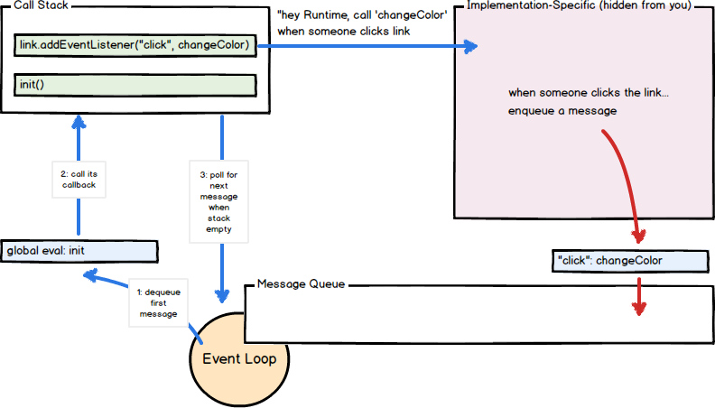
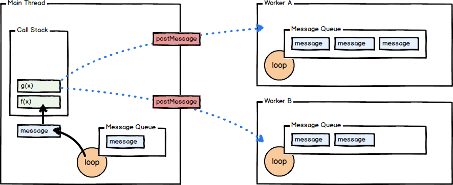

# Message Queue and Event Loop

JavaScript runtimes contain a message queue which stores a list of messages to be processed and their associated callback functions. These messages are queued in response to external events (such as a mouse being clicked or receiving the response to an HTTP request) given a callback function has been provided. If, for example a user were to click a button and no callback function was provided – no message would have been enqueued. In a loop, the queue is polled for the next message (each poll referred to as a “tick”) and when a message is encountered, the callback for that message is executed.



This callback function serves as the initial frame in the call stack, and due to JavaScript being single-threaded, further message polling and processing is halted pending the return of all calls on the stack. Subsequent (synchronous) function calls add new call frames to the stack (for example, function init calls function changeColor).

## Queuing Additional Messages

If a function called in your code is asynchronous (like setTimeout), the provided callback will ultimately be executed as part of a different queued message, on some future tick of the event loop. For example:

```js
function f() {
  console.log("foo");
  setTimeout(g, 0);
  console.log("baz");
  h();
}

function g() {
  console.log("bar");
}

function h() {
  console.log("blix");
}

f();
```

Due to the non-blocking nature of setTimeout, its callback will fire at least 0 milliseconds in the future and is not processed as part of this message. In this example, setTimeout is invoked, passing a callback function g and a timeout of 0 milliseconds. When the specified time elapses (in this case, almost instantly) a separate message will be enqueued containing g as its callback function. The resulting console activity would look like: “foo”, “baz”, “blix” and then on the next tick of the event loop: “bar”. If in the same call frame two calls are made to setTimeout – passing the same value for a second argument – their callbacks will be queued in the order of invocation.

## Web Workers

Using Web Workers enables you to offload an expensive operation to a separate thread of execution, freeing up the main thread to do other things. The worker includes a separate message queue, event loop, and memory space independent from the original thread that instantiated it. Communication between the worker and the main thread is done via message passing, which looks very much like the traditional, evented code-examples we’ve already seen.



First, our worker:

```js
// our worker, which does some CPU-intensive operation
var reportResult = function (e) {
  pi = SomeLib.computePiToSpecifiedDecimals(e.data);
  postMessage(pi);
};

onmessage = reportResult;
```

Then, the main chunk of code that lives in a script-tag in our HTML:

```js
// our main code, in a <script>-tag in our HTML page
var piWorker = new Worker("pi_calculator.js");
var logResult = function (e) {
  console.log("PI: " + e.data);
};

piWorker.addEventListener("message", logResult, false);
piWorker.postMessage(100000);
```

In this example, the main thread spawns a worker and registers the logResult callback function to the its “message” event. In the worker, the reportResult function is registered to its own “message” event. When the worker thread receives the message from the main thread, the worker enqueues a message and corresponding reportResult callback. When dequeued, a message is posted back to the main thread where a new message is enqueued (along with the logResult callback). In this way the developer can delegate CPU-intensive operations to a separate thread, freeing the main thread up to continue processing messages and handling events.

## A Note on Closures

JavaScript’s support for closures allow you to register callbacks that, when executed, maintain access to the environment in which they were created even though the execution of the callback creates a new call stack entirely. This is particularly of interest knowing that our callbacks are called as part of a different message than the one in which they were created. Consider the following example:

```js
function changeHeaderDeferred() {
  var header = document.getElementById("header");

  setTimeout(function changeHeader() {
    header.style.color = "red";

    return false;
  }, 100);

  return false;
}

changeHeaderDeferred();
```

In this example, the changeHeaderDeferred function is executed which includes variable header. The function setTimeout is invoked, which causes a message (plus the changeHeader callback) to be added to the message queue approximately 100 milliseconds in the future. The changeHeaderDeferred function then returns false, ending the processing of the first message – but the header variable is still referenced via a closure and is not garbage collected. When the second message is processed (the changeHeader function) it maintains access to the header variable declared in the outer function’s scope. Once the second message (the changeHeader function) is processed, the header variable can be garbage collected.
