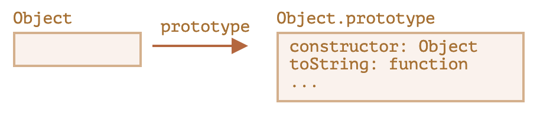
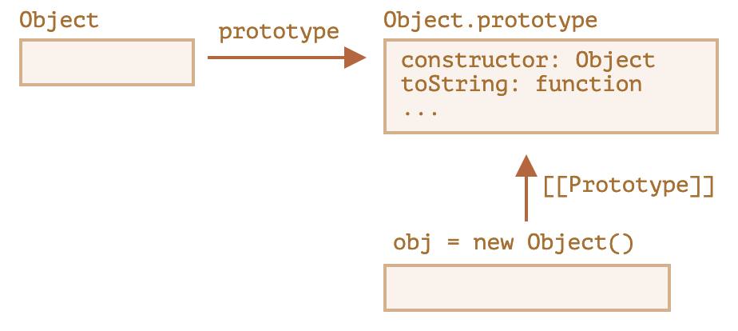
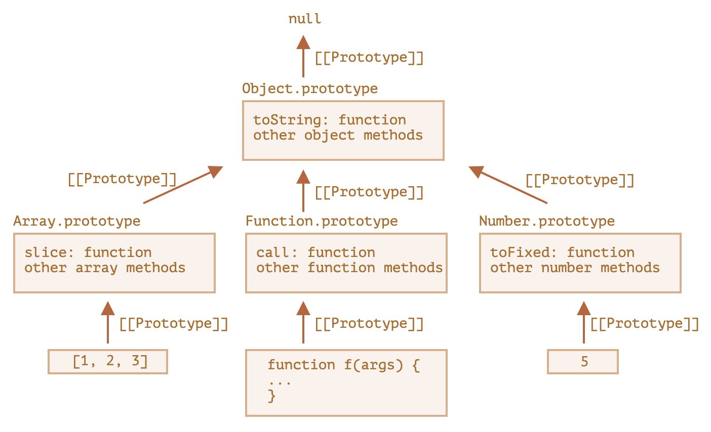

# Native Prototype

## Object.prototype

Let’s say we output an empty object:

```javascript
let obj = {};
alert(obj); // "[object Object]" ?
```

Where’s the code that generates the string `"[object Object]"`? That’s a built-in `toString` method, but where is it? The `obj` is empty!

…But the short notation `obj = {}` is the same as `obj = new Object()`, where `Object` is a built-in object constructor function, with its own `prototype` referencing a huge object with `toString` and other methods.

Here’s what’s going on:



When `new Object()` is called (or a literal object `{...}` is created), the `[[Prototype]]` of it is set to `Object.prototype`



So then when `obj.toString()` is called the method is taken from `Object.prototype`.

We can check it like this:

```javascript
let obj = {};

alert(obj.__proto__ === Object.prototype); // true

alert(obj.toString === obj.__proto__.toString); //true
alert(obj.toString === Object.prototype.toString); //true
```

Please note that there is no more `[[Prototype]]` in the chain above `Object.prototype`:

```javascript
alert(Object.prototype.__proto__); // null
```

## Other built-in prototypes

Other built-in objects such as `Array`, `Date`, `Function` and others also keep methods in prototypes.

For instance, when we create an array `[1, 2, 3]`, the default `new Array()` constructor is used internally. So `Array.prototype` becomes its prototype and provides methods. That’s very memory-efficient.

By specification, all of the built-in prototypes have `Object.prototype` on the top. That’s why some people say that “everything inherits from objects”.

Here’s the overall picture (for 3 built-ins to fit):



Let’s check the prototypes manually:

```javascript
let arr = [1, 2, 3];

// it inherits from Array.prototype?
alert(arr.__proto__ === Array.prototype); // true

// then from Object.prototype?
alert(arr.__proto__.__proto__ === Object.prototype); // true

// and null on the top.
alert(arr.__proto__.__proto__.__proto__); // null
```

Some methods in prototypes may overlap, for instance, `Array.prototype` has its own `toString` that lists comma-delimited elements:

```javascript
let arr = [1, 2, 3];
alert(arr); // 1,2,3 <-- the result of Array.prototype.toString
```

As we’ve seen before, `Object.prototype` has `toString` as well, but `Array.prototype` is closer in the chain, so the array variant is used.

## Primitives

The most intricate thing happens with strings, numbers and booleans.

As we remember, they are not objects. But if we try to access their properties, temporary wrapper objects are created using built-in constructors `String`, `Number` and `Boolean`. They provide the methods and disappear.

These objects are created invisibly to us and most engines optimize them out, but the specification describes it exactly this way. Methods of these objects also reside in prototypes, available as `String.prototype`, `Number.prototype` and `Boolean.prototype`.

## Changing native prototypes

Native prototypes can be modified. For instance, if we add a method to `String.prototype`, it becomes available to all strings:

```javascript
String.prototype.show = function () {
  alert(this);
};

"BOOM!".show(); // BOOM!
```

During the process of development, we may have ideas for new built-in methods we’d like to have, and we may be tempted to add them to native prototypes. But that is generally a bad idea.

**In modern programming, there is only one case where modifying native prototypes is approved. That’s polyfilling.**

Polyfilling is a term for making a substitute for a method that exists in the JavaScript specification, but is not yet supported by a particular JavaScript engine.

We may then implement it manually and populate the built-in prototype with it.

For instance:

```javascript
if (!String.prototype.repeat) {
  // if there's no such method
  // add it to the prototype

  String.prototype.repeat = function (n) {
    // repeat the string n times

    // actually, the code should be a little bit more complex than that
    // (the full algorithm is in the specification)
    // but even an imperfect polyfill is often considered good enough
    return new Array(n + 1).join(this);
  };
}

alert("La".repeat(3)); // LaLaLa
```

## Prototype methods, objects without **proto**

Setting or reading the prototype with `obj.__proto__` is considered outdated and somewhat deprecated (moved to the so-called “Annex B” of the JavaScript standard, meant for browsers only).

The modern methods to get/set a prototype are:

- [Object.getPrototypeOf(obj)](https://developer.mozilla.org/en-US/docs/Web/JavaScript/Reference/Global_Objects/Object/getPrototypeOf) – returns the `[[Prototype]]` of `obj`.
- [Object.setPrototypeOf(obj, proto)](https://developer.mozilla.org/en-US/docs/Web/JavaScript/Reference/Global_Objects/Object/setPrototypeOf) – sets the `[[Prototype]]` of `obj` to `proto`.

The only usage of `__proto__`, that’s not frowned upon, is as a property when creating a new object: `{ __proto__: ... }`.

Although, there’s a special method for this too:

- [Object.create(proto[, descriptors])](https://developer.mozilla.org/en-US/docs/Web/JavaScript/Reference/Global_Objects/Object/create) – creates an empty object with given `proto` as `[[Prototype]]` and optional property descriptors.

For instance:

```javascript
let animal = {
  eats: true,
};

// create a new object with animal as a prototype
let rabbit = Object.create(animal); // same as {__proto__: animal}

alert(rabbit.eats); // true

alert(Object.getPrototypeOf(rabbit) === animal); // true

Object.setPrototypeOf(rabbit, {}); // change the prototype of rabbit to {}
```

The `Object.create` method is a bit more powerful, as it has an optional second argument: property descriptors.

We can provide additional properties to the new object there, like this:

```javascript
let animal = {
  eats: true,
};

let rabbit = Object.create(animal, {
  jumps: {
    value: true,
  },
});

alert(rabbit.jumps); // true
```

We can use `Object.create` to perform an object cloning more powerful than copying properties in `for..in`:

```javascript
let clone = Object.create(
  Object.getPrototypeOf(obj),
  Object.getOwnPropertyDescriptors(obj)
);
```

This call makes a truly exact copy of `obj`, including all properties: enumerable and non-enumerable, data properties and setters/getters – everything, and with the right `[[Prototype]]`.

## Brief history

There’re so many ways to manage `[[Prototype]]`. How did that happen? Why?

That’s for historical reasons.

The prototypal inheritance was in the language since its dawn, but the ways to manage it evolved over time.

- The `prototype` property of a constructor function has worked since very ancient times. It’s the oldest way to create objects with a given prototype.
- Later, in the year 2012, `Object.create` appeared in the standard. It gave the ability to create objects with a given prototype, but did not provide the ability to get/set it. Some browsers implemented the non-standard `__proto__` accessor that allowed the user to get/set a prototype at any time, to give more flexibility to developers.
- Later, in the year 2015, `Object.setPrototypeOf` and `Object.getPrototypeOf` were added to the standard, to perform the same functionality as `__proto__`. As `__proto__` was de-facto implemented everywhere, it was kind-of deprecated and made its way to the Annex B of the standard, that is: optional for non-browser environments.
- Later, in the year 2022, it was officially allowed to use `__proto__` in object literals `{...}` (moved out of Annex B), but not as a getter/setter `obj.__proto__` (still in Annex B).
