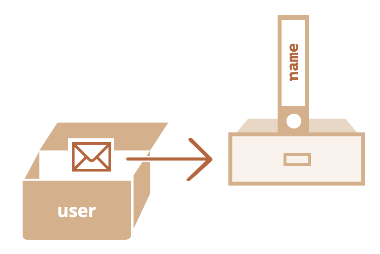
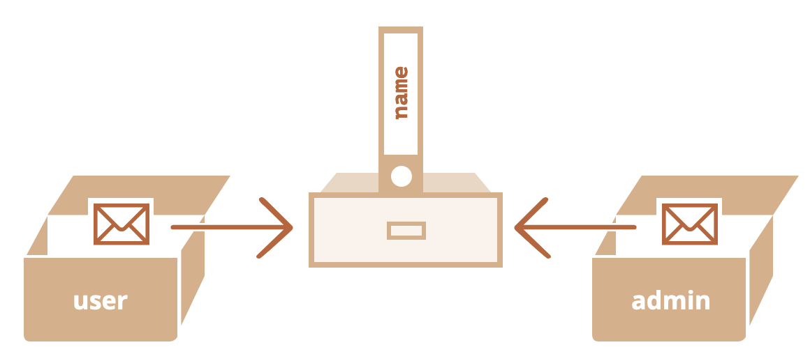

# Object

## Computed properties

We can use square brackets in an object literal, when creating an object. That’s called _computed properties_.

For instance:

```javascript
let fruit = prompt("Which fruit to buy?", "apple");

let bag = {
  [fruit]: 5, // the name of the property is taken from the variable fruit
};

alert(bag.apple); // 5 if fruit="apple"
```

The meaning of a computed property is simple: `[fruit]` means that the property name should be taken from `fruit`.

So, if a visitor enters `"apple"`, `bag` will become `{apple: 5}`.

Essentially, that works the same as:

```javascript
let fruit = prompt("Which fruit to buy?", "apple");
let bag = {};

// take property name from the fruit variable
bag[fruit] = 5;
```

…But looks nicer.

We can use more complex expressions inside square brackets:

```javascript
let fruit = "apple";
let bag = {
  [fruit + "Computers"]: 5, // bag.appleComputers = 5
};
```

Square brackets are much more powerful than dot notation. They allow any property names and variables. But they are also more cumbersome to write.

So most of the time, when property names are known and simple, the dot is used. And if we need something more complex, then we switch to square brackets.

## Object references and copying

One of the fundamental differences of objects versus primitives is that objects are stored and copied “by reference”, whereas primitive values: strings, numbers, booleans, etc – are always copied “as a whole value”.

That’s easy to understand if we look a bit under the hood of what happens when we copy a value.

Let’s start with a primitive, such as a string.

Here we put a copy of `message` into `phrase`:

```javascript
let message = "Hello!";
let phrase = message;
```

As a result we have two independent variables, each one storing the string `"Hello!"`.

Quite an obvious result, right?

Objects are not like that.

**A variable assigned to an object stores not the object itself, but its “address in memory” – in other words “a reference” to it.**

Let’s look at an example of such a variable:

```javascript
let user = {
  name: "John",
};
```

And here’s how it’s actually stored in memory:



The object is stored somewhere in memory (at the right of the picture), while the `user` variable (at the left) has a “reference” to it.

We may think of an object variable, such as `user`, like a sheet of paper with the address of the object on it.

When we perform actions with the object, e.g. take a property `user.name`, the JavaScript engine looks at what’s at that address and performs the operation on the actual object.

Now here’s why it’s important.

**When an object variable is copied, the reference is copied, but the object itself is not duplicated.**

For instance:

```javascript
let user = { name: "John" };

let admin = user; // copy the reference
```

Now we have two variables, each storing a reference to the same object:


As you can see, there’s still one object, but now with two variables that reference it.

We can use either variable to access the object and modify its contents:

```javascript
let user = { name: "John" };

let admin = user;

admin.name = "Pete"; // changed by the "admin" reference

alert(user.name); // 'Pete', changes are seen from the "user" reference
```

It’s as if we had a cabinet with two keys and used one of them (`admin`) to get into it and make changes. Then, if we later use another key (`user`), we are still opening the same cabinet and can access the changed contents.

## Comparison by reference

Two objects are equal only if they are the same object.

For instance, here `a` and `b` reference the same object, thus they are equal:

```javascript
let a = {};
let b = a; // copy the reference

alert(a == b); // true, both variables reference the same object
alert(a === b); // true
```

And here two independent objects are not equal, even though they look alike (both are empty):

```javascript
let a = {};
let b = {}; // two independent objects

alert(a == b); // false
```

For comparisons like `obj1 > obj2` or for a comparison against a primitive `obj == 5`, objects are converted to primitives. We’ll study how object conversions work very soon, but to tell the truth, such comparisons are needed very rarely – usually they appear as a result of a programming mistake.

## Cloning and merging, Object.assign

So, copying an object variable creates one more reference to the same object.

But what if we need to duplicate an object?

We can create a new object and replicate the structure of the existing one, by iterating over its properties and copying them on the primitive level.

Like this:

```javascript
let user = {
  name: "John",
  age: 30,
};

let clone = {}; // the new empty object

// let's copy all user properties into it
for (let key in user) {
  clone[key] = user[key];
}

// now clone is a fully independent object with the same content
clone.name = "Pete"; // changed the data in it

alert(user.name); // still John in the original object
```

We can also use the method [Object.assign](https://developer.mozilla.org/en-US/docs/Web/JavaScript/Reference/Global_Objects/Object/assign).

The syntax is:

```javascript
Object.assign(dest, ...sources);
```

- The first argument `dest` is a target object.
- Further arguments is a list of source objects.

It copies the properties of all source objects into the target `dest`, and then returns it as the result.

For example, we have `user` object, let’s add a couple of permissions to it:

```javascript
let user = { name: "John" };

let permissions1 = { canView: true };
let permissions2 = { canEdit: true };

// copies all properties from permissions1 and permissions2 into user
Object.assign(user, permissions1, permissions2);

// now user = { name: "John", canView: true, canEdit: true }
alert(user.name); // John
alert(user.canView); // true
alert(user.canEdit); // true
```

If the copied property name already exists, it gets overwritten:

```javascript
let user = { name: "John" };

Object.assign(user, { name: "Pete" });

alert(user.name); // now user = { name: "Pete" }
```

We also can use `Object.assign` to perform a simple object cloning:

```javascript
let user = {
  name: "John",
  age: 30,
};

let clone = Object.assign({}, user);

alert(clone.name); // John
alert(clone.age); // 30
```

Here it copies all properties of `user` into the empty object and returns it.

There are also other methods of cloning an object, e.g. using the spread syntax) `clone = {...user}`.

It is possible to do the same thing with the spread syntax.

```javascript
let arr = [1, 2, 3];

let arrCopy = [...arr]; // spread the array into a list of parameters
// then put the result into a new array

// do the arrays have the same contents?
alert(JSON.stringify(arr) === JSON.stringify(arrCopy)); // true

// are the arrays equal?
alert(arr === arrCopy); // false (not same reference)

// modifying our initial array does not modify the copy:
arr.push(4);
alert(arr); // 1, 2, 3, 4
alert(arrCopy); // 1, 2, 3
```

Note that it is possible to do the same thing to make a copy of an object:

```javascript
let obj = { a: 1, b: 2, c: 3 };

let objCopy = { ...obj }; // spread the object into a list of parameters
// then return the result in a new object

// do the objects have the same contents?
alert(JSON.stringify(obj) === JSON.stringify(objCopy)); // true

// are the objects equal?
alert(obj === objCopy); // false (not same reference)

// modifying our initial object does not modify the copy:
obj.d = 4;
alert(JSON.stringify(obj)); // {"a":1,"b":2,"c":3,"d":4}
alert(JSON.stringify(objCopy)); // {"a":1,"b":2,"c":3}
```

This way of copying an object is much shorter than `let objCopy = Object.assign({}, obj)` or for an array `let arrCopy = Object.assign([], arr)` so we prefer to use it whenever we can.

## Nested cloning

Until now we assumed that all properties of `user` are primitive. But properties can be references to other objects.

Like this:

```javascript
let user = {
  name: "John",
  sizes: {
    height: 182,
    width: 50,
  },
};

alert(user.sizes.height); // 182
```

Now it’s not enough to copy `clone.sizes = user.sizes`, because `user.sizes` is an object, and will be copied by reference, so `clone` and `user` will share the same sizes:

```javascript
let user = {
  name: "John",
  sizes: {
    height: 182,
    width: 50,
  },
};

let clone = Object.assign({}, user);

alert(user.sizes === clone.sizes); // true, same object

// user and clone share sizes
user.sizes.width = 60; // change a property from one place
alert(clone.sizes.width); // 60, get the result from the other one
```

To fix that and make `user` and `clone` truly separate objects, we should use a cloning loop that examines each value of `user[key]` and, if it’s an object, then replicate its structure as well. That is called a “deep cloning” or “structured cloning”. There’s [structuredClone](https://developer.mozilla.org/en-US/docs/Web/API/structuredClone) method that implements deep cloning.

### structuredClone

The call `structuredClone(object)` clones the `object` with all nested properties.

Here’s how we can use it in our example:

```javascript
let user = {
  name: "John",
  sizes: {
    height: 182,
    width: 50,
  },
};

let clone = structuredClone(user);

alert(user.sizes === clone.sizes); // false, different objects

// user and clone are totally unrelated now
user.sizes.width = 60; // change a property from one place
alert(clone.sizes.width); // 50, not related
```

The `structuredClone` method can clone most data types, such as objects, arrays, primitive values.

It also supports circular references, when an object property references the object itself (directly or via a chain or references).

For instance:

```javascript
let user = {};
// let's create a circular reference:
// user.me references the user itself
user.me = user;

let clone = structuredClone(user);
alert(clone.me === clone); // true
```

As you can see, `clone.me` references the `clone`, not the `user`! So the circular reference was cloned correctly as well.

Although, there are cases when `structuredClone` fails.

For instance, when an object has a function property:

```javascript
// error
structuredClone({
  f: function () {},
});
```

Function properties aren’t supported.

To handle such complex cases we may need to use a combination of cloning methods, write custom code or, to not reinvent the wheel, take an existing implementation, for instance [\_.cloneDeep(obj)](https://lodash.com/docs#cloneDeep) from the JavaScript library [lodash](https://lodash.com).

## Property flags and descriptors

As we know, objects can store properties.

Until now, a property was a simple “key-value” pair to us. But an object property is actually a more flexible and powerful thing.

In this chapter we’ll study additional configuration options, and in the next we’ll see how to invisibly turn them into getter/setter functions.

## Property flags

Object properties, besides a **`value`**, have three special attributes (so-called “flags”):

- **`writable`** – if `true`, the value can be changed, otherwise it’s read-only.
- **`enumerable`** – if `true`, then listed in loops, otherwise not listed.
- **`configurable`** – if `true`, the property can be deleted and these attributes can be modified, otherwise not.

We didn’t see them yet, because generally they do not show up. When we create a property “the usual way”, all of them are `true`. But we also can change them anytime.

First, let’s see how to get those flags.

The method [Object.getOwnPropertyDescriptor](https://developer.mozilla.org/en-US/docs/Web/JavaScript/Reference/Global_Objects/Object/getOwnPropertyDescriptor) allows to query the _full_ information about a property.

The syntax is:

```javascript
let descriptor = Object.getOwnPropertyDescriptor(obj, propertyName);
```

`obj`: The object to get information from.

`propertyName`: The name of the property.

The returned value is a so-called “property descriptor” object: it contains the value and all the flags.

For instance:

```javascript
let user = {
  name: "John",
};

let descriptor = Object.getOwnPropertyDescriptor(user, "name");

alert(JSON.stringify(descriptor, null, 2));
/* property descriptor:
{
  "value": "John",
  "writable": true,
  "enumerable": true,
  "configurable": true
}
*/
```

To change the flags, we can use [Object.defineProperty](https://developer.mozilla.org/en-US/docs/Web/JavaScript/Reference/Global_Objects/Object/defineProperty).

The syntax is:

```javascript
Object.defineProperty(obj, propertyName, descriptor);
```

`obj`, `propertyName`: The object and its property to apply the descriptor.

`descriptor`: Property descriptor object to apply.

If the property exists, `defineProperty` updates its flags. Otherwise, it creates the property with the given value and flags; in that case, if a flag is not supplied, it is assumed `false`.

For instance, here a property `name` is created with all falsy flags:

```javascript
let user = {};

Object.defineProperty(user, "name", {
  value: "John",
});

let descriptor = Object.getOwnPropertyDescriptor(user, "name");

alert(JSON.stringify(descriptor, null, 2));
/*
{
  "value": "John",
  "writable": false,
  "enumerable": false,
  "configurable": false
}
 */
```

Compare it with “normally created” `user.name` above: now all flags are falsy. If that’s not what we want then we’d better set them to `true` in `descriptor`.

Now let’s see effects of the flags by example.

## Non-writable

Let’s make `user.name` non-writable (can’t be reassigned) by changing `writable` flag:

```javascript
let user = {
  name: "John",
};

Object.defineProperty(user, "name", {
  writable: false,
});

user.name = "Pete"; // Error: Cannot assign to read only property 'name'
```

Now no one can change the name of our user, unless they apply their own `defineProperty` to override ours.

Here’s the same example, but the property is created from scratch:

```javascript
let user = {};

Object.defineProperty(user, "name", {
  value: "John",
  // for new properties we need to explicitly list what's true
  enumerable: true,
  configurable: true,
});

alert(user.name); // John
user.name = "Pete"; // Error
```

## Non-enumerable

Now let’s add a custom `toString` to `user`.

Normally, a built-in `toString` for objects is non-enumerable, it does not show up in `for..in`. But if we add a `toString` of our own, then by default it shows up in `for..in`, like this:

```javascript
let user = {
  name: "John",
  toString() {
    return this.name;
  },
};

// By default, both our properties are listed:
for (let key in user) alert(key); // name, toString
```

If we don’t like it, then we can set `enumerable:false`. Then it won’t appear in a `for..in` loop, just like the built-in one:

```javascript
let user = {
  name: "John",
  toString() {
    return this.name;
  },
};

Object.defineProperty(user, "toString", {
  enumerable: false,
});

// Now our toString disappears:
for (let key in user) alert(key); // name
```

Non-enumerable properties are also excluded from `Object.keys`:

```javascript
alert(Object.keys(user)); // name
```

## Non-configurable

The non-configurable flag (`configurable:false`) is sometimes preset for built-in objects and properties.

A non-configurable property can’t be deleted, its attributes can’t be modified.

For instance, `Math.PI` is non-writable, non-enumerable and non-configurable:

```javascript
let descriptor = Object.getOwnPropertyDescriptor(Math, "PI");

alert(JSON.stringify(descriptor, null, 2));
/*
{
  "value": 3.141592653589793,
  "writable": false,
  "enumerable": false,
  "configurable": false
}
*/
```

So, a programmer is unable to change the value of `Math.PI` or overwrite it.

```javascript
Math.PI = 3; // Error, because it has writable: false

// delete Math.PI won't work either
```

We also can’t change `Math.PI` to be `writable` again:

```javascript
// Error, because of configurable: false
Object.defineProperty(Math, "PI", { writable: true });
```

There’s absolutely nothing we can do with `Math.PI`.

Making a property non-configurable is a one-way road. We cannot change it back with `defineProperty`.

**Please note: `configurable: false` prevents changes of property flags and its deletion, while allowing to change its value.**

Here `user.name` is non-configurable, but we can still change it (as it’s writable):

```javascript
let user = {
  name: "John",
};

Object.defineProperty(user, "name", {
  configurable: false,
});

user.name = "Pete"; // works fine
delete user.name; // Error
```

And here we make `user.name` a “forever sealed” constant, just like the built-in `Math.PI`:

```javascript
let user = {
  name: "John",
};

Object.defineProperty(user, "name", {
  writable: false,
  configurable: false,
});

// won't be able to change user.name or its flags
// all this won't work:
user.name = "Pete";
delete user.name;
Object.defineProperty(user, "name", { value: "Pete" });
```

## Object.defineProperties

There’s a method [Object.defineProperties(obj, descriptors)](https://developer.mozilla.org/en-US/docs/Web/JavaScript/Reference/Global_Objects/Object/defineProperties) that allows to define many properties at once.

The syntax is:

```javascript
Object.defineProperties(obj, {
  prop1: descriptor1,
  prop2: descriptor2,
  // ...
});
```

For instance:

```javascript
Object.defineProperties(user, {
  name: { value: "John", writable: false },
  surname: { value: "Smith", writable: false },
  // ...
});
```

So, we can set many properties at once.

## Object.getOwnPropertyDescriptors

To get all property descriptors at once, we can use the method [Object.getOwnPropertyDescriptors(obj)](https://developer.mozilla.org/en-US/docs/Web/JavaScript/Reference/Global_Objects/Object/getOwnPropertyDescriptors).

Together with `Object.defineProperties` it can be used as a “flags-aware” way of cloning an object:

```javascript
let clone = Object.defineProperties({}, Object.getOwnPropertyDescriptors(obj));
```

Normally when we clone an object, we use an assignment to copy properties, like this:

```javascript
for (let key in user) {
  clone[key] = user[key];
}
```

…But that does not copy flags. So if we want a “better” clone then `Object.defineProperties` is preferred.

Another difference is that `for..in` ignores symbolic and non-enumerable properties, but `Object.getOwnPropertyDescriptors` returns _all_ property descriptors including symbolic and non-enumerable ones.

## Getters and setters

Accessor properties are represented by “getter” and “setter” methods. In an object literal they are denoted by `get` and `set`:

```javascript
let obj = {
  get propName() {
    // getter, the code executed on getting obj.propName
  },

  set propName(value) {
    // setter, the code executed on setting obj.propName = value
  },
};
```

The getter works when `obj.propName` is read, the setter – when it is assigned.

For instance, we have a `user` object with `name` and `surname`:

```javascript
let user = {
  name: "John",
  surname: "Smith",
};
```

Now we want to add a `fullName` property, that should be `"John Smith"`. Of course, we don’t want to copy-paste existing information, so we can implement it as an accessor:

```javascript
let user = {
  name: "John",
  surname: "Smith",

  get fullName() {
    return `${this.name} ${this.surname}`;
  },
};

alert(user.fullName); // John Smith
```

From the outside, an accessor property looks like a regular one. That’s the idea of accessor properties. We don’t _call_ `user.fullName` as a function, we _read_ it normally: the getter runs behind the scenes.

As of now, `fullName` has only a getter. If we attempt to assign `user.fullName=`, there will be an error:

```javascript
let user = {
  get fullName() {
    return `...`;
  },
};

user.fullName = "Test"; // Error (property has only a getter)
```

Let’s fix it by adding a setter for `user.fullName`:

```javascript
let user = {
  name: "John",
  surname: "Smith",

  get fullName() {
    return `${this.name} ${this.surname}`;
  },

  set fullName(value) {
    [this.name, this.surname] = value.split(" ");
  },
};

// set fullName is executed with the given value.
user.fullName = "Alice Cooper";

alert(user.name); // Alice
alert(user.surname); // Cooper
```

As the result, we have a “virtual” property `fullName`. It is readable and writable.

## Accessor descriptors

Descriptors for accessor properties are different from those for data properties.

For accessor properties, there is no `value` or `writable`, but instead there are `get` and `set` functions.

That is, an accessor descriptor may have:

- **`get`** – a function without arguments, that works when a property is read,
- **`set`** – a function with one argument, that is called when the property is set,
- **`enumerable`** – same as for data properties,
- **`configurable`** – same as for data properties.

For instance, to create an accessor `fullName` with `defineProperty`, we can pass a descriptor with `get` and `set`:

```javascript
let user = {
  name: "John",
  surname: "Smith",
};

Object.defineProperty(user, "fullName", {
  get() {
    return `${this.name} ${this.surname}`;
  },

  set(value) {
    [this.name, this.surname] = value.split(" ");
  },
});

alert(user.fullName); // John Smith

for (let key in user) alert(key); // name, surname
```

Please note that a property can be either an accessor (has `get/set` methods) or a data property (has a `value`), not both.

If we try to supply both `get` and `value` in the same descriptor, there will be an error:

```javascript
// Error: Invalid property descriptor.
Object.defineProperty({}, "prop", {
  get() {
    return 1;
  },

  value: 2,
});
```

## Smarter getters/setters

Getters/setters can be used as wrappers over “real” property values to gain more control over operations with them.

For instance, if we want to forbid too short names for `user`, we can have a setter `name` and keep the value in a separate property `_name`:

```javascript
let user = {
  get name() {
    return this._name;
  },

  set name(value) {
    if (value.length < 4) {
      alert("Name is too short, need at least 4 characters");
      return;
    }
    this._name = value;
  },
};

user.name = "Pete";
alert(user.name); // Pete

user.name = ""; // Name is too short...
```

So, the name is stored in `_name` property, and the access is done via getter and setter.

Technically, external code is able to access the name directly by using `user._name`. But there is a widely known convention that properties starting with an underscore `"_"` are internal and should not be touched from outside the object.

## Using for compatibility

One of the great uses of accessors is that they allow to take control over a “regular” data property at any moment by replacing it with a getter and a setter and tweak its behavior.

Imagine we started implementing user objects using data properties `name` and `age`:

```javascript
function User(name, age) {
  this.name = name;
  this.age = age;
}

let john = new User("John", 25);

alert(john.age); // 25
```

…But sooner or later, things may change. Instead of `age` we may decide to store `birthday`, because it’s more precise and convenient:

```javascript
function User(name, birthday) {
  this.name = name;
  this.birthday = birthday;
}

let john = new User("John", new Date(1992, 6, 1));
```

Now what to do with the old code that still uses `age` property?

We can try to find all such places and fix them, but that takes time and can be hard to do if that code is used by many other people. And besides, `age` is a nice thing to have in `user`, right?

Let’s keep it.

Adding a getter for `age` solves the problem:

```javascript
function User(name, birthday) {
  this.name = name;
  this.birthday = birthday;

  // age is calculated from the current date and birthday
  Object.defineProperty(this, "age", {
    get() {
      let todayYear = new Date().getFullYear();
      return todayYear - this.birthday.getFullYear();
    },
  });
}

let john = new User("John", new Date(1992, 6, 1));

alert(john.birthday); // birthday is available
alert(john.age); // ...as well as the age
```

Now the old code works too and we’ve got a nice additional property.
