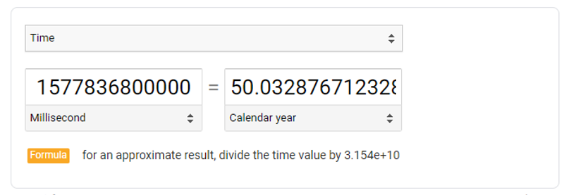
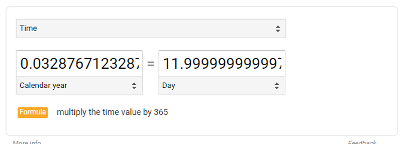
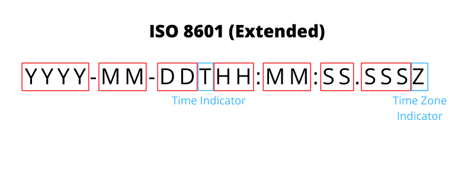
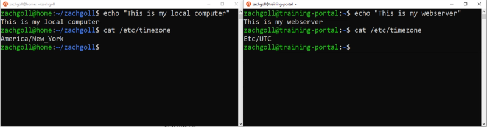
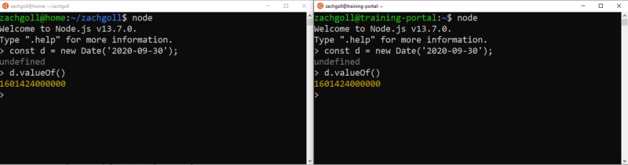
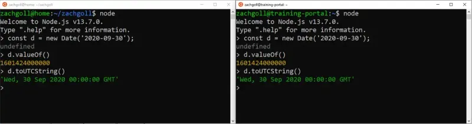
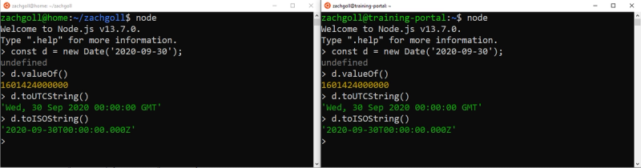
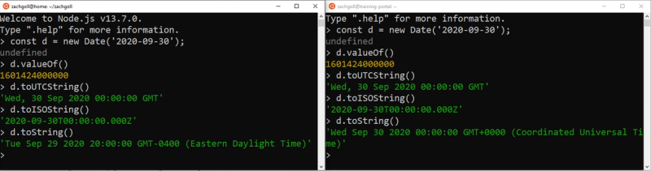

# Time

## What is UTC? (the key to understanding JavaScript dates)

UTC stands for “Coordinated Universal Time”, and per the name, it is the basis for how time is kept.

Before we had a record of time on our wrists, in our pockets, on our walls, and on our overpriced coffee makers, people needed a reliable way to calculate the current time. And how did they do that? The SUN.

Imagine sticking a perfectly vertical pole in the ground on a perfectly sunny day. When the sun rises, that pole is going to cast a shadow west, and conversely, will cast a shadow east as the sun sets. If you were to count how long it took for that shadow to move from point to point, you could (kind of) keep track of time.

**But there’s a problem…** If I put a vertical pole in the ground where I live in the U.S., the shadows aren’t going to be cast in the same direction at the same time as someone putting a pole in the ground somewhere in Ireland.

To solve this, we need a **common reference point** and a **time standard**. At some point, some scientific people thought that using 0° longitude (aka the “Prime Meridian”, which happens to be Greenwich UK) would be a good “universal reference point” to put that proverbial “pole in the ground”.

The next challenge is actually calculating “time” based on that “pole in the ground”. It used to be calculated using Greenwich Mean Time (The GMT Standard— started in 1847), but sometime in the early 1960’s, some engineers decided that we needed a new standard with a **more consistent calculation** than GMT.

In 1970, the **UTC standard** was finalized, but in 1972, an amendment was made to add “[leap seconds](https://en.wikipedia.org/wiki/Leap_second)” periodically in order to keep UTC in agreement with [mean solar time](https://en.wikipedia.org/wiki/Solar_time#Mean_solar_time) (which is slightly imprecise due to the irregularity of Earth’s rotation).

Today, there are 3 main calculations of “time” (which is starting to mean less and less to me as I write this):

1. Mean Solar Time (UT1)
2. Universally Coordinated Time (UTC)
3. International Atomic Time (TAI)

TAI is the most accurate and is calculated by [Atomic Clocks](https://en.wikipedia.org/wiki/Atomic_clock).

UTC is _derived from_ TAI, but has leap seconds added to it for the sake of staying synchronized with UT1.

In JavaScript, you’ll see GMT a lot, but it’s just a legacy term that never went away and can be thought of as the equivalent to UTC.

### Everything revolves around UTC

Since 1972, the world has been operating based on this UTC standard, and it is considered +/- 0 when talking about timezones.

If we move West of the UTC timezone, each successive timezone becomes 1 hour more negative, while the opposite applies while traveling East.

And as you might have guessed, since the world is a sphere, moving East eventually gets you to a “Western” timezone, so for example, the -10 timezone is equivalent to the +14 timezone.

### Timezones can be defined in two ways (and what about Daylight Savings Time?)

We can talk about timezones in two ways:

1. As a numerical reference to the “zero-point”, which is the UTC timezone
2. As a commonly known name, such as “UTC”, or “EST”

**The one thing that we HAVE to remember is that UTC does not change. EVER.**

I live in the Eastern part of the U.S., so from Nov 4th, 2019 → Mar 7, 2020, I lived in the EST timezone or the “Eastern Standard Time (North America)” zone from the [official timezone list](https://en.wikipedia.org/wiki/List_of_time_zone_abbreviations). The EST timezone could also be referred to as “UTC-05” because it is 5 hours West of the UTC timezone.

But what happens on March 8th, 2020— the first day of “Daylight Savings Time” in the U.S.?

**If UTC never changes, then how do we know it is Daylight Savings Time?**

On March 8th, 2020 (first day of Daylight Savings Time in U.S.), **my timezone changes from EST → EDT,** or “Eastern Standard Time (North America)” → “Eastern Daylight Time (North America)”.

EDT can also be referred to as “UTC-04” because we have “sprung forward” as a result of daylight savings time, and now, I am only 4 hours behind UTC.

See how that works?? UTC never changes, but the timezone you are living in DOES. To most, this doesn’t matter because when I say “The event starts at 10 a.m. EST”, nobody is going to question me whether I am talking about EST or EDT. Nobody cares because our smartphones take care of the “behind the scenes” conversions.

But as JavaScript developers, we are the ones writing those conversions, and therefore, should probably understand this stuff!

### But… My JavaScript date says “GMT-0400”

Remember — JavaScript is weird. And in its weirdness, it is still using the “GMT”, or “Greenwich Mean Time” to _represent_, **but not calculate** the dates.

In your brain, when you see “GMT”, just think “UTC”.

And when you see “GMT-0400”, this is the same thing as saying “UTC-04”, “EDT”, or “Eastern Daylight Time (North America)” as we defined in the previous section.

JavaScript was invented in the 90s, so I’m really not sure why they didn’t just use “UTC-0400” rather than “GMT-0400”, but that is a question for another day.

### But what about the UNIX Epoch?

So let’s get back to computers. You’ve certainly heard the term, “UNIX Epoch”, which is defined as January 1st, 1970.

Here it is in ISO 8601 format (more on this later):

```js
1970-01-01T00:00:00Z
```

While the “time” engineers were hard at work defining the UTC standard in the early 1970s, computer engineers were also hard at work building computers. When you build a computer, you have to give it a reference point and a “tick” frequency in order for it to remember what time it is. And that reference point was arbitrarily chosen as **midnight, January 1st, 1970.**

Several sources debate the true reason behind this date, but in the end, it doesn’t matter.

## So what is a JavaScript Date?

> A JavaScript date is the number of milliseconds that have passed since midnight on January 1st, 1970 (UTC timezone).

Hmm… That date sounds familiar…

When working with JavaScript dates, you must ALWAYS remember this definition. There are plenty of prototype functions on the Date object such as `getDate()`, `getUTCDate()`, and `toISOString`, but there is only 1 method that gives you the **true representation** of a JavaScript Date:

```js
const myDate = new Date("2020-01-01");

console.log(myDate.valueOf()); // 1577836800000
```

The `valueOf()` method tells us that midnight on January 1st, 2020 (UTC timezone) is `1577836800000` milliseconds after midnight on January 1st, 1970 (UTC timezone).



And if you’re like me, you are probably wondering about the `.032876712`part. This represents leap years. Since 1970, we’ve had leap years in the following years:

```js
1972, 1976, 1980, 1984, 1988, 1992, 1996, 2000, 2004, 2008, 2012, 2016, 2020;
```

Since we are using January 1st, 2020, and the extra day gets added in February, we need to _exclude_ the 2020 leap year in the calc, which leaves us with **12 total leap years** since Jan 1st, 1970. And if we convert years to days:



And that’s how we get those extra decimals 😆

So if we wanted to calculate a date **before** January 1st, 1970, is that possible?

Of course! The value will just be negative.

```js
const d = new Date("1912-06-23");

console.log(d.valueOf()); // -1815350400000
```

### Possible Date Object Output Values

When we printed the `valueOf()` the date above, you might have noticed that the output was a number. This is the first of 3 possible outputs of a Date object:

1. Primitive Value of Date Object (number)
2. ISO 8601 (string)
3. JavaScript Standard Format (string)

Here are examples of each:

```js
const myDate = new Date("2020-09-30");

// Primitive value (number)
myDate.valueOf(); // 1601424000000

// ISO 8601 (string)
myDate.toISOString(); // "2020-09-30T00:00:00.000Z"

// JavaScript Standard Format (string)
myDate.toString(); // "Tue Sep 29 2020 20:00:00 GMT-0400 (Eastern Daylight Time)"
```

The primitive value of a JavaScript Date is straightforward. As we discussed, it represents the number of milliseconds since midnight on Jan 1st, 1970 (UTC timezone), which is a number value.

The ISO 8601 format is a bit more confusing, but once you break out the pieces, it doesn’t look as intimidating. ISO 8601 actually has nothing to do with JavaScript — it’s a [global standard](https://en.wikipedia.org/wiki/ISO_8601) for times and dates (more on this in the Appendix if you are interested).

#### JavaScript ISO 8601 Format



We’ll talk a little more about this format later, but for now, just remember that the `T` is the indicator for time, while the `Z` is the indicator of timezone. In this case, “Z” comes from “Zulu Time”, which is a [military time zone reference](https://en.wikipedia.org/wiki/List_of_military_time_zones) for the **UTC timezone**. So remember:

```js
Z === “Zulu Time” (military) === UTC time (JavaScript)
```

Every time you use the `toISOString()` on a JavaScript Date object, you will ALWAYS get a UTC representation of the date, indicated by `Z`.

**Last but not least —** the JavaScript standard date format.

In my opinion, this is the most confusing output of them all. The primitive value prints the number of milliseconds since the epoch, which is easy to grasp. The ISO 8601 value prints the date value represented in a standardized format that never changes. But the JavaScript standard format? It not only prints a time zone that we still haven’t talked a lot about, but it also produces unexpected results as shown above.

## A Tale of Two Computers (and why they can’t seem to agree on what date it is!)

At the beginning of this post, **before we knew anything about UTC**, I showed an example of how JavaScript dates can _appear_ different depending on the computer that you are using, and that computer’s timezone.

In this section, we are going to be using two computers and a single date (Sep 30, 2020 — the day of writing) to demonstrate exactly why your date is “off by 1”.

Here are two **different computers with different timezones** as shown in the screenshot below. Notice how the timezones printed look a bit different than the timezones we talked about earlier. That is because there are two official timezone lists — a [“regular” one](https://en.wikipedia.org/wiki/List_of_time_zone_abbreviations) and a [“computer” one](https://en.wikipedia.org/wiki/List_of_tz_database_time_zones). In the first part of the post, we used the “regular” list, while below, we are using the “computer” list. There is no real difference, just semantics.



So **remember as we go through these examples:**


Let’s start with a simple date and getting the primitive value of it.



So far, so good. We passed the value `&#x27;2020-09-30&#x27;` as an input, and got the same output — `1601424000000`.

Now, let’s see what happens when we print this as UTC time:



Still looking good here. As expected, they are showing the same values. Let’s look at this as an ISO string, which should be the same thing as a UTC string.



And yet again, we get the same value, as expected. But now it’s time for the real fun:



And this right here is why JavaScript dates confuse so many people (including my former self).

Let’s think through this… We know the following things:

- We used an input value of `2020-09-30`
- The primitive value of the JavaScript date is `1601424000000` milliseconds since midnight, Jan 1st, 1970 (UTC time)
- If we convert the primitive value to UTC time, it represents midnight, Sep 30th, 2020.

So what we can conclude here is that **some of the JavaScript date methods** output the **“true” value** of the internally stored date **while other methods** output the **“relative” value** of the internally stored date **based on the timezone** of the computer that is printing the value.

Remember, the computer on the left is in the EDT timezone, which is “UTC-04”.

So if the internal value of this date is `160142400000`(midnight, Sep 30th, 2020 UTC time), then if we convert this value to EDT time, we have to subtract 4 hours. If we subtract 4 hours starting at midnight, then the “relative” timezone value of this date is 8 p.m. (i.e. 20:00), Sep 29th, 2020.

## Okay, I get it, but why does JavaScript do it this way?

So here’s how JavaScript dates work:

1. You enter a value such as `2020-09-30`
2. JavaScript assumes that this value is UTC time
3. JavaScript stores it as UTC time
4. JavaScript outputs it in your local time when using the `toString()` method or when you `console.log` the date

The real question is… If JavaScript assumes that you are inputting a UTC value, then why doesn’t it assume you want a UTC value outputted?

Well, in JavaScript’s eyes, when you typed `2020-09-30`, you weren’t specific enough.

So let’s talk about how we can avoid this problem.

## How to think about JavaScript Dates

When working with JavaScript dates, we need to ask ourselves the following questions:

1. What was my **input value**, and did I specify a timezone? (i.e. `2020-09-30` vs. `2020–09–30 GMT-0400`)
2. What is the UTC value of my date? (you can always find this using `.toISOString()` )
3. What JavaScript method am I using to display the date, and what timezone will it output my value as?

Let’s say that you are building an app that allows your user to specify their birthday in their user profile. And imagine that our user’s birthday is on June 28th, 1971, and they live in Florida (Eastern time zone).

The user has selected June 28th, but your web app is showing June 27th when printed as a string 😢

Here’s the code for that web app — let’s see if you can spot the mistake:

```js
const dateValue = dateInput.value; // Notice that we are grabbing the raw value, not the date value
const userSpecifiedTimezone = "EDT"; // Assume, this was selected by the user

// The date value is now a string, so grab the pieces
const dateParts = dateValue.split("-");
const year = dateParts[0];
const month = dateParts[1];
const day = dateParts[2];

// Construct a new JS date using the individual pieces and timezone specification
const dateWithTimezone = new Date(
  year + "-" + month + "-" + day + " " + userSpecifiedTimezone
);

// Use the 'localized' Date methods to get the new date values
const convertedYear = dateWithTimezone.getFullYear();
const convertedMonth = dateWithTimezone.getMonth() + 1; // Month is zero-indexed
const convertedDay = dateWithTimezone.getDate();

// Format it however you want
document.querySelector("#string-val").innerHTML =
  convertedYear +
  "-" +
  convertedMonth +
  "-" +
  convertedDay +
  " (year-month-day)";
};
```

Let’s go through our checklist from earlier:

1. **What is the input value, and did I specify a timezone?** —By default, the HTML5 input is going to record the date selection in UTC. So technically, we are specifying a timezone, but it is the default — UTC.
2. **What is the UTC value of this date?** — If you were to print `console.log(dateValue.toISOString())`, you would get `1971-06-28T00:00:00.000Z`, which represents the UTC value.
3. **What JavaScript method am I using to display the date?** — This is where we went wrong. Our input value was recorded in UTC, but since we used the `getDate()`, `getMonth()`, and `getFullYear()` methods, these will convert the raw date into the user’s local timezone, which is the Eastern Standard Timezone (North America)!

**So how do we fix it?**

There are two methods:

1. Easiest — Display the date in UTC time (consistent with how it was input)
2. Harder (not recommended) — Ask the user their timezone, and specify that timezone when you save the date

With the first method, all you need to do is change this:

```js
const day = dateValue.getDate();
const month = dateValue.getMonth() + 1; // Return Value is 0 indexed
const year = dateValue.getFullYear();
```

to this:

```js
const day = dateValue.getUTCDate();
const month = dateValue.getUTCMonth() + 1; // Return Value is 0 indexed
const year = dateValue.getUTCFullYear();
```

And after these changes, voila! It works!

The second method is more complicated, but could still work. Let’s say that you asked this user to select their time zone, and they selected the “EDT — Eastern Daylight Time (North America)” time zone.

## The many ways of using JavaScript dates

The example in the previous section highlights a specific “gotcha” scenario, but there are many other ways to work with JS dates.

For example, you can pass pretty much anything into the Date object:

```js
// EXAMPLE #1
// Inputs as arguments
// Date(year, month, day, hour, minute, second, millisecond)
// Note: the month is 0-indexed (I have no clue why...)
new Date(2020, 11, 2, 7, 10);

// EXAMPLE #2
// Inputs as various strings
// This works with pretty much anything you can think of
new Date("Jan 20 2020");
new Date("January 20 2020");
new Date("Jan-20-2020");
new Date("Jan 20 2020 02:20:10");

// EXAMPLE #3
// Inputs as numbers (milliseconds)
new Date(102031203);

// EXAMPLE #4
// Inputs as ISO 8601 (we are about to talk about this)
new Date("2020-01-20T00:00Z");

// EXAMPLE #5
// Inputs with timezone specifications
new Date("Jan 20 2020 02:20:10 -10:00"); // SPECIAL CASE
new Date("Jan 20 2020 02:20:10 -1000"); // SPECIAL CASE
new Date("Jan 20 2020 02:20:10 (EDT)"); // SPECIAL CASE

// EXAMPLE #6
// The current moment, specified in the user's local timezone
new Date(Date.now()); // SPECIAL CASE
```

Remember, always pay attention to your input values! In examples 1–4, we are specifying these dates in UTC time! Examples 5 and 6 are the only cases where we are specifying the dates according to a specific timezone. In example 5, we are doing so explicitly. In example 6, the `Date.now()` static method will automatically calculate the current date and time in your computer’s local timezone. This method returns a native Date value — the number of milliseconds since midnight, Jan 1st 1970 UTC, so we need to pass that into the `Date()` constructor to get an actual date object.

In other words, if you are planning a Livestream event that is happening in California on August 10, 2020 (remember, this is during Daylight Savings Time) at 8 pm, then you need to input it as (where PDT is Pacific Daylight Time):

```js
const myEventDate = new Date("Aug 10 2020 08:00:00 PDT");
```

and display it as:

```js
myEventDate.toString();
```

This will ensure that whoever reads this from their personal computer (in a different timezone) will have this Livestream event time and date displayed in their local time. Feel free to try it yourself! The output of `myEventDate.toString()` should print the time and date of the event converted to YOUR timezone.

## Appendix: A Primer on ISO 8601 (optional)

Remember, the 3 possible output formats for JavaScript Dates are:

1. Primitive Value of Date Object (number)
2. ISO 8601 (string)
3. JavaScript Standard Format (string)

In this appendix, we’ll dive deeper into the ISO 8601 standard format.

Just like UTC is not a JavaScript-specific concept, neither is ISO 8601.

ISO 8601 is an [international standard](https://en.wikipedia.org/wiki/ISO_8601), and comes in two main variations:

1. Basic
2. Extended

JavaScript uses the “Extended” variation, which simply means that there are delimiters between different types of values. For example, let’s look at a “Basic” version of a date and time:

```js
20200930T000000.000Z
```

This represents midnight, UTC time on September 30, 2020 using the “Basic” format of the ISO 8601 standard. But it is not very readable, and JavaScript doesn’t accept it.

The only difference between “Basic” and “Extended” variations of ISO 8601 is the use of delimiters. Here is the same date in “Extended” format:

```js
2020-09-30T00:00:00.000Z
```

And in this case, JavaScript accepts it as valid. The result is Sep 29th because my browser is converting UTC (midnight, Sep 30) to EST (8pm, Sep 29). It makes this conversion because I live in the EST timezone (explained in main post).


Most of this is self-explanatory. `YYYY` represents the full year, `MM` represents the month padded with zeroes if necessary (i.e. `01` for January), and`DD` represents the day padded with zeroes if necessary.

The `T` is simply an indicator that “we are about to enter time values rather than date values”.

Again, `HH` , `MM`, `SS`, and `SSS` represent hours, minutes, seconds, and milliseconds respectively.

The `Z` represents the UTC time zone. Anytime you add that `Z` to the end of your ISO date string, your date will be interpreted as UTC time. If you leave it off, the date will be interpreted as local time.

The last thing you need to know about ISO 8601 strings is that they are flexible. You can _reduce_ specificity with them. For example, all of the following ISO strings are valid:

```js
new Date("2020Z"); // 2020-01-01T00:00:00.000Z
new Date("2020-05Z"); // 2020-05-01T00:00:00.000Z
new Date("2020-05-10T00:00Z"); // 2020-05-10T00:00:00.000Z
```

And if we drop that `Z`, the dates are still valid, but they are interpreted as local time.

```js
// Adding the Z interprets dates as UTC time
new Date("2020-05-10T00:00Z"); // 2020-05-10T00:00:00.000Z

// Dropping the Z interprets dates as local time
new Date("2020-05-10T00:00"); // 2020-05-10T04:00:00.000Z
```
