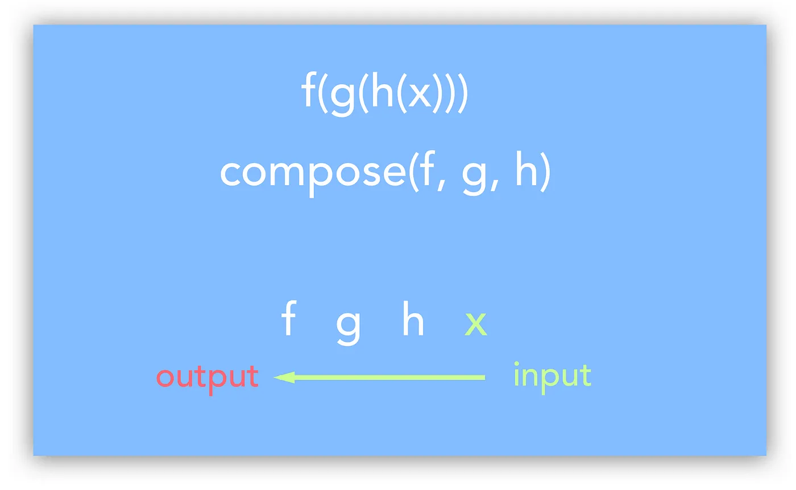
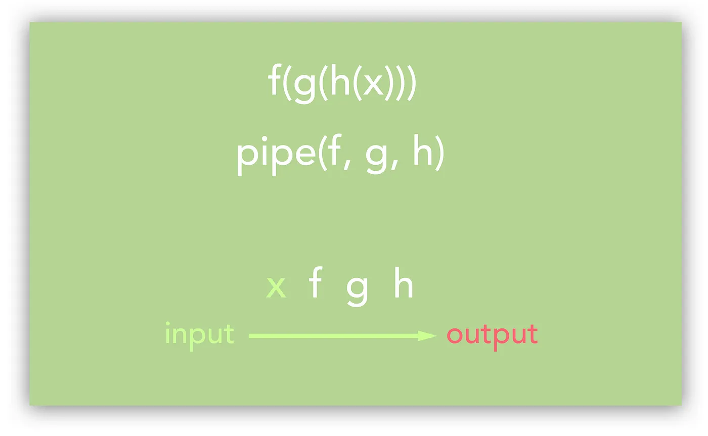

# Partial Applications, Currying, Compose and Pipe

## What is functional programming?

> Functional programming is a programming paradigm — a style of building the structure and elements of computer programs — that treats computation as the evaluation of mathematical functions and avoids changing-state and mutable data — [Wikipedia](https://en.wikipedia.org/wiki/Functional_programming)

Functional programming offers programmers to write shorter and tighter code to get to the point with significantly fewer lines of code. When we talk about functional programming the first thing we talk about is function composition. In fact function composition is regarded as a better alternative to object-oriented inheritance.

But to understand function composition we need to first understand what pure functions are.

A **pure function** is a **function** where the return value is always deterministic, without any observable side effects. In other words, pure functions satisfy the following properties :

- Given the same input, will always return the same output.
- Produces no side effects — such as mutation of mutable objects or output to I/O device.
- Relies on no external state — to produce result the function does not depend on any external resource.

Writing pure functions in functional programming languages like Clojure is very intuitive as they deal with persistent data-structures. But in **_Javascript_** when writing pure functions one has to fight the temptation of mutating the **_non-persistent data structures_**.

Let’s look into some preferred ways in Javascript to avoid mutations when dealing with non-persistent data-structures like objects and arrays

- **_Avoiding Array Mutations_** => Using **_map and filter_**; Using **_concat(), slice() and …spread_**
- **_Avoiding Object Mutations_** => Using **_Object.assign()_** **_and …spread_**

As such, a fundamental idea of FP is the “stitching-together” of functions — producing **complex functionality** by composing **small functions that do one thing**.

This is **function composition**. This is achieved by passing the **output** of one function as the **input of another** function.

### arity

Before we jump in, let’s get some terminology straight. Functions have _arity_, meaning the number of arguments they accept. A “unary” function accepts one argument, a “polyadic” function takes more than one argument. There are specialized terms we can use: A “binary” function accepts two, a “ternary” function accepts three, and you can rustle about with greek or latin words and invent names for functions that accept more than three arguments.

(Some functions accept a variable number of arguments, we call them _variadic_, although variadic functions and functions taking no arguments aren’t our primary focus in this essay.)

## Functions Invoking Functions

Whether writing code just for yourself or presenting an API to your users, it's often helpful to create a more specialized function as a "wrapper" around a more generalized function if you expect that function to be invoked repeatedly with the same argument or arguments.

One way to accomplish this is to manually define the more specific function in addition to the more general function. This is easy in JavaScript, because functions can invoke other functions.

```js
// More general function.
function add(a, b) {
  return a + b;
}

add(1, 2); // 3
add(10, 3); // 13

// More specific functions.
function addOne(b) {
  return add(1, b);
}

addOne(2); // 3
addOne(3); // 4

function addTen(b) {
  return add(10, b);
}

addTen(2); // 12
addTen(3); // 13
```

While defining a few specialized functions in this manner is very simple and straightforward, if you have enough of them it can add a lot of extra code, which then has to be maintained.

## Functions Returning Functions

Here, you'll see that it's possible to create a `makeAdder` function that returns a new function when invoked with an argument (functions that generate other functions or objects are commonly referred to as [factories](<https://en.wikipedia.org/wiki/Factory_(software_concept)>)). The returned function, when invoked with an argument, adds that argument's value to the originally-specified (or "bound") argument's value, returning the resulting sum.

```js
// More general function.
function add(a, b) {
  return a + b;
}

add(1, 2); // 3
add(10, 3); // 13

// More specific function generator.
function makeAdder(a) {
  return function (b) {
    return a + b;
  };
}

// More specific functions.
var addOne = makeAdder(1);
addOne(2); // 3
addOne(3); // 4

var addTen = makeAdder(10);
addTen(2); // 12
addTen(3); // 13
```

This is possible because JavaScript supports [closures](<https://en.wikipedia.org/wiki/Closure_(computer_science)>), which allow functions to access external variables even when invoked outside their immediate scope. Additionally, in JavaScript, [functions are first-class](https://en.wikipedia.org/wiki/First-class_function). Because of this, functions can both accept functions as arguments and return functions. Closures and first-class functions often work together, giving returned functions continued access to passed-in arguments.

While this example offers the convenience of allowing you to call `addOne(2)` instead of `add(1, 2)`, it doesn't come without a price. First, the actual adding logic is duplicated in both the more generic `add` function and `makeAdder` factory function, which can be problematic since the code is no longer as DRY as it could be. Second, for every different `something` function you want to handle in this manner, you'd need to manually create a `makeSomething` factory function.

## Functions Accepting Functions

The next logical step is to create a more generalized factory function that not only accepts an argument to be "bound" but also accepts a function to be invoked containing all of the core logic (functions passed into other functions as arguments are commonly referred to as [callbacks](<https://en.wikipedia.org/wiki/Callback_(computer_programming)>)).

This way, a single factory function can be created that can be used to create bound (or bindable, as you'll see shortly) versions of any function.

_Note that the original functions are not being modified in any way, and their behavior will not change. They are simply being referenced and invoked by the "wrapper" function._

```js
// Relatively flexible, more specific function generator.
function bindFirstArg(fn, a) {
  return function (b) {
    return fn(a, b);
  };
}

// More general functions.
function add(a, b) {
  return a + b;
}

add(1, 2); // 3

function multiply(a, b) {
  return a * b;
}

multiply(10, 2); // 20

// More specific functions.
var addOne = bindFirstArg(add, 1);
addOne(2); // 3
addOne(3); // 4
addOne(10); // 11
addOne(9000); // 9001

var multiplyByTen = bindFirstArg(multiply, 10);
multiplyByTen(2); // 20
multiplyByTen(3); // 30
multiplyByTen(10); // 100
multiplyByTen(9000); // 90000
```

Where this is especially interesting is that not only can the `bindFirstArg` function be used to bind any first argument to any arbitrary function, _it can be used to bind a function to itself_ as its own first argument, thus creating a "bindable" function.

Think about it this way: If the `bindFirstArg` function can bind the first argument to a function that takes two arguments--like `1` to `add` or `10` to `multiply`--and the `bindFirstArg` function itself takes two arguments, it stands to reason that `bindFirstArg` can bind a function as the first argument to itself.

Here, a more specific version of `bindFirstArg` is created with its first argument, the `add` function, bound to itself.

// More specific function generator.
var makeAdder = bindFirstArg(bindFirstArg, add);

// More specific functions.
var addOne = makeAdder(1);
addOne(2); // 3
addOne(3); // 4

var addTen = makeAdder(10);
addTen(2); // 12
addTen(3); // 13

Does this look familiar? It should. This is the `makeAdder` function, just created using a significantly more generalized approach than before.

Now, while the `bindFirstArg` function is more flexible than the previous examples, it's only _slightly_ more flexible. What if you want to be able to bind more than just that first argument? What if you have a function that accepts three or more arguments and you want to bind either the first argument or _both_ of the first two arguments or _any number_ of arguments, depending on the circumstance?

Even though this solution is more flexible than before, it can be generalized.

## Raw Composition

Consider the following mathematical functions:

`f(x) = x + 2g(x) = 4x`

You could compose these functions as such:

`f(g(x)) = 4x + 2// org(f(x)) = 4x + 8`

Here’s a programming analog:

```js
const addTwo = (x) => x + 2;
const multiplyByFour = (x) => 4 * x;
```

Like in the mathematical example above, you could compose them as:

```js
const composed1 = (x) => addTwo(multiplyByFour(x));
// or
const composed2 = (x) => multiplyByFour(addTwo(x));
```

## Problem

The problem is that composing functions like this **doesn’t scale well**.  
If you have **many functions**, your composition might end up looking like:

```js
func1(func2(func3(func4(func5(func6(func7(x)))))));
```

Which is absolutely unsightly.

How do we solve this? `compose()` and `pipe()`.

## The special arguments variable

When you create a function in JavaScript, it creates a special variable called `arguments`, that is _sort of_ like an array. It contains the arguments that are passed to the function. for example:

```javascript
var showArgs = function (a, b) {
  console.log(arguments);
};
showArgs("Tweedledee", "Tweedledum");
//=> { '0': 'Tweedledee', '1': 'Tweedledum' }
```

Notice that the output is more like an object with keys that happen to be integers, rather than an actual array.

The interesting thing about `arguments` is that it contains _all_ the arguments passed in a function call, regardless of how many are defined. So, if you call a function and pass it extra arguments, they will be available in the `arguments` variable.

```javascript
showArgs("a", "l", "i", "c", "e");
//=> { '0': 'a', '1': 'l', '2': 'i', '3': 'c', '4': 'e' }
```

The `arguments` variable also has a ‘length’ property, like an array.

```javascript
var argsLen = function () {
  console.log(arguments.length);
};
argsLen("a", "l", "i", "c", "e");
//=> 5
```

It is often useful to have the `arguments` variable as an actual array. In those cases we can convert the `arguments` variable into a real array by using a built-in array method called `slice`. Because `arguments` isn’t is a real array, we have to do it by a roundabout route:

```javascript
var showArgsAsArray = function () {
  var args = Array.prototype.slice.call(arguments, 0);
  console.log(args);
};
showArgsAsArray("Tweedledee", "Tweedledum");
//=> [ 'Tweedledee', 'Tweedledum' ]
```

The `arguments` variable is most commonly used to create functions that can take a variable number of arguments.

## Function Composition

==**Function composition**== ==is the act of pipelining the result of one function, to the input of another, creating an entirely new function.==

`compose()` takes **functions as input**, connects them such that the **data flows from RIGHT to LEFT,** then returns this combined function.



This can be done with any two functions, where the argument type of the first is the return type of the second. The newly created function takes what the second function would as a parameter and feeds it through the second function, then the result of the second function through the first function, and returns the result of the first function.

Let’s create a dirty little **_compose_** function which takes two functions and compose them to produce a new function.

```js
function compose(f, g) {
  return function (a) {
    return g(g(a));
  };
}

function add1(a) {
  return a + 1;
}

function multiply5(a) {
  return a * 5;
}

var add1Multiply5 = compose(add1, multiply5);

console.log(add1Multiply5(6)); //31
```

Analogous to compose there is one more familiar method attributed to unix is **_pipe_** which takes an array of functions to produce a new composed function.

`pipe()` is nearly identical to `compose()`. The only difference is that `pipe()` moves data in the **opposite direction**: `LEFT --> RIGHT`.



```js
const pipe = function (fns) {
  return function (item) {
    return fns.reduce(function (prev, fn) {
      return fn(prev);
    }, item);
  };
};

function add1(a) {
  return a + 1;
}

function multiply5(a) {
  return a * 5;
}

var add1multiply5 = pipe([add1, multiply5]);

console.log(add1multiply5(6)); //35
```

## Introducing The Pipe Function

When writing JavaScript (or any other language for that matter), you often find yourself having to call a series of functions to get from some starting value to the desired result. To keep the examples simple, let's use a couple of really basic functions:

```js
const inc = (num) => num + 1;
const dbl = (num) => num * 2;
```

We have two functions that each accept a number and return a new number. The first just increments the supplied value and the second takes whatever number is passed in and doubles it.

In our **very** contrived sample code, we want to get the result of incrementing some value, then doubling the result of that. A pretty standard approach to this would be to call the first function, assigning it's value to a variable (or, a constant), then passing that value into the second function, like so:

```js
const startValue = 2;

const plusOne = inc(startValue); // 3
const result = dbl(plusOne); // 6
```

This works, and there isn't necessarily anything wrong with this approach, but it does require that you create an extra variable (`plusOne`). Admittedly, in this case, the extra variable isn't a huge deal, but if you were following this approach for code with many steps, that would mean creating many variables. Many variables means coming up with meaningful names for them and, as we all know, naming things is hard.

You _could_ avoid the intermediate variables by nesting the function calls. Since `plusOne` is just holding the return value from `inc(startValue)`, you can easily replace that variable directly with the function call. So the updated code would be:

```js
const startValue = 2;

const result = dbl(inc(startValue)); // 6
```

We've removed the extra variable, and we didn't have to name anything extra, but this code isn't as clear as the previous code. You might argue that this isn't really any harder to read, but if you can imagine this same approach with four or five steps, the nested function calls would quickly create a single line of code that would take some focus to decipher. So while this _might_ not be too bad for two function calls, this approach doesn't scale very well.

We can get the benefits of the nested functions in a more readable fashion by abstracting the nesting of the functions into a utility function that is commonly referred to as `pipe`.

The goal of `pipe` is to end up replacing our code from above with something more like this:

```js
const incThenDbl = pipe(inc, dbl);
const result = incThenDbl(2);
```

Not only did we eliminate the intermediate variable, but we also did it in a single line without any confusing nesting. Instead, we created a line of code that reads more like english. It basically says, "Give me a function that **pipes** data through `inc`, then `dbl`". Also, if this series of steps can be applied to multiple situations, we now have a reusable function (`incThenDbl`) that we can use wherever we need it.

So now all we need to do is define the `pipe` function.

If you look at the sample of how we plan to use `pipe`, you'll notice two key things that are happening:

1. Both arguments to `pipe` are functions themselves
2. The value returned from `pipe` is also a function

The `pipe` utility is possible in JavaScript because JavaScript functions are first class. That is, functions in JavaScript can be passed around like any other value.

So we know that pipe is going to accept two functions as arguments and return a function. That means we will end up with something like this:

```js
const pipe = (f, g) => () => /*do stuff*/
```

We have a function that takes two arguments (these will be functions that we refer to as `f` and `g`) and returns a new function. We're not done yet, but we're getting close.

Referring back to the sample code, the returned function accepts an argument, so let's add that:

```js
const pipe = (f, g) => (args) => /*do stuff*/
```

Now we have the parts we need, so let's use those functions. We want to call `f` first and then pass the results of that to `g`. We need to nest the call to `f` in a call to `g`, so the next step in building out pipe would look like this:

```js
const pipe = (f, g) => (args) => g(f());
```

Since `f` is going to be a reference to `inc` in our example, it needs to receive the argument we pass into our returned function, so it should look like this:

```js
const pipe = (f, g) => (args) => g(f(args));
```

This takes in functions `f` and `g` and returns the inner function. This inner function is a closure, so it has access to the functions passed into the outer function. When you call the inner function with a value, it is passed to `f`, the return value of `f` is passed into `g` and the result of that call is returned from the inner function.

The only thing that's missing from this, is the ability to pass multiple arguments to `f`. This is an easy fix with ES6 rest and spread operators (which happen to look identical).

We'll rewrite `pipe` like so:

```js
const pipe =
  (f, g) =>
  (...args) =>
    g(f(...args));
```

The only change here is the addition of three dots (`...`) in front of each reference to `args`.

So in our `pipe` function, we gather up whatever arguments are passed into an array called `args`, then we pass them back into our function `f` as individual arguments.

In this form, pipe will work for our original sample code:

```js
const pipe =
  (f, g) =>
  (...args) =>
    g(f(...args));
const incThenDbl = pipe(inc, dbl);
const result = incThenDbl(2); // 6
```

**Note:** I should point out that even though we've done the work to accept multiple arguments, that only applies to the first function in the pipeline. The second function is going to receive the result of the first function, and since a function can only return one value, that means only one value will be passed to the second function.

This will work:

```js
const add = (a, b) => a + b;
const dbl = (num) => num * 2;
const pipe =
  (f, g) =>
  (...args) =>
    g(f(...args));
const sumThenDbl = pipe(add, dbl);
const result = sumThenDbl(2, 1); // 6
```

But if we called `add` as the second function in `pipe`, it would only receive a single argument(the return value of the preceding function).

### Piping More Than Two Functions

Our current `pipe` function is great, but it only works with two functions. So what if we want to pipe together three, four or even ten functions?

Since `pipe` takes in two functions and returns a new functions, we can use the result of `pipe` as an argument to `pipe`.

```js
const square = (n) => n * n;
const sumDblSquare = pipe(pipe(add, dbl), square);
const result = sumDblSquare(2, 1); // 36
```

Here, I added a `square` function and then created a function by piping `add` to `dbl`, then piped the results of that to `square`.

I could nest calls to pipe indefinitely, and eventually I could build up a long pipeline, but the code is going to get harder and harder to follow. It would be much nicer if we could just call pipe with all the functions we need to call.

To make our pipe function directly handle multiple functions we'll have to make some changes, but don't worry, none of the work we've done so far will go to waste.

Let's get ready for the next step by renaming the `pipe` function we just created (we'll just prefix it with an underscore). And while we're at it, let's start defining a new `pipe` function just below it.

```js
const _pipe = (f, g) => (...args) => g(f(...args))

const pipe = /*The new pipe function goes here*/
```

So the goal for the updated pipe function is to be able to do something like this:

```js
const inc = (num) => num + 1;
const dbl = (num) => num * 2;
const sqr = (num) => num * num;

const incDblSqr = pipe(inc, dbl, sqr);
const result = incDblSqr(2); // 36
```

We're only piping together three functions here, but when we're done with `pipe`, it'll work with any number of functions we pass into it.

We can see from the example above, calling pipe will still return a new function that will accept arguments and then execute the function pipeline. The big difference here is that instead of exactly two functions, we can now have a variable number of functions. The easiest way to handle a variable list of values is with an array. We have already seen that we can take a list of function arguments and convert it to an array using the `rest` operator.

So the beginning of our new `pipe` function will look like this:

```js
/*omitting the _pipe function for clarity*/

const pipe = (...fns) => /*Do something*/
```

So we'll accept all of the arguments and inside the function, they will be accessible in an array called `fns`.

Now our function has an array of functions and we expect it to return a single function. Anytime we have an array and we want to use its values to return a single value, we can accomplish that with `reduce`. So our function might look more like this:

```js
/*omitting the _pipe function for clarity*/

const pipe = (...fns) => fns.reduce((acc, val) => /*Do something & return the updated acc*/)
```

Here, reduce takes a function that takes in an accumulator and the current value. We're also calling it without an initial accumulator value, so in this case, `reduce` will take two values from the array and pass them both in, one as `acc` and the second as `val`. So our reducer function needs to take in two functions and return a new, composed function.

As luck would have it, **we already have a function that takes in two functions and returns a new function**... it's our previous `pipe` function that we have renamed `_pipe`. So that means we can update our code to look like this:

```js
const _pipe =
  (f, g) =>
  (...args) =>
    g(f(...args));

const pipe = (...fns) => fns.reduce(_pipe);
```

### Bonus - compose Functions Right to Left

If you'd prefer to compose your functions from right to left, you can create a `compose` function by using `reduceRight` instead of `reduce`. This will start with the last function you pass in, and work it's way to the left.

```js
const inc = (num) => num + 1;
const dbl = (num) => num * 2;
const sqr = (num) => num * num;

// Pipe
const _pipe =
  (f, g) =>
  (...args) =>
    g(f(...args));

//Compose
const compose = (...fns) => fns.reduceRight(_pipe);

const incDblSqr = compose(sqr, dbl, inc);
const result = incDblSqr(2);

console.log(result);
```

## Partial application

[Partial application](https://en.wikipedia.org/wiki/Partial_application) can be described as taking a function that accepts some number of arguments, binding values to one or more of those arguments, and returning a new function that only accepts the remaining, un-bound arguments.

What this means is that, given any arbitrary function, a new function can be generated that has one or more arguments "bound," or partially applied. And if you've been paying attention, you've realized by now that the previous examples have demonstrated partial application in a practical, albeit somewhat limited way.

If you've ever used the ECMAScript 5 [Function#bind](https://developer.mozilla.org/en-US/docs/JavaScript/Reference/Global_Objects/Function/bind) method, which allows a function to have both its `this` value and some of its arguments bound, you're already familiar with partial application. Although with Function#bind, it might help to think of the `this` value as an implicit 0th argument--see the [Extra Credit](https://benalman.com/news/2012/09/partial-application-in-javascript/#extra-credit) section at the end for a few `Function#bind` examples.

As a preamble, let’s make ourselves a `mapWith` function that maps a function over any collection that has a `.map` method:

```js
const mapWith = (unaryFn, collection) => collection.map(unaryFn);

const square = (n) => n * n;

mapWith(square, [1, 2, 3]);
//=> [1, 4, 9]
```

`mapWith` is a binary function, `square` is a unary function. When we called `mapWith` with arguments `square` and `[1, 2, 3]` and `square`, we _applied_ the arguments to the function and got our result.

Since `mapWith` takes two arguments, and we supplied two arguments, we _fully applied_ the arguments to the function. So what’s “partial” application? Supplying fewer arguments. Like supplying one argument to `mapWith`.

Now what happens if we supply one argument to `mapWith`? We can’t get a result without the other argument, so as we’ve written it, it breaks:

```
mapWith(square)
  //=> undefined is not an object (evaluating 'collection.map')
```

But let’s imagine that we could apply fewer arguments. We wouldn’t be fully applying `mapWith`, we’d be _partially applying_ `mapWith`. What would we expect to get? Well, imagine we decide to buy a $2,000 bicycle. We go into the store, we give them $1,000. What do we get back? A pice of paper saying that we are doing a layaway program. The $1,000 is held in trust for us, when we come back with the other $1,000, we get the bicycle.

Putting down $1,000 on a $2,000 bicycle is partially buying a bicycle. What it gets us is the right to finish buying the bicycle later. It’s the same with partial application. If we were able to partially apply the `mapWith` function, we’d get back the right to finish applying it later, with the other argument.

Something like this:

```js
const mapWith = (unaryFn) => (collection) => collection.map(unaryFn);

const square = (n) => n * n;

const partiallyAppliedMapWith = mapWith(square);

partiallyAppliedMapWith([1, 2, 3]);
//=> [1, 4, 9]
```

The thing is, we don’t want to always write our functions in this way. So what we want is a function that takes this:

```js
const mapWith = (unaryFn, collection) => collection.map(unaryFn);
```

And turns it into this:

```js
partiallyAppliedMapWith([1, 2, 3]);
//=> [1, 4, 9]
```

Working backwards:

```js
const partiallyAppliedMapWith = (collection) => mapWith(unaryFn, collection);
```

The expression `(collection) => mapWith(unaryFn, collection)` has two free variables, `mapWith` and `unaryFn`. If we were using a fancy refactoring editor, we could extract a function. Let’s do it by hand:

```js
const ____ = (mapWith, unaryFn) => (collection) => mapWith(unaryFn, collection);
```

What is this `_____` function? It takes the `mapWith` function and the `unaryFn`, and returns a function that takes a collection and returns the result of applying `unaryFn` and `collection` to `mapWith`. Let’s make the names very generic, the function works no matter what we call the arguments:

```js
const ____ = (fn, x) => (y) => fn(x, y);
```

This is a function that takes a function and an argument, and returns a function that takes another argument, and applies both arguments to the function. So, we can write this:

```js
const mapWith = (unaryFn, collection) => collection.map(unaryFn);

const square = (n) => n * n;

const ____ = (fn, x) => (y) => fn(x, y);

const partiallyAppliedMapWith = ____(mapWith, square);

partiallyAppliedMapWith([1, 2, 3]);
//=> [1, 4, 9]
```

So what is this `____` function? It partially applies one argument to any function that takes two arguments.

We can dress it up a bit. For one thing, it doesn’t work with methods, it’s strictly a blue higher-order function. Let’s make it khaki by passing `this` properly:

```js
const ____ = (fn, x) =>
  function (y) {
    return fn.call(this, x, y);
  };
```

Another problem is that it only works for binary functions. Let’s make it so we can pass one argument and we get back a function that takes as many remaining arguments as we like:

```js
const ____ = (fn, x) =>
  function (...remainingArgs) {
    return fn.call(this, x, ...remainingArgs);
  };

const add = (verb, a, b) => `The ${verb} of ${a} and ${b} is ${a + b}`;

const summer = ____(add, "sum");

summer(2, 3);
//=> The sum of 2 and 3 is 5
```

And what if we want to partially apply more than one argument?

```js
const ____ = (fn, ...partiallyAppliedArgs) =>
  function (...remainingArgs) {
    return fn.apply(this, partiallyAppliedArgs.concat(remainingArgs));
  };

const add = (verb, a, b) => `The ${verb} of ${a} and ${b} is ${a + b}`;

const sum2 = ____(add, "sum", 2);

sum2(3);
//=> The sum of 2 and 3 is 5
```

What we have just written is a _left partial application_ function: Given any function and some arguments, we partially apply those arguments and get back a function that applies those arguments and any more you supply to the original function.

Partial application is thus the application of part of the arguments of a function, and getting in return a function that takes the remaining arguments.

And here’s our finished function, properly named:

```js
const leftPartialApply = (fn, ...partiallyAppliedArgs) =>
  function (...remainingArgs) {
    return fn.apply(this, partiallyAppliedArgs.concat(remainingArgs));
  };

const add = (verb, a, b) => `The ${verb} of ${a} and ${b} is ${a + b}`;

const sum2 = leftPartialApply(add, "sum", 2);

sum2(3);
//=> The sum of 2 and 3 is 5
```

### right partial application

It is very convenient to have a `mapWith` function, because you are far more likely to want to write something like:

```js
const squareAll = leftPartialApply(mapWith, (x) => x * x);
```

Than to write:

```js
const map123 = leftPartialApply(map, [1, 2, 3]);
```

But sometime you have `map` but not `mapWith`, or some other analogous situation where you want to apply the values _from the right_ rather than the left. No problem:

```js
const rightPartialApply = (fn, ...partiallyAppliedArgs) =>
  function (...remainingArgs) {
    return fn.apply(this, remainingArgs.concat(partiallyAppliedArgs));
  };
```

### arbitrary partial application

What if you want to apply some, but not all of the arguments, and they may not be neatly lined up at the beginning or end? This is also possible, provided we define a placeholder of some kind, and then write some code to “fill in the blanks”.

This implementation takes a “template” of values, you insert placeholder values (traditionally `_`, but anything will do) where you want values to be supplied later.

```js
const div = (verbed, numerator, denominator) =>
  `${numerator} ${verbed} ${denominator} is ${numerator / denominator}`;

div("divided by", 1, 3);
//=> 1 divided by 3 is 0.3333333333333333

const arbitraryPartialApply = (() => {
  const placeholder = {},
    arbitraryPartialApply = (fn, ...template) => {
      let remainingArgIndex = 0;
      const mapper = template.map((templateArg) =>
        templateArg === placeholder
          ? (
              (i) => (args) =>
                args[i]
            )(remainingArgIndex++)
          : (args) => templateArg
      );

      return function (...remainingArgs) {
        const composedArgs = mapper.map((f) => f(remainingArgs));

        return fn.apply(this, composedArgs);
      };
    };

  arbitraryPartialApply._ = placeholder;
  return arbitraryPartialApply;
})();

const _ = arbitraryPartialApply._;

const dividedByThree = arbitraryPartialApply(div, "divided by", _, 3);

dividedByThree(2);
//=> 2 divided by 3 is 0.6666666666666666
```

Arbitrary partial application handles most of the cases for left- or right-partial application, but has more internal moving parts. It also doesn’t handle cases involving an arbitrary number of parameters.

For example, the built-in function `Math.max` returns the largest of its arguments, or `null` if no arguments are supplied:

```js
Math.max(1, 2, 3);
//=> 3

Math.max(-1, -2, -3);
//=> -1

Math.max();
//=> null
```

What if we want to have a default argument? For example, what if we want it tor return the largest number greater than or equal to `0`, or `0` if there aren’t any? We can do that with `leftPartialApplication`, but we can’t with `arbitraryPartialApply`, because we want to accept an arbitrary number of arguments:

```js
const maxDefaultZero = leftPartialApply(Math.max, 0);

maxDefaultZero(1, 2, 3);
//=> 3

Math.max(-1, -2, -3);
//=> 0

maxDefaultZero();
//=> 0
```

So there’s good reason to have left-, right-, and arbitrary partial application functions in our toolbox.

### Partial Application: From the Left

_Note that the `arguments` object is an array-like object created when a function is invoked, accessible only inside that function, containing all of the arguments passed into that function. While `arguments` is array-like, it is not an array. This means that while it has a `.length` property and numerically-indexed values, it doesn't have any of the [Array](https://developer.mozilla.org/en/JavaScript/Reference/Global_Objects/Array) methods, like `.concat` or `.slice`. In order to convert the `arguments` object into an array, the native [Array#slice](https://developer.mozilla.org/en-US/docs/JavaScript/Reference/Global_Objects/Array/slice) method is invoked on `arguments` using [call invocation](https://developer.mozilla.org/en-US/docs/JavaScript/Reference/Global_Objects/Function/call)._

The following `partial` function returns a function ƒ that, when invoked, invokes the `fn` function with the originally-specified (bound) arguments, followed by all arguments passed to ƒ.

```js
function partial(fn /*, args...*/) {
  // A reference to the Array#slice method.
  var slice = Array.prototype.slice;
  // Convert arguments object to an array, removing the first argument.
  var args = slice.call(arguments, 1);

  return function () {
    // Invoke the originally-specified function, passing in all originally-
    // specified arguments, followed by any just-specified arguments.
    return fn.apply(this, args.concat(slice.call(arguments, 0)));
  };
}
```

And here's an example of partial application, using the `partial` function:

```js
// Add all arguments passed in by iterating over the `arguments` object.
function addAllTheThings() {
  var sum = 0;
  for (var i = 0; i < arguments.length; i++) {
    sum += arguments[i];
  }
  return sum;
}

addAllTheThings(1, 2); // 3
addAllTheThings(1, 2, 3); // 6
addAllTheThings(1, 4, 9, 16, 25); // 55

// More specific functions.
var addOne = partial(addAllTheThings, 1);
addOne(); // 1
addOne(2); // 3
addOne(2, 3); // 6
addOne(4, 9, 16, 25); // 55

var addTen = partial(addAllTheThings, 1, 2, 3, 4);
addTen(); // 10
addTen(2); // 12
addTen(2, 3); // 15
addTen(4, 9, 16, 25); // 64
```

This works because the originally passed arguments, minus the first `fn` argument (which is sliced off), are stored as the `args` array, which is created when the `partial` function is invoked. Each time the returned function is invoked, it invokes the originally-passed `fn` function using [apply invocation](https://developer.mozilla.org/en-US/docs/JavaScript/Reference/Global_Objects/Function/apply). And because `.apply()` accepts an array of arguments-to-be-passed and `concat` joins two arrays, it is possible to invoke the `fn` function with the just-passed arguments appended to the originally-specified (bound) arguments.

#### "Full" Application?

It's worth noting that partial application is typically most useful when only _partially_ applying a function's arguments. If you choose to satisfy all the function arguments by specifying them all up-front, you'll just end up with a function that behaves as if all of its arguments had been hard-coded.

```js
function add(a, b) {
  return a + b;
}

var alwaysNine = partial(add, 4, 5);
alwaysNine(); // 9
alwaysNine(1); // 9 - this is just like calling add(4, 5, 1)
alwaysNine(9001); // 9 - this is just like calling add(4, 5, 9001)
```

In JavaScript, if you specify more arguments than what a function expects, they will be ignored (unless they are accessed via the `arguments` object). Because of this, no matter how many arguments are passed into the fully bound `alwaysNine` function, the result will never change.

### Partial Application: From the Right

Until this point, all examples of partial application have only shown one specific variation of partial application, in which the _leftmost_ function arguments are bound. And while this is the most commonly seen variation of partial application, it's not the only one.

Using very similar code as with the `partial` function, it's easy to make a `partialRight` function that binds the _rightmost_ function arguments. In fact, all that needs to be changed is the order in which the originally-specified arguments are concatenated with the just-specified arguments.

The following `partialRight` function returns a function ƒ that, when invoked, invokes the `fn` function with the arguments passed to ƒ, followed by all the originally-specified (bound) arguments.

```js
function partialRight(fn /*, args...*/) {
  // A reference to the Array#slice method.
  var slice = Array.prototype.slice;
  // Convert arguments object to an array, removing the first argument.
  var args = slice.call(arguments, 1);

  return function () {
    // Invoke the originally-specified function, passing in all just-
    // specified arguments, followed by any originally-specified arguments.
    return fn.apply(this, slice.call(arguments, 0).concat(args));
  };
}
```

And here's a somewhat silly example of partial application, highlighting the differences between the `partial` and `partialRight` functions:

```js
function wedgie(a, b) {
  return a + " gives " + b + " a wedgie.";
}

var joeGivesWedgie = partial(wedgie, "Joe");
joeGivesWedgie("Ron"); // "Joe gives Ron a wedgie."
joeGivesWedgie("Bob"); // "Joe gives Bob a wedgie."

var joeReceivesWedgie = partialRight(wedgie, "Joe");
joeReceivesWedgie("Ron"); // "Ron gives Joe a wedgie."
joeReceivesWedgie("Bob"); // "Bob gives Joe a wedgie."
```

The only problem with this `partialRight` implementation is that if too many arguments are passed into the partially applied function, the originally-specified (bound) arguments will be displaced, thus rendering them useless.

```js
joeReceivesWedgie("Bob", "Fred"); // "Bob gives Fred a wedgie."
```

While a more robust example could be written to take the function's [arity](https://en.wikipedia.org/wiki/Arity) (the number of arguments a function takes) into consideration, it will add additional complexity.

_In JavaScript, partially applying from the left will always be simpler and more robust than partially applying from the right._

### Partial Application: From Anywhere

While the `partial` and `partialRight` functions partially apply arguments from either the left or right, there's nothing stopping you from going one step further and creating a function that allows you to cherry-pick arguments to be partially applied.

In the following example, I'm going to name this function `partialAny` and the placeholder value will be an arbitrary property on that function called `partialAny._`.

The following `partialAny` function returns a function ƒ that, when invoked, invokes the `fn` function with the originally-specified (bound) arguments. However, any "placeholder" originally-specified arguments will be replaced, in-order, with arguments passed to ƒ as it is invoked. Any remaining arguments passed to ƒ will be added to the end.

```js
var partialAny = (function () {
  // A reference to the Array#slice method.
  var slice = Array.prototype.slice;

  // This function will be returned as a result of the IIFE and assigned
  // to the external `partialAny` var.
  function partialAny(fn /*, args...*/) {
    // Convert arguments object to an array, removing the first argument.
    var orig = slice.call(arguments, 1);

    return function () {
      // Convert arguments object to an array.
      var partial = slice.call(arguments, 0);
      var args = [];

      // Iterate over the originally-specified arguments. If the argument
      // was the `partialAny._` placeholder, use the next just-passed-in
      // argument, otherwise use the originally-specified argument.
      for (var i = 0; i < orig.length; i++) {
        args[i] = orig[i] === partialAny._ ? partial.shift() : orig[i];
      }

      // Invoke the originally-specified function, passing in interleaved
      // originally- and just-specified arguments, followed by any remaining
      // just-specified arguments.
      return fn.apply(this, args.concat(partial));
    };
  }

  // This is used as the placeholder argument.
  partialAny._ = {};

  return partialAny;
})();
```

And here's a slightly more legitimate example of partial application, using the `partialAny` function.

_Note that because `partialAny._`is a bit verbose, a variable called`**`is used instead, to make the example look nicer. The variable name could just as well be`foo`or`PLACEHOLDER`instead of`**`.\_

```js
function hex(r, g, b) {
  return "#" + r + g + b;
}

hex("11", "22", "33"); // "#112233"

// A more visually-appealing placeholder.
var __ = partialAny._;

var redMax = partialAny(hex, "ff", __, __);
redMax("11", "22"); // "#ff1122"

var greenMax = partialAny(hex, __, "ff");
greenMax("33", "44"); // "#33ff44"

var blueMax = partialAny(hex, __, __, "ff");
blueMax("55", "66"); // "#5566ff"

var magentaMax = partialAny(hex, "ff", __, "ff");
magentaMax("77"); // "#ff77ff"
```

While some libraries expose this `partialAny` functionality as `partial`, they are only able to use that name because they don't already have another function called `partial`. Which is because they call their partial-application-from-the-left function `curry`.

This is an unfortunate--but very common--cause of confusion, because partial application and currying, while related, are two different things.

### what’s partial application again?

“Partial application is the conversion of a polyadic function into a function taking fewer arguments arguments by providing one or more arguments in advance.” JavaScript does not have partial application built into the language (yet), but it is possible to write our own higher-order functions that perform left-, right-, or arbitrary partial application.

## Currying Introduction

[Currying](https://en.wikipedia.org/wiki/Currying) can be described as transforming a function of N arguments in such a way that it can be called as a chain of N functions each with a single argument.

What this means is that, once a function has been curried, it is effectively "primed" for partial application, because as soon as you pass an argument into a curried function, you are partially applying that argument. Unlike partial application, however, a curried function will keep returning curried functions until all arguments have been specified.

The following `curry` function returns a function ƒ that expects one argument. When invoked, it checks to see if all of the expected `fn` function arguments have been satisfied. If so, `fn` is invoked with those arguments. Otherwise, another function ƒ1 is returned that behaves like function ƒ. [Recursion](<https://en.wikipedia.org/wiki/Recursion_(computer_science)>) is used to maintain an array of already-specified arguments. Once all the expected `fn` function arguments are satisfied, `fn` is invoked.

_Note that while JavaScript functions have a `.length` property that reflects that function's [arity](https://en.wikipedia.org/wiki/Arity), in certain circumstances JavaScript cannot determine the number of expected arguments (for example, when a function internally uses the `arguments` object instead of specifying individual arguments)._

In cases where the function's arity cannot be automatically determined, you can specify a numeric argument `n` that will be used instead of the `fn.length` property.

```js
function curry(fn, n) {
  // If `n` argument was omitted, use the function .length property.
  if (typeof n !== "number") {
    n = fn.length;
  }

  function getCurriedFn(prev) {
    return function (arg) {
      // Concat the just-specified argument with the array of
      // previously-specified arguments.
      var args = prev.concat(arg);
      if (args.length < n) {
        // Not all arguments have been satisfied yet, so return a curried
        // version of the original function.
        return getCurriedFn(args);
      } else {
        // Otherwise, invoke the original function with the arguments and
        // return its value.
        return fn.apply(this, args);
      }
    };
  }

  // Return a curried version of the original function.
  return getCurriedFn([]);
}
```

And here's a completely contrived example of currying, using the `curry` function:

```js
var i = 0;
function a(arg1, arg2, arg3) {
  return ++i + ": " + arg1 + ", " + arg2 + ", " + arg3;
}

// Normal function invocation.

a("x", "y", "z"); // "1: x, y, z"
a("x", "y"); // "2: x, y, undefined"
a("x"); // "3: x, undefined, undefined"
a(); // "4: undefined, undefined, undefined"

// Curried function invocation.

var b = curry(a);
b(); // `a` not invoked, curried function returned
b("x"); // `a` not invoked, curried function returned
b("x")("y"); // `a` not invoked, curried function returned
b("x")("y")("z"); // "5: x, y, z"
b("x")("y")(); // "6: x, y, undefined"
b("x")()(); // "7: x, undefined, undefined"
b()("y")(); // "8: undefined, y, undefined"
b()()("z"); // "9: undefined, undefined, z"
b()()(); // "10: undefined, undefined, undefined"

var c = b("x");
c(); // `a` not invoked, curried function returned
c("y"); // `a` not invoked, curried function returned
c("y")("z"); // "11: x, y, z"
c("y")(); // "12: x, y, undefined"
c()("z"); // "13: x, undefined, z"
c()(); // "14: x, undefined, undefined"

var d = c("y");
d("z"); // "15: x, y, z"
d(); // "16: x, y, undefined"

var e = d("z");
e; // "17: x, y, z"
```

### Manually Specifying Function Arity

In the following example, you need to specify an `n` value when currying `a1` since `a1.length` is `0`. This is because an arguments list wasn't specified at the time `a1` was defined, and JavaScript is unable to determine how many arguments are actually being used internally.

```js
var i = 0;
function a1() {
  var arg1 = arguments[0];
  var arg2 = arguments[1];
  var arg3 = arguments[2];
  return ++i + ": " + arg1 + ", " + arg2 + ", " + arg3;
}

// Normal function invocation.

a1("x", "y", "z"); // "1: x, y, z"
a1("x", "y"); // "2: x, y, undefined"
a1("x"); // "3: x, undefined, undefined"
a1(); // "4: undefined, undefined, undefined"

// Curried function invocation.

var b1 = curry(a1, 3);
b1(); // `a` not invoked, curried function returned
b1("x"); // `a` not invoked, curried function returned
b1("x")("y"); // `a` not invoked, curried function returned
b1("x")("y")("z"); // "5: x, y, z"
b1("x")("y")(); // "6: x, y, undefined"
b1("x")()(); // "7: x, undefined, undefined"
b1()("y")(); // "8: undefined, y, undefined"
b1()()("z"); // "9: undefined, undefined, z"
b1()()(); // "10: undefined, undefined, undefined"

var c1 = b1("x");
c1(); // `a` not invoked, curried function returned
c1("y"); // `a` not invoked, curried function returned
c1("y")("z"); // "11: x, y, z"
c1("y")(); // "12: x, y, undefined"
c1()("z"); // "13: x, undefined, z"
c1()(); // "14: x, undefined, undefined"
```

If a different value for `n` is specified, the curried function will simply expect that many arguments, regardless of the original function's arity.

### More

When it comes to functional programming, the main cornerstone is composability, the ability to create new functions only by composing the existing ones. For example, we can use a function that returns true given a certain condition, and then reuse it in combination with a filter function, to select items in an array.

In javascript, though, this may lead to the creation of several functions that look like the following:

```js
var isGreaterThan = function (limit) {
  return function (value) {
    return value > limit;
  };
};
```

In that example, we have a function that creates another function. The first only binds a configuration value, the limit, and returns the second one, that in fact makes the comparison happen and return a boolean.

This function is in a curried form, that is, a function that always takes one single argument and returns a value, if it needs more arguments to compute the value, it returns another function to take the next argument, until all are passed, and then the final result is computed.

Using ES6’s arrow function syntax, this can be much less verbose:

```js
var isGreaterThan = (limit) => (value) => value > limit;
```

With curried forms, we have something like a factory of functions, we pass configuration data, receive a function to use in our compositions, and then we pass values to it.

Take for example the filter function. In lodash it takes the colletion as the first argument, and then a function to filter it as the second. They’re passing the data first, making it more difficult to compose with other functions, as we can see below:

```js
//Using lodash here.
//We flip the order of the arguments in the filter
//function, passing the data last, and curry it.
var filter = _.curry(function (fn, collection) {
  return _.filter(collection, fn);
});
```

Now we have a more composable filter function, and we can combine with greaterThan easy as a breeze.

```js
var onlyPositives = filter(greaterThan(0));
onlyPositives([-1, 4, 2, -5]); // [4, 5]
```

This is gold! And this is precisely what Ramda does with these base functions like map and filter. The final move is to take advantage of the fact they receive their data last and use a function to compose several functions. Underscore, lodash and ramda have it, and they’re all similar: you pass a lot of functions to it, and it returns a function that will pass the result of one function as arguments to the next, and return the result of the last, all right to left:

```js
//read from bottom to top

//+ getFirstPositivePlusOne :: [Number] => Number
**var** getFirstPositivePlusOne = R.compose(
  R.add(1),                 // 4
  R.get(0),                 // 3
  filter(greaterThan(0))); // [3, 6]

  getFirstPositive([-2, -1, 3, 6]); // 4
```

Only by combining data-last curried functions with compose, we can write much more concise and reasonable code, and all with pure functions, and that is precisely what Ramda does, that underscore and lodash are doing wrong. It offers several pieces of behaviour, properly curried, so we can compose this way, which is called point free way. Point free code is code that does not declare “glue” variables, like this:

```js
//lodash way
**var** onlyPositives = **function**(data){ //glue variable (data)
  **return** data.filter(**function**(item) {  //glue variable (item)
    **return** greaterThan(0, item);
  });
}

//pointfree ramda way
**var** onlyPositivesPF = R.filter(greaterThan(0)); //no glue variables
```

Even if your code would not be totally point free, by doing this you can remove a LARGE portion of boilerplate code and most of your unnecessary variables, thus producing smaller, more concise code, and also easier to identify flaws and bugs when they show up.

## Currying

Currying is a process of converting a _n arguments function_ into a _chained sequence of n functions_ _each with one argument._

Let’s consider the following example;

```js
function add(a, b) {
  return a + b;
}

add(1, 2); //3
```

According to the above statement, we need to convert this function into a chain of two functions which take one argument each. Let’s do that,

```js
function curriedAdd(a) {
  return function (b) {
    return a + b;
  };
}

curriedAdd(1)(2); //3
```

This way of writing functions provides flexibility to create various types of add functions. e.g:

```js
var add3 = curriedAdd(3);
var add5 = curriedAdd(5);

add3(2); //5
add5(2); //7
```

Currying is elemental in languages such as Haskell and Scala, which are inherently functional. It is so inherent that **_in Haskell every function is a curried function_**. JavaScript has functional capabilities, but currying isn’t idiomatic.

This function takes any traditional function and some arguments(to pre-populate) and returns a curried function waiting for the rest of the arguments a.k.a partial application.

```js
function curry(uncurried) {
  var args = Array.prototype.slice.call(arguments, 1);
  return function () {
    return uncurried.apply(
      this,
      args.concat(Array.prototype.slice.call(arguments, 0))
    );
  };
}
```

To use this, we give it a function that takes any number of arguments, along with as many of the arguments we need to pre-populate it with. What we get back is a function that’s waiting for the remaining arguments:

```js
function filterCollection(filter_fn, collection) {
  return collection.filter(filter_fn);
}

var greaterThan5 = curry(filterCollection, function (x) {
  return x > 5;
});
greaterThan5([3, 4, 5, 6, 7]); //[6,7]
```

## Currying vs Partial Application

**Curry:** lets you call a function, splitting it in multiple calls, providing _one_ argument per-call.

**Partial:** lets you call a function, splitting it in multiple calls, providing _multiple_ arguments per-call.

Let's assume that we have a function `Add` which takes 2 numbers as input and returns a number as output, e.g. `Add(7, 5)` returns `12`. In this case:

- **Partial applying** the function `Add` with a value `7` will give us a new function as output. That function itself takes 1 number as input and outputs a number. As such:

```
Partial(Add, 7); // returns a function f2 as output

             // f2 takes 1 number as input and returns a number as output
```

    So we can do this:

```
f2 = Partial(Add, 7);
f2(5); // returns 12;
      // f2(7)(5) is just a syntactic shortcut
```

- **Currying** the function `Add` will give us a new function as output. That function itself takes 1 number as input and outputs _yet_ another new function. That third function then takes 1 number as input and returns a number as output. As such:

```
Curry(Add); // returns a function f2 as output

         // f2 takes 1 number as input and returns a function f3 as output
         // i.e. f2(number) = f3

         // f3 takes 1 number as input and returns a number as output
         // i.e. f3(number) = number
```

So we can do this:

```
f2 = Curry(Add);
f3 = f2(7);
f3(5); // returns 12
```

In other words, "currying" and "partial application" are two totally different functions. **Currying takes exactly 1 input, whereas partial application takes 2 (or more) inputs.**

Even though they both return a function as output, the returned functions are of totally different forms as demonstrated above.
