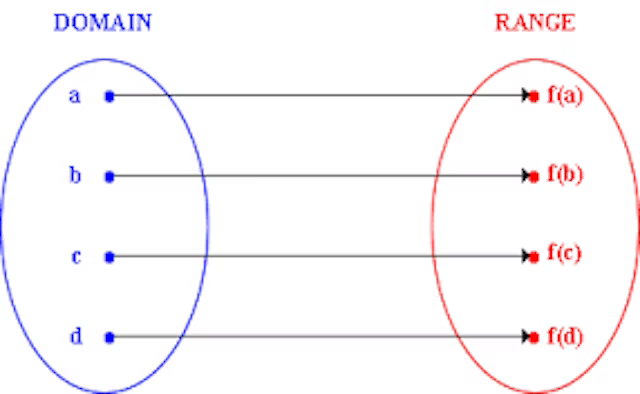

# Functional Programming

==**A pure function is deterministic**. This means, that given the same input, the function will always return the same output.==

To illustrate this as a function in mathematical terms (this will be quick!) it is a well defined function. Every input returns a single output, every single time.



## What is a Function?

A **function** is a process which takes some input, called **arguments**, and produces some output called a **return value**. Functions may serve the following purposes:

- **Mapping:** Produce some output based on given inputs. A function **maps** input values to output values.
- **Procedures:** A function may be called to perform a sequence of steps. The sequence is known as a procedure, and programming in this style is known as **procedural programming**.
- **I/O:** Some functions exist to communicate with other parts of the system, such as the screen, storage, system logs, or network.

## A pure function

A pure function **doesn’t depend on** and **doesn’t modify the states of variables out of its scope**.

Concretely, that means **a pure function always returns the same result given same parameters**. Its execution doesn’t depend on the state of the system.

The definition of a pure function is:

1. The function always returns the same result if the same arguments are passed in. It does not depend on any state, or data, change during a program’s execution. It must only depend on its input arguments.
2. The function does not produce any observable side effects such as network requests, input and output devices, or data mutation.

```js
const add = (x, y) => x + y; // A pure function
```

_add_ is a pure function because it’s output is solely dependent on the arguments it receives. Moreover, a pure function must not rely on any external mutable state, because it would no longer be deterministic or referentially transparent. Therefore, given the same values, it will always produce the same output.

How about this one?

```js
const magicLetter = "*";
const createMagicPhrase = (phrase) => `${magicLetter}abra${phrase}`;
```

Something about this one is fishy…. The createMagicPhrase function is dependent on a value which is external to its scope. Therefore, it is not pure!

Pure functions have many beneficial properties, and form the foundation of **functional programming**. Pure functions are completely independent of outside state, and as such, they are immune to entire classes of bugs that have to do with shared mutable state. Their independent nature also makes them great candidates for parallel processing across many CPUs, and across entire distributed computing clusters, which makes them essential for many types of scientific and resource-intensive computing tasks.

Pure functions are also extremely independent — easy to move around, refactor, and reorganize in your code, making your programs more flexible and adaptable to future changes.

#### Immutability

JavaScript’s object arguments are references, which means that if a function were to mutate a property on an object or array parameter, that would mutate state that is accessible outside the function. Pure functions must not mutate external state.

Consider this mutating, **impure** _`addToCart()`_ function:

```js
// impure addToCart mutates existing cart
const addToCart = (cart, item, quantity) => {
  cart.items.push({
    item,
    quantity,
  });
  return cart;
};

test("addToCart()", (assert) => {
  const msg = "addToCart() should add a new item to the cart.";
  const originalCart = {
    items: [],
  };
  const cart = addToCart(
    originalCart,
    {
      name: "Digital SLR Camera",
      price: "1495",
    },
    1
  );

  const expected = 1; // num items in cart
  const actual = cart.items.length;

  assert.equal(actual, expected, msg);

  assert.deepEqual(originalCart, cart, "mutates original cart.");
  assert.end();
});
```

It works by passing in a cart, and item to add to that cart, and an item quantity. The function then returns the same cart, with the item added to it.

The problem with this is that we’ve just mutated some shared state. Other functions may be relying on that cart object state to be what it was before the function was called, and now that we’ve mutated that shared state, we have to worry about what impact it will have on the program logic if we change the order in which functions have been called. Refactoring the code could result in bugs popping up, which could screw up orders, and result in unhappy customers.

Now consider this version:

```js
// Pure addToCart() returns a new cart
// It does not mutate the original.
const addToCart = (cart, item, quantity) => {
  const newCart = lodash.cloneDeep(cart);

  newCart.items.push({
    item,
    quantity,
  });
  return newCart;
};

test("addToCart()", (assert) => {
  const msg = "addToCart() should add a new item to the cart.";
  const originalCart = {
    items: [],
  };

  // deep-freeze on npm
  // throws an error if original is mutated
  deepFreeze(originalCart);

  const cart = addToCart(
    originalCart,
    {
      name: "Digital SLR Camera",
      price: "1495",
    },
    1
  );

  const expected = 1; // num items in cart
  const actual = cart.items.length;

  assert.equal(actual, expected, msg);

  assert.notDeepEqual(originalCart, cart, "should not mutate original cart.");
  assert.end();
});
```

In this example, we have an array nested in an object, which is why I reached for a deep clone. This is more complex state than you’ll typically be dealing with. For most things, you can break it down into smaller chunks.

#### Referential Transparency

Let’s implement a `square function`:

```js
const square = (n) => n * n;
```

This pure function will always have the same output, given the same input.

```js
square(2); // 4
square(2); // 4
square(2); // 4
// ...
```

Passing `2` as a parameter of the `square function` will always returns 4. So now we can replace the `square(2)` with 4. Our function is `referentially transparent`.

Basically, if a function consistently yields the same result for the same input, it is referentially transparent.

`pure functions + immutable data = referential transparency`

#### Be conservative about state

Pure functions don’t ever rely on outside state. That is to say: if a variable or a piece of data ever changes inside or outside of your function, and your function relies on that data, your function ain’t pure.

In reality, using some kind of state in your code is unavoidable. That said, the least you can do is consider carefully if whether things needs to be stateful or not.

- Is the data you need something that can be derived, based on some inputs or some existing state you already have? If so, it’s best not to explicitly store it as state.
- Is the data something which is used once and thrown away? If so, don’t persist it in any state or scope that will outlive its usefulness.
- Is it a piece of data you will need later, or something that is expected to change over time over the lifecycle of your app? Now you might have a good reason to store it in state.

#### Use scoping to your advantage

Once you’ve decided you actually _need_ some state, you’re not done figuring yet. You know some state needs to exist for longer than the duration of a function call — but you still need to carefully consider how long that state needs to exist for.

You can take advantage of different scopes to make sure your state only sticks around for as long as it needs to:

- If it’s only needed for the current piece of logic, store it in the current block scope using `const` or `let`.
- If it’s needed for the entire duration of the function call, store it in a `let` or `const` variable that’s declared at the top level of the function.
- If it’s something which needs to exist for a longer time — say, until an asynchronous call completes— store it in closure scope.
- If you’re using React, keep state as close to the component(s) where you need it as possible, and don’t hoist it too high up the component chain.
- If it needs to keep track of something across multiple function calls, persist it in the scope of a parent function, or potentially store it in the module scope.
- If the state needs to persist across multiple pages, store it in a temporary server store — like a session — or in localStorage.
- If it needs to exist for an extended period of time, store it in a database or a filesystem.

Try to pick a scope which keeps your state around for just as long as you absolutely need it for, and no longer.

#### Encapsulate state

Quite often, stateful data can be encapsulated.

For example, if you have a function which has is expensive to run — either because it takes a lot of cpu cycles, or because it fetches data asynchronously and takes a significant amount of time to return — you have a few options:

- You could manually create a state variable to save the result, and only re-call the function if that variable is not already populated.
- Or, you could abstract away the state in a reusable `memoize` function

`memoize` is a stateful function — we’re keeping a `results` array around in closure scope for as long as the returned memoized function exists. But in doing so, we’re encapsulating our state in a single place, and ensuring that other functions we want to memoize don’t need to worry about maintaining their own state, and introducing potential new bugs each time.

The thing about state is: _all code_ is ultimately stateful at some level. Even pure functional code written in your language of choice has side effects and state; memory is still being modified, instructions are being sent to the cpu, and the temperature of your computer is increasing.

What’s important is: are those side effects and state changes _encapsulated_ well enough, that they don’t cause state-related bugs in your code? Finding the right level abstraction for your stateful logic — without over-abstracting — is crucial here.vi

#### An impure function

```js
const fetchLoginToken = externalAPI.getUserToken;
```

Is `fetchLoginToken` a pure function? Does it return the same value every single time? Absolutely not! Sometimes it will work — sometimes the server will be down and we will get a 500 error — and at some point in the future the API may change so that this call is no longer valid! So, because the function is non-deterministic, we can safely say that it is an impure function.

==**A pure function will not cause side effects**. A side effect is any change in the system that is _observable_ to the outside world.==

```js
const calculateBill = (sumOfCart, tax) => sumOfCart * tax;
```

Is `calculateBill` pure? Definitely :) It exhibits the two necessary characteristics:

- The function depends only on its arguments to produce a result
- The function does not cause any side effects

Side effects include, but are not limited to:

- changing the file system
- inserting a record into a database
- making an http call
- mutations
- printing to the screen / logging
- obtaining user input
- querying the DOM
- accessing system state

## What Are Observable Side Effects?

An observable side effect is **any** interaction with the outside world from within a function. That could be anything from changing a variable that exists outside the function, to calling another method from within a function.

**Note:** If a pure function calls a pure function this isn’t a side effect and the calling function is still pure.

Side effects include, but are not limited to:

- Making a HTTP request
- Mutating data
- Printing to a screen or console
- DOM Query/Manipulation
- Math.random()
- Getting the current time

Side effects themselves are not bad and are often required. Except, for a function to be declared pure it must not contain any. Not all functions need to be, or should be, pure. I will discuss use cases for pure functions in a moment.

## Why should our functions be pure?

**_Readability ->_** Side effects make our code harder to read. Since a non pure function is not deterministic it may return several different values for a given input. We end up writing code that needs to account for the different possibilities. Let’s look at another _http based_ example:

This snippet can fail in _so many different ways_. What if the _id_ passed to the _getTokenFromServer_ was invalid? What if the server crashed and returned an error, instead of the expected token? There are a lot of contingencies that need to be planned for, and forgetting one (or several!) of them is very easy.

Additionally, a pure function is easier to read, as it requires _no context_. It receives all of its needed parameters up front, and does not talk / tamper with the state of the application.

**_Testability_ ->** Because pure functions are deterministic by nature, writing unit tests for them is a lot simpler. Either your function works or it doesn’t

**_Parallel Code_ ->** Since pure functions only depend on their input, and will not cause side effects, they are great for scenarios where parallel threads run and use shared memory.

**_Modularity and Reusability_ ->** Think of pure functions as little units of logic. Because they only depend on the input you feed them, you can easily reuse functions between different parts of your codebase or different projects altogether.

**_Referential Transparency ->_** This one _sounds so complicated_. When I first read the title I wanted a coffee break! Simply put, referential transparency means that a function call could be replaced by its output value, without changing the overall behavior of our program. This is mostly useful as a framework of thought when creating pure functions.

## Benefits

### Reproducible Results

When functions are pure and values are easy to inspect and create, then every function call can be reproduced in isolation. The impact this has on testing and debugging is hard to overstate.

To write a test, you declare the values that will act as arguments, pass them to the function, and verify the output. There is no context to set up, no current account, request, or user. There are no side effects to mock or stub. Instantiate a representative set of inputs, and validate the outputs. Testing doesn’t get more straightforward than this.

### Parallelization

Pure functions can always be parallelized. Distribute the input values over a number of threads, and collect the results

### Memoization

Because pure functions are referentially transparent, we only need to compute their output once for given inputs. Caching and reusing the result of a computation is called _memoization_, and can only be done safely with pure functions.

### Laziness

A variation on the same theme. We only ever need to compute the result of a pure function once, but what if we can avoid the computation entirely? Invoking a pure function means you specify a dependency: this output value depends on these input values. But what if you never use the output value? Because the function can not cause side effects, it does not matter if it is called or not. Hence a smart system can be _lazy_ and optimize the call away.

Some languages, like Haskell, are completely built on _lazy evaluation_. Only values that are needed to achieve side effects are computed, the rest is ignored. Ruby’s evaluation strategy is called _strict evaluation_, each expression is completely evaluated before its result can be used in another expression. This is unfortunate, but with some imagination we can build our own opt-in laziness.

### Self-documenting

Besides being easier to test, pure functions have other characteristics that make them worth using whenever possible. By their very nature, pure functions are self-documenting. If you know that a function doesn’t reach out of its scope to get data, you know the only data it can possibly touch is passed in as arguments.

## It’s pure and all…. but does it do anything?

It’s important to note that although pure functions offer a ton of benefits, **it’s not realistic to only have pure functions in our applications**. After all, if we did our application would have no side effects, thus not produce any observable effects to the outside world.

Instead we will try to encapsulate all of our side effects to specific parts of our codebase. That way, assuming we have written unit tests for our pure functions and know they are working, if something breaks in our app, it will be a lot easier to track down.

## FAQs

### What Makes a Function Pure in Functional Programming?

A function in functional programming is considered pure if it meets two main criteria. First, it should always produce the same output given the same input. This means that no matter how many times you call the function with the same arguments, the result will always be the same. Second, a pure function should not cause any side effects. Side effects refer to any changes in the state of the program or observable interaction with the outside world, such as modifying a global variable or performing I/O operations. Pure functions only depend on the input provided and do not alter any external state.

### Why are Pure Functions Important in Functional Programming?

Pure functions are a fundamental concept in functional programming because they provide several benefits. They make the code easier to reason about since the output solely depends on the input, and there are no side effects to consider. This predictability makes the code more maintainable and easier to debug. Pure functions also enable powerful programming techniques such as memoization, where previous results are cached and reused, leading to performance improvements. Moreover, they are highly testable and can be easily composed to create more complex functions.

### How are Pure Functions Different from Impure Functions?

The main difference between pure and impure functions lies in their interaction with external state and their predictability. Pure functions do not interact with external state and always produce the same output for the same input. On the other hand, impure functions may depend on or modify external state, making their output unpredictable for the same input. This unpredictability can make impure functions harder to test and debug.

### Can Pure Functions Have Local Side Effects?

No, pure functions cannot have local side effects. A pure function’s output is solely determined by its input values, and it does not modify any state or variables outside its scope. Any changes to variables within a pure function do not affect the external state or other functions, ensuring that the function remains pure.

### How Do Pure Functions Benefit Testing and Debugging?

Pure functions make testing and debugging easier due to their predictability. Since a pure function’s output is solely determined by its input, you can easily predict what the output should be for a given input. This makes it easier to write test cases and verify the correctness of the function. Moreover, since pure functions do not have side effects, you don’t need to worry about the function altering the state of your program in unexpected ways, making debugging simpler.

### Can Pure Functions Use Global Variables?

Pure functions should not use global variables. Using global variables would make the function dependent on external state, which goes against the principle of pure functions. A pure function’s output should only depend on its input, and it should not cause any side effects, including modifying global variables.

### How Do Pure Functions Enable Function Composition?

Pure functions can be easily composed to create more complex functions. Since the output of a pure function is solely determined by its input, you can use the output of one pure function as the input to another. This allows you to build complex functionality by composing simple, pure functions, making your code more modular and easier to understand.

### Are All Functions in Functional Programming Pure?

Not all functions in functional programming are pure. While pure functions are a fundamental concept in functional programming, it’s possible to have impure functions in a functional programming language. However, the use of pure functions is encouraged because of the benefits they provide, such as predictability, ease of testing, and the ability to compose functions.

### How Do Pure Functions Improve Performance?

Pure functions can improve performance through a technique called memoization. Since a pure function always produces the same output for the same input, you can cache the result of the function call and reuse it when the function is called again with the same arguments. This can significantly improve performance, especially for computationally intensive functions.

### Can Pure Functions Have Parameters?

Yes, pure functions can have parameters. In fact, a pure function’s output is determined solely by its input parameters. However, a pure function should not modify the values of its parameters, as this would be considered a side effect. Instead, it should return a new value based on the input parameters.
