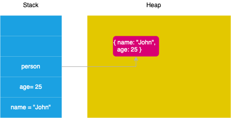

# Reference Type

Overview

- JavaScript has 2 kinds of variable types: primitive and reference.
- A fixed amount of memory is reserved after creation of every variable.
- When a variable is copied, it's in-memory value is copied.
- Passing a variable to a function via a call also creates a copy of that variable.

When you declare variables, the JavaScript engine allocates the memory for them on two memory locations: stack and heap.

Static data is the data whose size is fixed at compile time. Static data includes: Primitive value & Reference value.

- Because static data has a size that does not change, the JavaScript engine allocates a fixed amount of memory space to the static data and stores it on the stack.
- Unlike the stack, JavaScript stores objects (and functions) on the heap. The JavaScript engine doesn’t allocate a fixed amount of memory for these objects. Instead, it’ll allocate more space as needed.



## Primitives

The in-memory value of a primitive type is it's actual value (e.g. boolean `true`, number `42`). A primitive type can be stored in the fixed amount of memory available.

Primitive types are also known as: scalar types or simple types.

When we assign variables to other variables using `=`, we **copy** the value to the new variable. They are copied by value.

Changing one does not change the other. Think of the variables as having no relationship to each other.

For example:

```js
var a = 13; // assign `13` to `a`
var b = a; // copy the value of `a` to `b`
b = 37; // assign `37` to `b`
console.log(a); // => 13
```

The original was not changed, we can only change the copy.

## Objects

A reference type can contain other values. Since the contents of a reference type can not fit in the fixed amount of memory available for a variable, the in-memory value of a reference type is the reference itself (a memory address).

- Array
- Object
- Function

Reference types are also known as: complex types or container types.

Variables that are assigned a non-primitive value are given a _reference_ to that value. That reference points to the object’s location in memory. The variables don’t actually contain the value.

Objects are created at some location in your computer’s memory. When we write `arr = []`, we’ve created an array in memory. What the variable `arr` receives is the address, the location, of that array.

Notice that the value, the address, contained by the variable `arr` is static. The array in memory is what changes. When we use `arr` to do something, such as pushing a value, the Javascript engine goes to the location of `arr` in memory and works with the information stored there.

### Assigning by Reference

When a reference type value, an object, is copied to another variable using `=`, the address of that value is what’s actually copied over as if it were a primitive. **Objects are copied by reference** instead of by value.

Each variable now contains a reference to the _same array_. That means that if we alter one, another will change.

For example:

```js
var a = { c: 13 }; // assign the reference of a new object to `a`
var b = a; // copy the reference of the object inside `a` to new variable `b`
b.c = 37; // modify the contents of the object `b` refers to
console.log(a); // => { c: 37 }
```

The original was also changed, since the reference got copied.

## Passing Parameters through Functions

When we pass primitive values into a function, the function copies the values into its parameters. It’s effectively the same as using `=`.

### Pure Functions

We refer to functions that don’t affect anything in the outside scope as _pure functions_. As long as a function only takes primitive values as parameters and doesn’t use any variables in its surrounding scope, it is automatically pure, as it can’t affect anything in the outside scope.

All variables created inside are garbage-collected as soon as the function returns.

A function that takes in an Object, however, can mutate the state of its surrounding scope. If a function takes in an array reference and alters the array that it points to, perhaps by pushing to it, variables in the surrounding scope that reference that array see that change. After the function returns, the changes it makes persist in the outer scope. This can cause undesired side effects that can be difficult to track down.

Many native array functions, including `Array.map` and `Array.filter`, are therefore written as pure functions. They take in an array reference and internally, they copy the array and work with the copy instead of the original. This makes it so the original is untouched, the outer scope is unaffected, and we’re returned a reference to a brand new array.

**Impure function:**
This impure function takes in an object and changes the property `age` on that object to be 25. Because it acts on the reference it was given, it directly changes the object `alex`. Note that when it returns the `person` object, it is returning the exact same object that was passed in. `alex` and `alexChanged` contain the same reference. It’s redundant to return the `person` variable and to store the reference in a new variable.

**Pure function:**
In this function, we use `JSON.stringify` to transform the object we’re passed into a string, and then parse it back into an object with `JSON.parse`. By performing this transformation and storing the result in a new variable, we’ve created a new object. There are other ways to do the same thing such as looping through the original object and assigning each of its properties to a new object, but this way is simplest. The new object has the same properties as the original but it is a distinctly separate object in memory.

When we change the `age` property on this new object, the original is unaffected. This function is now pure. It can’t affect any object outside its own scope, not even the object that was passed in. The new object needs to be returned and stored in a new variable or else it gets garbage collected once the function completes, as the object is no longer in scope.
